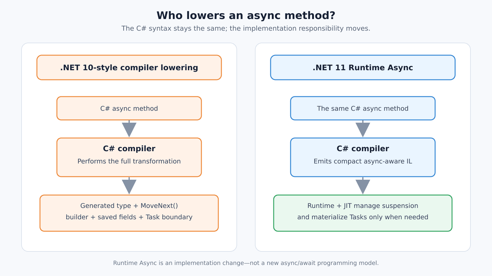
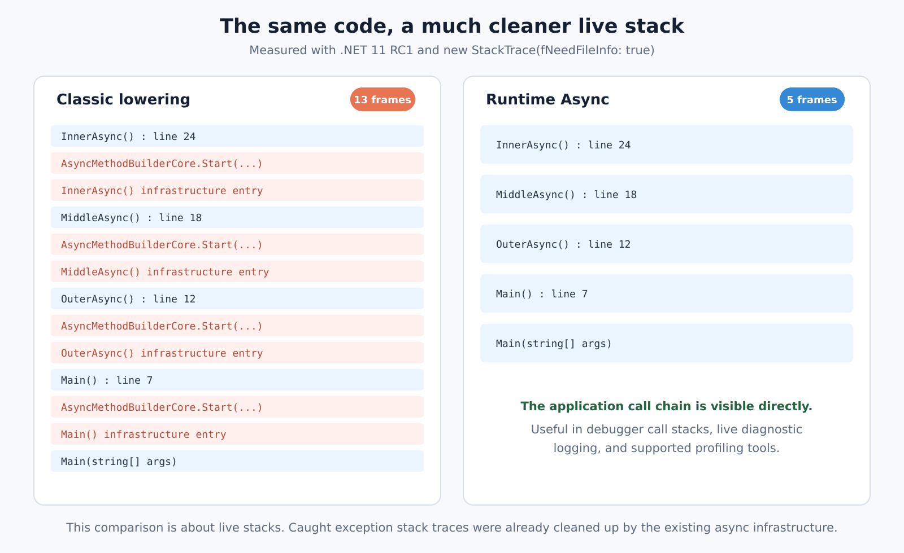
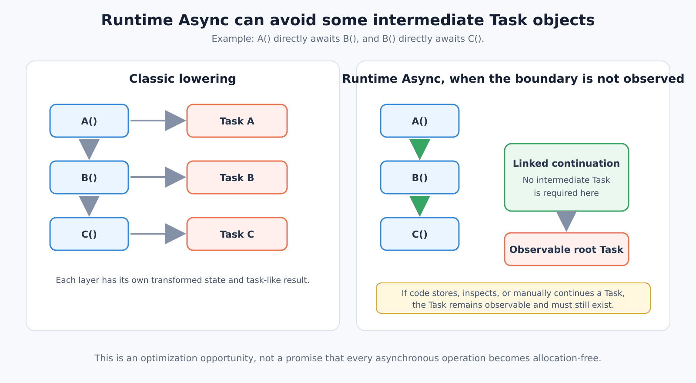
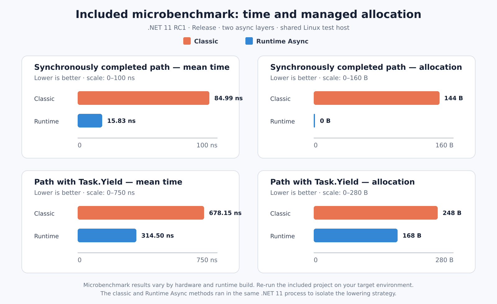
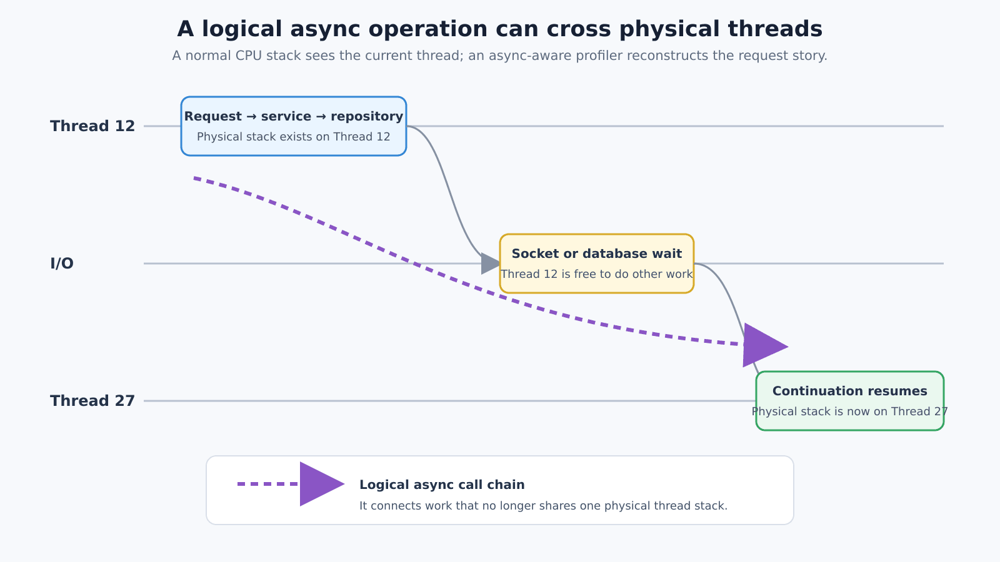

# .NET 11 Runtime Async: Cleaner Stack Traces and Faster Async Paths

## Introduction

Asynchronous code is everywhere in a modern .NET application.

An HTTP endpoint awaits an application service. The application service awaits a repository. The repository awaits a database call. Logging, authorization, retries, serialization, and network operations add more asynchronous layers around the same request.

The C# code can still look simple:

```csharp
public async Task<OrderDto> GetAsync(Guid id)
{
    Order order = await _orderRepository.GetAsync(id);
    return ObjectMapper.Map<Order, OrderDto>(order);
}
```

However, the implementation below `async` and `await` has not been simple. In .NET 10 and earlier versions, the C# compiler normally turns each async method into a generated state machine. This design works well, but it can add infrastructure frames to live call stacks, create intermediate task-related objects, and make production profiling more difficult.

.NET 11 starts changing that foundation with **Runtime Async V2**.

The source code and the async programming model do not change. The important change happens below the source code: more of the async transformation moves from the C# compiler into the runtime and the JIT compiler. This gives .NET more information at the moment it optimizes the method.

For developers, the main results are:

- Cleaner live async stack traces.
- Better stepping and debugging through async code.
- Opportunities to remove intermediate `Task` objects and allocations.
- Smaller generated IL for eligible async methods.
- Better optimization of common async paths.
- A new lower-overhead foundation for async profiling.

This article explains what changed, where you can observe the difference, how to measure it, and what you should consider before enabling the preview feature in a real application.

## The main change: async lowering moves closer to the runtime

Consider this small method:

```csharp
static async Task<int> ReadLengthAsync(
    Stream stream,
    CancellationToken cancellationToken)
{
    var buffer = new byte[4096];
    int bytesRead = await stream.ReadAsync(buffer, cancellationToken);
    return bytesRead;
}
```

With the classic model, the C# compiler creates a state-machine type. It usually contains:

- A state number.
- An async method builder.
- Fields for parameters and local values that must survive an incomplete `await`.
- Awaiter fields.
- A generated `MoveNext()` method.

`MoveNext()` runs the method until an awaited operation is incomplete. It saves the required state and registers itself as the continuation. Later, it runs again and continues from the saved state.

Runtime and JIT optimizations have made this model much cheaper over many .NET releases. Still, by the time the JIT receives the method, the compiler has already expanded a small source method into a more complex state machine.



With Runtime Async, the compiler emits smaller, suspension-aware IL and marks the method as async in metadata. The runtime and JIT then manage more of the transformation. They can use runtime information to decide:

- Which values are really alive at a suspension point.
- How continuation state should be stored.
- Whether an intermediate `Task` must be materialized.
- Whether a direct async call can use a more efficient calling path.
- How the method should be optimized after it becomes hot.

The programming model remains the same. `await`, cancellation, exceptions, synchronous completion, and `ConfigureAwait` keep their existing meaning. Microsoft states that behavioral compatibility is an explicit goal; an observable semantic difference should be treated as a bug.

### Enabling Runtime Async in a .NET 11 project

Application code must currently opt in:

```xml
<PropertyGroup>
  <TargetFramework>net11.0</TargetFramework>
  <Features>$(Features);runtime-async=on</Features>
</PropertyGroup>
```

No new C# syntax is required. You do not need `LangVersion=preview` or `EnablePreviewFeatures` for this switch in a `net11.0` project.

The .NET 11 runtime libraries are already compiled with Runtime Async enabled. Your own application and library methods use the new lowering only when you enable the feature during compilation.

## Cleaner live async stack traces

The clearest developer-experience improvement is visible in a **live stack trace**.

This means the stack shown by:

- The debugger Call Stack window.
- `new StackTrace()` while the code is running.
- A profiler that inspects live execution stacks.
- Diagnostic code that captures the current stack.

### Runnable example

The complete project is included in `samples/AsyncStackTraceDemo`. Its important part is:

```csharp
using System.Diagnostics;

await OuterAsync();

static async Task OuterAsync()
{
    await Task.CompletedTask;
    await MiddleAsync();
}

static async Task MiddleAsync()
{
    await Task.CompletedTask;
    await InnerAsync();
}

static async Task InnerAsync()
{
    await Task.CompletedTask;
    Console.WriteLine(new StackTrace(fNeedFileInfo: true));
}
```

The included script builds three variants:

1. .NET 10 with compiler-generated async lowering.
2. .NET 11 with compiler-generated async lowering.
3. .NET 11 with Runtime Async enabled.

On PowerShell:

```powershell
./scripts/run-samples.ps1
```

On Bash:

```bash
chmod +x ./scripts/run-samples.sh
./scripts/run-samples.sh
```

### Observed output

The .NET 10 and .NET 11 classic builds both produced 13 live frames. The output included repeated infrastructure frames similar to:

```text
InnerAsync()
AsyncMethodBuilderCore.Start(...)
InnerAsync()
MiddleAsync()
AsyncMethodBuilderCore.Start(...)
MiddleAsync()
OuterAsync()
AsyncMethodBuilderCore.Start(...)
OuterAsync()
Main()
AsyncMethodBuilderCore.Start(...)
Main()
Main(string[] args)
```

The Runtime Async build produced 5 frames:

```text
InnerAsync()
MiddleAsync()
OuterAsync()
Main()
Main(string[] args)
```



The exact generated method names can differ between source layout, SDK builds, and Debug or Release configuration. The useful result is the shape of the stack: Runtime Async shows the application call chain directly and removes the repeated async builder infrastructure from this example.

### Important: this is a live-stack improvement

Do not describe this feature as a general fix for `exception.StackTrace`.

Exception stack traces from code such as the following were already cleaned up by the existing async infrastructure:

```csharp
try
{
    await ProcessAsync();
}
catch (Exception exception)
{
    Console.WriteLine(exception.StackTrace);
}
```

The .NET 11 improvement is most visible while inspecting **live execution**, not after catching an exception.

## Where the performance opportunities come from

Runtime Async does not make every async operation faster and it does not remove every allocation. It gives the runtime new opportunities that were difficult to see after the compiler had already created a state machine.

### 1. Fewer intermediate Task objects

Consider a common layered call chain:

```csharp
static async Task<int> A() => await B();
static async Task<int> B() => await C();

static async Task<int> C()
{
    await Task.Yield();
    return 42;
}
```

In the classic model, every method has its own transformed state and task-like result. When the pattern is a direct call followed by a direct `await`, Runtime Async can sometimes use a special async calling path and link continuation state instead.

If the chain completes synchronously, the result can flow through internal calls as a value. If it suspends, the runtime can link continuation records without requiring a separate intermediate `Task<int>` at every eligible edge.



The optimization is not possible when the `Task` is observable as an object. For example:

```csharp
Task<int> task = GetValueAsync();
pendingTasks.Add(task);
task.ContinueWith(LogCompletion);
return task;
```

Here, the program stores and manually observes the task. The runtime must preserve that behavior and materialize the object.

### 2. Smaller generated IL and binaries

The classic transformation creates an entry method, a generated type, state fields, a builder, and `MoveNext()` for each async method.

Runtime Async leaves a smaller method body for the runtime to transform. In a deliberately async-heavy size test published by Microsoft, ten small async methods produced these assembly sizes:

| Lowering | Assembly size |
|---|---:|
| Compiler-generated | 10,752 bytes |
| Runtime Async | 5,632 bytes |

This is not a promise that a complete application will become 48% smaller. The test was intentionally dominated by small async methods. The useful conclusion is that Runtime Async can reduce the per-method IL and metadata cost.

### 3. Better exception flow through deep async chains

Classic async state machines normally contain generated exception handling so that an unhandled exception can be stored in the returned task.

In a deep chain, an exception can be:

1. Caught by generated code in the inner method.
2. Stored in its task.
3. Read and thrown again by the caller's awaiter.
4. Caught by the caller's generated code.
5. Stored in another task.

Runtime Async can move through continuation records that have no real user exception handler and fault the observable root task more directly. This can reduce repeated throw, catch, and task-fault work in deep pass-through chains.

This optimization does not make exceptions a normal or recommended control-flow mechanism. It only makes the runtime-generated path less expensive where possible.

### 4. Skipping unnecessary ExecutionContext work

`ExecutionContext` carries ambient state across async boundaries. `AsyncLocal<T>` values are a common example. Tracing and request-correlation systems can also use ambient state.

.NET 11 can detect when a continuation has no context state to restore and skip an unnecessary capture-and-restore cycle. `Task`, `Task<T>`, `ValueTask`, and `ValueTask<T>` paths can benefit.

The effect is workload-dependent. A high-throughput library path with little ambient state may benefit more than an ASP.NET Core request path that uses `Activity`, tracing, and several `AsyncLocal<T>` values.

### 5. JIT improvements for async paths

.NET 11 also improves several details around Runtime Async:

- Runtime Async methods participate in tiered compilation, so hot methods can receive Tier 1 optimizations.
- The JIT recognizes common factories such as `Task.CompletedTask`, `Task.FromResult`, and `ValueTask.FromResult`.
- Suspension points can be tail-merged to reduce generated code size.
- Some continuation objects can be cached and reused.
- Direct tail-await paths can avoid unnecessary layers.
- Runtime Async supports ReadyToRun and NativeAOT scenarios.
- ReadyToRun compilation can inline eligible await-less Runtime Async calls.

These are implementation improvements. Application code should continue to choose `Task` or `ValueTask` based on API semantics and measured needs, not because Runtime Async exists.

## A reproducible benchmark

The package includes `benchmarks/AsyncPathBenchmarks`. It compares classic and Runtime Async lowering inside the same .NET 11 process. This isolates the lowering strategy better than comparing a .NET 10 process with a .NET 11 process, where many other runtime changes would also affect the result.

The benchmark uses a compiler-recognized `RuntimeAsyncMethodGenerationAttribute` to force classic lowering for selected methods. This attribute is experimental and is **not a public .NET API**. Use it only for controlled experiments like this one.

Run it with:

```bash
dotnet run \
  --project benchmarks/AsyncPathBenchmarks/AsyncPathBenchmarks.csproj \
  -c Release \
  --filter "*"
```

The included job performs 3 warm-up iterations and 10 measurement iterations. For serious performance work, increase the iteration count and run on a quiet, dedicated machine.

### Results from the included run

Test environment:

- Ubuntu 24.04.3 LTS.
- Intel Xeon Platinum 8573C, with 9 logical cores available to the container.
- .NET SDK `11.0.100-rc.1.26425.128`.
- .NET runtime `11.0.0-rc.1.26425.128`.
- BenchmarkDotNet `0.16.0-preview.1`.
- Release configuration and Workstation GC.

| Method | Mean | Ratio | Allocated |
|---|---:|---:|---:|
| ClassicCompleted | 84.99 ns | 1.00 | 144 B |
| RuntimeCompleted | 15.83 ns | 0.20 | 0 B |
| ClassicYielding | 678.15 ns | 1.00 | 248 B |
| RuntimeYielding | 314.50 ns | 0.46 | 168 B |



These values are **not a general performance claim**. The benchmark ran in a shared container, could not raise process priority, and the `ClassicCompleted` measurements had high variance. The full BenchmarkDotNet report is included in `results/benchmark-results.md`.

The results demonstrate how to measure the feature and show clear allocation differences in this small pattern. They do not tell us how much faster an ABP application, API endpoint, or database operation will become.

Microsoft's own benchmark of the same two-layer pattern also showed lower time and allocation for Runtime Async, but with different absolute numbers. That difference is exactly why you should run the benchmark on your hardware and then measure a realistic application workload.

### Benchmark hygiene

Runtime Async is a compile-time feature. When switching the feature on and off in the same project, force a rebuild. Otherwise, an incremental build can leave an assembly from the previous configuration in the output directory.

The included scripts use `--no-incremental` for this reason.

For a fair application benchmark:

- Use Release builds.
- Pin the SDK and runtime versions.
- Record OS, CPU, GC mode, and application configuration.
- Warm up tiered compilation before recording steady-state throughput.
- Measure latency percentiles, CPU, and allocations—not only requests per second.
- Run several independent processes or test rounds.
- Compare the same commit with only the Runtime Async switch changed.
- Test with your real third-party libraries and normal observability configuration.

## Where should the difference be visible?

Runtime Async has the best opportunity in code with many small async layers:

```text
HTTP endpoint
  → application service
    → authorization helper
      → retry or policy layer
        → repository
          → database or network operation
```

Possible observable effects include:

- Fewer managed allocations per request.
- Lower GC pressure at high request rates.
- Better throughput on async-heavy CPU paths.
- Smaller application or library assemblies.
- Cleaner debugger and profiler stacks.

The difference may be difficult to see when:

- Most request time is spent waiting for a slow database or remote API.
- The async call chain is shallow.
- Tasks are stored or otherwise observed as objects.
- Much of the hot path is in older third-party assemblies compiled with classic lowering.
- Tracing, logging, or `AsyncLocal<T>` usage requires ambient context flow.
- The application is limited by database capacity, locks, serialization, or network bandwidth.

A 100-millisecond database query can easily hide a small runtime improvement in end-to-end request latency. The same improvement may still appear in allocation rate, CPU use, or maximum throughput under load.

## Investigating async behavior in production

Production async problems usually appear as one of these symptoms:

- High latency but low CPU usage.
- Thread-pool queue growth.
- Unexpected allocation or GC pressure.
- Time spent in continuations or framework infrastructure.
- A request that starts on one thread and continues on another.

The last case is especially important. When an async method suspends, its physical thread stack unwinds. The continuation can later resume on a different thread.



A normal sampling profiler can see the code currently running on Thread 27, but the earlier physical stack from Thread 12 is gone. An async-aware profiler needs runtime events to rebuild the logical chain.

### Start with counters

Use counters to decide whether you need a more detailed trace:

```bash
dotnet tool install --global dotnet-counters
dotnet-counters monitor --process-id <PID>
```

Watch the signals that match the symptom, such as:

- CPU usage.
- Allocation rate and GC activity.
- Thread-pool thread count.
- Thread-pool queue length.
- Exception rate.

Counters are good for detecting a problem, but they normally do not show the full logical async call chain.

### Collect a short trace

Install `dotnet-trace`:

```bash
dotnet tool install --global dotnet-trace
```

Collect a short runtime and sampled-thread trace:

```bash
dotnet-trace collect \
  --process-id <PID> \
  --duration 00:00:00:30 \
  --profile dotnet-common,dotnet-sampled-thread-time \
  --output async-investigation.nettrace
```

The exact providers should follow the question you are investigating. More events create more data and more overhead. Start narrow, record for a limited time, and reproduce one known problem window.

Open the trace in a compatible tool such as Visual Studio's performance tools or PerfView. Tool support matters: a runtime can emit new events before every analysis tool presents them in a useful async view.

### What is new for profiling in .NET 11?

Traditional Task Parallel Library events can be very verbose in async-heavy applications. .NET 11 adds a new buffered async-profiler event pipeline. Its design uses:

- Per-thread buffers.
- Compact timestamp and instruction-pointer encoding.
- Batched event flushing.
- A small wrapper frame that helps connect CPU samples to a logical async continuation.

In the runtime pull request's synthetic measurements, the new stream produced much less trace data and low overhead at realistic event rates. Treat those values as design measurements, not as a guarantee for your service. The event format is internal and can change, and analysis tools must understand it before you receive the full benefit.

Follow these production rules:

- Measure trace overhead on a staging environment first.
- Keep collection windows short.
- Avoid collecting unnecessary providers.
- Check for dropped events and increase buffers only when needed.
- Run the tool with the required process permissions.
- Protect traces because they can contain application names, paths, exception messages, and business information.

### Keep distributed tracing in the picture

Runtime stacks and CPU traces answer questions about execution cost. `Activity` and OpenTelemetry traces answer a different question: where did the request spend wall-clock time across services, databases, and external calls?

For a production investigation, use both views when possible:

- Distributed trace: request latency and service boundaries.
- Runtime trace: CPU, GC, contention, threads, and managed call stacks.
- Application logs: business context and failure details.

Together, they are more useful than any one source alone.

## Preview limitations and production readiness

Runtime Async currently supports async methods returning:

| Return type or feature | .NET 11 Runtime Async status |
|---|---|
| `Task` | Supported |
| `Task<T>` | Supported |
| `ValueTask` | Supported |
| `ValueTask<T>` | Supported |
| `async void` | Uses classic compiler transformation |
| Async iterators / `IAsyncEnumerable<T>` | Uses classic compiler transformation |
| Custom task-like types and custom builders | Use classic compiler transformation |

Runtime Async is compatible with existing assemblies. New code can await libraries compiled with the classic model, and classic code can call Runtime Async methods. However, the largest optimization opportunities appear when more of a direct async call chain uses Runtime Async.

The important readiness facts are:

- .NET 11 is RC1 at the time of writing, not the final release.
- Runtime Async remains preview and opt-in for application code.
- Microsoft describes the .NET 11 performance goal as broad parity with .NET 10, not a universal speedup.
- Important paths are already equal or faster, but known slower cases still exist.
- Tooling support for new profiling data can arrive at different times.
- Performance results can change between RC1, the final release, and servicing updates.

For production, do not enable the feature only because a microbenchmark is faster. Test compatibility, performance, diagnostics, startup, publishing, and rollback in the same deployment model you use for the real application.


## Conclusion

Runtime Async is one of the most important runtime changes in .NET 11, even though it does not add new C# syntax.

It moves more async implementation work into the runtime and JIT, where .NET has better information for optimization. The most immediate improvement is easier debugging through cleaner live stacks. The longer-term opportunity is reducing the hidden cost of composing many small async methods.

The feature is also a good reminder about performance work: architecture creates an opportunity, but measurement tells us whether that opportunity matters in our application.

Keep writing clear async code. Use `Task` and `ValueTask` according to their API trade-offs. Then benchmark the application, inspect its traces, and let evidence decide when Runtime Async is ready for your production workload.

## References

- [What's new in .NET 11](https://learn.microsoft.com/en-us/dotnet/core/whats-new/dotnet-11/overview)
- [What's new in the .NET 11 runtime](https://learn.microsoft.com/en-us/dotnet/core/whats-new/dotnet-11/runtime)
- [Performance Improvements in .NET 11 — Stephen Toub](https://devblogs.microsoft.com/dotnet/performance-improvements-in-net-11/)
- [High-performance EventSource runtime async profiler — dotnet/runtime PR #127238](https://github.com/dotnet/runtime/pull/127238)
- [dotnet-trace documentation](https://learn.microsoft.com/en-us/dotnet/core/diagnostics/dotnet-trace)
- [dotnet-counters documentation](https://learn.microsoft.com/en-us/dotnet/core/diagnostics/dotnet-counters)
- [dotnet-monitor documentation](https://learn.microsoft.com/en-us/dotnet/core/diagnostics/dotnet-monitor)

