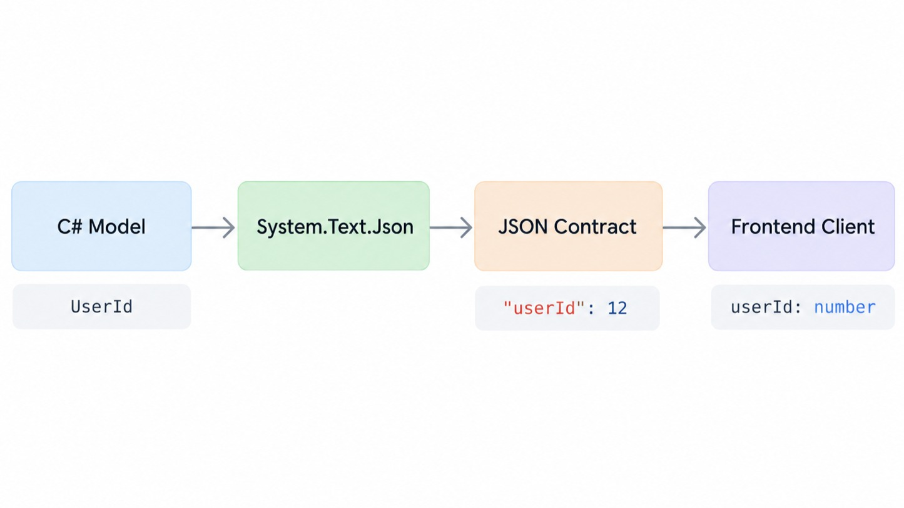
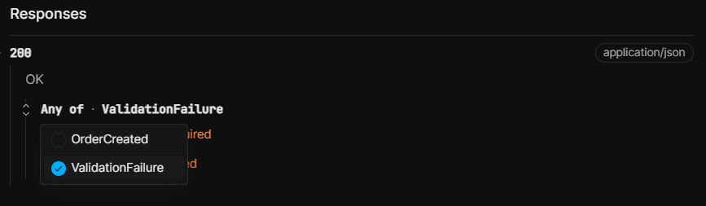
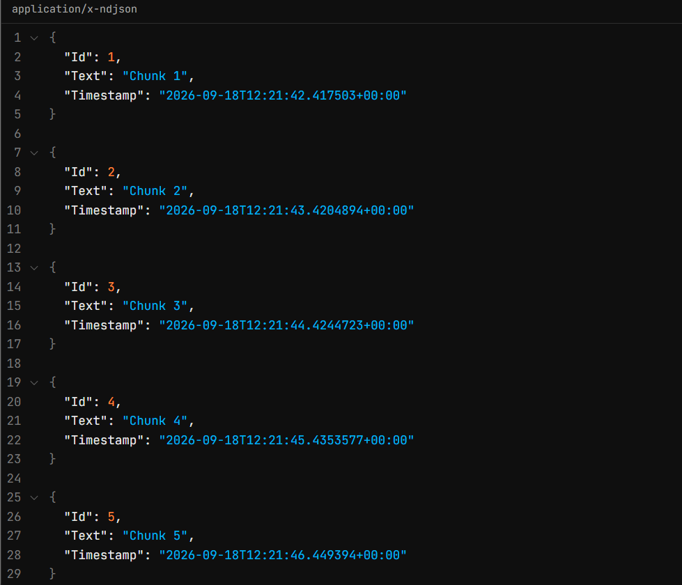
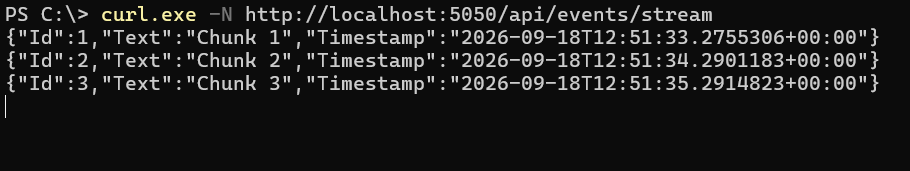

`System.Text.Json` is getting several useful improvements in .NET 11 that go beyond simple serialization.

Three changes are particularly relevant for API developers:

- more flexible naming-policy customization,
- serialization support for C# union types,
- and NDJSON output for asynchronous streams.

At first glance, these may look like unrelated serializer features. In practice, they affect three important parts of an API contract:

```text
Naming policies → property names
Union types     → possible value shapes
NDJSON          → how values are delivered
```

That has direct consequences for ASP.NET Core APIs, TypeScript frontends, generated clients, large-result endpoints, and AI streaming scenarios.

In this article, we'll look at each feature, build a small API around them, and discuss when NDJSON is a better fit than a conventional JSON array.

.NET 11 includes other `System.Text.Json` work as well, but features such as `GetTypeInfo<T>`, type-level `JsonIgnore`, and closed-hierarchy inference are outside the scope of this article except where they clarify the union guidance.

---

## .NET 11 Status First

At the time of writing, .NET 11 is at **Release Candidate 1**. Microsoft released `.NET 11.0.0-rc.1` on September 8, 2026, and the .NET release metadata lists the channel in the **Go-Live** support phase.

An important RC1 change is that **C# 15 is now the default language version for projects targeting .NET 11**. Union types were stabilized for C# 15 in RC1, so a `net11.0` project no longer needs:

```xml
<LangVersion>preview</LangVersion>
```

This matters because some .NET 11 library documentation still contains older wording that calls C# unions a preview feature. For RC1 language status, the [C# in .NET 11 RC1 release notes](https://github.com/dotnet/core/blob/main/release-notes/11.0/preview/rc1/csharp.md) are the more specific source.

RC1 is still pre-GA, however. Before a final production rollout, re-check the .NET 11 release notes, known issues, and serializer behavior against the final SDK.

---

## Naming Policies Become More Flexible

`System.Text.Json` already supports built-in naming conventions such as camelCase, snake_case, and kebab-case.

.NET 11 adds:

```csharp
JsonNamingPolicy.PascalCase
```

and introduces `JsonNamingPolicyAttribute`, which allows a naming policy to be applied to an individual property or field.

Per-member name overrides were already possible with `[JsonPropertyName("someName")]`. The .NET 11 addition is different: instead of hard-coding one literal JSON name, a member can opt into a naming **policy**, so the transformation remains policy-driven.

For example:

```csharp
using System.Text.Json;
using System.Text.Json.Serialization;

var options = new JsonSerializerOptions
{
    PropertyNamingPolicy = JsonNamingPolicy.PascalCase
};

var response = new EventResponse
{
    EventName = "UserRegistered",
    CreatedAtUtc =
        new DateTimeOffset(2026, 9, 18, 8, 30, 0, TimeSpan.Zero)
};

Console.WriteLine(
    JsonSerializer.Serialize(response, options));

public sealed class EventResponse
{
    [JsonNamingPolicy(JsonKnownNamingPolicy.CamelCase)]
    public string EventName { get; init; } = "";

    public DateTimeOffset CreatedAtUtc { get; init; }
}
```

Actual compact output:

```json
{"eventName":"UserRegistered","CreatedAtUtc":"2026-09-18T08:30:00+00:00"}
```

The serializer uses PascalCase globally, but `EventName` is explicitly kept in camelCase.

### Why does this matter for APIs?

Because JSON naming is part of the wire contract.

These responses contain the same data:

```json
{"userId":12}
```

```json
{"UserId":12}
```

but they are not necessarily compatible from a client's perspective.

A TypeScript application might have:

```ts
interface User {
    userId: number;
}
```

Changing the server to return `UserId` can break client mappings, generated SDKs, runtime validation, or tests without changing the underlying C# property at all.

So naming-policy changes should be treated as contract changes.

In ASP.NET Core, a global policy can be configured like this:

```csharp
builder.Services.ConfigureHttpJsonOptions(options =>
{
    options.SerializerOptions.PropertyNamingPolicy =
        JsonNamingPolicy.PascalCase;
});
```

The point of .NET 11 is not that PascalCase is suddenly preferable for web APIs. The useful part is having finer control when an API needs exceptions to its global convention.



*Figure: An illustrative contract-flow example showing how a server-side naming decision becomes part of the JSON and frontend contract. The runnable sample below intentionally uses PascalCase globally to demonstrate the new .NET 11 policy.*

---

## C# Union Types Meet System.Text.Json

Another important .NET 11 improvement is serialization support for C# union types.

A union represents a value that can be one of a fixed set of cases.

For example:

```csharp
public record OrderCreated(
    int OrderId,
    string Status);

public record ValidationFailure(
    string ErrorCode,
    string Message);

public union CreateOrderResult(
    OrderCreated,
    ValidationFailure);
```

A `CreateOrderResult` can now contain either:

```csharp
CreateOrderResult result =
    new OrderCreated(125, "created");
```

or:

```csharp
CreateOrderResult result =
    new ValidationFailure(
        "INVALID_QUANTITY",
        "Quantity must be greater than zero.");
```

Pattern matching can then handle the known cases explicitly:

```csharp
string message = result switch
{
    OrderCreated order =>
        $"Order {order.OrderId} created.",

    ValidationFailure failure =>
        failure.Message
};
```

The compiler knows which cases belong to the union instead of treating the value as an arbitrary `object`.

---

### Serializing a Union

.NET 11's `System.Text.Json` recognizes C# unions through the new `JsonTypeInfoKind.Union` contract kind and can serialize the active case directly. The feature works with both reflection-based serialization and source generation.

For example:

```csharp
CreateOrderResult result =
    new OrderCreated(125, "created");

string json =
    JsonSerializer.Serialize(result);

Console.WriteLine(json);
```

Actual compact output:

```json
{"OrderId":125,"Status":"created"}
```

The validation case produces:

```json
{"ErrorCode":"INVALID_QUANTITY","Message":"Quantity must be greater than zero."}
```

There is no artificial union wrapper or discriminator in the JSON. The active case becomes the actual representation.

That maps to a TypeScript union using the same wire-property casing:

```ts
type CreateOrderResult =
    | {
        OrderId: number;
        Status: string;
      }
    | {
        ErrorCode: string;
        Message: string;
      };
```

Because the serialized union has no discriminator, the client narrows by shape, for example:

```ts
function handle(result: CreateOrderResult) {
    if ("OrderId" in result) {
        console.log(result.Status);
    } else {
        console.error(result.Message);
    }
}
```

That is valid TypeScript, but an explicit discriminator can be easier to evolve when you control a brand-new polymorphic object contract.

---

### A Note on Union Deserialization

Serialization and deserialization are not identical concerns. When a union contains two object-shaped cases, `System.Text.Json` may not be able to determine the active case from the JSON token alone.

For structurally distinct objects, .NET 11 provides `JsonUnionTypeStructuralClassifier`:

```csharp
[JsonUnion(
    TypeClassifier =
        typeof(JsonUnionTypeStructuralClassifier))]
public union CreateOrderResult(
    OrderCreated,
    ValidationFailure);
```

In this sample, `OrderCreated` and `ValidationFailure` expose different root-level properties, so the classifier can distinguish them. The behavior is verified in the **Running and Testing the Sample** section below. If cases are still ambiguous, an explicit custom classifier may be required.

---

### OpenAPI and Generated Clients

ASP.NET Core's OpenAPI support represents a C# union as an `anyOf` schema with one entry per case type.

Conceptually:

```yaml
CreateOrderResult:
  anyOf:
    - $ref: "#/components/schemas/OrderCreated"
    - $ref: "#/components/schemas/ValidationFailure"
```

A client generator can then potentially produce:

```ts
type CreateOrderResult =
    OrderCreated | ValidationFailure;
```

That is much better than exposing the response as an untyped `object`, but generated clients should still be tested because generators can differ in how they model `anyOf`. Also remember that union serialization itself does not add a discriminator, so generated frontend code may still need shape-based narrowing.



*Figure: Scalar represents `CreateOrderResult` as an OpenAPI `anyOf` schema with `OrderCreated` and `ValidationFailure` alternatives.*

---

## Putting Everything Together in ASP.NET Core

The following Minimal API demonstrates the naming-policy configuration, a union response, OpenAPI/Scalar setup, and an NDJSON streaming endpoint.

### Project file

```xml
<Project Sdk="Microsoft.NET.Sdk.Web">

  <PropertyGroup>
    <TargetFramework>net11.0</TargetFramework>
    <Nullable>enable</Nullable>
    <ImplicitUsings>enable</ImplicitUsings>
  </PropertyGroup>

  <ItemGroup>
    <PackageReference
        Include="Microsoft.AspNetCore.OpenApi"
        Version="11.0.0-rc.1.26425.128" />
    <PackageReference
        Include="Scalar.AspNetCore"
        Version="2.17.4" />
  </ItemGroup>

</Project>
```

### `Program.cs`

```csharp
using System.Runtime.CompilerServices;
using System.Text.Json;
using System.Text.Json.Serialization;
using Microsoft.AspNetCore.Http.Json;
using Microsoft.Extensions.Options;
using Scalar.AspNetCore;

var builder = WebApplication.CreateBuilder(args);

builder.Services.AddOpenApi();

builder.Services.ConfigureHttpJsonOptions(options =>
{
    options.SerializerOptions.PropertyNamingPolicy =
        JsonNamingPolicy.PascalCase;
});

var app = builder.Build();

if (app.Environment.IsDevelopment())
{
    app.MapOpenApi();
    app.MapScalarApiReference();
}

app.MapGet("/api/contracts/naming", () =>
    new NamingResponse
    {
        EventName = "UserRegistered",
        CreatedAtUtc = DateTimeOffset.UtcNow
    });

app.MapPost("/api/orders", (
    CreateOrderRequest request) =>
{
    CreateOrderResult result =
        request.Quantity <= 0
            ? new ValidationFailure(
                "INVALID_QUANTITY",
                "Quantity must be greater than zero.")
            : new OrderCreated(
                125,
                "created");

    return TypedResults.Ok(result);
});

app.MapGet("/api/events/stream", async (
    HttpContext context,
    IOptions<JsonOptions> jsonOptions,
    CancellationToken cancellationToken) =>
{
    context.Response.ContentType =
        "application/x-ndjson; charset=utf-8";

    await JsonSerializer.SerializeAsyncEnumerable(
        context.Response.BodyWriter,
        GenerateEvents(cancellationToken),
        topLevelValues: true,
        options: jsonOptions.Value.SerializerOptions,
        cancellationToken: cancellationToken);
});

app.Run();

static async IAsyncEnumerable<StreamEvent> GenerateEvents(
    [EnumeratorCancellation]
    CancellationToken cancellationToken)
{
    for (var i = 1; i <= 5; i++)
    {
        await Task.Delay(1000, cancellationToken);

        yield return new StreamEvent(
            i,
            $"Chunk {i}",
            DateTimeOffset.UtcNow);
    }
}

public sealed class NamingResponse
{
    [JsonNamingPolicy(JsonKnownNamingPolicy.CamelCase)]
    public string EventName { get; init; } = "";

    public DateTimeOffset CreatedAtUtc { get; init; }
}

public record CreateOrderRequest(
    int ProductId,
    int Quantity);

public record OrderCreated(
    int OrderId,
    string Status);

public record ValidationFailure(
    string ErrorCode,
    string Message);

public union CreateOrderResult(
    OrderCreated,
    ValidationFailure);

public record StreamEvent(
    int Id,
    string Text,
    DateTimeOffset Timestamp);
```

A successful request:

```http
POST /api/orders
Content-Type: application/json

{"ProductId":17,"Quantity":2}
```

returns:

```json
{"OrderId":125,"Status":"created"}
```

while an invalid quantity produces the other union shape:

```json
{"ErrorCode":"INVALID_QUANTITY","Message":"Quantity must be greater than zero."}
```

This sample deliberately returns both domain outcomes under HTTP `200 OK` so that one endpoint can demonstrate a single union response and the generated `anyOf` schema. That is a serializer/OpenAPI demonstration, not a general HTTP error-handling recommendation. In a production API, validation failures are commonly mapped to an appropriate `4xx` response.

---

## NDJSON: Streaming JSON Records

The third major improvement is around asynchronous JSON output.

The read side of this model already existed before .NET 11: `JsonSerializer.DeserializeAsyncEnumerable(..., topLevelValues: true)` can consume a sequence of whitespace-separated top-level JSON values (available in .NET 9). .NET 11 completes the story on the **write** side by adding top-level-value output to `SerializeAsyncEnumerable` and direct `PipeWriter` support.

A conventional JSON array looks like this:

```json
[{"Id":1,"Text":"Chunk 1"},{"Id":2,"Text":"Chunk 2"},{"Id":3,"Text":"Chunk 3"}]
```

NDJSON — Newline Delimited JSON — looks like this:

```text
{"Id":1,"Text":"Chunk 1"}
{"Id":2,"Text":"Chunk 2"}
{"Id":3,"Text":"Chunk 3"}
```

Each line is an independent JSON value.

.NET 11 extends `JsonSerializer.SerializeAsyncEnumerable` with two useful capabilities:

- writing directly to a `PipeWriter`,
- and a `topLevelValues` option for NDJSON-style output.

The key call from the sample is:

```csharp
await JsonSerializer.SerializeAsyncEnumerable(
    context.Response.BodyWriter,
    GenerateEvents(cancellationToken),
    topLevelValues: true,
    options: jsonOptions.Value.SerializerOptions,
    cancellationToken: cancellationToken);
```

A .NET client can consume the same record-oriented format with:

```csharp
await foreach (var item in JsonSerializer.DeserializeAsyncEnumerable<StreamEvent>(
    responseStream,
    topLevelValues: true))
{
    Console.WriteLine(item);
}
```

When relying on line-based framing, verify any serializer formatting changes you make, especially indentation, against the actual wire output expected by your clients.

On Windows, run:

```powershell
curl.exe -N http://localhost:5050/api/events/stream
```

The wire output is similar to:

```text
{"Id":1,"Text":"Chunk 1","Timestamp":"..."}
{"Id":2,"Text":"Chunk 2","Timestamp":"..."}
{"Id":3,"Text":"Chunk 3","Timestamp":"..."}
```



*Figure: Scalar's Try It view shows the runtime response returned with `application/x-ndjson`. Scalar may pretty-print the values for display; the terminal capture below shows the actual newline-delimited wire format.*



*Figure: Streaming the NDJSON endpoint with `curl.exe -N`. Each JSON record arrives independently as it becomes available.*

---

## JSON Array vs. NDJSON

A normal JSON array is still the better default when a response is conceptually one document. NDJSON becomes more interesting when individual records are useful before the operation has completely finished.

One important distinction is that **streaming is not unique to NDJSON**. ASP.NET Core has been able to serialize `IAsyncEnumerable<T>` with `System.Text.Json` without first buffering the full sequence since .NET 6. The server-side memory benefit comes mainly from streaming the source and avoiding materialization such as `ToListAsync()`. NDJSON's main difference is its record-oriented framing, which lets clients parse and process complete records incrementally.

| Scenario | JSON array | NDJSON |
|---|---|---|
| Small CRUD or paginated response | Natural fit | Usually unnecessary |
| Client wants `response.json()` | Natural fit | Poor fit |
| Large streamed result | Can also stream with `IAsyncEnumerable<T>` | Easy per-record framing and parsing |
| Log/event stream | Possible, but awkward to frame incrementally | Natural fit |
| Incremental search results | Possible | Natural fit |
| ETL/data pipeline | Works | Often convenient |
| Browser AI stream | Possible | Good generic JSON-record format; SSE may be more convenient |
| One atomic document required | Natural fit | Poor fit |

A useful rule of thumb is:

> **If the response is conceptually one document, use normal JSON. If it is a sequence of independent records that should be processed as they arrive, NDJSON may be the better model.**

---

## Consuming NDJSON from the Frontend

There is one important frontend consequence.

This will not work:

```ts
const response = await fetch("/api/events/stream");
const data = await response.json();
```

NDJSON is not one complete JSON document.

Instead, the browser needs to consume the response body as a stream:

```ts
type StreamEvent = {
    Id: number;
    Text: string;
    Timestamp: string;
};

async function consumeEvents() {
    const response =
        await fetch("/api/events/stream");

    if (!response.ok || !response.body) {
        throw new Error(
            `Streaming request failed: ${response.status}`
        );
    }

    const reader = response.body.getReader();
    const decoder = new TextDecoder();

    let buffer = "";

    while (true) {
        const { value, done } =
            await reader.read();

        if (done) {
            break;
        }

        buffer += decoder.decode(
            value,
            { stream: true });

        const lines = buffer.split("\n");
        buffer = lines.pop() ?? "";

        for (const line of lines) {
            if (!line.trim()) {
                continue;
            }

            const item =
                JSON.parse(line) as StreamEvent;

            console.log(item);
        }
    }

    buffer += decoder.decode();

    if (buffer.trim()) {
        const item =
            JSON.parse(buffer) as StreamEvent;

        console.log(item);
    }
}
```

The buffer is important because network chunks do not necessarily align with NDJSON records.

For example, the browser might receive:

```text
{"Id":1,"Text":"Chu
```

and then:

```text
nk 1"}\n{"Id":2,
```

So each `reader.read()` result cannot safely be passed directly to `JSON.parse()`.

---

## Large Results and AI Streaming

Large-result scenarios are where the distinction between **streaming** and **format** becomes especially important.

Consider:

```csharp
var rows =
    await db.Transactions
        .ToListAsync();

return Results.Ok(rows);
```

If the query returns one million rows, the application materializes the result before serialization.

A streaming pipeline instead looks like this:

```text
Database
   │
   ▼
IAsyncEnumerable
   │
   ▼
Serializer
   │
   ▼
Network
```

The important point is that the **data source must stream too**. Calling:

```csharp
var rows = await query.ToListAsync();
```

before writing either a JSON array or NDJSON removes much of the server-side memory benefit.

NDJSON is useful here because the client can parse each complete record independently. A streamed JSON array can also avoid full server-side buffering, but many clients still treat the array as one document and wait for the full payload before calling a normal JSON parser.

There is also an operational trade-off: a truly streamed EF Core query can keep its data reader, database connection, and related upstream resources active while a slow client is still consuming the response. For very large exports, measure this behavior under realistic client speeds and consider whether paging or a background export job is a better fit.

---

### AI Streaming

AI responses are another natural streaming scenario.

An AI agent may produce more than just text:

```text
TextDelta
ToolStarted
ToolResult
Citation
Completed
Error
```

An application-level event envelope could look like this:

```text
{"type":"text","delta":"Hello "}
{"type":"text","delta":"world"}
{"type":"tool-started","name":"search"}
{"type":"tool-result","count":4}
{"type":"completed","finishReason":"stop"}
```

The `type` field above is **application-defined**. C# union serialization does not automatically add a discriminator.

Union types and NDJSON can still complement each other:

> **Union types can describe which event shapes are valid in code.**

> **NDJSON can describe how independent event records are delivered over time.**

If the JSON contract itself needs an explicit discriminator, model that discriminator deliberately rather than assuming it will appear because the server-side type is a union.

For browser-first server-to-client streaming, SSE may also be worth considering depending on the client requirements.

---

## Error Handling Is Different Once Streaming Starts

Suppose a server has already sent:

```text
HTTP 200 OK

{"Id":1}
{"Id":2}
```

and then the database fails.

The HTTP response has already started, so the server cannot replace the response with:

```http
500 Internal Server Error
```

A streaming API therefore needs an explicit strategy for mid-stream errors.

For an event-oriented protocol, that might be:

```text
{"type":"data","value":{"id":1}}
{"type":"error","code":"DB_FAILURE"}
```

It can also be useful to define a final completion event:

```text
{"type":"data","value":{"id":1}}
{"type":"completed"}
```

If the connection closes without `completed`, the client can treat the stream as interrupted rather than successfully finished.

These `type` fields are part of the application's streaming protocol; they are not inserted automatically by union serialization.

---

## Performance and Cancellation

NDJSON does not automatically mean “faster”, and it does not automatically use less server memory than a streamed JSON array.

The main benefits of NDJSON are usually:

- incremental client parsing,
- simple record boundaries,
- and the ability to process already-completed records before the full response finishes.

Memory behavior depends more on whether the producer and serializer stream or buffer the data. Every record still has serialization and parsing overhead, and flushing extremely small records can reduce throughput.

The response may also be buffered by infrastructure such as ASP.NET Core middleware, compression, reverse proxies, CDNs, or the client itself.

> **NDJSON defines the format. Streaming, flushing, and buffering define the transport behavior.**

That distinction should be tested in a production-like environment.

Cancellation matters too.

When a browser closes the connection or a user presses **Stop generating**, the request cancellation token should ideally propagate through the entire pipeline:

```text
Client disconnect
      │
      ▼
RequestAborted
      │
      ▼
IAsyncEnumerable
      │
      ├── DB query stops
      ├── AI request stops
      └── downstream calls stop
```

This can be especially important for AI workloads where unnecessary generation has a real cost.

---

## Compatibility Considerations

All three features can change a public API contract. Renaming `userId` to `UserId` may break generated clients or frontend mappings, and widening a value from one JSON shape to several possible union shapes changes what consumers must handle. Because union serialization is discriminator-free by default, clients may also need shape-based narrowing unless the API defines its own discriminator.

Switching an endpoint from `application/json` to `application/x-ndjson` is an even more visible change because clients can no longer rely on `response.json()` and must consume the body incrementally. For existing APIs, prefer additive changes over silent contract replacements. Keeping `GET /api/orders` for the conventional JSON response and introducing `GET /api/orders/stream` for NDJSON, for example, makes the migration explicit and allows existing consumers to continue working unchanged.

---

## RC1 and Production-Readiness Notes

These features do not all carry the same kind of production risk.

### Naming policies

The naming APIs are straightforward, but the wire contract is compatibility-sensitive. Treat casing changes exactly like other public-schema changes and contract-test them.

### NDJSON

NDJSON itself is established, but production behavior depends on the complete delivery path: client parsing, buffering, compression, proxy behavior, cancellation, mid-stream errors, load testing, and observability.

### C# unions

C# union syntax is **stable in C# 15 as of .NET 11 RC1** and does not require `LangVersion=preview` for `net11.0`.

The more important production consideration is deserialization classification. Object-shaped cases can require structural or custom classification. Structural classification has a scanning cost and couples classification to property shape, so contract evolution should be tested carefully.


There is also a documentation inconsistency at the time of writing: the .NET 11 libraries page still contains older wording that calls unions a preview language feature, while the RC1 C# release notes explicitly state that unions were stabilized. For RC1 language status, use the RC1 C# release notes.

.NET 11 RC1 is a Go-Live release, but it is not yet GA. Re-check the final release notes and known issues before the final production rollout.

---

## Running and Testing the Sample

The screenshots and runtime examples in this article were produced with the locally verified **.NET SDK `11.0.100-rc.1.26425.128`**.

The project uses `Microsoft.AspNetCore.OpenApi` `11.0.0-rc.1.26425.128` and `Scalar.AspNetCore` `2.17.4`.

To reproduce the setup:

```powershell
dotnet new web -n Json11Demo
cd Json11Demo

dotnet add package Microsoft.AspNetCore.OpenApi --version 11.0.0-rc.1.26425.128
dotnet add package Scalar.AspNetCore --version 2.17.4
```

Replace the generated project file and `Program.cs` with the versions shown above, then verify the installed SDK and build the project:

```powershell
dotnet --version
dotnet build
dotnet run --urls http://localhost:5050
```

The local `dotnet --version` output was `11.0.100-rc.1.26425.128`, matching the SDK build listed in the .NET 11 RC1 release notes. The project built successfully and the API was then started on `http://localhost:5050`.

The successful order request used during testing was:

```powershell
Invoke-RestMethod `
  -Uri "http://localhost:5050/api/orders" `
  -Method Post `
  -ContentType "application/json" `
  -Body '{"ProductId":17,"Quantity":2}'
```

PowerShell displayed:

```text
OrderId Status
------- ------
125     created
```

The validation branch was also tested with `Quantity` set to `0`:

```powershell
Invoke-RestMethod `
  -Uri "http://localhost:5050/api/orders" `
  -Method Post `
  -ContentType "application/json" `
  -Body '{"ProductId":17,"Quantity":0}'
```

PowerShell displayed:

```text
ErrorCode        Message
---------        -------
INVALID_QUANTITY Quantity must be greater than zero.
```

The NDJSON endpoint was tested with:

```powershell
curl.exe -N http://localhost:5050/api/events/stream
```

and produced records incrementally:

```text
{"Id":1,"Text":"Chunk 1","Timestamp":"..."}
{"Id":2,"Text":"Chunk 2","Timestamp":"..."}
{"Id":3,"Text":"Chunk 3","Timestamp":"..."}
```

The generated OpenAPI document was also inspected in Scalar at:

```text
http://localhost:5050/scalar/v1
```

where `CreateOrderResult` appeared as an `anyOf` choice between `OrderCreated` and `ValidationFailure`.

A separate `net11.0` console check was used to verify union deserialization. The same JSON object was deserialized first into an object-object union without a classifier, and then into the same union shape with `JsonUnionTypeStructuralClassifier`.

Input:

```json
{"OrderId":125,"Status":"created"}
```

Observed output:

```text
Default: JsonException: JSON value type 'Object' is ambiguous for union type 'DefaultResult' because multiple case types can use this value type. Specify a custom type classifier to support deserialization. Path: $ | LineNumber: 0 | BytePositionInLine: 1.
Structural: OrderCreated
```

This confirms the distinction discussed earlier: serialization of the active case is straightforward, but deserializing two object-shaped cases requires classification. For these structurally distinct cases, `JsonUnionTypeStructuralClassifier` successfully selected `OrderCreated`.


---

## Final Thoughts

The most useful way to look at these `System.Text.Json` improvements is not as three unrelated serializer features.

They affect three different parts of an API contract:

```text
Naming policy → name
Union type    → shape
NDJSON        → delivery
```

For normal CRUD and paginated endpoints, conventional JSON remains the simpler choice.

For large or long-running responses, the first architectural decision is whether the source and serializer should stream at all. NDJSON then becomes useful when the client benefits from independent, line-delimited records that can be parsed as they arrive.

Union types make fixed alternative shapes explicit in C#, while the naming-policy improvements provide more control over compatibility-sensitive JSON property names. The important production caveat is that serialization and deserialization are not the same problem: writing the active union case is simple, while reading ambiguous shapes may require classification.

Together, these .NET 11 changes give API developers more explicit control over how contracts are named, shaped, and delivered.

---

## Adoption Checklist

Before adopting these features:

- [ ] Treat JSON property casing as part of the public contract.
- [ ] Contract-test naming-policy changes and per-member overrides.
- [ ] Keep frontend types aligned with the actual wire casing.
- [ ] Inspect generated OpenAPI `anyOf` schemas for union responses.
- [ ] Test union deserialization separately from serialization.
- [ ] Add structural or custom classification when union cases are ambiguous.
- [ ] Consider a discriminator-based closed hierarchy for new related object contracts you fully control.
- [ ] Use NDJSON when independent records should be processed incrementally.
- [ ] Remember that streamed JSON arrays can also avoid full server-side buffering.
- [ ] Make sure the underlying data source streams instead of materializing with `ToListAsync()`.
- [ ] Test slow-client behavior and upstream resource lifetime for large streamed queries.
- [ ] Use an incremental frontend parser instead of `response.json()` for NDJSON.
- [ ] Handle records that span multiple network chunks and flush any final decoder buffer.
- [ ] Propagate request cancellation to downstream work.
- [ ] Define mid-stream error and completion semantics.
- [ ] Test proxy, compression, flushing, and buffering behavior.
- [ ] Compare NDJSON with SSE for browser-focused AI streaming.
- [ ] Re-check .NET 11 release notes and known issues before moving from RC to GA.


## References

- [.NET 11.0.0 RC1 release notes](https://github.com/dotnet/core/blob/main/release-notes/11.0/preview/rc1/11.0.0-rc.1.md)
- [C# in .NET 11 RC1 release notes](https://github.com/dotnet/core/blob/main/release-notes/11.0/preview/rc1/csharp.md)
- [What's new in .NET libraries for .NET 11](https://learn.microsoft.com/en-us/dotnet/core/whats-new/dotnet-11/libraries)
- [Use C# unions and closed hierarchies in ASP.NET Core](https://devblogs.microsoft.com/dotnet/unions-and-closed-hierarchies-in-aspnetcore/)
- [System.Text.Json overview](https://learn.microsoft.com/en-us/dotnet/standard/serialization/system-text-json/overview)
- [Generate OpenAPI documents in ASP.NET Core](https://learn.microsoft.com/en-us/aspnet/core/fundamentals/openapi/aspnetcore-openapi)
- [MVC doesn't buffer IAsyncEnumerable types when using System.Text.Json](https://learn.microsoft.com/en-us/aspnet/core/breaking-changes/6/iasyncenumerable-not-buffered-by-mvc)
- [Efficient querying in EF Core — buffering and streaming](https://learn.microsoft.com/en-us/ef/core/performance/efficient-querying)
