# Building High-Performance Blazor Lists in .NET 11: Virtualize, AnchorMode, and Strict CSP

> **Release status.** Everything in this article was built and tested on **.NET 11 RC1** (SDK `11.0.100-rc.1.26425.128`, runtime `11.0.0-rc.1.26425.128`, released September 8, 2026). RC1 has a go-live license, but it isn't the final release. APIs, generated markup, defaults, and browser behavior can still change before .NET 11 GA, which is planned for .NET Conf in November 2026. Rerun the sample's tests against each new SDK before you ship.

.NET 11 makes `Virtualize<TItem>` a viable choice for dynamic feeds, chats, logs, and variable-height collections. Before, it was mostly a component for predictable, uniform lists. It also works under a strict Content Security Policy for the first time. This article covers the changes behind that. It shows them in a runnable sample app, and it reports what I measured in Chrome, Firefox, and WebKit, including the rough edges that RC1 still has.

**TL;DR**

- **Variable heights:** `Virtualize` now measures rendered items and keeps a running average item height. `ItemSize` is only the starting estimate.
- **Scroll anchoring:** When something above the viewport changes height, what you're reading now normally stays put. Lists built from `div`s use the browser's native CSS scroll anchoring. `<table>` layouts, and browsers without `overflow-anchor`, use a `ResizeObserver`-based fallback.
- **`AnchorMode`:** A new parameter of the `[Flags]` enum `VirtualizeAnchorMode`. `Start`, the default, shows new items when you're at the top. `End` follows new items when you're at the bottom. `None` does neither. Away from the edges, every mode keeps the content you're reading in place when items are inserted.
- **Scroll APIs:** `InitialItemIndex` and `ScrollToItemAsync` finally let you open a list at a given item and jump to any item.
- **Overscan:** The `OverscanCount` default went from **3 to 15**. That means more DOM, and bigger `ItemsProvider` requests.
- **CSP:** Spacer heights now travel in `data-blazor-virtualize-*` attributes and are applied through CSSOM, so `style-src 'self'` no longer breaks virtualization. On .NET 10, the same policy collapsed a 100,000-item list to a 1,227 px scroll range.
- **RC1 caveats I measured:**
  - `<table>` rows that grow right after scrolling are only partly compensated.
  - The first render after `InitialItemIndex` can move the content by 53–82 px.
  - `AnchorMode.End` sometimes stops 29–77 px short of the bottom after an append. In Playwright's WebKit build that happened in 10 of 30 checks; in Chrome and Firefox, in 1–2 of 30.
  - In Playwright's WebKit build, a `Start` list jumps when items are appended at the very end.
  - The docs' `AnchorMode="Start"` shorthand doesn't compile.

  Details and workarounds are below.


## Large lists are not just a rendering problem

Picture an operations dashboard that shows 100,000 events. New events arrive every second and descriptions vary in length. Users have to be able to inspect older entries without being yanked back to the newest one every time something happens.

A naive `@foreach` over those events runs into trouble on several fronts at once:

- **DOM size.** In the sample, 100,000 simple three-cell rows produced 400,078 DOM elements. Layout, style recalculation, and memory all grow with that number, and richer rows are worse.
- **Render cost.** Blazor has to diff and describe every row. On **Blazor Server**, that description is a render batch sent over SignalR. On **Blazor WebAssembly**, it runs on the browser's main thread.
- **Prerendered HTML.** With prerendering, which the Blazor Web App template has on by default, every row is also rendered into the initial HTML document. The `foreach` version of the sample's 100,000-item list produced a **28.6 MB** HTML response, compared with **11.7 KB** for the virtualized version. The `foreach` page also took almost two minutes to become interactive ([section 12](#performance-what-i-measured)).
- **Constant change.** Feeds, chats, and log viewers change while people read them. Prepending an item or expanding a card above the viewport moves the content under the reader's eyes.

Three separate ideas are at play here. Real apps usually need all three, but they solve different problems:

| Concept | What it solves | Blazor feature |
|---|---|---|
| **Virtualization** | Only render what's (nearly) visible | `Virtualize<TItem>` |
| **Incremental loading** | Only *fetch* what's (nearly) visible | `ItemsProvider` + `ItemsProviderRequest` |
| **Scroll anchoring** | Keep what the user is reading still while data changes | .NET 11 anchoring + `AnchorMode` |

## What `Virtualize<TItem>` actually does

`Virtualize<TItem>` renders a *window* of items inside a scroll container. It stands in for everything outside that window with two spacer elements.

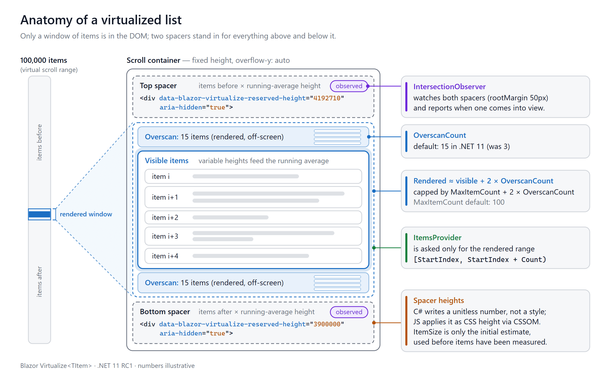

*Figure 1. The two spacers reserve the height of the items that aren't rendered. An `IntersectionObserver` watches the spacers and tells .NET when one of them scrolls into view.*

Here's how it works:

1. It finds the closest scrollable ancestor. In RC1, that's the first ancestor whose `overflow-y` is not `visible`, `hidden`, or `clip`. If there's none, it uses the document itself.
2. It renders the visible items plus `OverscanCount` extra items before and after them.
3. It renders a spacer before and after the window. Each spacer's height is *number of items it replaces* × *average item height*.
4. An `IntersectionObserver` (50 px root margin) watches both spacers. When one becomes visible, JavaScript reports the sizes to .NET, which computes a new window and renders it.

This `foreach`:

```razor
<div class="stream-viewport">
    @foreach (var item in items)
    {
        <ActivityCard @key="item.Id" Item="item" />
    }
</div>
```

becomes this:

```razor
<div class="stream-viewport" tabindex="0">
    <Virtualize Items="items" Context="item">
        <ActivityCard @key="item.Id" Item="item" />
    </Virtualize>
</div>
```

`Virtualize` doesn't require the whole collection to be in memory:

- **`Items`** takes an in-memory `ICollection<TItem>`. The component slices it directly.
- **`ItemsProvider`** takes a delegate. It receives an `ItemsProviderRequest` (`StartIndex`, `Count`, `CancellationToken`) and returns an `ItemsProviderResult<TItem>` (the slice plus `TotalItemCount`). Only the requested range needs to be loaded from the backend.

**Prerendering emits (almost) no items.** During static prerendering, `Virtualize` normally emits only its spacers. Real items appear once the component becomes interactive, which is why the virtualized HTML above was only 11.7 KB.

- With `Items`, the prerendered trailing spacer is item count × `ItemSize`.
- With an `ItemsProvider`, the provider isn't called during prerendering, so both spacers are 0 px. The sample's `/feed` and `/grid` pages prerender `data-blazor-virtualize-reserved-height="0"` twice.
- One exception in RC1: with in-memory `Items` and `InitialItemIndex` greater than 0, the window moves to the target before the first render. Up to `2 × OverscanCount + 1` items around it are then prerendered. The sample's `/chat` page prerenders messages #99,985–#100,000.

If you need all items in the initial HTML, for SEO or for no-JS clients, virtualization isn't the right tool. See [section 20](#when-not-to-use-virtualize).

## What changed in .NET 11

| | .NET 10 | .NET 11 RC1 | Introduced in |
|---|---|---|---|
| Variable-height items | Assumed uniform height (`ItemSize`) | Running average of measured heights | Preview 3 |
| Default `OverscanCount` | 3 | **15** (QuickGrid stays at 3) | Preview 3 |
| Content stability when items above resize | Native scroll anchoring disabled, so content jumped | Native CSS anchoring or `ResizeObserver` compensation | Preview 4 |
| Edge pinning | Hand-written JS | `AnchorMode` (`None`, `Start`, `End`, combinable) | Preview 4 (renamed in Preview 7) |
| Prepend/append detection for providers | — | `ItemComparer` (defaults to `EqualityComparer<T>.Default`) | Preview 4 / Preview 7 |
| Open at / jump to an item | Hand-written JS | `InitialItemIndex`, `ScrollToItemAsync` | Preview 6 (renamed in Preview 7) |
| Strict `style-src 'self'` | Spacers render `style="height:…"`, which the policy blocks | Spacer sizes rendered as `data-*` attributes and applied via CSSOM | Preview 6 |

To avoid relying only on the docs, I dumped the public surface from the RC1 shared framework with reflection (`tools/ApiSurface.cs` in the sample). Abridged output, with `TItem` shown generically:

```text
Assembly: Microsoft.AspNetCore.Components.Web 11.0.0-rc.1.26425.128
[Parameter] VirtualizeAnchorMode AnchorMode = Start
[Parameter] Int32 InitialItemIndex = 0
[Parameter] IEqualityComparer`1 ItemComparer = (EqualityComparer<TItem>.Default)
[Parameter] Single ItemSize = 50
[Parameter] Int32 MaxItemCount = 100
[Parameter] Int32 OverscanCount = 15
[Parameter] String SpacerElement = div
method Task ScrollToItemAsync(Int32 itemIndex, CancellationToken cancellationToken = default)
enum VirtualizeAnchorMode [Flags]  None = 0, Start = 1, End = 2
```

> **Reading older preview blog posts?** Preview 7 renamed three APIs: `VirtualizeAnchorMode.Beginning` → `Start`, `InitialIndex` → `InitialItemIndex`, and `ScrollToIndexAsync` → `ScrollToItemAsync`. Code from Preview 4–6 posts won't compile on RC1 until you apply those renames.

### Variable-height items

Earlier versions assumed that every item had the height given by `ItemSize`. In .NET 11, `ItemSize` is only the **initial estimate**. Once items render, the JavaScript side measures the total height of everything rendered between the two spacers, using a DOM `Range`. It sends that total to .NET along with the spacer and container sizes. .NET adds it to a running total and uses `totalMeasuredHeight / measuredItemCount` for every spacer calculation after that. Measurements are only taken when no placeholders are on screen, so placeholder heights don't distort the average.

You can see this in the sample. The activity feed starts with `ItemSize="96"` and 100,000 items, so the first scroll range is 100,000 × 96 ≈ **9.6 million px**. After the first measurements it settles at about **8.4 million px**, an average of about 84 px per card.

Two consequences:

- `Virtualize` doesn't know the exact height of each item. It estimates the unrendered ones from the average. When you jump by dragging the scrollbar far into an unmeasured region, the first position is an estimate and may be corrected slightly.
- A better `ItemSize` still helps, because it makes the first render and the first scroll range closer to reality.

### 3.2 Hybrid scroll anchoring

In .NET 10, `Virtualize` turned off the browser's native scroll anchoring, because spacer resizes could otherwise start a feedback loop. As a result, content jumped whenever an item above the viewport changed height. .NET 11 uses one of two paths instead:

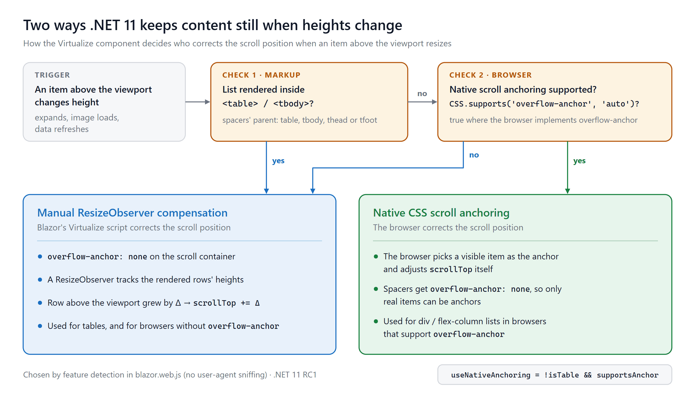

*Figure 2. The path is chosen by feature detection (`CSS.supports('overflow-anchor', 'auto')`) and by whether the spacers' parent is a table section. RC1 does no user-agent sniffing.*

You can see the choice in the DOM:

- In the sample's `div`-based feed, the scroll container keeps `overflow-anchor: auto` and only the spacers get `overflow-anchor: none`.
- In the `<table>` grid, the container itself gets `overflow-anchor: none` and the manual path takes over.

Chrome, Firefox, and Playwright's WebKit build all behaved this way, and all three report `overflow-anchor` support. Real Safari is a different story: according to MDN's compatibility data it supports `overflow-anchor` only from **Safari 27**. On older Safari and iOS versions, even `div` lists take the manual path. Playwright's WebKit build doesn't exercise that path.

### The `OverscanCount` default changed from 3 to 15

More overscan means fewer blank moments during fast scrolling and more items to average heights over. It also means:

- **More DOM.** The sample's feed renders 37–38 cards at the top of a 100,000-item list, compared with about 7 visible ones.
- **Bigger `ItemsProvider` requests.** With 15 items before and after the visible range, a request asks for roughly `visible + 30` items instead of `visible + 6`.
- **No breaking-change notice.** The change isn't listed on the .NET 11 or ASP.NET Core 11 breaking-changes pages, so check for it yourself when you upgrade.

`QuickGrid` deliberately keeps `OverscanCount = 3`, because grid rows are heavier. See [section 13](#choosing-itemsize-and-overscancount) for how to choose.

## The sample application: LiveStream

The sample is a Blazor Web App (Interactive Server) that renders a deterministic dataset of 100,000 synthetic events. Every scenario in this article is a page in it.

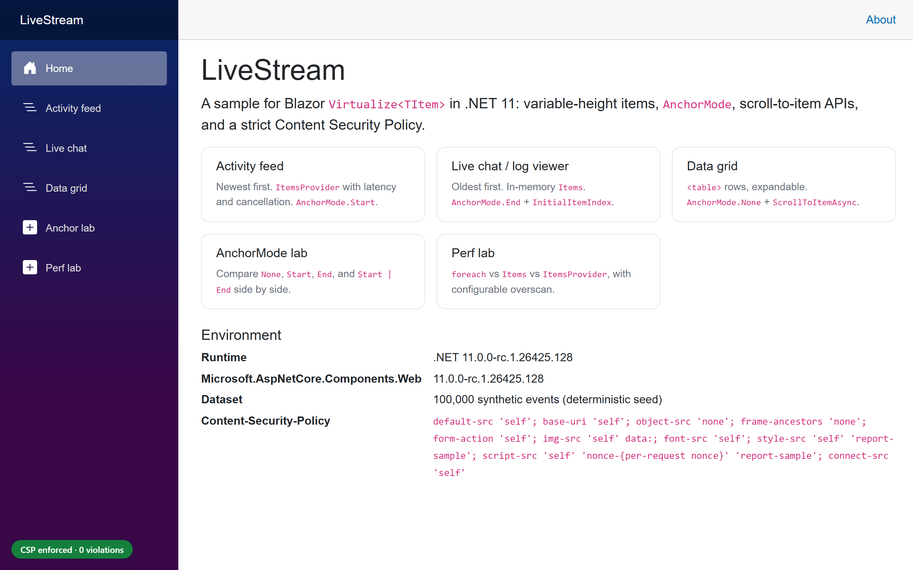

```text
samples/LiveStream/
├── global.json                      # pins the .NET 11 RC1 SDK
├── src/LiveStream/
│   ├── Components/
│   │   ├── Pages/ActivityFeed.razor  # ItemsProvider + AnchorMode.Start
│   │   ├── Pages/LiveChat.razor      # Items + AnchorMode.End + InitialItemIndex
│   │   ├── Pages/DataGrid.razor      # <table> + ScrollToItemAsync
│   │   ├── Pages/Labs/AnchorLab.razor
│   │   ├── Pages/Labs/PerfLab.razor
│   │   └── Stream/                   # ActivityCard, ChatMessage, StatsBar, ReadyMarker
│   ├── Models/StreamItem.cs
│   ├── Services/SyntheticDataset.cs  # shared, immutable 100k items
│   ├── Services/ActivityFeedStore.cs # per-circuit view + ItemsProvider
│   ├── Security/ContentSecurityPolicy.cs
│   └── wwwroot/js/                   # csp-monitor.js, stream-interop.js
├── baseline/CspBaseline.Net10/       # same CSP on .NET 10, for comparison
├── tests/LiveStream.Tests/           # xUnit + WebApplicationFactory
├── tools/ApiSurface.cs              # dumps the Virtualize API (section 3)
└── e2e/                              # Playwright tests, measurement scripts, results/
```

Technical choices:

- **Interactive Server** keeps the sample easy to run. The virtualization code is the same on WebAssembly. [Section 17](#browser-and-layout-caveats) covers the differences.
- **`net11.0`**, with the SDK pinned in `global.json`.
- **100,000 records**, with messages ranging from one to six lines. About 18% have an expandable diagnostics block.
- **150–400 ms simulated latency** in the feed's provider, with cancellation.
- **A strict CSP header on every page:** `style-src 'self'` and a per-request nonce for the one inline script (the import map). A badge in the corner counts violations live.

To run it:

```bash
cd samples/LiveStream
dotnet run --project src/LiveStream --urls http://localhost:5261
```

## The data model and the `ItemsProvider`

The model is a record:

```csharp
public sealed record StreamItem(
    long Id,
    string Author,
    string Message,
    string? Details,
    DateTimeOffset CreatedAt,
    StreamItemKind Kind)
{
    /// <summary>
    /// Identity by key. Virtualize uses ItemComparer to tell whether items were prepended
    /// or appended between ItemsProvider calls. The default (record value equality) compares
    /// every field, so an edited item would look like a different item; the Id doesn't change.
    /// </summary>
    public static IEqualityComparer<StreamItem> ById { get; } =
        EqualityComparer<StreamItem>.Create((a, b) => a?.Id == b?.Id, item => item.Id.GetHashCode());
}
```

Why a comparer, when records already have value equality? When data comes from an `ItemsProvider` and the total count grows, `Virtualize` compares the first item it rendered before with the first item of the new result. A mismatch means "items were inserted above". Record equality works until that first rendered item is *edited* in a refresh where the count also grew, which happens constantly in a live feed. The old and new versions then compare unequal, and an edit looks like a prepend. A key-based comparer avoids that.

The RC1 SDK agrees. Building the sample without a comparer produced a new analyzer warning:

```text
warning BL0011: Virtualize uses 'ItemsProvider' without 'ItemComparer'.
Set ItemComparer to an IEqualityComparer that identifies items by a unique key.
```

(With in-memory `Items`, `Virtualize` ignores `ItemComparer` and uses `EqualityComparer<TItem>.Default`.)

The provider is the store method that `Virtualize` calls:

```csharp
private async ValueTask<ItemsProviderResult<StreamItem>> GetAsync(ItemsProviderRequest request, bool newestFirst)
{
    Interlocked.Increment(ref _providerCalls);
    LastRequest = (request.StartIndex, request.Count);

    try
    {
        var (min, max) = Latency;
        if (max > 0)
        {
            // Simulated network + database time. Virtualize cancels this token
            // when the user scrolls on before the response arrives.
            await Task.Delay(Random.Shared.Next(min, max + 1), request.CancellationToken);
        }
    }
    catch (OperationCanceledException)
    {
        Interlocked.Increment(ref _canceledCalls);
        throw;
    }

    return GetRange(request.StartIndex, request.Count, newestFirst);
}
```

- **`request.StartIndex`** is the index of the first item to return.
- **`request.Count`** covers the visible range plus overscan on both sides. It's larger in .NET 11 because of the new default.
- **`request.CancellationToken`** is canceled when a newer request replaces this one. In the browser test, scrolling quickly through the feed produced canceled provider calls in all three engines. Pass the token all the way down to your database or HTTP call.
- **`TotalItemCount`** (the second constructor argument of the result) sets the spacer sizes. It has to be accurate and cheap.

> **Offset pagination gets expensive.** `Skip(n).Take(m)` is fine for a demo. Deep offsets can be slow in relational databases, and running `COUNT(*)` on every request adds up. For production feeds, consider keyset (cursor) pagination behind a layer that maps virtual indexes to stable cursors, and cache the total count.

One design detail in the sample is worth copying. The 100,000 base records are a **shared, immutable singleton**. Each circuit keeps only its own new events in a small list, so adding an item costs O(1) and a new circuit costs a few hundred bytes instead of a copy of the dataset.

## Scenario 1: an activity feed with `AnchorMode.Start`

New activity arrives at the **top** of the feed. It's newest first, and index 0 is the newest event.

```razor
<div class="stream-viewport" tabindex="0" @ref="viewport" aria-label="Activity feed, newest first">
    <Virtualize @ref="virtualize" TItem="StreamItem" ItemsProvider="provider" ItemComparer="StreamItem.ById"
                Context="item" ItemSize="96" AnchorMode="VirtualizeAnchorMode.Start">
        <ItemContent>
            <ActivityCard @key="item.Id" Item="item" Expanded="expanded.Contains(item.Id)" OnToggle="ToggleDetails" />
        </ItemContent>
        <Placeholder>
            <div class="activity-card activity-card--placeholder" aria-hidden="true">…</div>
        </Placeholder>
        <EmptyContent>
            <p class="stream-empty">No activity has been recorded yet.</p>
        </EmptyContent>
    </Virtualize>
</div>
```

`provider` is assigned once in `OnInitialized` (`provider = Store.GetNewestFirstAsync;`), so every render passes the same delegate instance. New events, whether from the simulated live stream or the "+5 events" button, aren't pushed to the UI one at a time. They go into a queue, and a 250 ms `PeriodicTimer` flushes them in batches:

```csharp
private async Task FlushAsync()
{
    List<StreamItem> batch = [];
    while (pending.TryDequeue(out var item))
    {
        batch.Add(item);
    }

    if (batch.Count == 0 || virtualize is null)
    {
        return;
    }

    Store.Add(batch);

    if (!atTop)
    {
        unseen += batch.Count;
        announcement = $"{unseen} new events above.";
    }

    // ItemsProvider data changed outside of Virtualize: ask it to re-request the visible range.
    await virtualize.RefreshDataAsync();
    StateHasChanged();
}
```

`atTop` comes from a small JS helper, shown in the next section, that reports when the user reaches or leaves the top edge. It uses the same definition as `AnchorMode.Start` in RC1: `scrollTop < 1`. A looser threshold would create a gap. The page would think the user was at the top and skip the pill, while `Virtualize` would already be keeping the new events out of view.

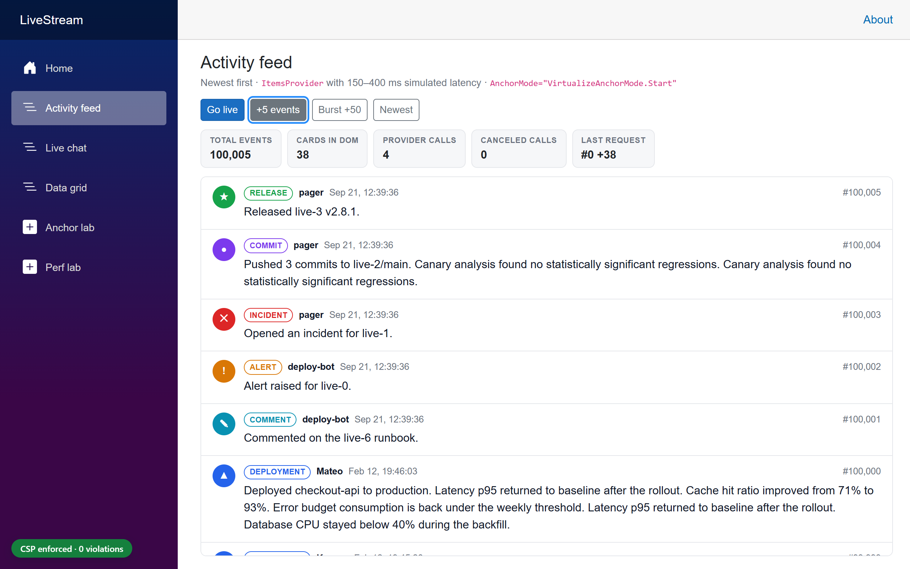

### Expected UI behavior, and what I measured

| Situation | Expected | Measured (Chrome, Firefox, WebKit) |
|---|---|---|
| At the top, 5 events arrive | The view stays at the top and shows the new events | `scrollTop` stays 0; the first visible card is the newest |
| Reading older events, 5 events arrive | What you're reading doesn't move; an "↑ 5 new events" pill appears | Same first visible card, offset changed by ≤ 1 px |
| A card *above* the viewport expands | Visible content stays put | 0 px shift (wheel scrolling, 6/6 runs per engine) |
| DOM size | Only a window of the 100,000 events | 37–38 cards rendered |
| Fast scrolling with 150–400 ms latency | Stale requests are canceled | Canceled provider calls > 0 in every run of the test |

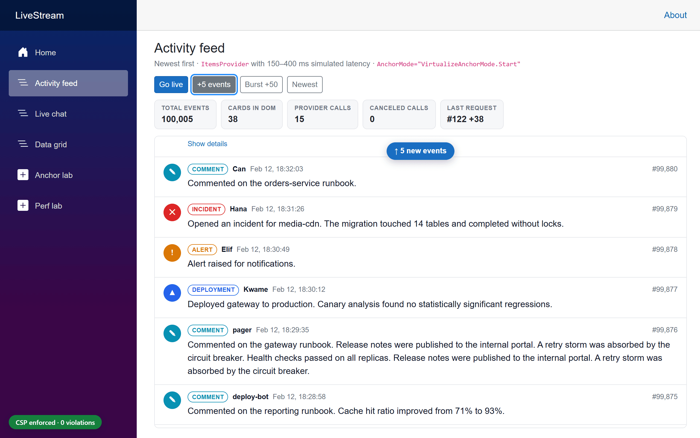

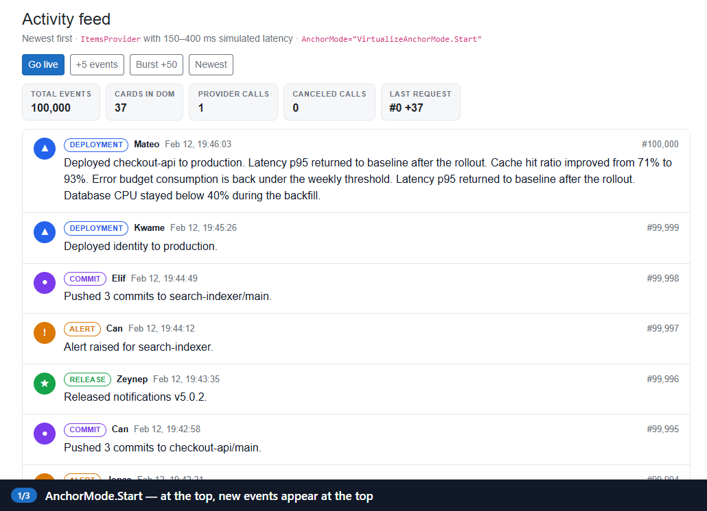

*The pill calls `ScrollToItemAsync(0)`. The GIF is a screen recording of the sample in Chrome.*

## Scenario 2: a chat or log viewer with `AnchorMode.End`

In a chat or log viewer, new items arrive at the **bottom**, and the list should open there too:

```razor
<div class="stream-viewport stream-viewport--chat" tabindex="0" @ref="viewport" aria-label="Chat messages, oldest first">
    <Virtualize @ref="virtualize" Items="messages" Context="message"
                ItemSize="72" AnchorMode="VirtualizeAnchorMode.End"
                InitialItemIndex="@(messages.Count - 1)">
        <ChatMessage @key="message.Id" Message="message" Mine="@(message.Author == Me)" />
    </Virtualize>
</div>
```

- `Items` is a `List<StreamItem>`. With in-memory `Items`, `Virtualize` re-reads the collection on every render, so appending is just `messages.Add(...)` followed by `StateHasChanged()`. You don't need `RefreshDataAsync`.
- `InitialItemIndex="@(messages.Count - 1)"` opens the list at the latest message. It's applied once, on the first interactive render.
- `AnchorMode.End` follows new messages **only while the user is at the bottom**. In RC1, "at the bottom" means less than 2 px away.

The core UX rule for chat UIs is to follow new messages only while the user is already following the live edge. `AnchorMode.End` implements that rule. The sample adds the other half: an unread counter and a way back to the bottom. A tiny JS module reports when the user leaves or reaches an edge, using the same thresholds as `Virtualize` (1 px for the top, 2 px for the bottom). It calls .NET only when that state flips, not on every scroll event:

```js
export function watchEdge(element, dotNetRef, edge, threshold) {
    let atEdge = null;
    let frame = 0;

    const check = () => {
        frame = 0;
        const distance = edge === 'end'
            ? element.scrollHeight - element.clientHeight - element.scrollTop
            : element.scrollTop;
        const now = distance < threshold;
        if (now !== atEdge) {
            atEdge = now;
            dotNetRef.invokeMethodAsync('OnEdgeChanged', now);
        }
    };
    // … a scroll listener and a ResizeObserver schedule check() once per animation frame
}
```

```razor
@if (unread > 0)
{
    <button type="button" class="new-items-pill new-items-pill--bottom" @onclick="JumpToLatestAsync">
        ↓ @unread new @(unread == 1 ? "message" : "messages")
    </button>
}
```

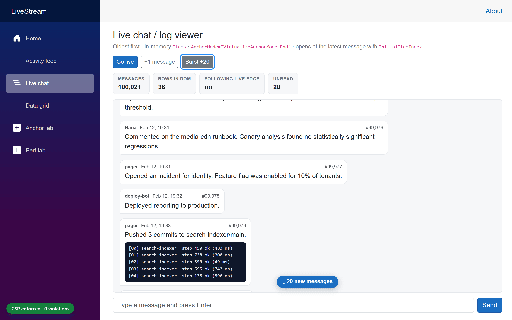

### Expected UI behavior, and what I measured

| Situation | Expected | Measured |
|---|---|---|
| Page opens | At the bottom, message #100,000 visible | ✔ all engines (`InitialItemIndex`) |
| At the bottom, a message arrives | Scrolls to show it | With the sample's guard: ✔ 30/30 follow checks per engine. `AnchorMode.End` alone: Chrome 29/30, Firefox 28/30, **WebKit 20/30** (see below) |
| Scrolled up, 20 messages arrive | View stays put; "↓ 20 new messages" pill | ✔ all engines, `scrollTop` unchanged |
| User returns to the bottom | Following resumes | ✔ all engines |

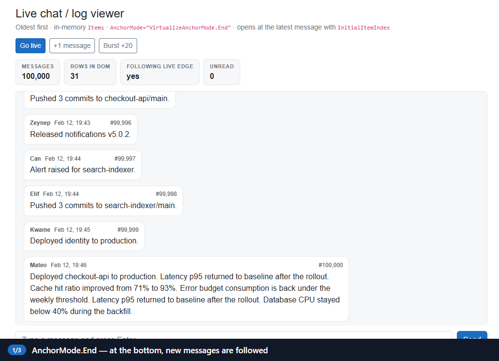

### An RC1 caveat: End-follow sometimes stops short

I ran the chat tests 10 times per engine with the sample's safety net turned off. Each run contains three checks that depend on `AnchorMode.End` following an append: a new message, a message sent from the composer, and a new message after returning to the bottom. They passed **29/30 in Chrome, 28/30 in Firefox, and 20/30 in Playwright's WebKit**. In every failure, the list ended **29–77 px short** of the bottom 600 ms after the append (Chrome 72 px, Firefox 61 px, WebKit 29–77 px), so the new message was only partly visible. Outside the test suite the miss was rare: in isolated WebKit runs.

The sample therefore adds a small, explicit safety net. It only acts if the page's edge watcher considered the user to be at the live edge (less than 2 px, the same as `AnchorMode.End`) when the message arrived, *and* the list then ended up between 1 and 120 px short of the bottom:

```js
export function stickToBottom(element, tolerance) {
    requestAnimationFrame(() => {
        const distance = element.scrollHeight - element.clientHeight - element.scrollTop;
        if (distance > 1 && distance <= tolerance) {
            element.scrollTop = element.scrollHeight;
        }
    });
}
```

With the guard on (the sample's default), the same 10× run passed **all 40 chat tests, including 30/30 follow checks, in every engine**. Add `?guard=false` to the URL, or run the tests with `CHAT_GUARD=false`, to observe `AnchorMode.End` on its own. An End-anchoring fix is already merged for RC2 ([dotnet/aspnetcore#69388](https://github.com/dotnet/aspnetcore/pull/69388)). It changes exactly the condition that decides when to pin, so retest before you keep or remove a workaround like this. Playwright's WebKit on Windows is also not Safari on macOS or iOS, so test on real devices too.

## Understanding every `AnchorMode`, measured

The docs describe the modes in terms of scroll position. To find out what they actually do, the sample's **AnchorMode lab** (`/lab/anchor`) prepends or appends 5 items at the top, middle, and bottom of a 2,000-item variable-height list. It runs every mode with both `Items` and `ItemsProvider`, in Chrome, Firefox, and WebKit.

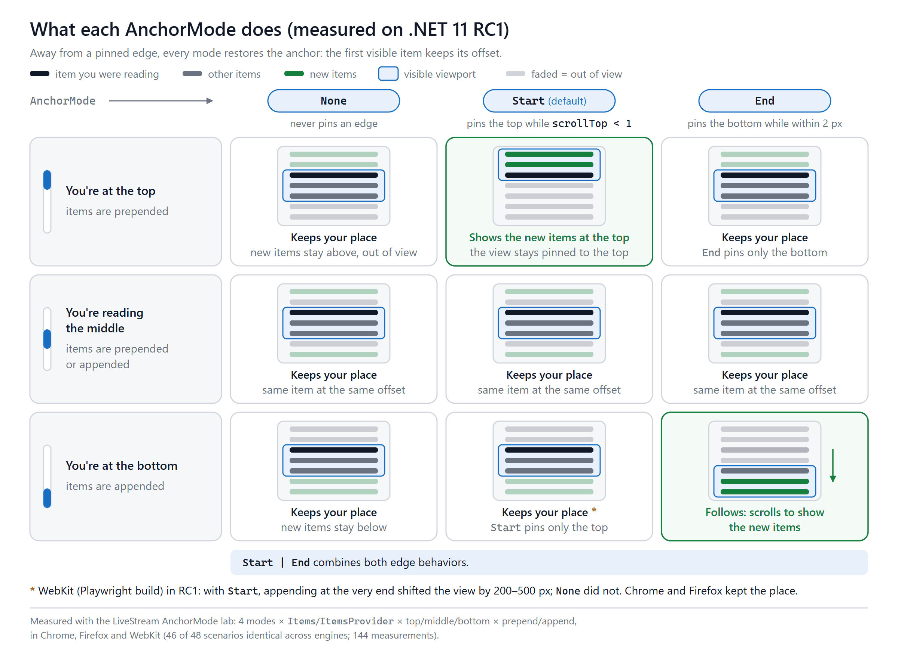

| Where the user is | What arrives | `None` | `Start` (default) | `End` | `Start \| End` |
|---|---|---|---|---|---|
| At the top | 5 items prepended | Keeps place | **Shows the new items** | Keeps place | **Shows the new items** |
| At the top | 5 items appended | Keeps place | Keeps place | Keeps place | Keeps place |
| In the middle | 5 items prepended | Keeps place | Keeps place | Keeps place | Keeps place |
| In the middle | 5 items appended | Keeps place | Keeps place | Keeps place | Keeps place |
| At the bottom | 5 items prepended | Keeps place | Keeps place | Keeps place | Keeps place |
| At the bottom | 5 items appended | Keeps place | Keeps place ⚠️ | **Follows the new items** | **Follows the new items** |

*"Keeps place" means the item that was first visible before the change was still the first visible item afterward. The matrix records which item that was, not its pixel offset; sections 6 and 10 report pixel shifts. `Items` and `ItemsProvider` fell into the same category in every cell. 46 of the 48 scenarios gave the same result in Chrome, Firefox, and WebKit (144 measurements in total). The ⚠️ cell covers both exceptions, which were WebKit with `Start`, for `Items` and for `ItemsProvider`.*

Three conclusions:

1. **Keeping your place is the default everywhere.** `AnchorMode` doesn't turn anchoring on or off. It decides what happens **at the edges**: `Start` shows new items when you're at the very top (`scrollTop < 1`), and `End` follows new items when you're at the very bottom (within 2 px).
2. **`None` keeps the *content* still, not the `scrollTop` number.** The docs say `None` keeps "the current scroll position". With `None`, though, prepending 5 items at the top *increased* `scrollTop` by about 400 px, so that the same item stayed in view. If you want new items at the top to become visible, that's `Start`.
3. **Between the edges, all four modes behave the same.**

**⚠️ WebKit and infinite lists.** In Playwright's WebKit build, appending items while the user was at the very end of a `Start` list (the default) moved the visible content. It moved **214 px** with `Items` and **366–486 px** with `ItemsProvider`, in 3 of 3 runs. With `AnchorMode.None` it moved **0 px**, and Chrome and Firefox moved 0 px in both modes. That's exactly the classic infinite-scroll pattern: reach the end, and more items load. If a list only ever grows at the end and doesn't need top pinning, **set `AnchorMode="VirtualizeAnchorMode.None"`** and test on real Safari.

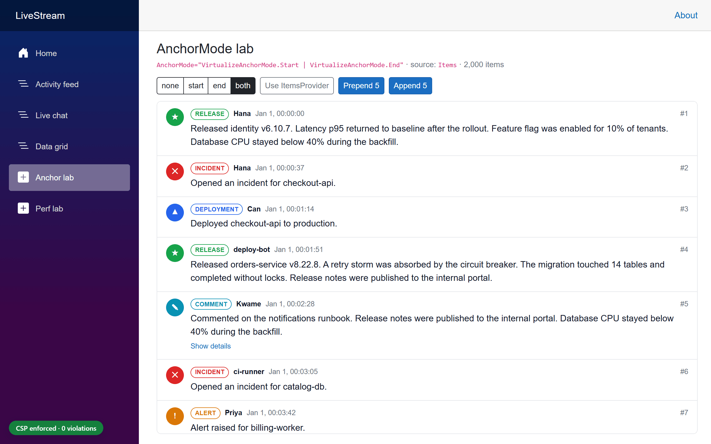

### Gotcha: the docs' Razor shorthand doesn't compile

The release notes and the virtualization docs show this:

```razor
<Virtualize AnchorMode="Start" ...>   @* from the docs *@
```

On RC1, that fails with `CS0103: The name 'Start' does not exist in the current context`. Razor treats non-string component parameters as C# expressions, so write the enum out in full:

```razor
<Virtualize AnchorMode="VirtualizeAnchorMode.Start" ...>
<Virtualize AnchorMode="VirtualizeAnchorMode.Start | VirtualizeAnchorMode.End" ...>
```

### Other details worth knowing

- **Upgraded lists get `Start` automatically.** It's the default because it matches how lists behaved before. If a list shouldn't pin to anything, such as a sortable grid or an infinite list that grows at the end, set `None` explicitly.
- **`AnchorMode` can change at runtime.** `Virtualize` sends the new value to JavaScript after the next render.
- **Keyboard:** Pressing <kbd>End</kbd> in the scroll container turns on bottom-following even when `End` isn't set, and <kbd>Home</kbd> clears it. `ScrollToItemAsync` also clears it.
- **Deletions above the viewport are not anchored.** Inserts and height changes are, but removing items above the reader still moves content. That's an open backlog request ([dotnet/aspnetcore#66509](https://github.com/dotnet/aspnetcore/issues/66509)).
- **`Start | End` is allowed,** but the design discussion admits there's no known real use case for it.

## Refreshing virtualized data without thrashing

With an `ItemsProvider`, `Virtualize` can't know that your data changed. Call `RefreshDataAsync()`. When the change comes from outside Blazor's event pipeline, such as a timer, a SignalR client, or a message-bus handler, marshal it onto the renderer first. The handler below is illustrative. The sample does the same thing with its `PumpAsync` loop, which calls `InvokeAsync(FlushAsync)` (section 6):

```csharp
// Called from a timer, a SignalR client, or a message-bus handler, not from a Blazor event.
private Task OnEventsArrivedAsync(IReadOnlyList<StreamItem> batch) => InvokeAsync(async () =>
{
    Store.Add(batch);

    if (virtualize is not null)
    {
        await virtualize.RefreshDataAsync(); // re-requests the current window
    }

    StateHasChanged(); // RefreshDataAsync doesn't render by itself
});
```

Rules that matter in practice:

- **Get back onto the renderer's synchronization context** with `InvokeAsync`, as above. `RefreshDataAsync` must run there too.
- **Call `StateHasChanged()` afterwards** when the refresh doesn't come from a Blazor event handler. `RefreshDataAsync` fetches, but it doesn't render.
- **Batch.** In RC1, `RefreshDataAsync()` also **resets the running average item height**, so every refresh starts measuring from scratch. Refreshing on every message of a busy stream means more provider calls, more renders, *and* less accurate spacer estimates. The sample drains its queue with a 250 ms `PeriodicTimer`, so the list refreshes at most four times per second, however fast events arrive.
- **Clean up.** Implement `IAsyncDisposable`: cancel timers and loops, dispose `DotNetObjectReference`s and JS module references, and catch `JSDisconnectedException` when the circuit is already gone. The RC1 SDK nudges you here too, with a new analyzer warning: *BL0016: JS interop call 'InvokeAsync' is not guarded with a try/catch block*.
- **Pass the cancellation token through.** When a newer request supersedes an older one, the older token is canceled. Ignoring it just wastes backend work.

## Variable heights and expansion

Every card in the sample's feed has a different height, and about 18% can expand a diagnostics block. Three rules make that work well:

1. **Keep per-item UI state in the parent, not in the item component.** `Virtualize` disposes item components that scroll out of the window. An `Expanded` field inside `ActivityCard` would be lost as soon as the card scrolled away. The sample keeps a `HashSet<long>` of expanded IDs in the page and passes `Expanded` down as a parameter.
2. **Give each item one root element, and no vertical margins.** Heights are measured from the rendered content between the spacers, and collapsing margins between siblings make that fragile. Use padding and borders inside the item instead.
3. **Reserve space for content that loads later.** An image without `width` and `height` (or `aspect-ratio`) changes the row height after it loads. Anchoring compensates, but it's better not to cause the shift in the first place.

### How stable is it? Measurements

In this test I scrolled with real mouse-wheel input, then expanded an item rendered just *above* the viewport, and recorded how far the first visible item moved. Six runs per cell:

| Layout (anchoring path) | Chrome | Firefox | WebKit |
|---|---|---|---|
| `div` feed (native CSS anchoring) | **0 px** ×6 | **0 px** ×6 | **0 px** ×6 |
| `<table>` grid (manual `ResizeObserver`) | 41–42 px ×4, 222 px ×1, 0 px ×1 | 41–42 px ×4, 0 px ×2 | 0–1 px ×5, 42 px ×1 |
| `<table>` grid, after ordinary renders first | ≤ 1 px ×6 | 0 px ×6 | ≤ 1 px ×6 |

What's behind the table numbers:

- **Tables have a gap in RC1.** On the manual path, rows are added to the `ResizeObserver` after ordinary renders but *not* after scroll-triggered renders. A row that changes height right after a scroll can be observed for the first time with its new height already applied, so there's nothing to compensate against. When I triggered ordinary renders first (expanding and collapsing another row), the shift was **≤ 1 px in 6/6 runs in every engine**. Right after scrolling, Chrome and Firefox usually shifted by one row line (41–42 px; 16 of 24 runs), and Chrome occasionally by about 220 px (2 of 12 runs). WebKit shifted 42 px in 1 of 12 runs and ≤ 1 px otherwise.
- **Programmatic jumps are harder than wheel scrolling.** I also set `scrollTop` directly, let the list settle, and then expanded an item above the viewport. In Chrome and WebKit, the `div` feed didn't move in any run. Firefox moved it 168 px in 1 of 7 runs, and 132–186 px in 3 of 7 runs in an earlier session. The grid moved 41–132 px in Chrome, 0–42 px in Firefox, and 0 px in WebKit. If your app scrolls programmatically and then changes content above the viewport, test that combination.

## Data grids: tables, jumping to rows, and QuickGrid

The sample's grid virtualizes `<tr>` elements inside `<tbody>`. The visible column header lives in a separate table *outside* the scroll container:

```razor
@* The visible header sits outside the scroll container. A sticky <thead> inside it would cover the
   row that InitialItemIndex / ScrollToItemAsync align to the container's top edge. *@
<div class="grid-frame">
    <div class="grid-header" aria-hidden="true">
        <table class="event-grid"><colgroup>…</colgroup><thead>…</thead></table>
    </div>

    <div class="stream-viewport grid-viewport" tabindex="0" aria-label="Event log">
        <table class="event-grid">
            <colgroup>…</colgroup>
            <thead class="visually-hidden">…</thead> @* column headers for assistive technology *@
            <tbody>
                <Virtualize @ref="virtualize" TItem="StreamItem" ItemsProvider="provider" ItemComparer="StreamItem.ById"
                            Context="row" SpacerElement="tr" ItemSize="62" AnchorMode="VirtualizeAnchorMode.None"
                            InitialItemIndex="@(StartRow is int start ? start - 1 : 0)">
                    <ItemContent>
                        <tr @key="row.Id" data-id="@row.Id" @onclick="() => Toggle(row.Id)">…</tr>
                    </ItemContent>
                </Virtualize>
            </tbody>
        </table>
    </div>
</div>
```

```css
/* Same <colgroup> and table-layout: fixed in both tables; scrollbar-gutter keeps the columns aligned. */
.grid-header { flex: none; overflow-y: hidden; scrollbar-gutter: stable; }
.grid-frame .grid-viewport { flex: 1 1 0; scrollbar-gutter: stable; }
.event-grid { width: 100%; table-layout: fixed; }
```

```csharp
private async Task JumpAsync()
{
    if (virtualize is not null && jumpTo is int row)
    {
        await virtualize.ScrollToItemAsync(row - 1);
    }
}
```

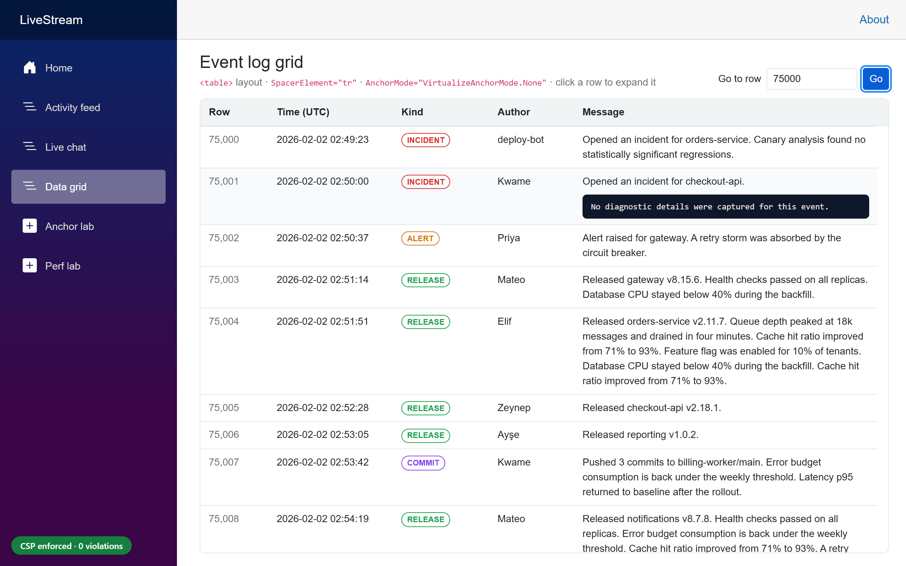

- **`SpacerElement="tr"`** keeps the markup valid. `Virtualize` gives the spacer rows `display: table-row` itself.
- **`AnchorMode.None`** is set explicitly, because a grid that users sort and filter shouldn't pin to an edge.
- **`ScrollToItemAsync`** ("Go to row") and **`InitialItemIndex`** (`/grid?row=500`) put the requested row at the top of the viewport in every engine. Keep in mind:
  - `ScrollToItemAsync` scrolls instantly (no smooth scrolling). It aligns the item with the **top edge of the scroll container** and cancels any earlier call that's still running (the last call wins).
  - A sticky `<thead>` *inside* the scroll container would cover exactly that row. That's why the sample keeps the header outside the container, as shown above.
  - It throws `InvalidOperationException` if called before the first interactive render. Use `InitialItemIndex` for the starting position.
  - The index is a **position in the list**, not a database identity. If your provider's ordering isn't stable, the jump can land on a different record.
- **An RC1 issue with `InitialItemIndex`:** When the grid opened with `?row=75000`, the *next* ordinary render (expanding a visible row) moved the rows by **82 px in Chrome, −53 px in Firefox, and 63 px in WebKit**, in 3/3 runs each, while `scrollTop` stayed the same. The top spacer is recomputed once positioning ends. After `ScrollToItemAsync` the same action moved them 0 px. RC2 freezes the spacer item size during initial positioning ([dotnet/aspnetcore#69170](https://github.com/dotnet/aspnetcore/pull/69170)).
- **Size `ItemSize` for the real rows.** The grid's rows average about 62 px (38.6–122 px), because messages wrap. The sample keeps the short columns on one line (`white-space: nowrap`) so that only the message column wraps.
- **`<table>` layouts use the manual compensation path.** See the measurements in [section 10](#10-variable-heights-and-expansion).

**QuickGrid** forwards `InitialItemIndex` and `ScrollToItemAsync` in .NET 11. Its `AnchorMode` and `ItemComparer` parameters are marked `[Experimental("ASP0030")]` in RC1, and that attribute has already been removed for RC2. It keeps `OverscanCount = 3`. Two QuickGrid issues filed against RC1 are still open: Start anchoring drifts after prepends in Server render modes, and the grid sends duplicate provider requests ([#69380](https://github.com/dotnet/aspnetcore/issues/69380), [#69381](https://github.com/dotnet/aspnetcore/issues/69381)). If you rely on QuickGrid anchoring, test it specifically.

## Performance: what I measured

I didn't want illustrative numbers here, so the sample's **Perf lab** (`/lab/perf`) renders the same row markup in three ways: a plain `foreach`, `Virtualize` with `Items`, and `Virtualize` with an `ItemsProvider`. A Playwright script measured each variant three times in fresh Chrome contexts and took the median.

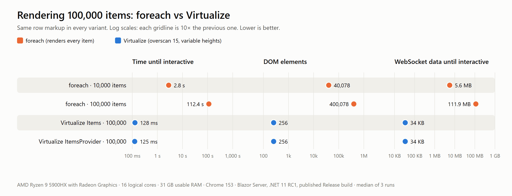

| Variant (100,000 items unless noted) | HTML | First row painted | Interactive | DOM elements | Rows rendered | JS heap | WebSocket until interactive |
|---|---|---|---|---|---|---|---|
| `foreach`, 10,000 items | 2.9 MB | 77 ms | 2.8 s | 40,078 | 10,000 | 21.2 MB | 5.6 MB |
| `foreach` | 28.6 MB | 248 ms | **112.4 s** | 400,078 | 100,000 | 189.5 MB | 111.9 MB |
| `Virtualize` `Items`, fixed heights, overscan 15 | 11.7 KB | 106 ms | **125 ms** | 288 | 52 | 2.7 MB | 39 KB |
| `Virtualize` `Items`, variable heights, overscan 15 | 11.7 KB | 109 ms | **128 ms** | 256 | 44 | 2.7 MB | 34 KB |
| `Virtualize` `ItemsProvider`, variable heights, overscan 15 | 11.7 KB | 108 ms | **125 ms** | 256 | 44 | 2.7 MB | 34 KB |

*Published Release build, Production environment, Blazor Server on localhost. Chrome 153 on an AMD Ryzen 9 5900HX. Median of 3 fresh browser contexts per variant. "Interactive" is the time from navigation until the first interactive render batch was applied. JS heap is in MiB; HTML and WebSocket sizes use decimal units (1 MB = 1,000,000 bytes). Raw data: `e2e/results/perf.json`.*

What the numbers say:

- **Prerendering hides the problem for a moment.** The `foreach` page painted its first row after 248 ms, because the rows are in the HTML. It then took **112 seconds** to become interactive. The circuit had to send 112 MB of render batches for 100,000 rows, and the browser recorded 92 seconds of long tasks on the main thread. Even at 10,000 items it took 2.8 s.
- **With `Virtualize`, the rendered window sets the cost, not the list length.** For 100,000 items it took about 125 ms to become interactive, with 256–288 DOM elements, 2.7 MB of JS heap, and 34–39 KB over the WebSocket.
- **`Items` and `ItemsProvider` cost the same on the UI side.** The difference is on the server: `Items` needs the collection in memory, while a provider fetches only the window.

### The overscan trade-off


To stress each configuration, the harness "flings" the list: 60 mouse-wheel events of 600 px each in about 2.4 seconds (≈ 15,000 px/s). After each event it checks whether the center of the viewport shows a row or an empty spacer.

- **Fixed heights:** Moving from overscan 3 to 15 cut blank samples from **55 to 3 out of 60**, at the cost of 52 instead of 28 rendered rows.
- **Variable heights:** Overscan helps less here: 52, 39, and 32 blank samples for overscan 3, 15, and 30. Every window change must be measured and rendered, and the running average is still converging while you fling through unmeasured regions.
- **Server traffic while scrolling** was 0.6–1.2 MB per fling on Blazor Server. That's the render batches for each new window, and it grows with overscan and row complexity.

Treat these numbers as a *relative* comparison, taken on one machine with the server on localhost. Over a real network, Blazor Server adds a round trip to every window change, which makes overscan more valuable. On WebAssembly there's no round trip, but rendering competes with everything else on the main thread.

The main message: **`Virtualize` limits how much UI you render. It doesn't make your data access faster.** If your provider runs an expensive `COUNT(*)` on every request, slows down at deep offsets, returns far more columns than the row needs, or ignores the cancellation token, virtualization won't hide that.

## Choosing `ItemSize` and `OverscanCount`

**`ItemSize`**

- It's the starting estimate. `Virtualize` uses it before any measurements exist and for the first scroll range.
- Set it close to your real average item height. Measure it in the browser, as the sample did for its grid (about 62 px). A value that's far off makes the first layout and scrollbar noticeably wrong until measurements arrive.
- Variable-height support doesn't make it irrelevant. Changing `ItemSize` at runtime resets the measured average.

**`OverscanCount`**

| Lower (e.g. 3) | Higher (e.g. 15–30) |
|---|---|
| Fewer DOM nodes and components | Fewer blank moments during fast scrolling |
| Smaller render batches and provider requests | More items to average variable heights over |
| More risk of placeholders or empty space when scrolling fast | More DOM, more component instances, bigger batches |

Start with the .NET 11 default of 15, then profile with your real row template on the slowest devices you support. Heavy rows, such as grids with many cells or rich cards, may justify going back down. `QuickGrid` stays at 3 for exactly that reason. `MaxItemCount` (default 100) still caps how many items are rendered, plus 2 × `OverscanCount`. Don't set it lower than what a tall window can show.

## Content Security Policy: why virtualization used to break

A strict policy like the following blocks inline `style` attributes:

```http
Content-Security-Policy: default-src 'self'; style-src 'self'
```

That applies both to attributes in the server-rendered markup and to attributes set with `element.setAttribute('style', …)`. Browsers report them as **`style-src-attr`** violations. Nonces don't help, because they never apply to attributes, and `'unsafe-hashes'` doesn't scale to values that change on every scroll.

Up to .NET 10, `Virtualize` rendered its spacers like this (captured from the sample's .NET 10.0.10 baseline):

```html
<div style="height: 0px; flex-shrink: 0;" aria-hidden="true"></div>
<div aria-hidden="true" style="height: 9598560px; flex-shrink: 0;"></div>
```

With the same strict policy as the .NET 11 app, the baseline logged **5 `style-src-attr` violations**, with samples such as `height: 9600000px; flex-shrink: 0;`. They came from both the prerendered HTML and `blazor.web.js`. Worse, the list **collapsed**. The spacers had no height, so a 100,000-item list had a scroll range of **1,227 px**, and about 15 rows were all anyone could reach. Chrome, Firefox, and WebKit gave identical results.

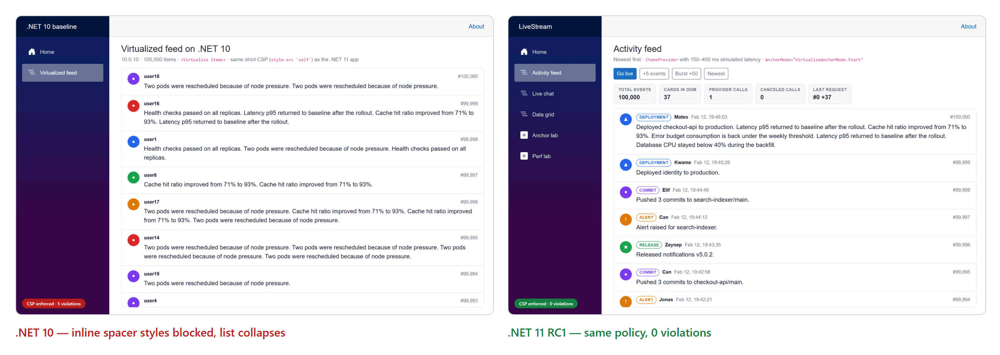

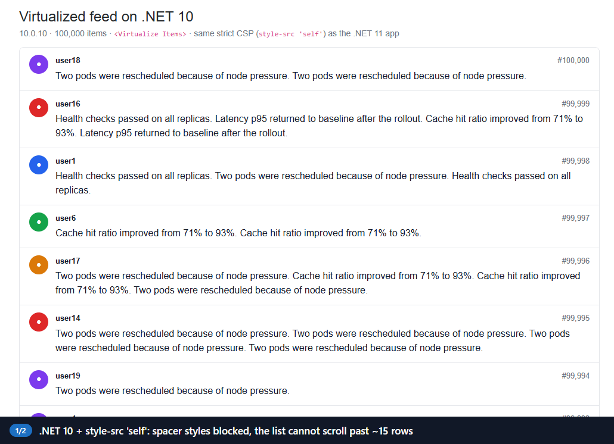

### What .NET 11 does instead

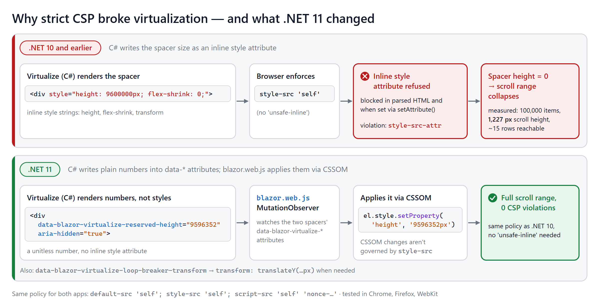

In .NET 11, the C# side renders **numbers**, not styles:

```html
<!-- prerendered by .NET 11 RC1 (/lab/perf?mode=items: 100,000 items × ItemSize 64) -->
<div data-blazor-virtualize-reserved-height="0" aria-hidden="true"></div>
<div aria-hidden="true" data-blazor-virtualize-reserved-height="6400000"></div>
```

- `data-blazor-virtualize-reserved-height` holds the height as a unitless number, for both spacers and default placeholders.
- `data-blazor-virtualize-loop-breaker-transform` holds a vertical offset for the trailing spacer, when one is needed.
- A `MutationObserver` in `blazor.web.js` watches those two attributes on the spacers. It parses each value, accepts only finite numbers, and applies it through the CSS Object Model, with `element.style.setProperty('height', …)` or `translateY(…)`.

Browsers don't apply `style-src` to properties set through an element's `style` object. MDN documents this, and the web-platform-tests confirm it for current Chrome, Firefox, and Safari. If you explain this to your security team, be precise: **the CSP specification doesn't formally exempt CSSOM**. It even describes gating some CSSOM setters on `'unsafe-eval'`. The guarantee is how browsers actually behave, and that's what the framework relies on.

> **Don't test for "no `style` attribute in the DOM".** After hydration, the .NET 11 spacers *do* show a `style` attribute in DevTools:
>
> ```html
> <div aria-hidden="true" data-blazor-virtualize-reserved-height="9596352"
>      style="flex-shrink: 0; height: 9.59635e+06px; overflow-anchor: none;"></div>
> ```
>
> That's the serialization of the properties set through CSSOM, and it's allowed. The .NET 10 spacers show a `style` attribute too, but there it's inert, because the browser refused it. Instead, check for **violations**, and check that the **computed height equals the reserved height**.

### Sending a strict CSP from a Blazor Web App

Send the policy as an **HTTP response header**, not a `<meta>` tag. Only a header supports `frame-ancestors`, `report-to`, and `Content-Security-Policy-Report-Only`. The sample generates a nonce per request, because the Blazor Web App's `<ImportMap />` is an inline `<script>`:

```csharp
public static string Build(string nonce) => string.Join("; ",
    "default-src 'self'",
    "base-uri 'self'",
    "object-src 'none'",
    "frame-ancestors 'none'",
    "form-action 'self'",
    "img-src 'self' data:",
    "font-src 'self'",
    "style-src 'self' 'report-sample'",
    $"script-src 'self' 'nonce-{nonce}' 'report-sample'",
    "connect-src 'self'");

public static IApplicationBuilder UseStrictContentSecurityPolicy(this IApplicationBuilder app, CspMode mode)
{
    // …
    return app.Use(async (context, next) =>
    {
        // UseStatusCodePagesWithReExecute and UseExceptionHandler run the rest of the pipeline
        // again for the same HttpContext. Create the nonce and register the header callback once,
        // or the header and the re-rendered <ImportMap /> end up with different nonces.
        if (!context.Items.ContainsKey(NonceKey))
        {
            var nonce = Convert.ToBase64String(RandomNumberGenerator.GetBytes(16));
            context.Items[NonceKey] = nonce;

            context.Response.OnStarting(() =>
            {
                if (context.Response.ContentType?.StartsWith("text/html", StringComparison.OrdinalIgnoreCase) == true)
                {
                    context.Response.Headers[headerName] = Build(nonce);
                }

                return Task.CompletedTask;
            });
        }

        await next();
    });
}
```

```razor
@* App.razor (abridged) *@
<ImportMap nonce="@nonce" />

@code {
    private string? nonce;

    [CascadingParameter]
    private HttpContext? HttpContext { get; set; }

    protected override void OnInitialized() => nonce = HttpContext.GetCspNonce();
}
```

The `ContainsKey` guard fixes a real bug that the article review caught in the first version of this middleware. Without it, a 404 page re-executed by `UseStatusCodePagesWithReExecute` got one nonce in the header and a different one in the import map, so the import map was blocked on error pages. The sample now has an integration test for exactly that case.

Notes on the directives:

- **`'report-sample'`** doesn't relax anything. It only adds the first 40 characters of a blocked inline style or script to violation reports. That's how the .NET 10 samples above were captured.
- **`img-src 'self' data:`** is needed because the template's Bootstrap and navigation icons use `data:` SVGs in CSS.
- **`connect-src 'self'`** covers the Blazor Server WebSocket. Under CSP Level 3, `'self'` matches same-host `ws:`/`wss:`, and current browsers implement that. Very old browsers needed explicit `ws:`/`wss:` sources.
- **The template's `<ReconnectModal />`** is CSP-friendly. Apps created before .NET 10 that still use the built-in JS reconnect UI get an injected `<style>` element, which violates `style-src 'self'`.
- **The .NET 11 template no longer puts an inline `onclick` on `NavMenu`.** It uses a collocated `NavMenu.razor.js` module instead. (The .NET 10 template still has the inline handler; the sample's baseline removes it so that only `Virtualize` is compared.) In RC1, that module binds to the prerendered menu element, which interactive render modes replace, so the mobile menu stays open after navigation. RC2 fixes this ([dotnet/aspnetcore#68951](https://github.com/dotnet/aspnetcore/pull/68951), a backport of #68768). Because the sample is fully interactive, it keeps the menu's open/closed state in the component instead.
- **Blazor WebAssembly** also needs `'wasm-unsafe-eval'` in `script-src`. Microsoft's Blazor CSP docs give a starting policy for each render mode.
- **Nonces must be unique per response.** Don't let a CDN or output cache serve one nonce to many users.
- **Roll out with `Content-Security-Policy-Report-Only` first.** Add `report-to csp-endpoint` to the policy and declare the endpoint in a `Reporting-Endpoints: csp-endpoint="https://…/csp-reports"` response header. Also add `report-uri https://…/csp-reports` for browsers that don't support `report-to` yet. Switch to enforcing once the reports are clean.

### Security framing

.NET 11 removes an important source of CSP incompatibility from `Virtualize`, but it doesn't make an application "CSP-secure". Your complete policy still depends on your render mode, scripts, styles, third-party components, and hosting. CSP reduces the impact of XSS and clickjacking. It doesn't replace output encoding, CSRF protection, or authorization. `Virtualize` decides which records are *rendered*; your backend still has to decide which records a user may *see*.

## Testing strict CSP compatibility

A test plan that catches real problems:

1. Enable `style-src 'self'` (and a nonce-based `script-src`) as an HTTP header, in every environment you test in.
2. Don't add `'unsafe-inline'`.
3. Listen for `securitypolicyviolation` events from the very start of the page. The sample loads a tiny `csp-monitor.js` from `'self'` as the first script in `<head>`, so it also sees violations raised while the prerendered HTML is parsed.
4. Load every virtualized page, then scroll to the start, middle, and end.
5. Prepend and append items, and expand variable-height items.
6. Assert **zero violations**, and assert that each spacer's computed height matches its `data-blazor-virtualize-reserved-height`.
7. Include error pages (404, 500), which render through a re-executed pipeline.
8. Run the tests in Chromium, Firefox, and WebKit, and check real Safari/iOS manually.

The sample's Playwright test is short:

```js
test(`${path}: no CSP violations while loading and scrolling`, async ({ page }) => {
    await page.goto(APP + path);
    await waitForList(page, row);
    for (const f of [0.25, 0.75, 1, 0]) {
        await scrollViewportTo(page, f);
        await settle(page, 300);
    }

    expect(await cspViolations(page)).toEqual([]);
});
```

The integration tests also check the prerendered HTML without a browser, using `WebApplicationFactory`. They verify that the HTML of every page contains no `style="`, that the import map carries the response's nonce, and that a re-executed 404 page uses the same nonce in its header and its markup.

## Accessibility and UX

- **Make the scroll container focusable.** Since Chrome 132, Chromium makes a scroll container keyboard-focusable automatically only when it has *no* focusable children. Lists whose items contain buttons or links, like the feed's "Show details", don't qualify. Give the container `tabindex="0"` and an `aria-label`, as the sample does. If there's no `tabindex`, RC1 adds `tabindex="-1"` so the container can receive <kbd>Home</kbd>/<kbd>End</kbd>, but that doesn't make it reachable with <kbd>Tab</kbd>.
- **Don't force-scroll readers.** `AnchorMode.End` already follows new items only at the live edge. Pair it with a visible "N new messages" control.
- **Announce summaries, not every item.** Use a single polite live region with an updating count ("12 new messages below.") rather than announcing each message. A busy log would flood a screen reader.
- **Keep placeholders close to real item heights,** so loading states don't shift the layout.
- **Use stable `@key`s** (the item ID, never the loop index).
- **Watch focus.** If a focused row scrolls out of the window, it's removed from the DOM and focus is lost. Keep focus on the container, or scroll the focused item into view before changing data.
- **Keep table semantics when you split the header.** The sample's visible grid header is `aria-hidden`, and the body table keeps a visually hidden `<thead>`, so screen readers still announce the column names.
- **Respect `prefers-reduced-motion`** in skeleton animations. The sample turns its shimmer off.

## Browser and layout caveats

- **The scroll container needs a real height** and `overflow-y: auto` or `scroll`. In a flex layout, give the list `flex: 1; min-height: 0`. If a sibling (like a header) sits in the same flex column, give that sibling `flex: none`. The list's flex basis is its virtual height, which can be millions of pixels, so flexbox would otherwise shrink the sibling to nothing. That happened to the sample's grid header during development.
- **Single column only.** Variable-height support assumes a vertical stack. Items that share a row (`flex-wrap`, CSS grid with several columns, horizontal lists) aren't supported.
- **Don't style the spacers.** No borders, margins, or `::before`/`::after` content on them.
- **Tables and `div`s behave differently.** They use different anchoring paths ([section 3.2](#32-hybrid-scroll-anchoring)), so test the layout you actually ship.
- **Safari and iOS:** Safari 26 and earlier don't support `overflow-anchor`, so they take the manual path even for `div` lists. Playwright's WebKit build doesn't exercise that path. Test on devices.
- **Lazy-loaded media** changes row heights after render. Reserve its space.
- **Very uneven height distributions** (a few rows 100× taller than the rest) make the running average less representative, so expect the scrollbar to be approximate.
- **Nested scroll containers and document-level scrolling** both work, but the scroll container is detected as the first scrollable ancestor. Check that it's the one you expect.
- **WebAssembly.** The same component and markup apply. Spacer styles are applied by a `MutationObserver` callback, which runs asynchronously in every render mode. On WebAssembly, though, the .NET side can refresh synchronously before that callback has run. That's why the RC2 End-anchoring fix ([#69388](https://github.com/dotnet/aspnetcore/pull/69388), a backport of #69310) also flushes pending spacer styles before reading `scrollHeight`. Your CSP also needs `'wasm-unsafe-eval'`.

## Preview/RC status and production readiness

> **Tested against:** .NET SDK `11.0.100-rc.1.26425.128` · ASP.NET Core `11.0.0-rc.1.26425.128` · Microsoft.AspNetCore.Components.Web `11.0.0-rc.1.26425.128`

**Support facts**

- RC1 ships with a **go-live license**, which means Microsoft supports it in production. The go-live support window for RC1 ends **October 13, 2026**, and you're expected to move to RC2 and then GA.
- **.NET 11 is an STS release** with two years of support. The dotnet/core release notes currently give November 10, 2026 – November 9, 2028. So far, the support-policy page lists only the RC1 go-live release, not .NET 11's GA support dates.
- **.NET 10 is LTS** and is supported until **November 14, 2028**. That's the same month .NET 11 support ends, because STS releases are now supported for 24 months. Upgrading doesn't meaningfully change your support window (the published end dates are five days apart), so decide based on features and risk.

**Known RC1 issues relevant to this article** (as of September 21, 2026)

| Issue | Status |
|---|---|
| `AnchorMode.End` stays at the top after the initial `ItemsProvider` load ([#69302](https://github.com/dotnet/aspnetcore/issues/69302)) | Fixed for RC2 ([#69388](https://github.com/dotnet/aspnetcore/pull/69388)). The RC1 workaround is a small initial fetch followed by the regular one |
| `InitialItemIndex` positioning can oscillate or finish at the wrong item; in the sample, the next render moved rows by 53–82 px | Fixed for RC2 ([#69170](https://github.com/dotnet/aspnetcore/pull/69170)). Observed in section 11 |
| False-positive prepend detection causes backward scroll jumps with `ItemsProvider` and ongoing updates ([#69362](https://github.com/dotnet/aspnetcore/pull/69362)) | Open PR, RC2 milestone |
| User scrolling doesn't reliably cancel an in-flight `ScrollToItemAsync` ([#69288](https://github.com/dotnet/aspnetcore/pull/69288)) | Open PR |
| QuickGrid: Start anchoring in Server modes, and duplicate provider requests ([#69380](https://github.com/dotnet/aspnetcore/issues/69380), [#69381](https://github.com/dotnet/aspnetcore/issues/69381)) | Open |
| Deleting items above the viewport isn't anchored ([#66509](https://github.com/dotnet/aspnetcore/issues/66509)) | Backlog |
| The template's mobile `NavMenu` stays open after navigation in interactive render modes ([#68951](https://github.com/dotnet/aspnetcore/pull/68951), a backport of #68768) | Fixed for RC2 |
| `<table>` rows that grow right after scrolling are only partly compensated: usually 41–42 px in Chrome and Firefox, sometimes ~220 px in Chrome | Observed in this sample (section 10) |
| `AnchorMode.End` sometimes stops 29–77 px short of the bottom after an append. WebKit: 20/30 checks passed; Chrome and Firefox: 1–2 misses in 30 | Observed in this sample (section 7). Playwright WebKit 26.6 on Windows, not verified in Safari |
| A `Start` list moves 214–486 px when items are appended at the very end; `None` doesn't | Observed in this sample (section 8). Playwright WebKit 26.6 on Windows only, not verified in Safari |

**Docs inconsistencies to be aware of in RC1**

- The docs and release notes use `AnchorMode="Start"`, which doesn't compile in Razor. Use `VirtualizeAnchorMode.Start`.
- The "Advanced styles" section of the virtualization docs still says all items must have identical height. That text predates variable-height support.
- The .NET 10 version of the virtualization docs suggests using `data-blazor-virtualize-reserved-height` for CSP compliance. .NET 10 doesn't read that attribute: the sample's .NET 10.0.10 baseline renders and needs inline styles.

## Build and verification results

**Test environment**

| | |
|---|---|
| .NET SDK | `11.0.100-rc.1.26425.128` (installed side by side with `dotnet-install.ps1` in `~/.dotnet11`) |
| Runtime | .NET `11.0.0-rc.1.26425.128`; baseline: .NET `10.0.10` (SDK `10.0.301`) |
| App model | Blazor Web App, Interactive Server, prerendering on |
| Builds | Debug (`dotnet run`) for tests and probes; published Release build in the Production environment for the perf numbers |
| OS / hardware | Windows 11 Pro (build 26200), AMD Ryzen 9 5900HX (8 cores / 16 threads), 32 GB RAM |
| Browsers | Google Chrome 153.0.8010.50, Playwright Firefox, Playwright WebKit 26.6 (Playwright 1.63.0) |
| Dataset | 100,000 generated records (deterministic seed) |

**Prerequisites and commands**

You need the .NET 11 RC1 SDK. The .NET 10 baseline also needs the .NET 10 SDK: `baseline/global.json` pins 10.0.301, so run the baseline from its own folder. The browser tests need Node.js 20+ and Google Chrome.

```bash
cd samples/LiveStream
dotnet build            # 0 warnings, 0 errors
dotnet test             # xUnit + WebApplicationFactory

cd e2e
npm install
npx playwright install firefox webkit
npx playwright test     # starts both apps; Chrome, Firefox, WebKit
```

`e2e/playwright.config.js` starts the .NET 11 app with `$DOTNET11`. If that isn't set, it uses `~/.dotnet11/dotnet` when that exists, and plain `dotnet` otherwise. It starts the baseline from its folder, so that its `global.json` applies.

**Results**

| Check | Result |
|---|---|
| `dotnet build` (Debug and Release) | 0 warnings, 0 errors |
| `dotnet test` | **17/17 passed**, 3 consecutive runs |
| `npx playwright test` (Chrome, Firefox, WebKit) | **72 tests: 65 passed, 0 failed, 0 flaky, 7 skipped.** The skipped tests are `fixme` markers for the RC1 issues below: the table gap and the `InitialItemIndex` shift in each engine, plus `AnchorMode.End` without the guard in WebKit |

| Test | Expected result | Actual result |
|---|---|---|
| Initial activity feed render | Only viewport items are rendered | **Pass**: 37–38 of 100,000 cards in the DOM (all engines) |
| Prepend at the top | The viewport stays pinned to the start and shows the new items | **Pass** (all engines) |
| Prepend while reading older items | Visible content doesn't move; a pill appears | **Pass**: ≤ 1 px (all engines) |
| Append at the chat bottom | The new message is followed | **Pass** with the sample's guard (30/30 follow checks per engine). `AnchorMode.End` alone: Chrome 29/30, Firefox 28/30, WebKit 20/30 |
| Append while reading history | The user isn't pulled to the bottom | **Pass** (all engines) |
| Expand a variable-height item above the viewport (`div` list) | No disruptive jump | **Pass**: 0 px (18/18 wheel runs) |
| Expand a row above the viewport (`<table>`) | No disruptive jump | **Partial**: ≤ 1 px after an ordinary render. Right after scrolling: usually 41–42 px in Chrome and Firefox (occasionally ~220 px in Chrome), and ≤ 1 px in 11 of 12 WebKit runs |
| Open at a row / jump to a row | The target row is at the top | **Pass** for both. RC1: after `InitialItemIndex`, the next render moves the rows by 53–82 px |
| Append at the end of a `Start` list (infinite scroll) | No movement | **Pass** in Chrome and Firefox; **fail** in Playwright WebKit (214–486 px). With `None`: pass everywhere |
| Strict CSP (`style-src 'self'`) | No virtualization style violations | **Pass**: 0 violations, 5 pages × 3 engines; error pages keep the header and markup nonces in sync |
| Same CSP on .NET 10.0.10 | (baseline for comparison) | 5 `style-src-attr` violations; the list collapsed to 1,227 px (all engines) |
| Fast scrolling with latency | Stale provider calls are canceled | **Pass**: canceled calls > 0 (all engines) |
| Performance, 100,000 items | `Virtualize` ≪ `foreach` | 125 ms vs 112.4 s to interactive; 256 vs 400,078 DOM elements ([section 12](#12-performance-what-i-measured)) |

All raw data is in `samples/LiveStream/e2e/results/`: `EVIDENCE.md`, `perf.json`, `anchor-matrix.json`, `chat-follow-summary.json`, and `final-e2e.json`.

## When not to use `Virtualize`

Virtualization is a trade-off. It's not the right choice when:

- The list has only 20–50 simple rows. The overhead isn't worth it.
- The full content must be in the initial HTML for SEO or no-JS clients. `Virtualize` prerenders at most a small window of items, and usually none.
- Users need the browser's find-in-page (<kbd>Ctrl</kbd>+<kbd>F</kbd>) across all rows. Unrendered rows can't be found.
- All rows must print or export from the page. Do that on the server instead.
- The layout isn't a single vertical stack (masonry, multi-column wraps, horizontal carousels).
- Classic pagination gives users a clearer mental model, as with "page 3 of the invoices".

Virtualization and pagination can also work together. Large data grids often combine server-side paging, filtering, and sorting with viewport virtualization inside the current result set.


## References

- [What's new in ASP.NET Core in .NET 11](https://learn.microsoft.com/en-us/aspnet/core/release-notes/aspnetcore-11)
- [ASP.NET Core Razor component virtualization](https://learn.microsoft.com/en-us/aspnet/core/blazor/components/virtualization?view=aspnetcore-11.0)
- [Enforce a Content Security Policy for ASP.NET Core Blazor](https://learn.microsoft.com/en-us/aspnet/core/blazor/security/content-security-policy?view=aspnetcore-11.0)
- [ASP.NET Core Blazor security overview](https://learn.microsoft.com/en-us/aspnet/core/blazor/security/)
- [.NET 11 downloads](https://dotnet.microsoft.com/en-us/download/dotnet/11.0) and the [.NET support policy](https://dotnet.microsoft.com/platform/support/policy/dotnet-core)
- dotnet/aspnetcore pull requests: [#64964](https://github.com/dotnet/aspnetcore/pull/64964) (variable heights), [#65951](https://github.com/dotnet/aspnetcore/pull/65951) (hybrid anchoring), [#66262](https://github.com/dotnet/aspnetcore/pull/66262) (AnchorMode), [#66680](https://github.com/dotnet/aspnetcore/pull/66680) (CSP), [#66753](https://github.com/dotnet/aspnetcore/pull/66753) (scroll to item), [#67934](https://github.com/dotnet/aspnetcore/pull/67934) (anchoring regression fix)
- [MDN: CSP `style-src`](https://developer.mozilla.org/docs/Web/HTTP/Reference/Headers/Content-Security-Policy/style-src), [`style-src-attr`](https://developer.mozilla.org/docs/Web/HTTP/Reference/Headers/Content-Security-Policy/style-src-attr), and [`overflow-anchor`](https://developer.mozilla.org/docs/Web/CSS/overflow-anchor)
- [W3C Content Security Policy Level 3](https://www.w3.org/TR/CSP3/)
- [Chrome for Developers: Keyboard-focusable scrollers](https://developer.chrome.com/blog/keyboard-focusable-scrollers)