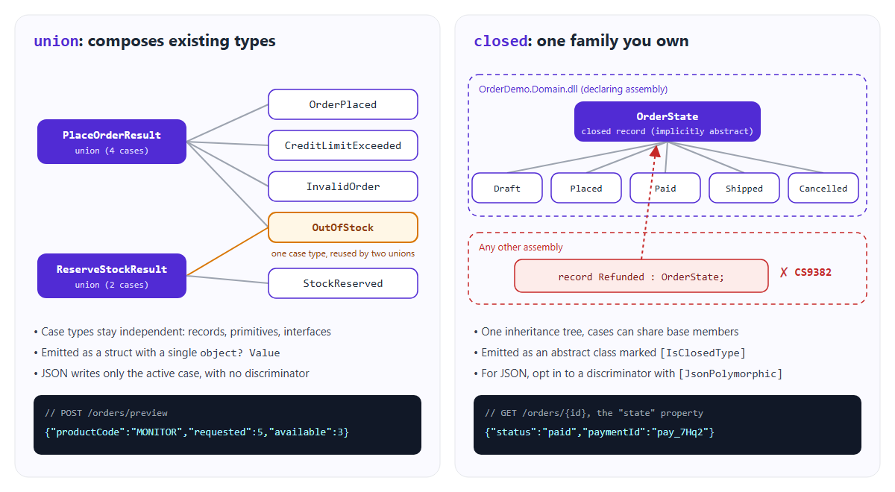
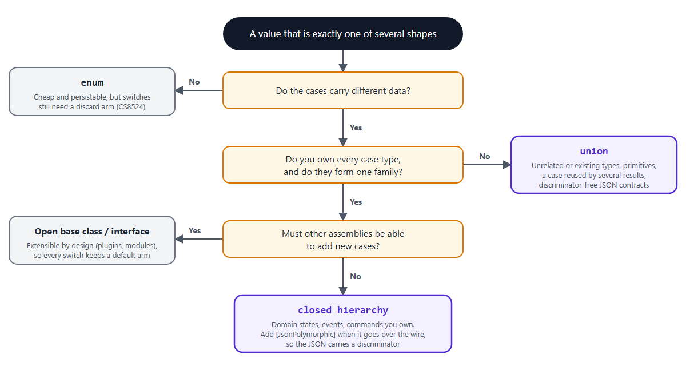
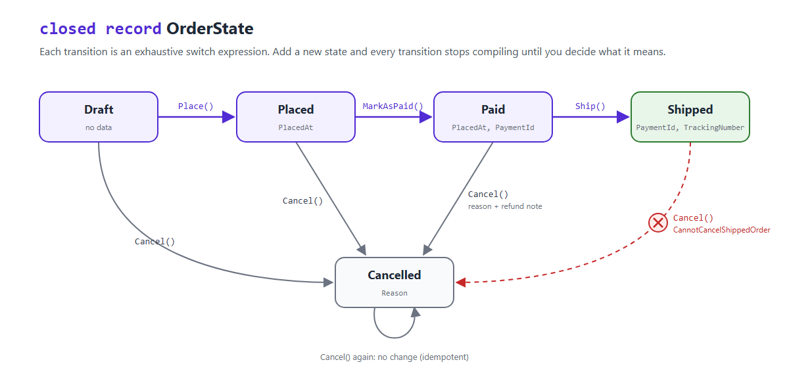
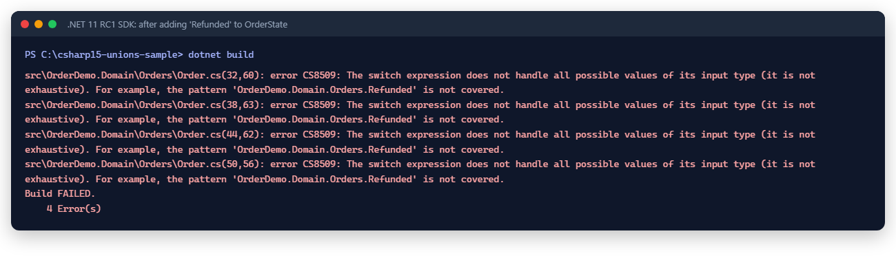
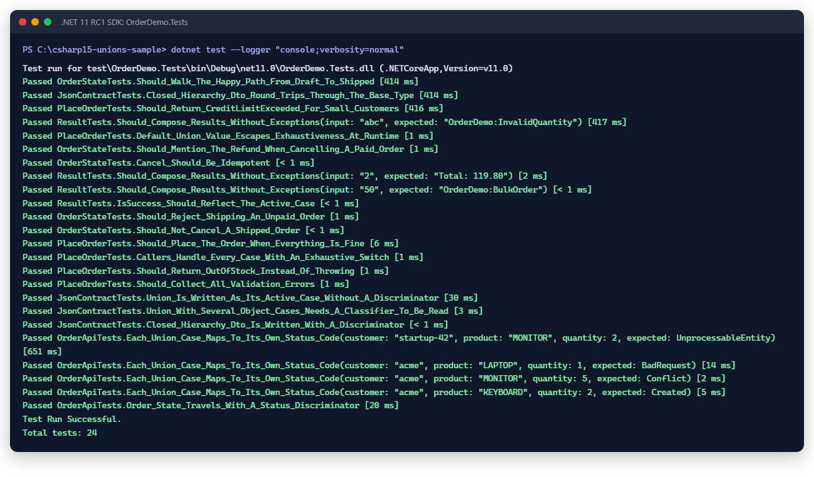

# C# 15 Union Types and Closed Hierarchies: Exhaustive Domain Models and API Contracts

> **Release status.** .NET 11 isn't released as stable yet. Everything in this article was built and tested on **.NET 11 RC1** (SDK `11.0.100-rc.1.26425.128`, runtime `11.0.0-rc.1.26425.128`, released September 8, 2026). RC1 comes with a go-live license, but it isn't the final release, and .NET 11 GA is expected in November 2026. Compiler messages, serializer behavior, and tooling can still change before then, so rerun the sample's tests against each new SDK before you ship anything.

Almost every C# codebase has at least one switch that lies:

```csharp
return state switch
{
    Draft => "draft",
    Placed => "placed",
    Paid => "paid",
    _ => throw new InvalidOperationException("Unknown state") // "this can't happen"
};
```

That last arm is there because the compiler has no idea that `Draft`, `Placed`, and `Paid` are the only states that exist. So we add a default arm to keep it quiet, and that arm quietly turns into a trap. The day someone adds a `Refunded` state, this code still compiles fine and throws at runtime.

C# 15 fixes this with two features that ship together in .NET 11: **union types** and **closed hierarchies**. Both tell the compiler "this is the complete list of possibilities", and in return the compiler checks your `switch` expressions against that list.

In this article, we'll start with the simplest possible usage of each feature, look at what they actually compile to, compare them with the patterns we use today, and then build a small order API where both features do real work. I built and tested every example on .NET 11 RC1, and I'll share the exact outputs, including a few surprises that ABP developers should know about before they start using these features.

Here's what we'll cover:

- Where .NET 11 and C# 15 stand today
- Closed hierarchies: the two-minute version
- Union types: the two-minute version
- How they compare with enums, abstract base classes, interfaces, and result wrappers
- A realistic scenario: an order API with exhaustive states and results
- Going further: JSON contracts, a generic `Result<T>`, `default` values, and versioning
- Using these features in an ABP solution
- RC1 constraints and production readiness
- Adoption and migration guidance
- Running the sample yourself

## Where .NET 11 and C# 15 Stand Today

A quick status check first, because it affects everything else in this article:

- **.NET 11 RC1** shipped on **September 8, 2026**. The official release metadata lists the channel in the **go-live** support phase, with release type **STS**.
- **GA is expected in November 2026.** Until then, "stable" isn't the right word, so treat everything here as release-candidate behavior.
- RC1 makes **C# 15 the default language version** for projects that target `net11.0`, and it stabilizes union types and closed class hierarchies, along with collection expression arguments, labeled `break`/`continue`, and extension indexers. You **don't** need `<LangVersion>preview</LangVersion>` anymore. None of the projects in this article set a `LangVersion`.
- The docs are catching up. At the time of writing, the "What's new in C# 15" page still calls C# 15 "the latest C# preview release" and notes that some features from the union proposal aren't implemented yet. For the language status in RC1, the [C# in .NET 11 RC 1 release notes](https://github.com/dotnet/core/blob/main/release-notes/11.0/preview/rc1/csharp.md) are the more precise source.

> **For ABP developers:** the latest stable ABP release on NuGet at the time of writing is **10.6.1**, and ABP 10.x packages target up to `net10.0`. You need a `net11.0` project to use C# 15. As usual, ABP will ship a **.NET 11-based ABP 11** release, so you'll get first-class .NET 11 support there. Until then, I tested ABP 10.6.1 packages inside a `net11.0` app, and you'll find the results in the [ABP section](#using-these-features-in-an-abp-solution) below.

## Closed Hierarchies: The Two-Minute Version

Let's start with the easier one. You add the `closed` modifier to a class (or a record class), and from then on, **only code in the same assembly can derive directly from it**:

```csharp
public closed record OrderState;

public sealed record Draft : OrderState;
public sealed record Placed(DateTimeOffset PlacedAt) : OrderState;
public sealed record Paid(DateTimeOffset PlacedAt, string PaymentId) : OrderState;
public sealed record Shipped(string PaymentId, string TrackingNumber) : OrderState;
public sealed record Cancelled(string Reason) : OrderState;
```

Because the compiler now knows every direct descendant, a `switch` expression that handles all of them is exhaustive. There's no default arm, and there's no warning:

```csharp
static string Describe(OrderState state) => state switch
{
    Draft => "draft",
    Placed(var placedAt) => $"placed at {placedAt:HH:mm}",
    Paid(_, var paymentId) => $"paid with {paymentId}",
    Shipped(_, var trackingNumber) => $"shipped, tracking {trackingNumber}",
    Cancelled(var reason) => $"cancelled: {reason}",
};

// Describe(new Paid(now, "pay_7Hq2")) -> "paid with pay_7Hq2"
```

Here are the rules I think are worth remembering. The ones with error codes are straight from the RC1 compiler; the rest come from the language reference:

- **A closed class is implicitly abstract.** `new OrderState()` fails with `CS0144: Cannot create an instance of the abstract type or interface 'OrderState'`. You also can't combine `closed` with `sealed`, `static`, or an explicit `abstract`.
- **Other assemblies can't derive from it.** In the versioning experiment later in this article, declaring `public sealed record Lost : ShipmentStatus;` in a consumer project failed with `CS9382: 'Lost': cannot use a closed type 'ShipmentStatus' from another assembly as a base type`.
- **It isn't transitive.** Only *direct* descendants are restricted. If `Paid` were a normal, unsealed record, another assembly could derive from `Paid`. That's why I seal the leaves. Alternatively, you can mark an intermediate type `closed` too.
- **Classes only.** `closed interface` fails with `CS0106: The modifier 'closed' is not valid for this item`. The spec lists closed interfaces as a possible future feature, but they aren't in C# 15.
- **Nullable inputs need a `null` arm.** A switch over `OrderState?` isn't exhaustive until you handle `null`.
- **It's a contextual keyword.** Existing variables named `closed` keep compiling.

So what does the compiler actually emit? I checked with reflection. `OrderState` becomes a regular **abstract class** marked with `[IsClosedType]`, and its constructors are `protected` and marked `[CompilerFeatureRequired("ClosedClasses")]`. That last attribute is how the restriction survives compilation: a compiler that doesn't understand closed classes refuses to call those constructors, so it can't derive from the type either.

## Union Types: The Two-Minute Version

A union is a value that is **exactly one of a fixed list of case types**. The case types already exist, and the union just groups them:

```csharp
public sealed record OrderPlaced(Guid OrderId, decimal Total);
public sealed record OutOfStock(string ProductCode, int Requested, int Available);
public sealed record CreditLimitExceeded(decimal Limit, decimal Attempted);
public sealed record InvalidOrder(IReadOnlyList<string> Errors);

public union PlaceOrderResult(OrderPlaced, OutOfStock, CreditLimitExceeded, InvalidOrder);
```

Each case converts to the union implicitly, so you just assign or return the case:

```csharp
PlaceOrderResult result = new OutOfStock("MONITOR", Requested: 5, Available: 3);
```

And consuming code pattern-matches on the cases directly, with no default arm:

```csharp
var message = result switch
{
    OrderPlaced placed => $"Order {placed.OrderId} placed",
    OutOfStock(var product, var requested, var available) => $"Only {available} of {product} left, you asked for {requested}",
    CreditLimitExceeded(var limit, _) => $"Credit limit of {limit} exceeded",
    InvalidOrder(var errors) => string.Join(" ", errors),
};

// "Only 3 of MONITOR left, you asked for 5"
```

If you forget a case, the compiler tells you which one:

```text
warning CS8509: The switch expression does not handle all possible values of its input type
(it is not exhaustive). For example, the pattern 'OrderDemo.Domain.Orders.InvalidOrder' is not covered.
```

Now, what *is* a union at runtime? The compiler turns the `union` declaration into a **struct**. The struct is marked with `[Union]`, implements `System.Runtime.CompilerServices.IUnion`, has one constructor per case type, and stores the active case in a single `object? Value` property. A few consequences follow from that:

- **Patterns unwrap the union.** `result is OutOfStock` tests `result.Value`, not the struct itself, so it returns `true` in the example above.
- **Value-type cases are boxed.** In `union IntOrString(int, string)`, assigning `42` stores a boxed `Int32` in `Value`. For hot paths, the docs describe how to write a custom union with a non-boxing access pattern.
- **Case types can be almost anything:** records, classes, structs, primitives, interfaces, and even other unions.
- **A case type can belong to several unions.** In the sample, `OutOfStock` is also used by `union ReserveStockResult(StockReserved, OutOfStock)`. A closed hierarchy can't do that, because a class has only one base class.
- **You can add members to a union body** (methods and computed properties), but you can't add instance fields or auto-properties.



*Figure: A union groups independent case types (one of them shared by two unions). A closed hierarchy is one inheritance family that other assemblies can't extend.*

## How They Compare With What We Do Today

We've been modeling "one of several shapes" for years without these features. Here's how the usual suspects behave in a `switch` expression, based on the diagnostics RC1 actually produced:

| Approach | Exhaustive without `_`? | New case flagged at compile time? | Unrelated types as cases? |
|---|---|---|---|
| `enum` | No (CS8524) | Only if you avoid `_` | Not applicable |
| Open abstract base class | No (CS8509 on `_`) | No | No |
| Marker interface | No | No | Only types you own |
| Result wrapper library | Through `Match(...)` | Depends on the library | Yes |
| `closed` hierarchy | Yes | Yes (CS8509) | No |
| `union` | Yes | Yes (CS8509) | Yes |

A few notes on this table:

- **Enums** get halfway there. If you handle every named member, the compiler still warns with `CS8524` because an enum can hold unnamed values like `(LegacyOrderStatus)3`. Most teams silence that with `_ => ...`, and from then on, adding an enum member is silent. Enums also can't carry per-state data, which is how we end up with a `Status` enum next to a bag of nullable properties (`PaidAt`, `TrackingNumber`, `CancelReason`) that are only valid in some states.
- **Open abstract base classes** are what most of us use for this today. Without a default arm, the compiler warns that `the pattern '_' is not covered`, because any assembly could add a subclass. So you add `_ => throw`, and you're back to the lying switch from the introduction.
- **Result wrappers** such as a hand-written `Result<T>` or OneOf-style libraries work, but exhaustiveness lives in the library's `Match` API instead of in regular C# patterns, and each library brings its own conventions.

One important limit applies to *every* row: **only `switch` expressions get exhaustiveness checking.** A `switch` statement that forgets a case compiles without a warning (I tried it with both a union and a closed hierarchy), and so does an `if`/`else` chain. If you want the safety net, write `switch` expressions.

The following decision flow is how I pick between the options now:



## A Realistic Scenario: An Order API

Let's put both features to work in a scenario ABP developers will recognize: a small ordering API with an order aggregate, a domain service that places orders, and HTTP endpoints on top. To keep the sample focused on the language features, it's a plain .NET 11 solution with in-memory stores. We'll bring ABP into the picture in a separate section.

```text
OrderDemo.slnx
├── src/OrderDemo.Domain    // OrderState (closed), PlaceOrderResult (union), Order, OrderPlacementService
├── src/OrderDemo.Api       // Minimal API endpoints + DTOs
└── test/OrderDemo.Tests    // xUnit + Shouldly + WebApplicationFactory
```

### Order states as a closed hierarchy

The order moves through a small state machine. Each state carries only the data that makes sense for it: a `Paid` order has a `PaymentId`, and a `Shipped` order has a `TrackingNumber`. Nothing is nullable "because it depends on the status".



Here's the aggregate. Every transition is a `switch` expression over the current state:

```csharp
public sealed class Order
{
    private readonly List<OrderLine> _lines;

    public Guid Id { get; }

    public string CustomerId { get; }

    public IReadOnlyList<OrderLine> Lines => _lines;

    public OrderState State { get; private set; }

    public decimal Total => _lines.Sum(line => line.UnitPrice * line.Quantity);

    public Order(Guid id, string customerId, IEnumerable<OrderLine> lines)
    {
        Id = id;
        CustomerId = customerId;
        _lines = [.. lines];
        State = new Draft();
    }

    public void Place(DateTimeOffset now) => State = State switch
    {
        Draft => new Placed(now),
        Placed or Paid or Shipped or Cancelled => throw InvalidTransition(nameof(Place)),
    };

    public void MarkAsPaid(string paymentId) => State = State switch
    {
        Placed placed => new Paid(placed.PlacedAt, paymentId),
        Draft or Paid or Shipped or Cancelled => throw InvalidTransition(nameof(MarkAsPaid)),
    };

    public void Ship(string trackingNumber) => State = State switch
    {
        Paid paid => new Shipped(paid.PaymentId, trackingNumber),
        Draft or Placed or Shipped or Cancelled => throw InvalidTransition(nameof(Ship)),
    };

    public void Cancel(string reason) => State = State switch
    {
        Draft or Placed => new Cancelled(reason),
        Paid paid => new Cancelled($"{reason} (refund payment {paid.PaymentId})"),
        Shipped => throw new OrderStateException(
            "OrderDemo:CannotCancelShippedOrder",
            "A shipped order can't be cancelled. Create a return instead."),
        Cancelled => State,
    };

    private OrderStateException InvalidTransition(string action) => new(
        "OrderDemo:InvalidOrderStateTransition",
        $"Can't run '{action}' on an order in the '{State.GetType().Name}' state.");
}
```

Notice that I list the invalid states explicitly (`Draft or Paid or Shipped or Cancelled => throw ...`) instead of writing `_ => throw ...`. It's a little more typing, but it's the whole point: a discard arm would "handle" any future state automatically, and the compiler would have nothing to warn about. With explicit arms, adding a state forces a decision in every transition. We'll see that in action in a moment.

> `OrderStateException` carries a namespaced error code such as `OrderDemo:CannotCancelShippedOrder`. In an ABP application, this would simply be a `BusinessException` with the same code, since ABP's domain services throw business exceptions for rule violations.

### Placement outcomes as a union

Placing an order has four *expected* outcomes, and only one of them is a success. Running out of stock isn't exceptional in an online shop; it happens every day, and the caller must handle it. That's a perfect fit for the `PlaceOrderResult` union we declared earlier. The domain service returns cases directly, and the implicit conversion works even through `Task<PlaceOrderResult>`:

```csharp
public async Task<PlaceOrderResult> PlaceAsync(PlaceOrderInput input, CancellationToken cancellationToken = default)
{
    if (input.Lines.Count == 0)
    {
        return new InvalidOrder(["An order must contain at least one line."]);
    }

    var lines = new List<OrderLine>();
    var errors = new List<string>();

    foreach (var line in input.Lines)
    {
        // ... validation and stock lookup ...

        if (stock.Available < line.Quantity)
        {
            return new OutOfStock(line.ProductCode, line.Quantity, stock.Available);
        }

        lines.Add(new OrderLine(line.ProductCode, line.Quantity, stock.UnitPrice));
    }

    if (errors.Count > 0)
    {
        return new InvalidOrder(errors);
    }

    var order = new Order(Guid.NewGuid(), input.CustomerId, lines);

    var limit = await customerCredit.GetLimitAsync(input.CustomerId, cancellationToken);
    if (order.Total > limit)
    {
        return new CreditLimitExceeded(limit, order.Total);
    }

    order.Place(clock.GetUtcNow());
    await orderRepository.InsertAsync(order, cancellationToken);

    return new OrderPlaced(order.Id, order.Total);
}
```

The method signature is now honest: it tells every caller exactly what can come back, without try/catch blocks for expected outcomes and without a generic `Result` whose error part is just a string.

### Mapping the union to HTTP responses

At the API boundary, each case gets its own status code. ASP.NET Core's `Results<...>` type already models "one of these HTTP results", so the two fit together nicely. The `switch` is target-typed to the endpoint's return type, and it's exhaustive over `PlaceOrderResult`:

```csharp
app.MapPost("/orders", async Task<Results<Created<OrderPlaced>, Conflict<OutOfStock>, UnprocessableEntity<CreditLimitExceeded>, ValidationProblem>> (
    PlaceOrderInput input,
    OrderPlacementService service,
    CancellationToken cancellationToken) =>
    await service.PlaceAsync(input, cancellationToken) switch
    {
        OrderPlaced placed => TypedResults.Created($"/orders/{placed.OrderId}", placed),
        OutOfStock outOfStock => TypedResults.Conflict(outOfStock),
        CreditLimitExceeded exceeded => TypedResults.UnprocessableEntity(exceeded),
        InvalidOrder invalid => TypedResults.ValidationProblem(
            new Dictionary<string, string[]> { ["lines"] = [.. invalid.Errors] }),
    });
```

If someone adds a fifth outcome to `PlaceOrderResult`, this endpoint stops compiling until they decide which HTTP response it deserves.

### Exposing the state as a discriminated DTO

For reading an order, the API returns an `OrderDto` whose `State` property is a **closed DTO hierarchy with an explicit JSON discriminator**. I nest the cases inside the base record to keep the family together (`OrderStateDto.Paid`), and I give each case an explicit wire name:

```csharp
[JsonPolymorphic(TypeDiscriminatorPropertyName = "status")]
[JsonDerivedType(typeof(Draft), "draft")]
[JsonDerivedType(typeof(Placed), "placed")]
[JsonDerivedType(typeof(Paid), "paid")]
[JsonDerivedType(typeof(Shipped), "shipped")]
[JsonDerivedType(typeof(Cancelled), "cancelled")]
public closed record OrderStateDto
{
    public sealed record Draft : OrderStateDto;
    public sealed record Placed(DateTimeOffset PlacedAt) : OrderStateDto;
    public sealed record Paid(string PaymentId) : OrderStateDto;
    public sealed record Shipped(string TrackingNumber) : OrderStateDto;
    public sealed record Cancelled(string Reason) : OrderStateDto;
}

public sealed record OrderDto(Guid Id, string CustomerId, decimal Total, OrderStateDto State);

public static class OrderMapper
{
    public static OrderDto ToDto(this Order order) => new(order.Id, order.CustomerId, order.Total, order.State.ToDto());

    public static OrderStateDto ToDto(this OrderState state) => state switch
    {
        Draft => new OrderStateDto.Draft(),
        Placed placed => new OrderStateDto.Placed(placed.PlacedAt),
        Paid paid => new OrderStateDto.Paid(paid.PaymentId),
        Shipped shipped => new OrderStateDto.Shipped(shipped.TrackingNumber),
        Cancelled cancelled => new OrderStateDto.Cancelled(cancelled.Reason),
    };
}
```

The mapper is exhaustive too. That's a small detail with a big payoff: the domain and the contract can't silently drift apart. (Notice that the DTO intentionally drops `PlacedAt` from `Paid`. The contract doesn't have to mirror the domain model; it only has to cover it.)

### Does It Actually Work?

Let's run the API and walk through the whole flow. These are the real responses from the sample running on .NET 11 RC1:

```bash
dotnet run --project src/OrderDemo.Api --urls http://localhost:5189
```

**Happy path:**

```bash
curl -i -X POST http://localhost:5189/orders -H "Content-Type: application/json" \
  -d '{"customerId":"acme","lines":[{"productCode":"KEYBOARD","quantity":2},{"productCode":"MOUSE","quantity":1}]}'
```

```text
HTTP 201
{"orderId":"0757817c-70c7-41db-a5d7-3b8eea41eda2","total":144.30}
```

**The other three union cases**, each with its own status code:

```text
POST /orders  {"customerId":"acme","lines":[{"productCode":"MONITOR","quantity":5}]}
HTTP 409
{"productCode":"MONITOR","requested":5,"available":3}

POST /orders  {"customerId":"startup-42","lines":[{"productCode":"MONITOR","quantity":2}]}
HTTP 422
{"limit":500,"attempted":658.00}

POST /orders  {"customerId":"acme","lines":[{"productCode":"LAPTOP","quantity":1},{"productCode":"MOUSE","quantity":0}]}
HTTP 400
{"type":"https://tools.ietf.org/html/rfc9110#section-15.5.1","title":"One or more validation errors occurred.","status":400,
 "errors":{"lines":["Unknown product 'LAPTOP'.","Quantity for 'MOUSE' must be greater than zero."]},"traceId":"..."}
```

**Reading the order and moving it through the state machine:**

```text
GET /orders/0757817c-...
HTTP 200
{"id":"0757817c-...","customerId":"acme","total":144.30,"state":{"status":"placed","placedAt":"2026-09-23T08:47:32.0829309+00:00"}}

POST /orders/0757817c-.../ship  {"trackingNumber":"TRK-1"}
HTTP 409
{"type":"https://tools.ietf.org/html/rfc9110#section-15.5.10","title":"Can't run 'Ship' on an order in the 'Placed' state.","status":409,"code":"OrderDemo:InvalidOrderStateTransition"}

POST /orders/0757817c-.../pay  {"paymentId":"pay_7Hq2"}
HTTP 200
{"id":"0757817c-...","customerId":"acme","total":144.30,"state":{"status":"paid","paymentId":"pay_7Hq2"}}

POST /orders/0757817c-.../ship  {"trackingNumber":"TRK-90210"}
HTTP 200
{"id":"0757817c-...","customerId":"acme","total":144.30,"state":{"status":"shipped","trackingNumber":"TRK-90210"}}

POST /orders/0757817c-.../cancel  {"reason":"Customer changed their mind"}
HTTP 409
{"type":"https://tools.ietf.org/html/rfc9110#section-15.5.10","title":"A shipped order can't be cancelled. Create a return instead.","status":409,"code":"OrderDemo:CannotCancelShippedOrder"}
```

Every state carries its own data, and the `status` discriminator tells a TypeScript or C# client exactly which shape it's looking at.

> On Windows PowerShell 5.1, `curl.exe -d '{...}'` loses the JSON quotes when it passes arguments to the native process. Save the body to a file and use `--data-binary "@body.json"`, or use PowerShell 7.

### The moment it pays off: adding a new state

This is the part I was most curious about. Imagine the business asks for refunds, so we add one line to the domain:

```csharp
public sealed record Refunded(string PaymentId, decimal Amount) : OrderState;
```

Then we run `dotnet build`:



The build fails in all four transition methods of `Order`. The sample promotes `CS8509` to an error (more on that in the migration section), so these aren't warnings you can scroll past. When I built with warnings instead of errors so that the API project could compile too, a fifth location appeared: the `OrderState.ToDto()` mapper in `OrderDemo.Api`. That's every place in the solution that needs a decision about refunds, and the compiler found all five. With `_ => throw` arms, the build would have passed and the first refund would have failed in production.

## Going Further

Now that the basics are in place, let's look at the parts that need a bit more care.

### Unions and closed hierarchies on the wire

The two features look similar in C#, but they serialize very differently with `System.Text.Json` in .NET 11:

- **A union writes only its active case, with no discriminator.** The `/orders/preview` endpoint in the sample returns `PlaceOrderResult` as-is, and the body is `{"productCode":"MONITOR","requested":5,"available":3}` with `200 OK`. Nothing in that JSON says "this is an `OutOfStock`"; the client has to figure it out from the shape.
- **Reading a union back needs help when several cases are JSON objects.** Deserializing that same body into `PlaceOrderResult` throws `JsonException: JSON value type 'Object' is ambiguous for union type ... because multiple case types can use this value type. Specify a custom type classifier to support deserialization.` Adding `[JsonUnion(TypeClassifier = typeof(JsonUnionTypeStructuralClassifier))]` to the union lets the serializer pick the case by property names. I verified this with a two-case union whose cases have different property names.
- **`closed` alone doesn't change the JSON.** To get a discriminator, you opt in with `[JsonPolymorphic]`. With `[JsonPolymorphic(InferClosedTypePolymorphism = true)]`, the serializer discovers the cases from the closed hierarchy and uses the type names as discriminators. For nested cases, that's the simple name, so you get `{"$type":"Paid","paymentId":"pay_123"}`. With explicit `[JsonDerivedType]` names, as in the sample, you control both the property name and the values: `{"status":"paid","paymentId":"pay_7Hq2"}`.

For public contracts, I prefer the explicit names. Renaming a C# class shouldn't change your API, and the explicit list is easy to review in a pull request.

This lines up with Microsoft's own guidance in [Use C# unions and closed hierarchies in ASP.NET Core](https://devblogs.microsoft.com/dotnet/unions-and-closed-hierarchies-in-aspnetcore/): for a new contract where you own every case, use a closed hierarchy with a discriminator. Use a union when you must preserve an existing discriminator-free contract, or when the cases can't share a base class (primitives, types you don't own). The same post lists the binding limitations: unions work in JSON request and response bodies, but not in query strings, route values, headers, or form fields, and in SignalR they only work with `JsonHubProtocol`.

> If you want to go deeper on the serializer side (the union contract kind, classifiers, OpenAPI `anyOf` output, and generated TypeScript clients), my teammate Okan Koca covered it in detail in [System.Text.Json in .NET 11: naming policies, union types, and NDJSON streaming](https://github.com/abpframework/abp/blob/dev/docs/en/Community-Articles/2026-09-21-system-text-json-in-net11-naming-policies-union-types-ndjson-streaming/post.md).

### A generic Result<T>: where the union falls short

Here's the first thing I tried to build with unions, and it's probably the first thing you'll try too:

```csharp
public sealed record Error(string Code, string Message);

public union Result<T>(T, Error) where T : notnull;
```

The declaration compiles, and concrete usage like `Result<int>` with an `int value =>` arm works fine. But the moment you write a *generic* helper, it breaks:

```csharp
public static TOut Match<T, TOut>(Result<T> result, Func<T, TOut> onSuccess, Func<Error, TOut> onFailure)
    where T : notnull => result switch
{
    T value => onSuccess(value),      // error CS8780
    Error error => onFailure(error),
};
```

```text
error CS8780: A variable may not be declared within a 'not' or an 'or' pattern or a union matching
involving matching against either the instance, or its underlying value.
```

The compiler can't know whether `T` is itself a union, so it can't decide whether `T value` should match the union instance or its `Value`. A `where T : class` constraint doesn't help (I tried). And there's a second catch: `Result<Error>` makes both constructors identical, so `Result<Error> r = new Error(...)` fails with `CS0457: Ambiguous user defined conversions`.

For a *generic* result type, a closed generic hierarchy works better. Combined with C# 14 extension members, it reads nicely:

```csharp
public closed record Result<T>
{
    public static implicit operator Result<T>(T value) => new Success<T>(value);

    public static implicit operator Result<T>(Error error) => new Failure<T>(error);
}

public sealed record Success<T>(T Value) : Result<T>;

public sealed record Failure<T>(Error Error) : Result<T>;

public static class ResultExtensions
{
    extension<T>(Result<T> result)
    {
        public bool IsSuccess => result is Success<T>;

        public TOut Match<TOut>(Func<T, TOut> onSuccess, Func<Error, TOut> onFailure) => result switch
        {
            Success<T>(var value) => onSuccess(value),
            Failure<T>(var error) => onFailure(error),
        };

        public Result<TOut> Map<TOut>(Func<T, TOut> map) => result switch
        {
            Success<T>(var value) => map(value),
            Failure<T>(var error) => error,
        };

        public Result<TOut> Bind<TOut>(Func<T, Result<TOut>> next) => result switch
        {
            Success<T>(var value) => next(value),
            Failure<T>(var error) => error,
        };
    }
}
```

Every switch here is exhaustive with no default arm, because the closed hierarchies rules also cover generic types: each derived type uses the base's type parameter, so for any `Result<T>` there is exactly one `Success<T>` and one `Failure<T>`. Usage looks like this, and the sample's tests confirm all three paths:

```csharp
Result<int> ParseQuantity(string input) =>
    int.TryParse(input, out var quantity) && quantity > 0
        ? quantity
        : new Error("OrderDemo:InvalidQuantity", $"'{input}' isn't a valid quantity.");

Result<decimal> PriceFor(int quantity) =>
    quantity <= 10
        ? quantity * 59.90m
        : new Error("OrderDemo:BulkOrder", "Bulk orders need a quote.");

var message = ParseQuantity(input)
    .Bind(PriceFor)
    .Map(total => $"Total: {total}")
    .Match(ok => ok, error => error.Code);

// "2"   -> "Total: 119.80"
// "abc" -> "OrderDemo:InvalidQuantity"
// "50"  -> "OrderDemo:BulkOrder"
```

My rule of thumb: **use a union for concrete, operation-specific outcomes** (like `PlaceOrderResult`), and **use a closed generic hierarchy when you need a reusable, generic result type**.

### `default`: the value the compiler doesn't see

Unions are structs, and every struct has a `default` value. For a union, `default` means `Value` is `null`, and **none** of the cases match it. The compiler doesn't warn you, because a non-nullable union parameter is assumed to hold a value:

```csharp
var results = new PlaceOrderResult[1]; // results[0] is default

static string Describe(PlaceOrderResult result) => result switch
{
    OrderPlaced => "placed",
    OutOfStock => "out of stock",
    CreditLimitExceeded => "credit",
    InvalidOrder => "invalid",
};

Describe(results[0]); // SwitchExpressionException: Non-exhaustive switch expression failed to match its input.
```

That's a real test in the sample, and it passes by throwing. Arrays, uninitialized fields, and `default(T)` in generic code are the usual sources. If a union can reach your code that way, add a `null` arm. It's allowed, and it catches the default value:

```csharp
    InvalidOrder => "invalid",
    null => "no result (default value)",
```

### Versioning: exhaustive today, an exception tomorrow

Exhaustiveness is a **compile-time** check. At runtime, the compiler still emits a fallback that throws `SwitchExpressionException` for anything unexpected. I wanted to see what that means across assemblies, so I built a tiny experiment:

1. A `Shipping` library with `closed record ShipmentStatus` and three cases.
2. A `Consumer` app with an exhaustive switch over those three cases, compiled against v1.
3. A v2 of the library that adds `Returned`, dropped into the consumer's output folder **without** recompiling the consumer.

```text
--- 1) consumer built against v1
in transit with UPS
--- 2) ship Shipping v2 only, no consumer rebuild
Unhandled exception. System.Runtime.CompilerServices.SwitchExpressionException: Non-exhaustive switch expression failed to match its input.
Unmatched value was Returned { Reason = Damaged box }.
```

So adding a case to a public closed hierarchy (or a public union) is a **breaking change**. Recompiled consumers get new warnings or errors, and consumers that aren't recompiled get runtime exceptions. The closed hierarchies spec lists this as a drawback too: adding `closed` to an existing class, or adding a new derived class to a closed one, can be a breaking change. Inside a single solution, that's exactly what you want. For a NuGet package or a reusable module, it's a versioning decision you should make on purpose.

## Using These Features in an ABP Solution

This is the section I care about most, because ABP adds its own serialization, caching, and layering conventions on top of plain .NET.

### Can you use them today?

ABP 10.x targets up to `net10.0`. As with every major .NET release, ABP will ship a .NET 11-based version, **ABP 11**, which is the release to use for production apps on .NET 11. In the meantime, .NET runs `net10.0` libraries in `net11.0` apps. To check it in practice, I created a `net11.0` console app on the RC1 SDK, referenced **ABP 10.6.1** packages (`Volo.Abp.Ddd.Domain`, `Volo.Abp.Json.SystemTextJson`, `Volo.Abp.Caching`), and booted it with `AbpApplicationFactory`. The app initialized fine, and an `AggregateRoot<Guid>` with a closed state property compiled cleanly and moved from `Waiting` to `OnTheWay` as expected:

```csharp
public closed record ShipmentState;
public sealed record Waiting : ShipmentState;
public sealed record OnTheWay(string Carrier) : ShipmentState;

public class Shipment : AggregateRoot<Guid>
{
    public ShipmentState State { get; private set; } = new Waiting();

    protected Shipment() { }

    public Shipment(Guid id) : base(id) { }

    public Shipment Dispatch(string carrier)
    {
        State = State switch
        {
            Waiting => new OnTheWay(carrier),
            OnTheWay => throw new BusinessException("Shipping:AlreadyDispatched"),
        };
        return this;
    }
}
```

> **Scope of this check:** it's a smoke test of ABP's core, DDD, JSON, and caching packages. It's not a full ABP solution with EF Core, a UI, or generated client proxies. Persistence in particular is its own topic: mapping a closed hierarchy or a union to EF Core columns is outside this article, and I haven't tested it.

### Where each feature fits in ABP's layers

- **Domain layer:** closed hierarchies fit aggregate states and value objects perfectly. ABP already encourages entities that are valid from creation and change state through meaningful domain methods. A closed state hierarchy makes those methods exhaustive.
- **Domain services:** keep throwing `BusinessException` with namespaced codes for rule violations. That's what ABP's exception handling, localization, and auditing are built around. Keep in mind that ABP maps an `IBusinessException` to **HTTP 403** by default unless you register a mapping, for example `options.Map("OrderDemo:CannotCancelShippedOrder", HttpStatusCode.Conflict)` with `AbpExceptionHttpStatusCodeOptions`.
- **Application layer:** use unions for *expected* outcomes that the caller must branch on (such as `OutOfStock`), especially when a domain service returns them to an application service that turns them into a DTO. For the application service contract itself, I'd keep regular DTO classes and put any polymorphic part inside a property typed as a closed DTO hierarchy with explicit discriminators, like `OrderDto.State` in the sample. I haven't verified how ABP's C#, JavaScript, and Angular client proxy generation handle unions or closed hierarchies, so test your proxies before exposing these types from auto API controllers.

### Two ABP-specific gotchas I hit

**1. `IJsonSerializer.Serialize(object)` drops the discriminator of a top-level closed hierarchy.** ABP's `IJsonSerializer.Serialize` takes an `object`, so System.Text.Json serializes the runtime type (`InTransit`) instead of the declared base type, and the `[JsonPolymorphic]` metadata on the base is never used. Here's the output from ABP's `AbpSystemTextJsonSerializer` on RC1:

```text
closed hierarchy                  -> {"carrier":"UPS"}
closed hierarchy as a DTO property -> {"trackingNumber":"TRK-1","state":{"status":"inTransit","carrier":"UPS"}}
union                             -> {"trackingNumber":"TRK-404"}
```

The discriminator is there when the closed type is a *property* of another object, because then the declared type is known. It's also there in MVC responses: ABP's MVC pipeline uses the standard `SystemTextJsonOutputFormatter`, and a plain MVC controller on RC1 that returns `Task<ShipmentStateDto>` produced `{"status":"inTransit","carrier":"UPS"}` and bound `{"status":"pending"}` correctly as input.

**2. `IDistributedCache<TClosedBase>` can write values it can't read back.** ABP's default `Utf8JsonDistributedCacheSerializer` goes through that same `IJsonSerializer.Serialize(object)` call. So caching a closed base type directly writes JSON without a discriminator, and reading it fails:

```text
cache (base type)        -> NotSupportedException: The JSON payload for polymorphic interface or abstract type
                            'ShipmentStateDto' must specify a type discriminator.
cache (wrapped in a DTO) -> ShipmentDto { TrackingNumber = TRK-1, State = InTransit { Carrier = UPS } }
```

The fix is simple: cache a regular class that *contains* the polymorphic value, which is what ABP cache items usually look like anyway. Unions can't be cache items directly either, because `IDistributedCache<TCacheItem>` requires `TCacheItem : class` and a union is a struct.

### A note for ABP module authors

ABP modules are designed to be extended: virtual methods, replaceable services, and object extensions. `closed` goes the other way. It tells consumers "you can't add to this". Both are valid, but don't mix them up by accident:

- Use `closed` freely for **internal** state and for DTO families that you intend to version deliberately.
- Keep extension points open. If application developers should be able to add their own variants, an open base class plus a default arm is still the right design.
- Treat adding a case to a public closed hierarchy or union as a **breaking change** in your release notes, for the versioning reasons shown above.

## RC1 Constraints and Production Readiness

Here's everything I'd keep in mind before relying on these features in production:

- **It's still a release candidate.** RC1 has a go-live license, but GA is expected in November 2026. Recheck behavior on RC2 and GA.
- **Support lifecycle.** .NET 11 is an STS release with two years of support. .NET 10 is LTS and supported until November 14, 2028. If your policy is LTS-only, these features wait for .NET 12. For ABP, the current stable line targets .NET 10, and the .NET 11-based ABP 11 release will follow, as usual.
- **The docs are still moving.** Some pages still describe C# 15 as a preview, and the "What's new" page says some features from the union proposal aren't implemented yet. Trust the SDK you run, and check the release notes for each new build.
- **Only `switch` expressions are checked.** `switch` statements and `if`/`else` chains don't get exhaustiveness warnings.
- **`default` escapes the check.** A `default` union value matches none of its cases (see above).
- **It's a compiler guarantee, not a runtime one.** Stale binaries throw `SwitchExpressionException` when they meet a new case.
- **Closed interfaces don't exist in C# 15.** Only classes and record classes can be `closed`.
- **Generic unions have sharp edges.** Type-parameter cases can't be matched with declaration patterns in generic code (`CS8780`), and some instantiations become ambiguous (`CS0457`).
- **Serialization is opt-in and asymmetric.** Unions write without a discriminator and may need a classifier to be read. Closed hierarchies need `[JsonPolymorphic]` to get a discriminator at all. In ABP, watch out for top-level `IJsonSerializer.Serialize(...)` calls and cached base types.
- **Binding limits.** Unions aren't supported for query strings, route values, headers, or form fields, and in SignalR they only work with `JsonHubProtocol`, not the MessagePack or Newtonsoft protocols.
- **Performance.** Compiler-generated unions box value-type cases and always store an `object?`. That's fine for results and messages. For hot paths with value-type cases, the docs show how to write a custom union with the non-boxing access pattern.
- **Tooling.** You need the .NET 11 SDK (or a Visual Studio version that ships it). Roslyn exposes union cases to analyzers through `ITypeSymbol.UnionCaseTypes`, so expect analyzer and source-generator support to improve over time.

## Adoption and Migration Guidance

Here's the order I'd adopt these features in an existing codebase, from lowest to highest risk.

**1. Get on the SDK and pin it.** Target `net11.0` and pin the SDK with a `global.json`, so every developer and CI agent uses the same compiler:

```json
{
  "sdk": {
    "version": "11.0.100-rc.1.26425.128"
  }
}
```

**2. Make non-exhaustive switches fail the build.** This one line in `Directory.Build.props` turns the feature from a nice warning into a guarantee. It's what produced the build errors in the `Refunded` screenshot:

```xml
<Project>
  <PropertyGroup>
    <WarningsAsErrors>$(WarningsAsErrors);CS8509</WarningsAsErrors>
  </PropertyGroup>
</Project>
```

**3. Close your internal hierarchies first.** Search for abstract base classes and records whose switches end with `_ => throw`. Add `closed`, seal the leaves, delete the discard arms, and let the compiler show you what was never handled. This change is invisible to anyone outside the assembly, so it's the safest place to start.

**4. Replace enum-plus-nullables with state types.** If you have a `Status` enum and properties that are only valid in some states, move that data into closed state records, like the `Order` sample does. The invalid combinations simply stop being representable.

**5. Turn expected failures into return values.** For operations with a fixed set of outcomes (out of stock, credit limit, duplicate name), return a union of records instead of throwing and catching. Keep exceptions, and `BusinessException` in ABP, for real rule violations and unexpected failures.

**6. Pick the right shape for generic results.** Use a closed generic hierarchy for a reusable `Result<T>`. If you already use a result library that works for you, there's no rush to replace it; migrate when you touch the code anyway.

**7. Be deliberate at the API boundary.** Use closed DTO hierarchies with explicit `[JsonDerivedType]` names for new contracts. Use unions when you need to preserve an existing discriminator-free contract, add a classifier if you also deserialize them, and test your generated clients.

**8. Version public types carefully.** For NuGet packages and reusable ABP modules, treat new cases as breaking changes, and only close a public hierarchy when you're sure consumers shouldn't extend it.

A short checklist to go with it:

- [ ] SDK pinned, project targets `net11.0`, no `LangVersion` override needed
- [ ] `CS8509` promoted to an error
- [ ] No `_ =>` arms in switches over closed hierarchies or unions, unless it's truly intentional
- [ ] Leaves of closed hierarchies are `sealed` (or intentionally `closed`)
- [ ] Unions that can be `default` have a `null` arm
- [ ] Polymorphic API types have explicit discriminators and are tested with your client generators
- [ ] ABP caches store DTO classes that wrap polymorphic values
- [ ] Release notes mention every new case in a public hierarchy or union

## Running the Sample Yourself

Everything shown above comes from one small solution. Here's how to set it up and test it.

### Setup

Install the RC1 SDK side by side. This doesn't require admin rights and doesn't touch your existing SDKs:

```powershell
Invoke-WebRequest https://dot.net/v1/dotnet-install.ps1 -OutFile dotnet-install.ps1
./dotnet-install.ps1 -Version 11.0.100-rc.1.26425.128 -InstallDir "$HOME\.dotnet-rc" -NoPath

$env:DOTNET_ROOT = "$HOME\.dotnet-rc"
$env:PATH = "$env:DOTNET_ROOT;$env:PATH"
dotnet --version   # 11.0.100-rc.1.26425.128
```

Create the solution:

```powershell
dotnet new globaljson --sdk-version 11.0.100-rc.1.26425.128
dotnet new sln -n OrderDemo
dotnet new classlib -n OrderDemo.Domain -o src/OrderDemo.Domain
dotnet new web -n OrderDemo.Api -o src/OrderDemo.Api
dotnet new xunit -n OrderDemo.Tests -o test/OrderDemo.Tests
dotnet sln add src/OrderDemo.Domain src/OrderDemo.Api test/OrderDemo.Tests
dotnet add src/OrderDemo.Api reference src/OrderDemo.Domain
dotnet add test/OrderDemo.Tests reference src/OrderDemo.Domain src/OrderDemo.Api
dotnet add test/OrderDemo.Tests package Shouldly
dotnet add test/OrderDemo.Tests package Microsoft.AspNetCore.Mvc.Testing --prerelease
dotnet add test/OrderDemo.Tests package Microsoft.Extensions.TimeProvider.Testing
```

Then add the code from this article: the domain types, `Order`, `OrderPlacementService`, the in-memory stores, the API's `Program.cs` and DTOs, and the `Directory.Build.props` from the migration section. The API also needs `public partial class Program;` at the end of `Program.cs`, so that `WebApplicationFactory<Program>` can find it.

### Test steps

1. Run `dotnet test` from the solution folder.
2. Run the API with `dotnet run --project src/OrderDemo.Api --urls http://localhost:5189` and replay the requests from the "Does It Actually Work?" section.
3. Add `public sealed record Refunded(string PaymentId, decimal Amount) : OrderState;` to the domain, run `dotnet build`, and watch the four `CS8509` errors. Then remove the line again.

### Results

The test project has 24 tests, covering four areas:

- **State transitions:** the happy path, invalid transitions, the refund note, the shipped-order rule, and idempotent cancellation.
- **Placement outcomes:** every union case, the exhaustive consumer switch, and the `default` trap.
- **The generic `Result<T>`:** `Map`, `Bind`, `Match`, and `IsSuccess`.
- **JSON contracts and HTTP:** discriminator output and round trips, union output and ambiguity, and status codes from `WebApplicationFactory`.

All 24 passed on .NET 11 RC1:



## Conclusion

Union types and closed hierarchies aren't flashy features. They don't change how your code runs, and at runtime a closed record is just an abstract class and a union is just a struct with an `object?` inside. What they change is how honest your types are. A method that returns `PlaceOrderResult` tells you every outcome, an `OrderState` can't be in a combination that makes no sense, and a new case shows up as a compiler error in every place that needs a decision, instead of as a production incident.

My short version:

- Use **closed hierarchies** for families of types you own: domain states, events, commands, and DTO families with explicit discriminators.
- Use **unions** for fixed sets of *existing* or unrelated types, and for operation-specific results.
- Make **CS8509 an error**, stop writing `_ => throw`, and remember the `default` and versioning edges.

In ABP applications, both features fit naturally into the domain and application layers. Just keep polymorphic values inside DTO properties when they go through `IJsonSerializer` or the distributed cache, and test your client proxies before exposing these types from your APIs.

Thanks for reading, see you in the next one!

## References

- [What's new in C# 15](https://learn.microsoft.com/en-us/dotnet/csharp/whats-new/csharp-15)
- [What's new in .NET 11](https://learn.microsoft.com/en-us/dotnet/core/whats-new/dotnet-11/overview)
- [C# in .NET 11 RC 1 release notes](https://github.com/dotnet/core/blob/main/release-notes/11.0/preview/rc1/csharp.md)
- [Union types (C# reference)](https://learn.microsoft.com/en-us/dotnet/csharp/language-reference/builtin-types/union)
- [The `closed` modifier (C# reference)](https://learn.microsoft.com/en-us/dotnet/csharp/language-reference/keywords/closed)
- [Closed hierarchy patterns (C# reference)](https://learn.microsoft.com/en-us/dotnet/csharp/language-reference/operators/patterns#closed-hierarchy-patterns)
- [Unions feature specification](https://learn.microsoft.com/en-us/dotnet/csharp/language-reference/proposals/csharp-15.0/unions)
- [Closed hierarchies feature specification](https://learn.microsoft.com/en-us/dotnet/csharp/language-reference/proposals/csharp-15.0/closed-hierarchies)
- [Use C# unions and closed hierarchies in ASP.NET Core (.NET Blog)](https://devblogs.microsoft.com/dotnet/unions-and-closed-hierarchies-in-aspnetcore/)
- [.NET and .NET Core support policy](https://dotnet.microsoft.com/en-us/platform/support/policy/dotnet-core)
- [ABP Framework documentation](https://abp.io/docs/latest)
