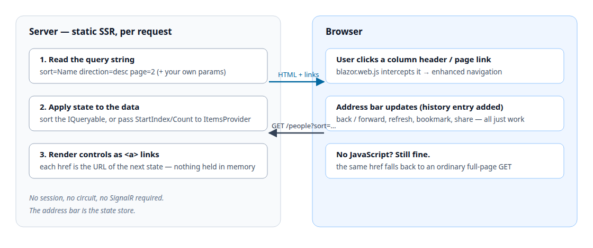
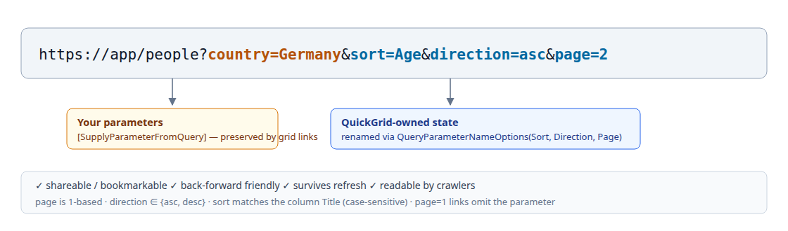
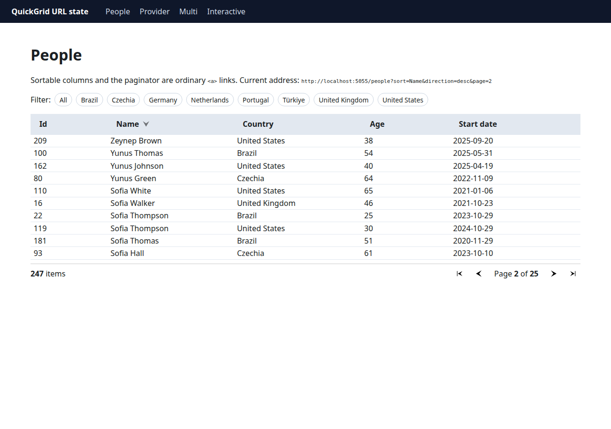
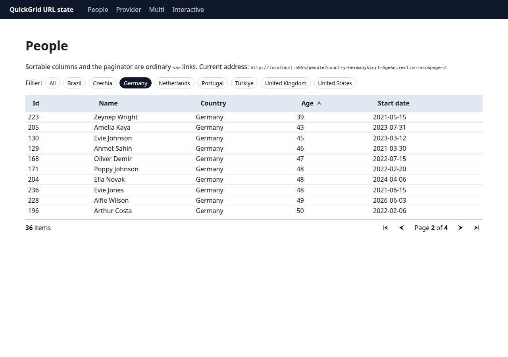
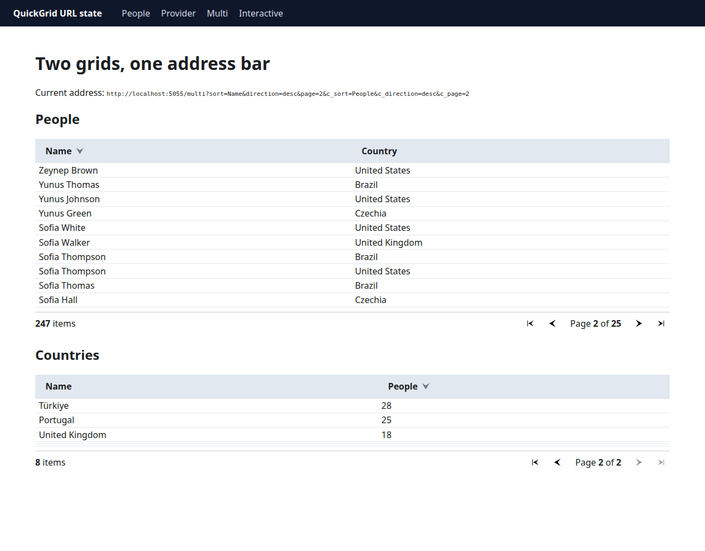

# QuickGrid in .NET 11: Sorting and Paging That Live in the URL

> **Release status.** Everything in this article was built and tested on **.NET 11 RC1** (SDK `11.0.100-rc.1.26425.128`, `Microsoft.AspNetCore.Components.QuickGrid` `11.0.0-rc.1.26425.128`, released September 8, 2026). RC1 ships with a go-live license, but it is not the final release. Query parameter names and defaults described here are the RC1 behavior — they were renamed once during the previews (details below), so recheck them when you move to RC2 or GA, planned for .NET Conf in November 2026.

`QuickGrid` has always been a good data grid with one structural limitation: its sort column, sort direction, and page index lived only in component memory, and its controls were `<button>`s wired to `@onclick`. On statically server-side rendered pages — pages with no interactive render mode — sorting and paging simply did nothing. On interactive pages, the state was still unshareable: you couldn't bookmark page 4, send a colleague a link to "the error logs sorted by time, descending", or press Back and land where you were.

.NET 11 moves that state into the query string. Sortable column headers and the `Paginator` now render as ordinary `<a>` links whose `href` is the URL of the next state — `?sort=Name&direction=desc&page=2`. Because the state is in the request, it works identically in static SSR, during prerendering, and after the circuit or WebAssembly runtime takes over. I built a small static-SSR-only Blazor app to try it, and this article walks through what actually renders — including a few rough edges I hit on RC1.

**TL;DR**

- **Static SSR works.** Sorting and paging are functional on pages with no interactivity at all — headers and the paginator are `<a>` links carrying `sort`, `direction`, and `page` query parameters.
- **The URL is the state store.** Refresh, Back/Forward, bookmarks, and "copy link" all preserve the grid state because the state is the address.
- **Your own parameters coexist.** A `[SupplyParameterFromQuery]` filter like `?country=Germany` is preserved inside QuickGrid's generated links, and vice versa.
- **Multiple grids need distinct parameter names.** The new `QueryParameterNameOptions` parameter renames `sort`/`direction`/`page` per grid (e.g. `?c_sort=Name&c_page=2`). Two grids sharing the defaults fight over the same keys.
- **`page` is 1-based in the URL** even though `PaginationState.CurrentPageIndex` stays 0-based.
- **Renamed during previews.** Preview 5–6 shipped `QueryParameterNamePrefix` and an `order` parameter; Preview 7 replaced it with `QueryParameterNameOptions` and renamed `order` → `direction`. Code written against Preview 5/6 articles won't compile unchanged on RC1.
- **Breaking markup change:** `button.col-title` becomes `a.col-title`. CSS and E2E selectors targeting `button` need updating. An `AppContext` switch reverts to buttons — but then the controls are dead in SSR again.
- **RC1 rough edge:** with `GridItemsProvider`, a `?page=` request invokes the provider **twice** — the second call is a duplicate. Details in [Server-side paging](#server-side-paging-with-griditemsprovider).

## Why the URL, and why it matters architecturally

Before the markup, it's worth being clear about what problem this solves. A data grid has three pieces of mutable view state — *which column sorts*, *which direction*, *which page* — and only a few places that state can live:

| Where state lives | Shareable/bookmarkable | Survives refresh | Back/Forward | Works in static SSR | Server resources |
|---|---|---|---|---|---|
| Component memory (.NET ≤ 10) | No | No | No | No (controls dead) | Circuit per user |
| `Session`/`TempData` | No | Yes | No | Yes, but per-user | Server store + cookies |
| **Query string (.NET 11)** | **Yes** | **Yes** | **Yes** | **Yes** | **None** |

The query string is the only option that's shareable, refresh-safe, history-friendly, SSR-compatible, and stateless on the server all at once. Every state transition is just a GET: no session affinity, no circuit to hold open, no memory to expire. It's also what the rest of the web already does for list views — GitHub's issue lists, NuGet's search results, and every e-commerce category page encode `?sort=&page=` in the address bar.

The mechanism, per request:



1. On each request the grid reads `sort`, `direction`, and `page` from the query string.
2. It applies them to the data — sorting the `IQueryable` itself for `Items`, or passing `StartIndex`/`Count`/sort descriptors to your `GridItemsProvider`.
3. It renders every state-changing control as an `<a>` whose `href` is the URL that produces the *next* state. Clicking "Name" while it sorts descending produces the `direction=asc` URL; clicking "next" produces `page=3`.

In the browser, `blazor.web.js` intercepts these clicks as **enhanced navigations** — a fetch plus a DOM patch plus a `pushState`, so the address bar updates without a full reload. With JavaScript disabled or absent, the same `href` performs an ordinary full-page GET. Both paths land on identical markup, which is what makes the feature progressive enhancement rather than a JS dependency.

## The sample app

The sample is a Blazor Web App with **no interactivity on its pages** — the scenario that was impossible before .NET 11:

```bash
dotnet new blazor -n QuickGridUrlState --interactivity None --empty
cd QuickGridUrlState
dotnet add package Microsoft.AspNetCore.Components.QuickGrid --version 11.0.0-rc.1.26425.128
dotnet run --urls http://localhost:5055
```

The runnable project, including the integration tests, is [salihozkara/quickgrid-url-state](https://github.com/salihozkara/quickgrid-url-state). Clone that repository to run the pages and `dotnet test` without reassembling the snippets below.

The data layer is 247 deterministically generated `Person` rows (fixed seed, so results are reproducible), exposed through a singleton store:

```csharp
public sealed record Person(int Id, string Name, string Country, int Age, DateOnly StartDate);

public sealed class PersonStore
{
    private static readonly string[] FirstNames = [ "Amelia", "Oliver", "Salih", /* ... */ ];
    private static readonly string[] LastNames  = [ "Smith", "Yilmaz", "Tiurina", /* ... */ ];
    private static readonly string[] Countries  = [ "United Kingdom", "Türkiye", "Germany", /* ... */ ];

    public IReadOnlyList<Person> People { get; }

    public PersonStore()
    {
        var rng = new Random(Seed: 20260923); // fixed seed: same 247 rows on every run
        People = Enumerable.Range(1, 247)
            .Select(id => new Person(
                Id: id,
                Name: $"{FirstNames[rng.Next(FirstNames.Length)]} {LastNames[rng.Next(LastNames.Length)]}",
                Country: Countries[rng.Next(Countries.Length)],
                Age: rng.Next(21, 68),
                StartDate: DateOnly.FromDayNumber(rng.Next(
                    DateOnly.FromDateTime(DateTime.Today.AddYears(-6)).DayNumber,
                    DateOnly.FromDateTime(DateTime.Today).DayNumber))))
            .ToList();
    }
}
```

`Program.cs` is the stock template plus one registration and — for the interactive page used later — the usual interactive-server lines:

```csharp
builder.Services.AddRazorComponents()
    .AddInteractiveServerComponents();
builder.Services.AddSingleton<PersonStore>();
// ...
app.MapRazorComponents<App>()
    .AddInteractiveServerRenderMode();
```

The page that matters is `Components/Pages/People.razor`:

```razor
@page "/people"
@using Microsoft.AspNetCore.Components.QuickGrid
@using QuickGridUrlState.Data
@inject PersonStore Store
@inject NavigationManager Nav

<PageTitle>People — QuickGrid URL state</PageTitle>

<h1>People</h1>

<p class="lede">
    Sortable columns and the paginator are ordinary <code>&lt;a&gt;</code> links.
    Current address: <code>@Nav.Uri</code>
</p>

<div class="filters">
    Filter:
    <a href="@FilterHref(null)">All</a>
    @foreach (var c in Store.People.Select(p => p.Country).Distinct().Order())
    {
        <a href="@FilterHref(c)" class="@(c == Country ? "active" : null)">@c</a>
    }
</div>

<QuickGrid Items="@FilteredPeople" Pagination="@pagination" Class="people-grid">
    <PropertyColumn Property="@(p => p.Id)" Sortable="true" Title="Id" />
    <PropertyColumn Property="@(p => p.Name)" Sortable="true" Title="Name" />
    <PropertyColumn Property="@(p => p.Country)" Sortable="true" Title="Country" />
    <PropertyColumn Property="@(p => p.Age)" Sortable="true" Title="Age" />
    <PropertyColumn Property="@(p => p.StartDate)" Sortable="true" Title="Start date" Format="yyyy-MM-dd" />
</QuickGrid>

<Paginator State="@pagination" />

@code {
    private readonly PaginationState pagination = new() { ItemsPerPage = 10 };

    [SupplyParameterFromQuery(Name = "country")]
    public string? Country { get; set; }

    private IQueryable<Person> FilteredPeople => Store.People
        .Where(p => Country is null || p.Country == Country)
        .AsQueryable();

    private string FilterHref(string? country) =>
        country is null ? "/people" : $"/people?country={Uri.EscapeDataString(country)}";
}
```

Nothing in this page is new code — that's the point. The same `QuickGrid`/`Paginator`/`PaginationState` trio that needed interactivity in .NET 10 now works on a static page in .NET 11, because the controls render as links and the state arrives via the URL.

## The URL contract

Here's a real URL the app produces, with the parts labeled:



| Parameter | Default name | Values | Notes |
|---|---|---|---|
| Sort column | `sort` | The column's **`Title`**, URL-encoded | Case-**sensitive** match against `Title`. `?sort=Start%20date` sorts the "Start date" column; `?sort=name` matches nothing and is ignored. |
| Sort direction | `direction` | `asc`, `desc` | Case-**insensitive** (`DESC` works). `asc`/`desc` are the only valid values — `Ascending`, `none`, or empty are ignored. |
| Page | `page` | 1-based integer | `?page=2` is the second page. Page 1 links **omit** the parameter entirely, so the canonical first-page URL stays clean. Out-of-range values clamp; garbage falls back to page 1. |

A few rules worth remembering:

- **The sort key is the column `Title`, not the property name.** `Title` is also what users see, which keeps URLs readable (`?sort=Start%20date`). The cost: renaming a column title invalidates existing bookmarks, and a `TemplateColumn` with `SortBy` but no `Title` renders a non-linked, unsortable header in URL mode — give sortable template columns a `Title`.
- **`PropertyColumn` infers `Title` from the member name** when you don't set one, so `Property="p => p.Name"` is already URL-sortable as `?sort=Name`.
- **Both `sort` and `direction` must be present** for a URL sort to take effect. `?sort=Name` alone is ignored (the grid treats it as "no sort instruction"), and `?direction=desc` alone does nothing. QuickGrid's own links always emit the pair.

## What actually renders

Requesting `/people?sort=Name&direction=desc&page=2` produces this markup (abridged — Blazor's internal `b-*` attributes omitted):

```html
<table theme="default" aria-rowcount="11" class="quickgrid people-grid">
  <thead>
    <tr>
      <th class="col-justify-start" aria-sort="none" scope="col">
        <div class="col-header-content">
          <a class="col-title" href="http://localhost:5055/people?sort=Id&amp;direction=asc&amp;page=2">
            <div class="col-title-text">Id</div>
            <div class="sort-indicator" aria-hidden="true"></div>
          </a>
        </div>
      </th>
      <th class="col-justify-start col-sort-desc" aria-sort="descending" scope="col">
        <div class="col-header-content">
          <a class="col-title" href="http://localhost:5055/people?sort=Name&amp;direction=asc&amp;page=2">
            <div class="col-title-text">Name</div>
            <div class="sort-indicator" aria-hidden="true"></div>
          </a>
        </div>
      </th>
      <!-- ... -->
    </tr>
  </thead>
  <!-- tbody rows: Zeynep Brown, Yunus Thomas, ... -->
</table>

<div class="paginator">
  <div class="summary"><strong>247</strong> items</div>
  <nav role="navigation">
    <a class="go-first"    href=".../people?sort=Name&amp;direction=desc"          aria-label="Go to first page">«</a>
    <a class="go-previous" href=".../people?sort=Name&amp;direction=desc"          aria-label="Go to previous page">‹</a>
    <div class="pagination-text">Page <strong>2</strong> of <strong>25</strong></div>
    <a class="go-next"     href=".../people?sort=Name&amp;direction=desc&amp;page=3"  aria-label="Go to next page">›</a>
    <a class="go-last"     href=".../people?sort=Name&amp;direction=desc&amp;page=25" aria-label="Go to last page">»</a>
  </nav>
</div>
```

A few things stand out in that markup:

- The hrefs are **absolute** (`http://localhost:5055/people?...`), built from the current `NavigationManager` URI.
- **Every control preserves the rest of the state.** On page 2 sorted by name descending, the "Id" header links to `?sort=Id&direction=asc&page=2` — changing the sort does **not** reset the page. Paginator links likewise keep `sort`/`direction`.
- **The active column's link toggles.** Sorted `desc`, the Name header offers `direction=asc`. The cycle is asc → desc → asc…; there's no "unsorted" link target — removing the sort means editing the URL.
- **`aria-sort` is correct** on the `<th>` (`descending` here, `none` on the others), plus `scope="col"`, an `aria-hidden` indicator glyph, `aria-label`/`title` on paginator links, and `aria-disabled="true"` + `tabindex="-1"` on the disabled first/previous links.
- **"Go to first/previous" from page 2 omit `page`** — the default state needs no parameter.

And in the browser:



*Figure: `/people?sort=Name&direction=desc&page=2`. The in-page "Current address" line is the sample's `NavigationManager.Uri` — the same string a user can copy and share.*

## Your own parameters are first-class citizens

The filter chips in the sample set `?country=` — a parameter QuickGrid knows nothing about, bound via `[SupplyParameterFromQuery]` on the page. Two behaviors make this work nicely:

1. **QuickGrid links preserve foreign parameters.** On `/people?country=Germany`, the Name header renders `?country=Germany&sort=Name&direction=asc` — the grid merges its state into the existing query string rather than replacing it.
2. **Your links can drop grid state on purpose.** The filter chips link to `/people?country=X` with no `sort`/`direction`/`page`, which resets the grid to page 1 unsorted — usually what you want when the result set changes. If you wanted the filter to keep sorting, you'd copy the grid params into your own links the same way.

`/people?country=Germany&sort=Age&direction=asc&page=2`:



*Figure: app-owned `country` filter combined with grid-owned `sort`/`direction`/`page` in one URL — fully bookmarkable.*

That composability is the quiet win here: QuickGrid owns three parameters, you own the rest of the query string, and nobody needs a shared state container or an event bus to coordinate them.

## Two grids on one page

Default parameter names are only safe when there is exactly one grid. The `/multi` page mounts a second grid with a prefix:

```razor
<QuickGrid Items="@Countries" Pagination="@countryPagination"
           QueryParameterNameOptions="@(new QueryParameterNameOptions("c_"))" Class="people-grid">
    <PropertyColumn Property="@(c => c.Name)" Sortable="true" Title="Name" />
    <PropertyColumn Property="@(c => c.People)" Sortable="true" Title="People" />
</QuickGrid>
<Paginator State="@countryPagination" />
```

The constructor argument is the **prefix including its own separator** — `new QueryParameterNameOptions("c_")` yields `c_sort`, `c_direction`, `c_page`. Each name is also settable independently:

```csharp
new QueryParameterNameOptions { Page = "p2" }   // sort, direction stay default; page becomes p2
```

Both grids operate independently in one URL — `/multi?sort=Name&direction=desc&page=2&c_sort=People&c_direction=desc&c_page=2`:



Two traps to know about:

- **No prefix = shared state.** Two grids with the default names both read `?page=`/`?sort=` and interfere with each other (the [API proposal](https://github.com/dotnet/aspnetcore/issues/66830) calls this out as a pit-of-failure). If you add a second grid to a page, prefix it.
- **`QueryParameterNameOptions` is per-`QuickGrid`.** The `Paginator` picks up the page parameter name through its linked `PaginationState`, so the `<Paginator>` tag needs no extra attribute — as long as it's bound to that grid's `PaginationState`.

## Server-side paging with `GridItemsProvider`

`Items` keeps everything in memory; real apps page at the database. With `ItemsProvider`, the resolved state arrives per request:

```csharp
peopleProvider = async request =>
{
    Logger.LogInformation(
        "ItemsProvider called: StartIndex={StartIndex} Count={Count} Sort=[{Sort}]",
        request.StartIndex, request.Count,
        string.Join(", ", request.GetSortByProperties().Select(s => $"{s.PropertyName} {s.Direction}")));

    var sorted = request.ApplySorting(Store.People.AsQueryable());
    var slice = sorted.Skip(request.StartIndex).Take(request.Count ?? 10).ToList();
    await Task.Delay(150, request.CancellationToken); // pretend this was a database
    return GridItemsProviderResult.From(slice, Store.People.Count);
};
```

In an EF Core app, `ApplySorting` + `Skip`/`Take` translate to `ORDER BY`/`OFFSET`/`FETCH`, so the URL state reaches the database query directly. Requesting four URLs in a row produced this log — and one surprise:

```text
GET /provider                                      → StartIndex=0  Count=10 Sort=[]
GET /provider?page=2                               → StartIndex=10 Count=10 Sort=[]
                                                     StartIndex=10 Count=10 Sort=[]   ← again
GET /provider?sort=Name&direction=asc              → StartIndex=0  Count=10 Sort=[Name Ascending]
GET /provider?sort=Name&direction=desc&page=4      → StartIndex=30 Count=10 Sort=[]
                                                     StartIndex=30 Count=10 Sort=[Name Descending]
```

**On RC1, any request with `page` in the URL invokes the provider twice.** With `page` alone the second call is an identical duplicate; with `sort`+`page`, the first call has the page applied but **not** the sort, and the second adds it. A sort-only URL issues a single call with the sort already applied, so the double fetch is specific to the pagination path. (Probably related to [dotnet/aspnetcore#69381](https://github.com/dotnet/aspnetcore/issues/69381), which tracks duplicate `ItemsProvider` lifecycles elsewhere in QuickGrid on RC1.) In practice that means every paged SSR request currently runs the provider twice — two count + page queries if that's how your provider is written. Until it's fixed: use `Items` for modest tables, or cache inside the provider.

## Interactive pages keep the same contract

`PeopleInteractive.razor` is the same grid with `@rendermode InteractiveServer`. Two things worth noting:

- **The prerendered HTML already reflects the URL.** `/people-interactive?sort=Name&direction=asc` renders `aria-sort="ascending"` and the sorted rows in the initial document — no flash of unsorted content while the circuit connects, because the static pass reads the URL the same way.
- **Controls stay `<a>` links once interactive.** Clicks go through Blazor's router/enhanced navigation instead of a full GET, but the state still round-trips through the address bar — so Back/Forward, refresh, and link sharing keep working interactively too.

That second point is the real upgrade: even in interactive apps, grid state isn't trapped in the component anymore. A user can lose the circuit, reload, and land on the same sorted page — something in-memory state could never give you.

## Edge cases I tested

All by plain HTTP requests against the running RC1 app:

| Request | Result |
|---|---|
| `?sort=Name&direction=desc` | Name desc, `aria-sort="descending"` |
| `?page=3` | Rows 21–30 — `page` is 1-based |
| `?page=999` | Last page (25), HTTP 200 — clamps, no redirect |
| `?page=0`, `?page=-1`, `?page=abc` | Page 1 — invalid values fall back silently |
| `?sort=BogusColumn` | Ignored — grid renders unsorted |
| `?sort=name` | Ignored — `sort` matching is case-**sensitive** on `Title` |
| `?sort=Name` (no `direction`) | Ignored — the pair is required |
| `?direction=desc` (no `sort`) | Ignored |
| `?direction=DESC` | Works — direction matching is case-insensitive |
| `?direction=Ascending` / `none` / empty | Ignored — only `asc`/`desc` are valid |
| `?sort=Age&sort=Name&direction=asc` | First value wins (Age asc) |
| `?sort=Start%20date&direction=desc` | Works — URL-decoded `Title` matches |
| `?page=2` on a grid without `Pagination` | Ignored, no error |
| Bare URL on a grid with `IsDefaultSortColumn` | Default sort applies; an explicit `?sort=` overrides it |

None of these throw — the grid treats the query string as untrusted input and falls back to defaults, which is the right behavior for parameters anyone can paste into the address bar.

## Accessibility and SEO

Because everything is real markup, most of the accessibility story comes free:

- **`<a>` vs `<button>`.** Sort headers are true links now (they navigate), which is the right element for the job — screen readers announce "link", and open-in-new-tab works. Disabled paginator links carry `aria-disabled="true"` and `tabindex="-1"`.
- **`aria-sort`** shows up on the sorted `<th>` (`ascending`/`descending`, `none` elsewhere) and `scope="col"` on all headers — table semantics are intact.
- **Focus.** The template's `FocusOnNavigate` moves focus to `h1` on navigation, which keeps enhanced-nav clicks sane for keyboard users.
- **SEO/no-JS.** The full sorted, paged table is in the HTML response — crawlers and link unfurlers see real rows, and every sort/page permutation is a crawlable URL. Two things to watch: `?page=999` returns **200 with clamped content** rather than a redirect (add a `canonical` link if soft-duplicates worry you), and `IsDefaultSortColumn` makes the bare URL and `?sort=X&direction=Y` render identical content, so pick one canonical form for links you publish.

## Opting out

URL navigation is on by default. This reverts to the .NET 10-style `<button>` controls:

```csharp
AppContext.SetSwitch(
    "Microsoft.AspNetCore.Components.QuickGrid.EnableUrlBasedQuickGridNavigationAndSorting",
    false);
```

I verified this on RC1: with the switch off, headers and paginator render `<button type="button">` again — **but the URL state is still read**. `/people?sort=Name&direction=desc&page=2` still renders sorted page 2; the buttons just can't change it in SSR. So the switch is a compatibility escape hatch for interactive apps (custom `button.col-title` CSS/JS, `Paginator` subclasses relying on the sync `OnParametersSet`), not a way to turn URL state off. In static SSR it leaves you with dead controls.

## .NET 10 vs .NET 11, and the preview trail

| | .NET 10 | .NET 11 RC1 |
|---|---|---|
| Sort/page state | Component memory only | URL query string (default) |
| Controls | `<button>` + `@onclick` | `<a href>` — `<button>` via AppContext opt-out |
| Static SSR sorting/paging | Not functional | Works |
| Shareable/bookmarkable grid state | No | Yes |
| Back/Forward restores grid | No | Yes |
| Multi-grid param isolation | n/a | `QueryParameterNameOptions` per grid |

Feature timeline, checked against the published NuGet packages:

| Preview | API |
|---|---|
| Preview 5 (PR [#65451](https://github.com/dotnet/aspnetcore/pull/65451)) | Feature lands: `QueryParameterNamePrefix` string parameter, `?sort`/`?order`/`?page` |
| Preview 7 (PR [#67733](https://github.com/dotnet/aspnetcore/pull/67733)) | `QueryParameterNamePrefix` → `QueryParameterNameOptions`; `order` → `direction`; per-name overrides |
| RC1 | Same surface as Preview 7 — `QueryParameterNameOptions`, `direction` |

The public surface on RC1, dumped from the assembly:

```text
Microsoft.AspNetCore.Components.QuickGrid 11.0.0-rc.1.26425.128

QuickGrid<TGridItem>
  [Parameter] QueryParameterNameOptions QueryParameterNameOptions   // new
  [Parameter] PaginationState Pagination
  ... (Items, ItemsProvider, Virtualize, AnchorMode, ItemKey, RowClass, OnRowClick, ...)

QueryParameterNameOptions (sealed)
  ctor(string prefix = "")
  string Sort, Direction, Page                                      // settable
```

> **Docs lag the RC1 rename.** The QuickGrid docs page and several preview-era blog posts still show `QueryParameterNamePrefix` and `?order=`. On RC1 that parameter doesn't exist and `order` is ignored — use `QueryParameterNameOptions` and `direction`.

## Known issues and production readiness

- **Go-live, not GA.** RC1 is production-supported under Microsoft's go-live license (window ends October 13, 2026 — plan to move to RC2/GA). .NET 11 is an **STS** release (support through November 9, 2028); .NET 10 remains **LTS** (November 14, 2028). The support windows end in the same month, so choose on features and risk, not longevity.
- **Duplicate provider calls on `?page=` requests** ([observed above](#server-side-paging-with-griditemsprovider)) — budget for it or use `Items` for small tables. See also [dotnet/aspnetcore#69381](https://github.com/dotnet/aspnetcore/issues/69381).
- **Markup breaking change.** `button.col-title` → `a.col-title` and paginator `button` → `a`. CSS selectors and Playwright/Selenium locators targeting `button` need updating; `aria-disabled` replaces `:disabled` for the disabled paginator state.
- **`Paginator.OnParametersSet` → `OnParametersSetAsync`.** Binary-compatible but behaviorally breaking for `Paginator` subclasses that overrode the sync method — they silently stop being called.
- **`sort` uses `Title`.** Renaming a column title breaks published/bookmarked URLs; give `TemplateColumn`s a `Title` to make them URL-sortable.
- **Sorting does not reset the page** — sorting while on page 12 keeps page 12 (with clamping). If your UX expects "back to page 1 on re-sort," note the behavior.

## Build and verification results

Everything above ran against the RC1 SDK and QuickGrid package from the release note at the top — the sample is the `dotnet new blazor --interactivity None` app described earlier, plus one `InteractiveServer` page and a small `WebApplicationFactory` test suite.

| Check | Result |
|---|---|
| `dotnet build` (app + tests) | 0 warnings, 0 errors |
| `dotnet test` — 12 integration tests | **12/12 passed** |
| Manual HTTP matrix (sort/page/malformed/multi-grid/opt-out) | Every row in the edge-case table verified |

The tests assert the contract directly: sort headers are `<a>` links, `?sort=Name&direction=desc&page=2` renders descending order with `aria-sort="descending"` and "Page 2 of 25", the `country` filter survives inside generated links, `?page=999` clamps to the last page, prefixed parameters drive the second grid, and the interactive page's prerendered HTML already carries URL state.

## Adoption checklist

- [ ] On .NET 11 RC1+: add/update `Microsoft.AspNetCore.Components.QuickGrid` to `11.0.0-rc.1.*` — no code changes needed for single grids.
- [ ] Verify sortable columns have meaningful `Title`s — they become the public `?sort=` values and bookmark identifiers.
- [ ] Set `QueryParameterNameOptions` prefixes on every grid after the first on a page.
- [ ] Update CSS/JS/E2E selectors from `button.col-title` / `nav button` to `a.col-title` / `nav a`; check `aria-disabled` instead of `:disabled`.
- [ ] If you subclass `Paginator`, move `OnParametersSet` overrides to `OnParametersSetAsync`.
- [ ] Decide deliberately whether sorting should reset the page — it doesn't, out of the box.
- [ ] Keep filter/search params in the query string (`[SupplyParameterFromQuery]`) — the grid preserves them for free.
- [ ] For `GridItemsProvider`, measure the duplicate `?page=` invocation on RC1 and re-check after upgrading.
- [ ] Only use the `EnableUrlBasedQuickGridNavigationAndSorting` opt-out for interactive pages with a concrete compatibility need.
- [ ] Add `rel="canonical"` (or equivalent) if out-of-range pages and default-sort duplicates matter for SEO.

## References

- [What's new in ASP.NET Core in .NET 11](https://learn.microsoft.com/en-us/aspnet/core/release-notes/aspnetcore-11)
- [QuickGrid component](https://learn.microsoft.com/en-us/aspnet/core/blazor/components/quickgrid) — note the preview-era `QueryParameterNamePrefix`/`order` naming
- [ASP.NET Core Blazor routing](https://learn.microsoft.com/en-us/aspnet/core/blazor/fundamentals/routing) and [enhanced navigation](https://learn.microsoft.com/en-us/aspnet/core/blazor/fundamentals/navigation#enhanced-navigation-and-form-handling)
- dotnet/aspnetcore: PR [#65451](https://github.com/dotnet/aspnetcore/pull/65451) (SSR support), issue [#66830](https://github.com/dotnet/aspnetcore/issues/66830) (API proposal), PR [#67733](https://github.com/dotnet/aspnetcore/pull/67733) (API rename), issue [#69381](https://github.com/dotnet/aspnetcore/issues/69381) (duplicate provider requests)
- [.NET 11 downloads](https://dotnet.microsoft.com/en-us/download/dotnet/11.0) and the [.NET support policy](https://dotnet.microsoft.com/platform/support/policy/dotnet-core)
- Sample application: [quickgrid-url-state](https://github.com/salihozkara/quickgrid-url-state)
