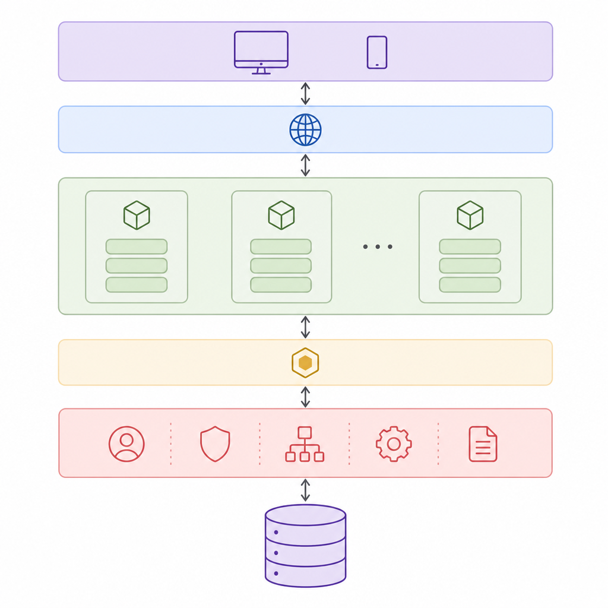
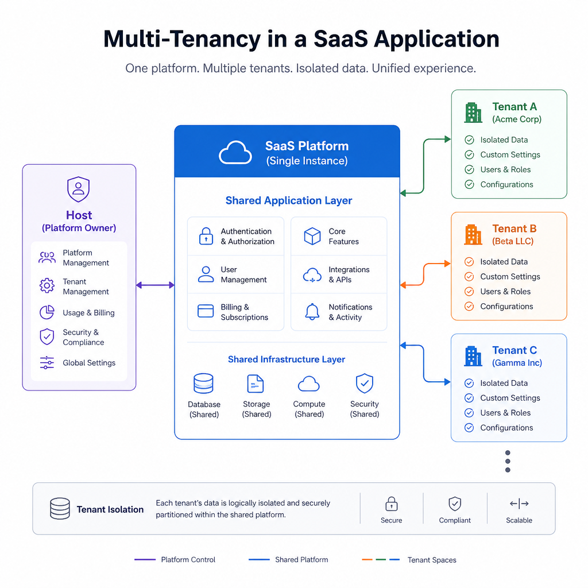

ABP nedir sorusu, .NET ekosistemine giren birçok geliştiricinin kısa sürede karşısına çıkar. Çünkü ABP, sıfırdan tekrar tekrar yazılan kurumsal uygulama problemlerini çözmek için hazırlanmış güçlü bir uygulama geliştirme platformudur. Kimlik doğrulama, yetkilendirme, çoklu kiracılık, modülerlik, otomatik API üretimi, arka plan işleri ve katmanlı mimari gibi konuları tek tek kurmak yerine, bunları düzenli bir temel üzerinde sunar.

Burada önemli bir nokta var: “ABP” kısaltması farklı alanlarda farklı anlamlara gelebilir. Ancak bu yazıda konu, ABP Platform ve ABP Framework yani .NET ile iş uygulamaları geliştirmek için kullanılan altyapıdır.

Eğer ASP.NET Core ile büyüyebilen, bakım yapılabilir ve ekipçe geliştirilebilir bir uygulama kurmak istiyorsanız, ABP'yi anlamak ciddi zaman kazandırır.

## ABP tam olarak nedir?

ABP, .NET ve ASP.NET Core üzerinde çalışan, açık kaynak temelli bir uygulama framework ve platform yaklaşımıdır. Özellikle iş uygulamaları için tasarlanmıştır.

Pratikte ABP şunları sağlar:

- Hazır mimari yapı
- Modüler geliştirme yaklaşımı
- Domain Driven Design uyumlu katmanlar
- Otomatik REST API oluşturma
- Authorization ve authentication altyapısı
- Multi-tenancy desteği
- Background job ve worker yapıları
- UI tarafında farklı seçenekler
- CLI ve geliştirme araçları

Yani ABP, yalnızca bir NuGet paketi koleksiyonu değildir. Daha çok, kurumsal .NET projelerinde sık karşılaşılan ihtiyaçları ortak bir geliştirme modeli içinde çözen bir çerçevedir.




## ABP neden ortaya çıktı?

Bir ASP.NET Core projesi oluşturmak kolaydır. Zor olan kısım, proje büyüdükçe mimari kalitesini korumaktır.

Örneğin birkaç ay içinde şu sorular gelir:

- Yetkilendirme politikasını nasıl standart hale getireceğiz?
- Application service ile domain logic ayrımını nasıl koruyacağız?
- Tenant bazlı veri izolasyonunu nasıl yöneteceğiz?
- Ortak modülleri başka projelerde nasıl yeniden kullanacağız?
- API, UI ve veri katmanı arasında bağımlılıkları nasıl temiz tutacağız?
- Audit logging, localization ve exception handling gibi çapraz kesen ihtiyaçları nereye koyacağız?

ABP tam olarak bu noktada devreye girer. Framework, geliştiriciye boş bir iskelet vermek yerine, iyi düşünülmüş bir başlangıç noktası sunar.

## ABP'nin temel yapı taşları

ABP'yi anlamanın en iyi yolu, onu oluşturan ana fikirleri ayrı ayrı görmekten geçer.

### 1. Modüler mimari

ABP'nin en güçlü taraflarından biri modülerliktir. Uygulamanızı bağımsız sorumluluk alanlarına ayırabilirsiniz.

Örnek modüller:

- Identity
- Tenant Management
- SaaS
- Catalog
- Ordering
- Payment
- Notification

Her modül kendi bağımlılıklarını, servislerini, domain kurallarını ve hatta veri erişimini taşıyabilir. Bu yaklaşım özellikle şu durumlarda çok değerlidir:

- Büyük ekiplerle çalışma
- Tekrarlanabilir kurumsal modüller geliştirme
- Modüler monolit kurma
- Daha sonra mikroservislere evrilebilecek yapı tasarlama

### 2. Katmanlı yapı ve DDD yaklaşımı

ABP, katmanlı mimariyi ve DDD prensiplerini pratik hale getirir. Tipik bir çözüm yapısında şu katmanlar görülür:

- Domain
- Application
- Entity Framework Core veya başka veri erişim katmanı
- HttpApi
- HttpApi.Client
- Web veya başka UI katmanı

Bu yapı sayesinde:

- Domain kuralları UI'dan bağımsız kalır
- Use case mantığı application katmanında toplanır
- Veri erişimi altyapı katmanında izole edilir
- API ve istemci tarafı daha temiz ayrılır

Küçük projelerde bu yapı ilk bakışta fazla gelebilir. Ama proje büyüdüğünde, bu ayrım ciddi bakım avantajı sağlar.

### 3. Hazır altyapı özellikleri

ABP'nin değerinin büyük kısmı, kutudan çıkan altyapı yeteneklerinden gelir.

Başlıca özellikler:

- Permission-based authorization
- Validation altyapısı
- Exception handling standardizasyonu
- Audit logging
- Localization
- Setting management
- Feature management
- Distributed event bus desteği
- Background jobs ve background workers
- Object-to-object mapping entegrasyonları
- Caching desteği

Bu özellikleri tek tek farklı kütüphanelerle birleştirmek mümkündür. Ancak ABP bunları uyumlu ve bütüncül bir model içinde sunar.

## ABP ile neler geliştirilir?

ABP en çok şu tip projelerde anlamlıdır:

- ERP benzeri iş uygulamaları
- CRM sistemleri
- Admin panel ağırlıklı platformlar
- SaaS ürünleri
- Çok kiracılı B2B uygulamalar
- Kurum içi operasyon sistemleri
- API merkezli backend projeleri

Örneğin bir B2B SaaS ürünü düşünün:

- Her müşteri kendi tenant'ı olarak sisteme girer
- Kullanıcı, rol ve izin yönetimi tenant bazında çalışır
- Ayarlar tenant seviyesinde özelleşir
- Audit log ile işlemler takip edilir
- Uygulama servisleri otomatik olarak API olarak sunulur

ABP böyle bir senaryoda ciddi geliştirme hızlandırıcısıdır.




## ABP'nin öne çıkan özellikleri


## ABP'de multi-tenancy nasıl çalışır?

Multi-tenancy, ABP'nin en dikkat çeken özelliklerinden biridir. Özellikle SaaS geliştiren ekipler için çok değerlidir.

ABP'de tenant kavramı birinci sınıf vatandaştır. Bu sayede şunları daha kolay kurabilirsiniz:

- Tenant bazlı kullanıcı yönetimi
- Host ve tenant ayrımı
- Tenant bazlı ayar ve özellik yönetimi
- Veri filtreleme
- Farklı tenantlar için farklı yetenekler

Genel model genelde şöyledir:

1. İstek gelir.
2. Tenant çözümleme yapılır.
3. Geçerli tenant context'i oluşturulur.
4. Veri erişimi ve yetkilendirme bu context'e göre davranır.

Bunu manuel kurmak mümkündür, ancak hataya açıktır. ABP bu süreci standartlaştırır.

## ABP'de otomatik API üretimi

ABP'nin pratik taraflarından biri de application service katmanındaki servisleri HTTP API olarak sunabilmesidir.

Bu yaklaşımın avantajları:

- Tekrar eden controller kodu azalır
- Tutarlı API yüzeyi oluşur
- Frontend ekipleri daha hızlı ilerler
- Swagger/OpenAPI çıktıları daha düzenli olur

Basit bir örnek:

```csharp
public class BookAppService : ApplicationService
{
    public Task<BookDto> GetAsync(Guid id)
    {
        // business logic
    }

    public Task<List<BookDto>> GetListAsync()
    {
        // business logic
    }
}
```

Bu tür bir servis, ABP yaklaşımıyla doğrudan uygulama sözleşmesinin bir parçası haline gelir. Amaç, geliştiricinin gereksiz taşıma koduna değil, iş problemine odaklanmasıdır.

## UI seçenekleri

ABP tek bir UI yaklaşımına kilitlenmez. Bu da onu farklı ekip yapıları için esnek kılar.

Desteklenen yaygın seçenekler:

- MVC / Razor Pages
- Blazor Server
- Blazor WebAssembly
- MAUI Blazor
- Angular
- React odaklı modern şablon desteği

Bu esneklik şu senaryolarda işe yarar:

- Backend ve frontend aynı çözümde ilerleyecekse Razor Pages iyi olabilir
- Zengin .NET tabanlı web UI isteniyorsa Blazor tercih edilebilir
- Ayrık SPA ekibi varsa Angular veya React daha uygun olabilir

## ABP CLI ve geliştirici deneyimi

ABP yalnızca runtime tarafında değil, geliştirme sürecinde de hız kazandırır. CLI araçlarıyla proje oluşturma, modül ekleme ve bazı geliştirme akışlarını kolaylaştırır.

CLI'nin sağladığı faydalar:

- Standart proje başlangıcı
- Tekrarlanan kurulum işlerinin azalması
- Ekip içinde tutarlı çözüm yapısı
- Öğrenmesi daha kolay bir başlangıç deneyimi

Kurumsal projelerde en büyük kayıplardan biri, her ekibin farklı başlangıç iskeleti üretmesidir. ABP burada ortak dil sağlar.

## ABP Framework açık kaynak mı?

Evet. ABP Framework'ün çekirdeği açık kaynak temellidir. Bunun yanında ticari tarafta ek modüller, tema seçenekleri, startup şablonları, destek ve bazı üretkenlik araçları sunulabilir.

Bu ayrımı doğru anlamak önemli:

- Açık kaynak kısım, güçlü bir temel sağlar
- Ticari teklifler, özellikle kurumsal hız ve hazır modül ihtiyacında değer üretir

Yani ABP'yi kullanmak için mutlaka ticari sürüme bağımlı olmak gerekmez. Ancak proje ihtiyaçlarına göre ticari modüller mantıklı olabilir.

## ABP, ASP.NET Core'un yerine mi geçer?

Hayır. ABP, ASP.NET Core'un alternatifi değil; onun üzerine kurulu bir framework'tür.

Bunu şöyle düşünmek daha doğru olur:

- ASP.NET Core temel platformdur
- ABP ise bu platform üzerinde iş uygulaması geliştirmeyi hızlandıran üst katmandır

Dolayısıyla ABP kullandığınızda yine .NET, ASP.NET Core, dependency injection, middleware, EF Core gibi tanıdık dünyadasınız. Sadece daha yapılandırılmış bir geliştirme modeline geçiyorsunuz.

## ABP ile düz ASP.NET Core karşılaştırması

Kısa bir karşılaştırma yapmak faydalı olur.

### Düz ASP.NET Core

Avantajları:

- Tam esneklik
- Daha az soyutlama
- Küçük projelerde daha hafif başlangıç

Dezavantajları:

- Birçok altyapı kararını sizin vermeniz gerekir
- Modülerlik ve standartlar ekip disiplinine kalır
- Yetkilendirme, localization, audit log gibi ihtiyaçlar için daha çok manuel kurulum gerekir

### ABP

Avantajları:

- Hızlı başlangıç
- Kurumsal ihtiyaçlar için hazır altyapı
- Modüler ve katmanlı mimari desteği
- Multi-tenancy ve permission sistemi gibi gelişmiş özellikler

Dezavantajları:

- Öğrenme eğrisi vardır
- Küçük CRUD projeleri için fazla güçlü gelebilir
- Framework'ün yaklaşımına uyum sağlamak gerekir

Kısacası, her proje için ABP şart değildir. Ama karmaşık iş uygulamalarında ciddi fark yaratabilir.

## ABP ne zaman kullanılmalı, ne zaman kullanılmamalı?

### Ne zaman kullanılmalı?

ABP iyi bir tercihtir eğer:

- Kurumsal bir iş uygulaması geliştiriyorsanız
- Projede kullanıcı, rol, izin ve tenant yapısı önemliyse
- Uzun ömürlü ve bakımı yapılabilir bir mimari istiyorsanız
- Birden fazla modül veya ekip birlikte çalışacaksa
- Tekrarlanan altyapı işlerinden kaçınmak istiyorsanız
- Monolit başlayıp zamanla büyüyebilecek bir yapı kuruyorsanız

### Ne zaman kullanılmamalı?

ABP gereksiz olabilir eğer:

- Çok küçük ve kısa ömürlü bir proje geliştiriyorsanız
- Sadece birkaç endpoint ve basit CRUD ekranı varsa
- Ekibin framework öğrenme maliyetine zamanı yoksa
- Çok özel, alışılmışın dışında bir mimari kurgulanacaksa
- Hazır conventions yerine tamamen özgür bir yapı isteniyorsa

Burada ana ölçüt şudur: proje karmaşıklığı ve ömrü arttıkça ABP'nin değeri de artar.

## ABP öğrenmeye nasıl başlanır?

ABP'ye başlarken en verimli yol, tüm özellikleri aynı anda ezberlemeye çalışmak değildir. Bunun yerine temel akışı anlamak gerekir.

Önerilen öğrenme sırası:

1. Çözüm yapısını inceleyin
2. Domain, application ve infrastructure ayrımını anlayın
3. Basit bir entity ve application service oluşturun
4. Permission ve authorization akışını deneyin
5. Multi-tenancy ihtiyacınız varsa tenant modeline geçin
6. Gerekirse modül geliştirme tarafına ilerleyin

Özellikle şu kavramları erkenden anlamak büyük fark yaratır:

- Application service
- Repository yaklaşımı
- DTO kullanımı
- Permission sistemi
- Unit of work davranışı
- Module bağımlılık yapısı

## “ABP” neden bazen kafa karıştırıyor?

Teknik dünyada ABP kısaltması farklı şeyler için de kullanılır. Örneğin:

- Alternating Bit Protocol
- Adblock Plus
- LoRaWAN tarafında Activation by Personalisation

Bu yüzden arama yaparken veya teknik bir doküman yazarken bağlamı net belirtmek gerekir. Bu yazıdaki ABP, tamamen .NET iş uygulamaları için kullanılan ABP Platform anlamındadır.

## Son değerlendirme

ABP, .NET geliştiricileri için özellikle kurumsal uygulama tarafında güçlü bir hızlandırıcıdır. Size sadece bir framework değil, aynı zamanda tekrar eden mimari kararlar için olgun bir yol haritası sunar.

Her projede kullanılması gerekmez. Basit projelerde fazla gelebilir. Ancak yetkilendirme, modülerlik, tenant yönetimi, API standardizasyonu ve uzun vadeli bakım önemliyse ABP oldukça mantıklı bir seçimdir.

Özetle ABP'nin değeri, tek bir özellikte değil; birçok kurumsal ihtiyacı birlikte ve tutarlı şekilde çözmesinde yatar.

## TL;DR

- ABP, .NET ve ASP.NET Core üzerinde iş uygulamaları geliştirmek için tasarlanmış modüler bir framework ve platform yaklaşımıdır.
- Multi-tenancy, authorization, otomatik API üretimi ve katmanlı mimari gibi ihtiyaçları hazır şekilde sunar.
- Özellikle SaaS ve kurumsal uygulamalarda güçlüdür; çok küçük projelerde ise fazla kapsamlı olabilir.
- ASP.NET Core'un yerine geçmez, onun üzerine kurulu daha yapılandırılmış bir geliştirme modeli sağlar.