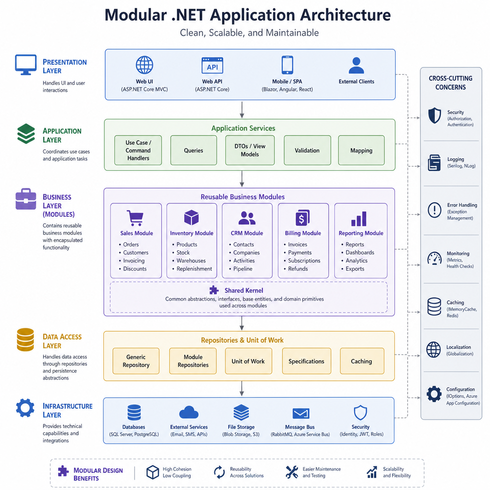
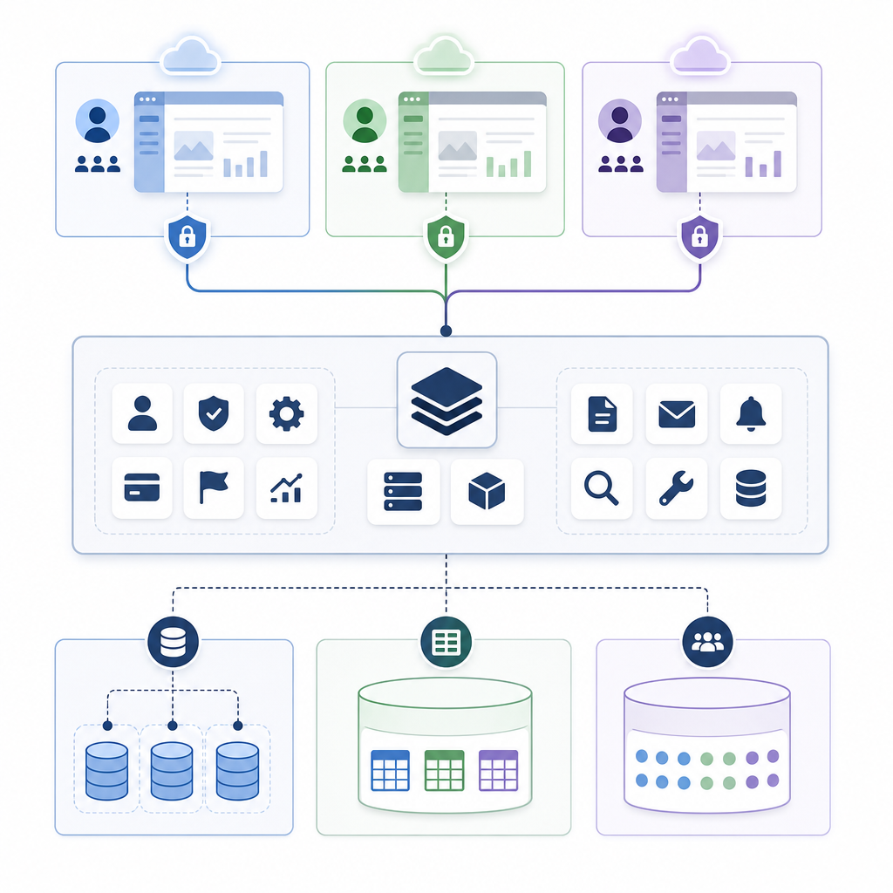
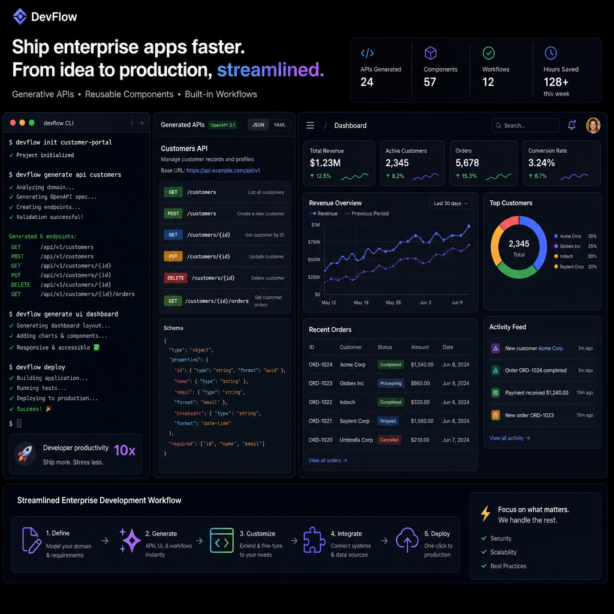

Most .NET teams do not struggle because they cannot write CRUD code. They struggle because real business applications quickly grow into authentication, permissions, multi-tenancy, background jobs, audit logging, API layers, UI integration, and deployment complexity.

That is where ABP Framework stands out. It gives you an opinionated application architecture with many enterprise features already wired together. If you are building a serious business app on .NET, that can save a lot of time and prevent a lot of accidental architecture mistakes.

In this post, I will cover 5 good things about ABP Framework, where it shines, and where it may be more than you need.

## 1. ABP gives you a strong modular architecture

One of the best things about ABP Framework is that it pushes you toward a clean, modular structure from the beginning.

ABP is not just a library collection. It encourages a layered architecture with clear boundaries between:

- Domain layer
- Application layer
- Infrastructure layer
- API layer
- UI layer

This matters because enterprise applications tend to become messy when business rules, database access, and HTTP concerns all get mixed together.

With ABP, you typically work with familiar patterns such as:

- Entities
- Value objects
- Repositories
- Domain services
- Application services
- DTOs

That makes it much easier to follow Domain-Driven Design principles without building all the plumbing yourself.

### Why this is useful in real projects

A common problem in standard ASP.NET Core projects is that the first version looks clean, but after a year, everything starts leaking into everything else. Controllers talk directly to EF Core, business rules are duplicated, and shared code becomes hard to extract.

ABP reduces that risk by making structure a default, not an afterthought.

### Another practical advantage

ABP supports both:

- Modular monolith architecture
- Microservice-based architecture

That is a very practical path for growing teams. You can start with a modular monolith, keep deployment simple, and split modules into services later only if you actually need to. That is usually a better strategy than forcing microservices too early.

## 2. Multi-tenancy is built in, not bolted on

If you have ever added multi-tenancy to an existing application late in the project, you already know how painful it can be.

ABP Framework has multi-tenancy support as a first-class capability. This is one of its biggest strengths for SaaS development.

It supports common tenant models such as:

- Single database for all tenants
- Separate database per tenant
- Hybrid setups

This gives you flexibility based on your scale, compliance, and cost requirements.

### Why this matters

Multi-tenancy is not just about adding a TenantId column. In real systems, you also need to think about:

- Data isolation
- Cache isolation
- Authentication behavior
- Tenant-specific settings
- Background job context
- Permission management

ABP already handles much of this infrastructure.

A particularly valuable part is that it integrates tenant awareness with parts of the stack that are otherwise easy to misconfigure, including identity and authorization flows.

### Real-world example

Imagine you are building a B2B SaaS product for accounting firms. Each customer company needs:

- Its own users
- Its own roles and permissions
- Its own settings
- Strong isolation from other tenants

In a plain ASP.NET Core setup, that requires a lot of custom groundwork. In ABP, much of the model is already there, so your team can spend more time on accounting workflows and less time rebuilding SaaS infrastructure.

## 3. Cross-cutting concerns are already solved

A lot of backend work is repetitive, but still critical. Every serious application needs the same core concerns handled properly.

ABP includes many of these out of the box, including:

- Authentication and authorization
- Permission system
- Validation
- Audit logging
- Exception handling
- Caching
- Localization
- Setting management
- Feature management
- Background jobs and workers
- Concurrency control

This is a big deal because these features are easy to underestimate. Teams often build them partially, inconsistently, or too late.

### Why built-in cross-cutting features matter

When these capabilities are part of the framework, you get:

- More consistent behavior across modules
- Less duplicated infrastructure code
- Better maintainability
- Faster onboarding for new developers

For example, audit logging is often requested after a system goes live, usually when an admin asks, "Who changed this record and when?" ABP already has a solid story for that kind of requirement.

### Background processing is also easier

Business applications often need scheduled or asynchronous work such as:

- Sending emails
- Running imports
- Generating reports
- Syncing with external systems

ABP supports background jobs and workers, and it integrates with popular tools used in production environments. That is much better than inventing your own fragile task scheduler inside the app.

## 4. Developer productivity is genuinely better

Some frameworks promise productivity but mostly add abstraction. ABP is more convincing because the productivity gains are tied to very practical features.

A few standout examples:

- CLI support for creating projects and modules
- ABP Studio for managing solutions and development workflows
- Code generation and scaffolding
- Automatic REST API generation from application services
- Dynamic client proxy support
- Prebuilt UI themes and components
- Support for Angular, Blazor, MVC, and other UI approaches

### Auto API generation is a big time saver

One of the nicest parts of ABP is that application services can be exposed as REST endpoints by convention.

That means less boilerplate controller code and a clearer path from business use case to API surface.

For example, a typical application service can represent a use case like managing products, invoices, or tenants, and ABP can expose it through conventional HTTP endpoints. That reduces repetitive code while keeping the service layer central.

### Tooling helps teams move faster

Good tooling matters more than many developers admit.

When the framework helps you generate modules, organize layers, manage dependencies, and scaffold common pieces, your team can focus more on business rules and less on setup work.

This is especially useful for:

- Teams building internal business software quickly
- Agencies delivering multiple similar projects
- Startups building SaaS products on .NET
- Enterprise teams standardizing architecture across solutions

## 5. ABP is actively evolving for modern enterprise .NET

A framework is only valuable long term if it keeps moving with the platform.

ABP has continued to evolve with modern .NET and recent releases have added meaningful enterprise features rather than cosmetic changes.

Examples include:

- Support aligned with newer .NET versions
- Ongoing Angular and Blazor improvements
- Enhancements around identity and account management
- Improvements for authorization and localization
- Strong continued focus on multi-tenant scenarios

That matters because many enterprise applications live for years. You want a framework that is not frozen in time.

### Why this is important for decision makers

When a team adopts a framework, they are not just choosing syntax or templates. They are choosing:

- Upgrade path
- Ecosystem stability
- Long-term maintainability
- Operational confidence

ABP has shown that it is aimed at serious, long-lived business applications, not just demos or starter kits.

## When to use ABP Framework

ABP is a strong fit when you are building:

- SaaS products with multi-tenancy requirements
- Enterprise business applications with many modules
- Systems that need authorization, auditing, and background processing
- Applications where clean architecture matters over the long run
- Products that may start as a modular monolith and evolve later

## When NOT to use ABP Framework

ABP is not automatically the right choice for every .NET project.

You may want something simpler if you are building:

- A very small internal tool
- A basic API with minimal business rules
- A short-lived prototype
- A project where the team does not want an opinionated architecture

There is also a learning curve. ABP gives you a lot, but you need to learn its conventions and structure to get the full benefit. For some teams, that investment pays off quickly. For others, it may feel heavy.

## The main trade-off

The biggest trade-off is simple: ABP gives you more architecture up front.

That is great when your application is complex enough to justify it. It is less attractive when your app is small and likely to stay small.

So the question is not whether ABP Framework is good. It clearly is. The better question is whether your project actually needs the problems it solves:

- Modularity
n- Multi-tenancy
- Rich authorization
- Auditability
- Scalable application structure

If the answer is yes, ABP becomes a very compelling choice.

## TL;DR

- ABP Framework gives .NET teams a clean modular architecture that fits real business applications.
- Its built-in multi-tenancy support is one of its strongest advantages for SaaS development.
- Cross-cutting concerns like permissions, auditing, validation, and background jobs are already solved.
- Tooling, auto API generation, and UI support improve developer productivity in practical ways.
- ABP is best for serious enterprise or SaaS apps, but it can be overkill for very small projects.