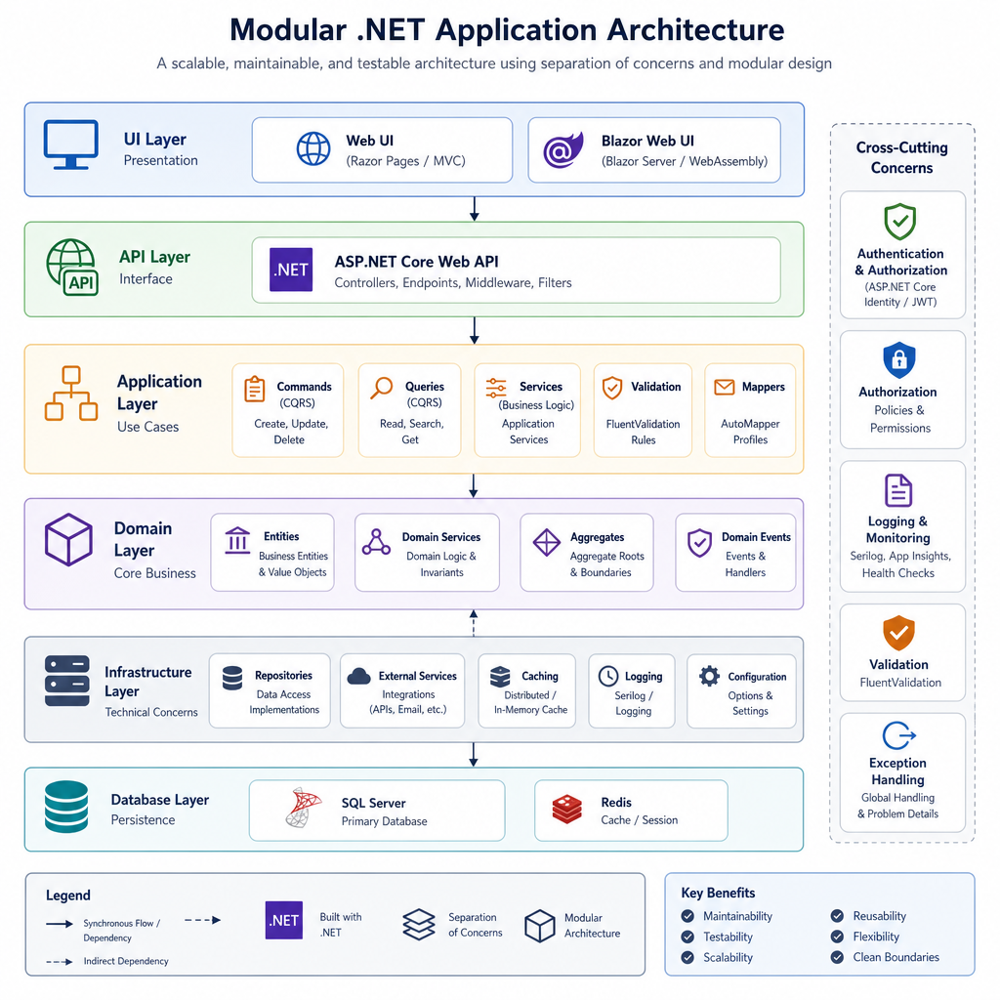
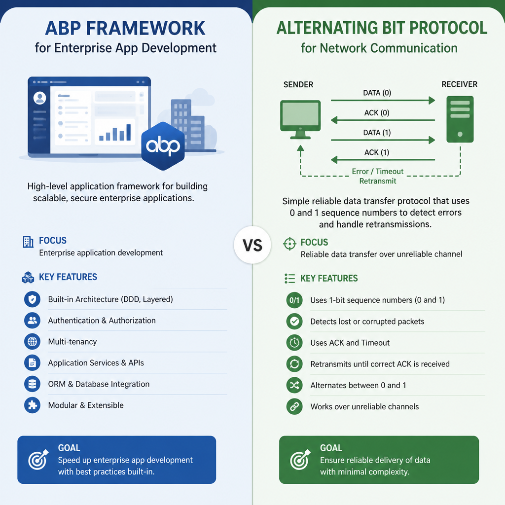
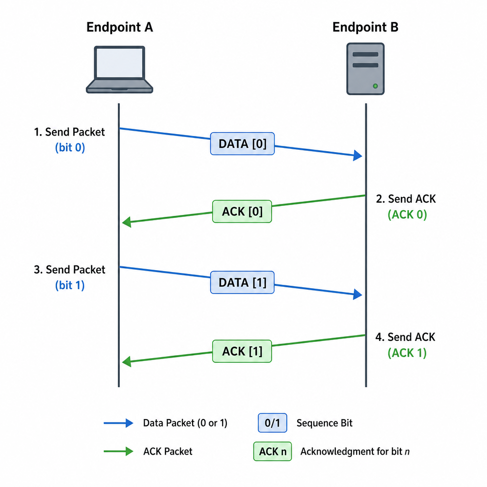

If you search for "ABP" in software, you quickly run into two very different meanings. One is **ABP Framework**, a popular open-source application framework for building modern .NET business applications. The other is **Alternating Bit Protocol**, a classic networking protocol used to guarantee reliable message delivery over unreliable channels.

That ambiguity matters. If a developer asks "What is ABP?", the right answer depends entirely on context.

In the ABP.IO ecosystem, ABP almost always means **ABP Framework / ABP Platform**. But since the term also appears in networking and computer science courses, it is worth clarifying both.

## ABP in software development: ABP Framework

**ABP Framework** is an open-source application framework built on **.NET and ASP.NET Core**. It is designed to help developers build **modular, maintainable, and production-ready business applications** faster.

Instead of starting every project from scratch, ABP gives you a structured foundation for common application needs:

- authentication and authorization
- multi-tenancy
- modular architecture
- layered application design
- database integration
- auditing
- localization
- background jobs
- API conventions
- UI integration options

In short, ABP is not just a library. It is a **full application development platform** for enterprise-style .NET projects.

### Why developers use ABP

A lot of business applications repeat the same infrastructure work:

- user and role management
- permissions
- CRUD screens
- tenant isolation
- validation
- exception handling
- logging and auditing
- DTO mapping
- dependency injection setup

ABP reduces that repetition by offering conventions and ready-made modules.

This is especially useful when you are building:

- SaaS platforms
- admin panels
- internal enterprise systems
- multi-tenant products
- modular monoliths
- microservice-based business applications

### Core features of ABP Framework

### Modular architecture

ABP is strongly centered around **modularity**. You can organize your solution into reusable modules with clear boundaries.

That makes it easier to:

- separate concerns
- reuse functionality across projects
- keep large codebases maintainable
- evolve an application without turning it into a big ball of mud

A typical ABP solution often includes layers such as:

- Domain
- Application
- Entity Framework Core or MongoDB integration
- HTTP API
- Web UI or frontend app

### Multi-tenancy support

One of ABP's standout capabilities is **multi-tenancy**.

If you are building a SaaS product where multiple customers use the same application, ABP helps you model that cleanly. It supports tenant-aware application behavior and can be configured for different data isolation strategies.

This is a major reason teams choose ABP over plain ASP.NET Core.

### Built-in application modules

ABP includes prebuilt modules for common enterprise requirements, such as:

- identity management
- tenant management
- permission management
- audit logging
- setting management
- feature management

These save time and also provide a consistent architecture across projects.

### Database flexibility

ABP works well with **Entity Framework Core** and supports multiple databases through EF Core providers, including:

- SQL Server
- PostgreSQL
- MySQL
- Oracle
- SQLite

It also supports **MongoDB** for teams that prefer a document database approach.

### UI options

ABP is not tied to a single frontend style. Depending on your project, you can use it with:

- MVC / Razor Pages
- Angular
- Blazor Server
- Blazor WebAssembly
- React in broader integration scenarios

That flexibility helps teams adopt ABP without rewriting their preferred frontend stack decisions.

### Tooling: CLI, Suite, and Studio

ABP also improves developer productivity with dedicated tooling:

- **ABP CLI** for creating solutions, adding modules, and automating project setup
- **ABP Suite** for generating CRUD pages and accelerating repetitive business UI work
- **ABP Studio** for managing and understanding solutions in a more visual way

For teams building line-of-business applications, these tools can significantly reduce setup and scaffolding time.

## How ABP Framework works in practice

A practical way to understand ABP is to compare it with plain ASP.NET Core.

With plain ASP.NET Core, you usually assemble many pieces yourself:

- project structure
- architecture rules
- permission model
- tenant model
- audit system
- boilerplate CRUD patterns
- module boundaries

With ABP, many of these concerns already have a place in the framework.

For example, if you are building a B2B SaaS application for inventory management, ABP gives you a strong starting point for:

1. creating tenants for each customer
2. managing users and roles per tenant
3. exposing application services over HTTP APIs
4. implementing domain logic in a structured way
5. generating admin or CRUD screens faster
6. tracking changes through audit logs

That does not mean ABP writes your business logic for you. It means it removes much of the repetitive infrastructure work around that logic.

## When ABP Framework is a good fit

ABP shines when the application is more than a simple website.

### When to use ABP Framework

Use ABP when you need:

- a structured .NET architecture from day one
- multi-tenancy
- enterprise-grade authorization and permission handling
- modularity across teams or domains
- reusable application modules
- faster development of business applications
- long-term maintainability for a growing codebase

It is especially useful for:

- SaaS products
- ERP-style systems
- CRM platforms
- internal company portals
- business workflow systems

### When NOT to use ABP Framework

ABP may be too heavy if you are building:

- a very small prototype
- a simple landing page
- a tiny API with only a few endpoints
- a short-lived internal tool with minimal requirements

In those cases, plain ASP.NET Core may be simpler and faster.

ABP is powerful, but that power comes with:

- a learning curve
- architectural conventions to understand
- more moving parts than a minimal app

So the real question is not whether ABP is good. It is whether your project is large or important enough to benefit from its structure.

## Common concerns about ABP Framework

### Learning curve

This is the most common issue new teams notice.

ABP introduces concepts such as:

- modules
- application services
- domain-driven layering
- tenant-aware behavior
- framework conventions

If your team is new to these ideas, the first project may feel slower before it gets faster.

### Dependency management

Like any modern framework, ABP sits on top of a stack of packages and integrations. Teams should manage dependencies carefully, keep packages updated, and run security scanning regularly.

### Licensing expectations

A frequent point of confusion is licensing.

The **core ABP Framework** is open source, but some related tooling, themes, commercial modules, and support offerings may require paid plans. That is not unusual, but teams should understand the difference before committing.

## ABP in networking: Alternating Bit Protocol

In a completely different context, **ABP** can mean **Alternating Bit Protocol**.

This is a classic **data communication protocol** used to ensure reliable delivery over an unreliable channel.

It is typically taught in networking or distributed systems courses because it demonstrates the basic idea behind acknowledgment and retransmission.

### The basic idea

Alternating Bit Protocol uses:

- a **1-bit sequence number**: 0 or 1
- an **ACK** from the receiver
- **retransmission** if the ACK is missing or delayed

The sender transmits a frame with bit 0, waits for acknowledgment, then sends the next frame with bit 1. After that, it alternates back to 0, then 1 again.

If a frame or acknowledgment is lost, the sender sends the same frame again.

This is why it is called **alternating bit**.

### How Alternating Bit Protocol works

A simplified flow looks like this:

1. Sender sends message M1 with sequence bit 0.
2. Receiver gets M1, accepts it, and sends ACK 0.
3. Sender receives ACK 0 and sends M2 with sequence bit 1.
4. If ACK 1 is lost, the sender times out and resends M2 with bit 1.
5. Receiver recognizes whether it is a new frame or a duplicate based on the bit.

This protocol belongs to the **stop-and-wait ARQ** family:

- only one unacknowledged frame is in flight
- sender waits before sending the next one
- window size is effectively 1

### Why Alternating Bit Protocol matters

In production systems, you usually do not implement Alternating Bit Protocol directly. But it is still important because it teaches the fundamentals behind reliable communication:

- sequence numbers
- acknowledgments
- duplicate detection
- timeout handling
- retransmission logic

These ideas show up again in more advanced protocols.

### Strengths of Alternating Bit Protocol

- very simple to understand
- easy to implement
- reliable over lossy channels
- useful for education and simple constrained systems

### Weaknesses of Alternating Bit Protocol

- poor throughput on high-latency networks
- sender must wait after every frame
- inefficient for large-scale or high-volume communication
- not suitable when continuous high-speed transmission is needed

## ABP Framework vs Alternating Bit Protocol

These two meanings of ABP are unrelated except for the abbreviation.

### ABP Framework

- domain: enterprise software development
- ecosystem: .NET, ASP.NET Core
- purpose: accelerate business application development
- common use cases: SaaS, admin systems, modular apps

### Alternating Bit Protocol

- domain: networking and data communication
- ecosystem: protocol theory, computer networks
- purpose: reliable message delivery
- common use cases: education, simple communication models

If you are reading ABP.IO documentation, job posts, .NET tutorials, or enterprise architecture articles, **ABP almost certainly means ABP Framework**.

If you are reading a networking textbook or protocol design material, it may mean **Alternating Bit Protocol**.

## Which meaning is usually intended?

In modern software development discussions, especially around .NET, **ABP usually refers to ABP Framework**.

That is the meaning most developers are looking for when they ask:

- What is ABP?
- Is ABP worth learning?
- Should I use ABP for my SaaS app?
- How does ABP compare to plain ASP.NET Core?

The networking meaning is valid, but much less common in day-to-day product development conversations.

## Final take

If your context is **ABP.IO**, the answer is simple: ABP is a **modular open-source application framework for .NET** that helps teams build enterprise and SaaS applications faster by providing infrastructure, conventions, modules, and tooling.

If your context is computer networking, ABP may instead refer to **Alternating Bit Protocol**, a simple stop-and-wait protocol for reliable communication.

The abbreviation is the same. The meaning is not.

## TL;DR

- In the ABP.IO world, ABP usually means **ABP Framework**, a .NET framework for building modular business applications.
- ABP Framework offers features like multi-tenancy, modularity, built-in modules, database flexibility, and developer tooling.
- In networking, ABP can also mean **Alternating Bit Protocol**, a simple reliable transmission protocol.
- If your context is ASP.NET Core, SaaS, or enterprise apps, the intended meaning is almost always **ABP Framework**.