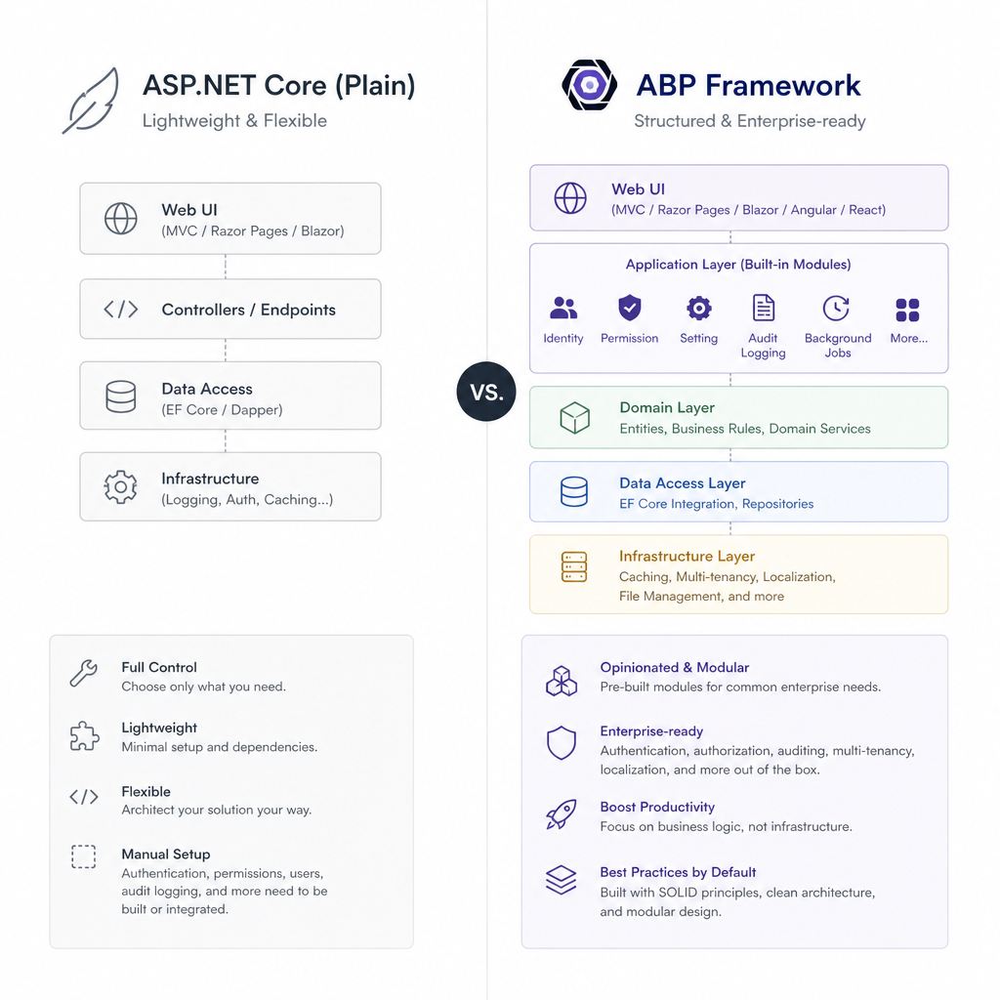

If you search for “ABP,” you can land in very different places: ad blockers, biology terms, medical abbreviations, and the ABP Framework. In this article, we are talking about the ABP Framework from ABP.IO.

For .NET teams building real business applications, ABP matters because it solves a common problem: every serious project ends up needing the same infrastructure pieces, but most teams keep rebuilding them from scratch. Authentication, authorization, audit logging, multi-tenancy, background jobs, modularization, and API conventions are not the part that makes your product unique. They are necessary, but repetitive.

ABP gives you that foundation out of the box, while still letting you build with familiar .NET tools and patterns.

## ABP Framework in simple terms

ABP Framework is an open-source application framework for building modern web applications and APIs on .NET. It is designed especially for enterprise and line-of-business software.

At a high level, ABP combines:

- ASP.NET Core foundations
- Domain-Driven Design principles
- modular application structure
- built-in cross-cutting concerns
- support for monolith and microservice styles
- tooling to speed up development

Instead of starting with a blank ASP.NET Core project and wiring every architectural concern yourself, you start with a structured solution that already includes many production-grade building blocks.

That does not mean ABP hides .NET from you. It sits on top of the .NET ecosystem and tries to reduce boilerplate while keeping the project maintainable.

## Why developers use ABP

Most business applications grow in predictable ways. A simple app becomes a larger system with:

- user and role management
- permissions
- tenant-specific data
- audit trails
- background processing
- integration events
- localization
- reusable modules
- API and UI layers that need to stay organized

You can absolutely build all of that with plain ASP.NET Core. Many teams do. The issue is consistency and speed.

ABP helps by standardizing the way these concerns are implemented. That gives teams a few practical benefits:

### Less infrastructure code

You spend less time writing the same repository wrappers, authorization plumbing, or logging infrastructure in every project.

### Better architectural discipline

ABP encourages a clear separation between layers such as domain, application, infrastructure, and presentation.

### Faster onboarding for teams

When projects follow common ABP conventions, it is easier for developers to understand where code belongs and how features are built.

### Built-in features for enterprise scenarios

Features like multi-tenancy, permission management, and audit logging are not add-ons bolted on later. They are first-class parts of the framework.


## The core architectural ideas behind ABP

ABP is not just a package collection. It pushes a specific style of application design.

### Modularity

ABP applications are built from modules. A module can represent:

- a technical capability
- a business domain area
- a reusable package shared across projects

This makes large applications easier to evolve. Instead of one giant codebase where everything depends on everything else, you can organize features into clear units.

A typical project may have modules such as:

- Identity
n- SaaS or tenant management
- Product catalog
- Ordering
- Reporting

Each module can define its own services, domain logic, permissions, and UI integration.

### Domain-Driven Design support

ABP aligns well with DDD-style application design. You do not have to be a DDD purist to use it, but the framework is clearly built with that mindset.

Common DDD-friendly concepts in ABP include:

- entities and aggregate roots
- repositories
- domain services
- application services
- domain events
- unit of work

This is useful because business applications usually become hard to maintain when business rules are scattered across controllers, services, and database code.

### Layered structure

ABP commonly separates code into layers like:

- Domain: core business rules
- Application: use cases and orchestration
- Infrastructure: persistence and external integrations
- Presentation: HTTP APIs, Razor Pages, Angular, or Blazor UI

That separation helps when the application gets larger or when multiple teams contribute to the same codebase.

### Monolith first, microservice ready

One of ABP’s practical strengths is that it works well for modular monoliths while also supporting microservice-oriented designs.

That matters because many teams do not need microservices on day one, but they do want a structure that will not block future growth.

A modular monolith built with ABP is often a better starting point than jumping directly into distributed complexity.

## Key features that make ABP stand out

ABP includes many features that teams usually build manually or assemble from several libraries.

### Authentication and authorization

ABP provides integrated support for authentication and authorization patterns common in enterprise apps.

You can define permissions centrally and use them across APIs and UI layers. This is more scalable than scattering role checks throughout the codebase.

A typical permission-based approach looks like this:

```csharp
public class ProductAppService : ApplicationService
{
    [Authorize("Catalog.Products.Create")]
    public async Task CreateAsync(CreateProductDto input)
    {
        // business logic
    }
}
```

This keeps security rules explicit and consistent.

### Multi-tenancy

Multi-tenancy is one of the best-known ABP capabilities. If your application serves multiple customers from the same system, tenant awareness becomes a core architectural concern.

ABP can help manage:

- tenant resolution
- tenant-specific data filtering
- tenant administration
- host-level vs tenant-level behavior

Without framework support, multi-tenancy often ends up as a fragile collection of custom conventions.

### Audit logging

ABP can automatically capture useful audit information for operations. In internal business systems, this is often a requirement rather than a nice-to-have.

Typical audit data includes:

- who performed an action
- when it happened
- which entity changed
- which endpoint or service was called

### Background jobs

Not every task should run during the HTTP request. Email sending, report generation, data sync, and heavy processing are good candidates for background execution.

ABP includes background job infrastructure so these scenarios are easier to implement in a standardized way.

### Event bus

ABP supports local and distributed event patterns. This is useful when you want to decouple modules.

For example:

- an order is created
- inventory is updated by another handler
- a notification module sends a message
- a reporting module updates analytics

This keeps modules less tightly coupled than direct service-to-service calls everywhere.

### Data filtering

ABP provides data filtering features for common concerns such as:

- soft delete
- multi-tenancy isolation

This reduces repetitive query logic and lowers the risk of forgetting important filters in some code paths.

### Auto API generation

ABP can expose application services as conventional REST APIs automatically. That can save time, especially in CRUD-heavy business applications.

The benefit is not just less code. It also creates a more consistent API surface across modules.

### Virtual file system and localization

For modular systems, managing embedded resources, views, and localization files can become messy. ABP provides infrastructure to make these concerns more manageable, especially when building reusable modules.


## UI and database options

ABP is flexible about presentation and persistence choices.

### UI options

Depending on your project, you can build with:

- Angular
- Blazor Server
- Blazor WebAssembly
- Razor Pages

This matters because teams do not all work the same way.

- If you want a rich SPA experience, Angular is a strong option.
- If your team prefers staying close to .NET end to end, Blazor can be appealing.
- If you want a more server-driven approach with simple page flows, Razor Pages can be a practical fit.

### Database and persistence options

ABP supports common persistence approaches such as:

- Entity Framework Core
- MongoDB

For many teams, EF Core is the default because it matches typical relational business applications. MongoDB support is useful when the data model or operational requirements fit a document database better.

The important part is that ABP does not force a single persistence story for every application.

## ABP tools that improve developer experience

Frameworks are not only about runtime features. Tooling matters a lot in day-to-day development.

### ABP CLI

ABP CLI helps create solutions, add modules, update packages, and automate common tasks.

A simple example:

```bash
abp new Acme.BookStore -u angular -dbms ef
```

This can generate a ready-to-run solution with a chosen UI and database provider.

### ABP Studio

ABP Studio provides a visual development experience around ABP-based solutions. It can simplify project management, dependency handling, and running complex solutions.

This is especially valuable for teams working with multiple modules or services.

### ABP Suite

ABP Suite helps generate common application structures and CRUD workflows. It is useful when you want to move faster on standard business screens without hand-writing every layer.

Used well, code generation here is less about laziness and more about not wasting senior developer time on repetitive scaffolding.

## What an ABP project looks like in practice

A basic ABP solution often includes several projects organized by responsibility. Exact templates vary, but a common structure includes:

- `.Domain` for core domain logic
- `.Application` for application services and DTOs
- `.EntityFrameworkCore` or another persistence project
- `.HttpApi` for API endpoints
- `.Web` or a UI project for the frontend

This structure can feel larger than a plain ASP.NET Core starter project, but that is the trade-off. ABP optimizes for maintainability in growing systems, not for the smallest possible initial folder tree.

### Example: an application service

In ABP, many use cases are implemented as application services:

```csharp
public class ProductAppService : ApplicationService
{
    private readonly IRepository<Product, Guid> _productRepository;

    public ProductAppService(IRepository<Product, Guid> productRepository)
    {
        _productRepository = productRepository;
    }

    public async Task<ListResultDto<ProductDto>> GetListAsync()
    {
        var products = await _productRepository.GetListAsync();

        return new ListResultDto<ProductDto>(
            ObjectMapper.Map<List<Product>, List<ProductDto>>(products)
        );
    }
}
```

The point is not that this is impossible in plain ASP.NET Core. The point is that ABP gives this structure a consistent home and integrates it with conventions like authorization, validation, unit of work, and API exposure.

## ABP vs plain ASP.NET Core

This is the comparison many .NET developers really care about.

### Plain ASP.NET Core

With plain ASP.NET Core, you get maximum control and minimal framework opinion.

That is ideal when:

- the project is small
- the architecture is simple
- the team wants to design everything itself
- enterprise cross-cutting concerns are limited

But you will likely need to assemble or build:

- permission management
- modularity conventions
- audit logging approach
- multi-tenancy infrastructure
- application service patterns
- reusable scaffolding and project standards

### ABP Framework

With ABP, you accept more conventions in exchange for speed and consistency.

That is ideal when:

- the project is a business application
- multiple cross-cutting concerns are required
- the team wants architectural guardrails
- modular growth is expected
- tenant support is important

The trade-off is straightforward:

- plain ASP.NET Core gives you freedom first
- ABP gives you structure first

Neither is universally better. The better choice depends on what you are building.




## When to use ABP

ABP is a strong fit when:

- you are building internal business software or SaaS platforms
- the app needs users, roles, permissions, and administration features
- multi-tenancy is part of the roadmap
- the codebase is expected to grow over time
- multiple developers or teams will work on the same system
- you want a modular monolith instead of an unstructured monolith
- you want to avoid rewriting the same infrastructure in every project

### Real-world example

Imagine you are building a B2B SaaS platform for managing retail operations.

You will probably need:

- company-specific data isolation
- admin and staff roles
- audit logs for critical actions
- background jobs for imports and notifications
- reusable modules for identity, catalog, billing, and reporting

This is exactly the kind of project where ABP can save serious time.

## When NOT to use ABP

ABP is not the right answer for every .NET project.

Avoid it when:

- you are building a very small API or prototype
- the team is unfamiliar with layered and modular architecture and needs to move fast immediately
- the application has very limited business complexity
- you want an ultra-lightweight codebase with minimal abstractions
- the team strongly prefers custom architecture over framework conventions

### A good counterexample

If you are building a simple internal service with a handful of endpoints and no UI, permissions, tenant model, or long-term complexity, ABP may be overkill.

In that case, plain ASP.NET Core with a clean but lightweight architecture is probably a better choice.

## Things to be careful about

ABP is powerful, but there are trade-offs.

### Learning curve

If terms like aggregate root, application service, unit of work, module system, and event bus are new to your team, ABP can feel heavy at first.

The framework rewards developers who are comfortable with architectural thinking.

### Bigger starting footprint

A generated ABP solution often looks much larger than a basic ASP.NET Core project. Some developers misread that as unnecessary complexity. In reality, it is pre-structured complexity for applications that are expected to grow.

Still, if your app will stay small, that extra structure may not pay off.

### Version upgrades

As with many large frameworks, major version upgrades can require attention. If your project depends heavily on ABP conventions and modules, you should treat upgrades as planned engineering work, not a casual package update.

## A simple getting-started path

If you want to evaluate ABP without overcommitting, keep it practical.

### Step 1: Create a sample solution

Use ABP CLI to create a starter app with your preferred UI stack.

```bash
abp new DemoApp -u blazor -dbms ef
```

### Step 2: Explore the project structure

Look at:

- where domain logic lives
- how application services are organized
- how permissions are defined
- how the data layer is wired

### Step 3: Build one real feature

Do not judge ABP by the template alone. Implement one feature end to end, for example:

- Product management
- Customer management
- Invoice tracking

That will show whether the framework helps or gets in your way.

### Step 4: Evaluate the fit

Ask practical questions:

- Did the conventions reduce boilerplate?
- Did the structure make the feature easier to organize?
- Did the team understand the layers?
- Are the built-in features relevant to your real roadmap?

## Common misunderstanding: ABP is only for huge systems

This is only partly true.

ABP is most valuable in medium and large business applications, but it does not require you to start with microservices or massive infrastructure. In fact, one of the better ways to use ABP is to build a well-structured modular monolith first.

That gives you:

- clear boundaries
- less accidental coupling
- room to grow later
- fewer distributed system headaches early on

For many teams, that is the sweet spot.

## Final take

ABP Framework is best understood as an opinionated productivity framework for serious .NET business applications. It is not trying to replace ASP.NET Core. It builds on top of it and provides a structured way to handle the parts that every enterprise app eventually needs.

If your project is small and short-lived, ABP may feel like too much. If your project needs modularity, permissions, tenant awareness, and long-term maintainability, ABP can be a very practical choice.

The key is to evaluate it based on your actual application shape, not just on whether the generated solution looks bigger than you are used to.

## TL;DR

- ABP Framework is an open-source .NET framework for building modular, enterprise-style web applications.
- It provides built-in support for features like authorization, multi-tenancy, audit logging, background jobs, and modular architecture.
- It is a strong fit for business apps and SaaS platforms, especially when teams want structure and reusable infrastructure.
- It may be too heavy for very small projects or teams that want a minimal, custom-built architecture.
- The best way to evaluate ABP is to build one real feature and see whether its conventions help your team move faster.