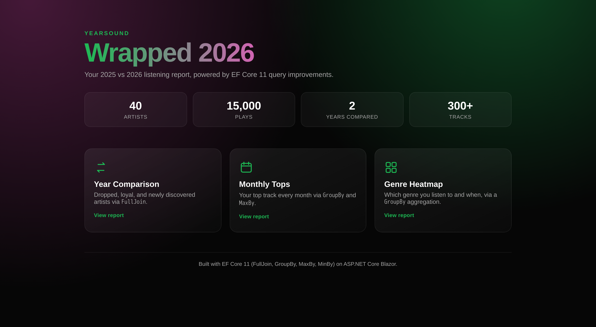
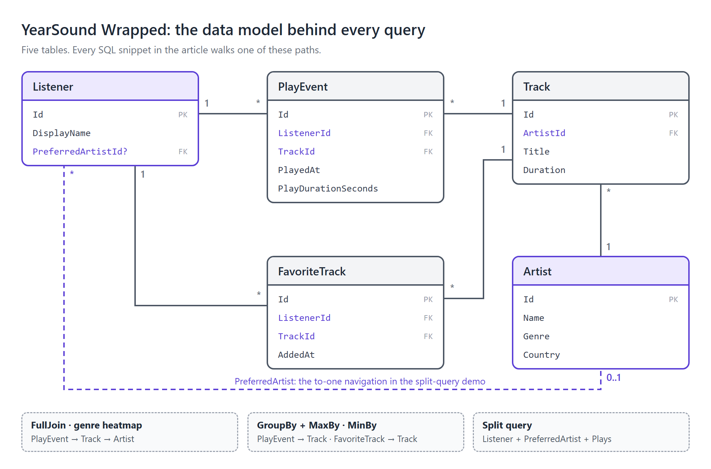
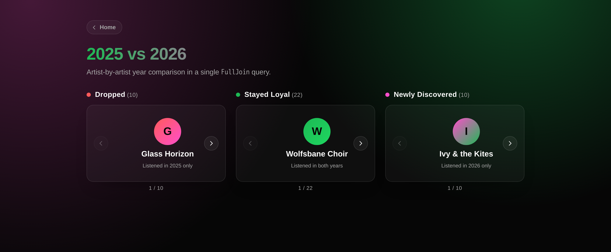
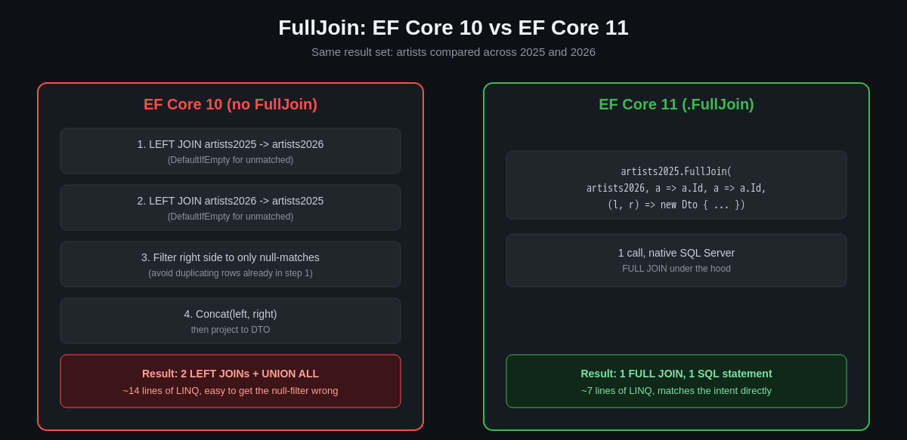
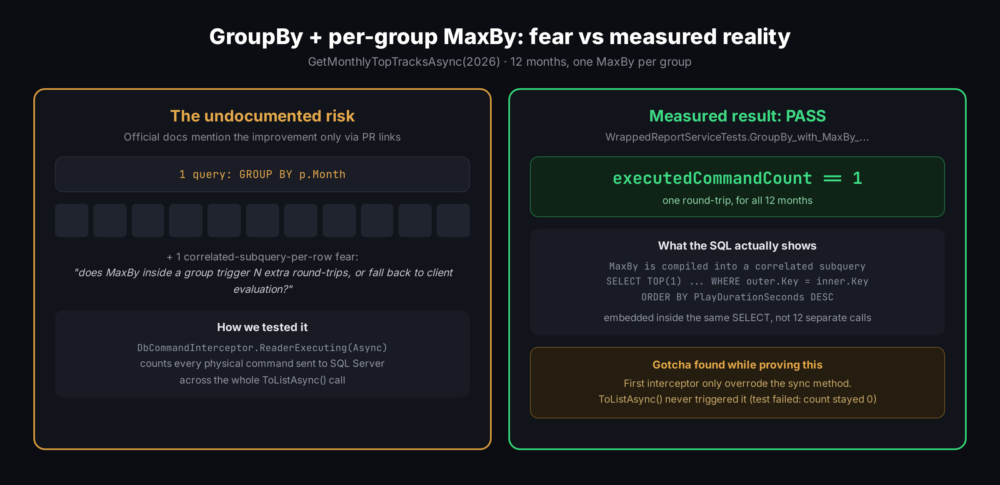
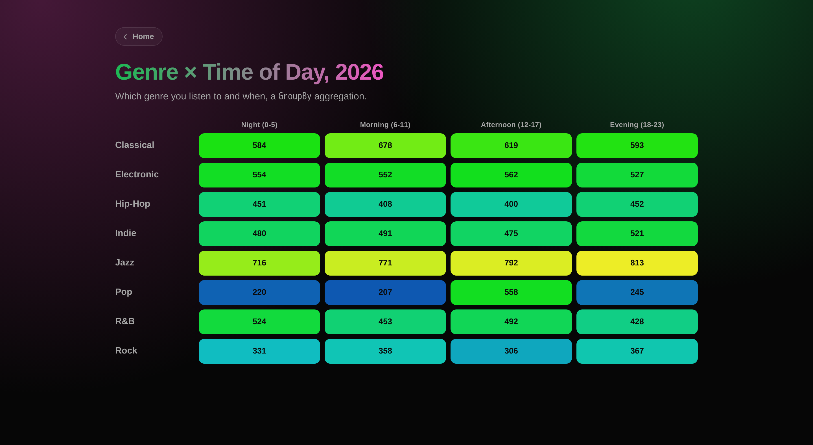
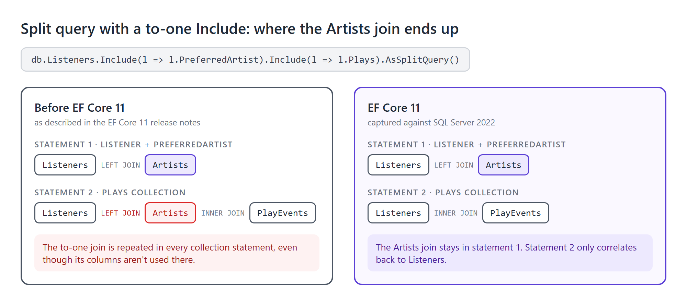
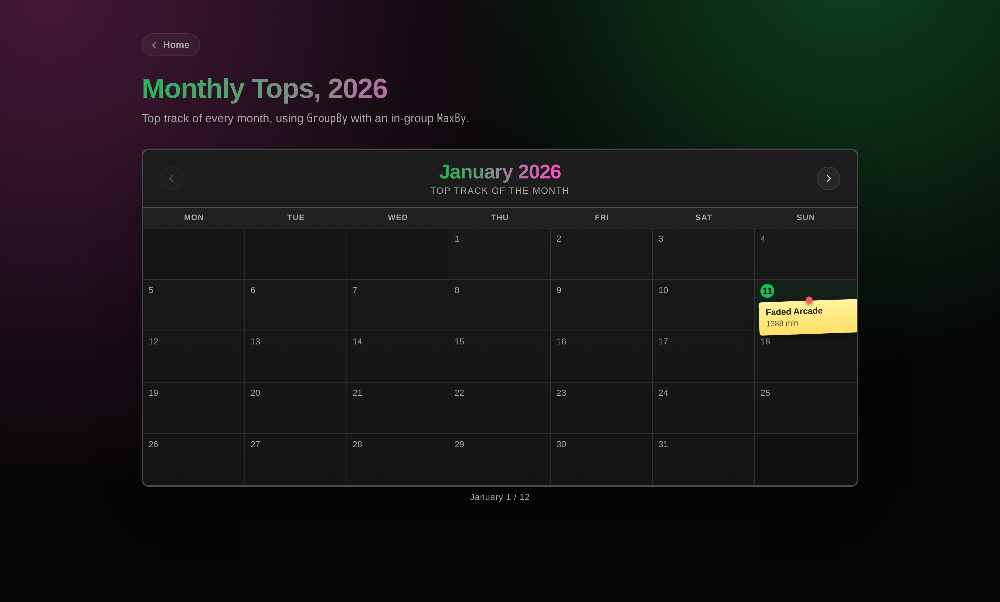

# EF Core 11 Query Improvements, Proven With a Music "Wrapped" Report

Every December, music streaming apps ship the same ritual: a personalized, shareable recap of your year in listening. It's a deceptively simple feature to build a demo around and a surprisingly good one to stress-test a query engine with. A "your year in review" report is, under the hood, nothing but reporting SQL: comparisons across time periods, per-group winners, multi-key aggregations and joins across a handful of related tables. If a new version of your ORM promises to make exactly that kind of query easier or safer to write, the honest way to find out is to build the report and read the SQL it produces instead of taking the changelog's word for it.

That's the premise of this article. EF Core 11 (currently shipping as `11.0.0-rc.1`) ships a handful of LINQ-to-SQL translation improvements that sound small on paper but remove real friction from everyday reporting code: a native `FullJoin`, a smarter translation for `GroupBy` combined with a per-group `MaxBy`/`MinBy`, and a split-query optimization that stops a to-one navigation from leaking a join into collection statements it doesn't belong in. The official release notes describe *that* these exist, mostly by linking to the GitHub PRs that implemented them. They don't always show *what the generated SQL looks like*, nor do they answer the one question every EF developer actually cares about: does this really collapse into one round-trip, or am I about to ship an N+1?

To answer that with evidence instead of trust, we built a small, deliberately "boring" business domain around a subject everyone already understands: an end-of-year music listening report in the style of the year-end listening recaps most streaming apps publish. We called it **YearSound Wrapped**. It's a plain ASP.NET Core Blazor Server app on a Clean Architecture layout (Domain / Application / Infrastructure / Web, no extra framework on top), backed by SQL Server, seeded with 40 artists and roughly 15,000 play events across two years. Every query in this article runs against that real dataset, and every SQL snippet below is a real captured execution (`ToQueryString()` or logged `DbCommand` text) rather than a guess.



The domain is five tables. Every query below walks one of the paths in this diagram, so it's worth a quick look before reading the generated SQL:



## Environment note: this is preview software

Before getting into the queries, a disclosure that matters if you're deciding whether to adopt this today. `Microsoft.EntityFrameworkCore.SqlServer 11.0.0-rc.1.26425.128` targets **`net11.0` only**: there is no `net10.0` fallback in the package's dependency graph. .NET 11 itself hasn't reached GA at the time of writing (expected around November 2026), so the SDK isn't something most machines have installed yet. This one didn't either.

Rather than installing a preview SDK system-wide, the whole build/test loop for this project runs against the `mcr.microsoft.com/dotnet/sdk:11.0` Docker image, with SQL Server 2022 running in a sibling container via `docker-compose.yml`. This kept the host machine on stable .NET 10 for everything else while still giving us a real `net11.0` compiler and runtime to validate against. The one place this bit us: running Testcontainers-based xUnit tests *from inside* that build container is a Docker-in-Docker scenario, and on Docker Desktop for Windows the WSL2 network layer doesn't expose the SQL Server sibling container the way a native Linux Docker host would. The practical fix was to install the RC SDK to an isolated, non-`PATH` folder on the host (`dotnet-install.ps1 -InstallDir ... -NoPath`) and run `dotnet test` from there directly. At that point Testcontainers talks to Docker Desktop with no extra layer in between and the problem disappears entirely.

None of this is a criticism of EF Core 11 itself. It's the normal cost of working against release-candidate tooling, and it's worth budgeting time for if you want to try this before GA.

## Feature 1: `FullJoin` for year-over-year comparison

`FullJoin` also ships in .NET 11 as a plain LINQ operator over in-memory collections. This section is about the EF Core side of it: what the operator turns into when both sources are `IQueryable`s backed by SQL Server.

### The query

The most natural "full outer join" question in a Wrapped-style report is: which artists survived from one year to the next, which ones did you drop and which ones did you discover? That's exactly a full outer join on artist identity between two filtered subsets of `PlayEvent`.

```csharp
public async Task<List<ArtistYearComparisonDto>> GetYearComparisonAsync(CancellationToken ct = default)
{
    var artists2025 = db.PlayEvents
        .Where(p => p.PlayedAt.Year == 2025)
        .Select(p => p.Track.Artist)
        .Distinct();

    var artists2026 = db.PlayEvents
        .Where(p => p.PlayedAt.Year == 2026)
        .Select(p => p.Track.Artist)
        .Distinct();

    return await artists2025
        .FullJoin(
            artists2026,
            a => a.Id,
            a => a.Id,
            (a2025, a2026) => new ArtistYearComparisonDto
            {
                ArtistName = (a2025 ?? a2026)!.Name,
                ListenedIn2025 = a2025 != null,
                ListenedIn2026 = a2026 != null
            })
        .ToListAsync(ct);
}
```

### The generated SQL

That LINQ compiles to a single, native `FULL JOIN` in T-SQL. This is the real captured output against SQL Server 2022:

```sql
SELECT [s].[Id], [s].[Country], [s].[Genre], [s].[Name], [s0].[Id], [s0].[Country], [s0].[Genre], [s0].[Name]
FROM (
    SELECT DISTINCT [a].[Id], [a].[Country], [a].[Genre], [a].[Name]
    FROM [PlayEvents] AS [p]
    INNER JOIN [Tracks] AS [t] ON [p].[TrackId] = [t].[Id]
    INNER JOIN [Artists] AS [a] ON [t].[ArtistId] = [a].[Id]
    WHERE DATEPART(year, [p].[PlayedAt]) = 2025
) AS [s]
FULL JOIN (
    SELECT DISTINCT [a0].[Id], [a0].[Country], [a0].[Genre], [a0].[Name]
    FROM [PlayEvents] AS [p0]
    INNER JOIN [Tracks] AS [t0] ON [p0].[TrackId] = [t0].[Id]
    INNER JOIN [Artists] AS [a0] ON [t0].[ArtistId] = [a0].[Id]
    WHERE DATEPART(year, [p0].[PlayedAt]) = 2026
) AS [s0] ON [s].[Id] = [s0].[Id]
```

### What it replaces

`FullJoin` is new in EF Core 11, but it's worth placing it in context rather than jumping straight to the oldest possible comparison. EF Core 10 already added first-class `LeftJoin` and `RightJoin` LINQ operators (Preview 1 and Preview 2 respectively), which replaced the old `GroupJoin().SelectMany().DefaultIfEmpty()` idiom for one-sided outer joins. So a fair EF Core 10-era "before" for a full outer join is `artists2025.LeftJoin(artists2026, ...).Concat(artists2025.RightJoin(artists2026, ...).Where(...))`, filtering the second half down to the unmatched rows so nothing is double-counted. The `GroupJoin` + `DefaultIfEmpty` + `Concat` version below is the older idiom that predates even EF Core 10's `LeftJoin`/`RightJoin`, shown because it's still the form most existing EF Core 9-and-earlier codebases actually have on disk today:

```csharp
var left = from a2025 in artists2025
           join a2026 in artists2026 on a2025.Id equals a2026.Id into g
           from a2026 in g.DefaultIfEmpty()
           select new { a2025, a2026 };

var right = from a2026 in artists2026
            join a2025 in artists2025 on a2026.Id equals a2025.Id into g
            from a2025 in g.DefaultIfEmpty()
            where a2025 == null
            select new { a2025 = (Artist?)null, a2026 };

var comparison = await left.Concat(right).Select(...).ToListAsync();
```

Either way, `FullJoin` collapses this into one operator that says exactly what you mean, whether the pre-11 alternative in your codebase is the `LeftJoin`/`RightJoin`/`Concat` combination EF Core 10 made possible or the older `GroupJoin` gymnastics above.





In the seeded dataset this returns 10 "dropped" artists, 22 "stayed loyal" and 10 "newly discovered". The UI above renders each bucket as its own single-artist carousel, backed by this one query.

## Feature 2: `GroupBy` with a per-group `MaxBy`: proving it's one query

### The query

This is the feature the official docs are vaguest about, and the one this project spent the most effort verifying. The "top track of each month" report needs, for every month, the single play event with the highest `PlayDurationSeconds`:

```csharp
// Compiles to a single SQL query in EF Core 11 (verified below).
public async Task<List<MonthlyTopTrackDto>> GetMonthlyTopTracksAsync(int year, CancellationToken ct = default)
{
    return await db.PlayEvents
        .Where(p => p.PlayedAt.Year == year)
        .GroupBy(p => p.PlayedAt.Month)
        .Select(g => new MonthlyTopTrackDto
        {
            Month = g.Key,
            TopTrack = g.MaxBy(p => p.PlayDurationSeconds)!.Track.Title,
            TotalMinutes = g.Sum(p => p.PlayDurationSeconds) / 60
        })
        .OrderBy(x => x.Month)
        .ToListAsync(ct);
}
```

### Proving it's a single round-trip

The release notes for this improvement point at GitHub PRs and stop there. There's no worked example of the resulting SQL, and no explicit statement of whether "translates to SQL" also means "translates to *one* SQL statement." It's tempting to say this would have fallen back to client evaluation or produced one query per group on EF Core 10, but that's not how EF Core actually behaves: since EF Core 3.0, a LINQ expression that can't be translated throws an `InvalidOperationException` at query time rather than silently degrading. Since per-group `MaxBy` translation is new in EF Core 11, the honest expectation for this exact shape on EF Core 10 is a translation exception, not a silent N+1. We did not verify this directly against an EF Core 10 build, so treat it as an informed expectation, not a measured result. What *is* measured, and worth closing with a test rather than an assumption, is whether EF Core 11 really executes this as a single round-trip:

```csharp
[Fact]
public async Task GroupBy_with_MaxBy_should_translate_to_single_sql_query()
{
    var executedCommandCount = 0;
    var interceptor = new CountingCommandInterceptor(() => executedCommandCount++);

    var options = new DbContextOptionsBuilder<AppDbContext>()
        .UseSqlServer(fixture.Db.Database.GetConnectionString())
        .AddInterceptors(interceptor)
        .Options;

    await using var countedDb = new AppDbContext(options);
    var service = new WrappedReportService(countedDb);

    await service.GetMonthlyTopTracksAsync(2026);

    executedCommandCount.Should().Be(1);
}
```

`CountingCommandInterceptor` is a `DbCommandInterceptor` that increments a counter every time SQL Server actually executes a command. Run against the real container, **this test passes**: `executedCommandCount == 1` for all twelve months, in a single round-trip. The captured SQL shows exactly how: `MaxBy` compiles into a correlated subquery embedded in the same `SELECT`, not a join and not a separate statement per group.

```sql
SELECT [p0].[Key] AS [Month], (
    SELECT TOP(1) [t].[Title]
    FROM (
        SELECT [p2].[PlayDurationSeconds], [p2].[TrackId], DATEPART(month, [p2].[PlayedAt]) AS [Key]
        FROM [PlayEvents] AS [p2]
        WHERE DATEPART(year, [p2].[PlayedAt]) = 2026
    ) AS [p1]
    INNER JOIN [Tracks] AS [t] ON [p1].[TrackId] = [t].[Id]
    WHERE [p0].[Key] = [p1].[Key] OR ([p0].[Key] IS NULL AND [p1].[Key] IS NULL)
    ORDER BY [p1].[PlayDurationSeconds] DESC) AS [TopTrack],
    ISNULL(SUM([p0].[PlayDurationSeconds]), 0) / 60 AS [TotalMinutes]
FROM (
    SELECT [p].[PlayDurationSeconds], DATEPART(month, [p].[PlayedAt]) AS [Key]
    FROM [PlayEvents] AS [p]
    WHERE DATEPART(year, [p].[PlayedAt]) = 2026
) AS [p0]
GROUP BY [p0].[Key]
ORDER BY [p0].[Key]
```



One nuance worth calling out explicitly, since it's the kind of thing "translates to a single query" can obscure: this is *one SQL statement*, not *one join*. EF Core 11 is choosing a correlated `TOP(1) ... ORDER BY` subquery per group key, evaluated inline. That's the right trade-off here (a join would have required deduplicating to one row per group afterward anyway), but it's the kind of detail you only get by reading the generated SQL rather than by reading "compiles to SQL" in a changelog.

### A gotcha while writing the interceptor test

The first version of `CountingCommandInterceptor` only overrode the synchronous `ReaderExecuting` method. Since `GetMonthlyTopTracksAsync` calls `ToListAsync()`, EF Core invokes the *asynchronous* `ReaderExecutingAsync` hook instead, and the counter never incremented. That made the test **fail** with `executedCommandCount` stuck at `0` instead of the expected `1`, and the failure was easy to misread as "EF Core is issuing zero queries" or, worse, as evidence that the `GroupBy` + `MaxBy` translation itself was broken. The real cause had nothing to do with EF Core's query translation: the interceptor simply wasn't watching the code path this query actually took. The fix is to override both hooks:

```csharp
private class CountingCommandInterceptor(Action onExecuting) : DbCommandInterceptor
{
    public override InterceptionResult<DbDataReader> ReaderExecuting(
        DbCommand command, CommandEventData eventData, InterceptionResult<DbDataReader> result)
    {
        onExecuting();
        return base.ReaderExecuting(command, eventData, result);
    }

    public override ValueTask<InterceptionResult<DbDataReader>> ReaderExecutingAsync(
        DbCommand command, CommandEventData eventData, InterceptionResult<DbDataReader> result,
        CancellationToken cancellationToken = default)
    {
        onExecuting();
        return base.ReaderExecutingAsync(command, eventData, result, cancellationToken);
    }
}
```

If you're writing your own command-counting interceptor for a codebase that mixes sync and async EF Core calls (most do), override both methods from the start. Otherwise a real translation problem and "my interceptor is watching the wrong method" look identical from the test output, and it's easy to spend time debugging the wrong layer.

## Feature 3: `GroupBy` for realistic multi-key reporting

### The query

Not every `GroupBy` question is about picking a winner per group. Sometimes it's plain aggregation for a report, grouped by more than one key. "Which genre do you listen to and at what time of day?" groups by a composite key and sums minutes:

```csharp
public async Task<List<GenreTimeOfDayDto>> GetGenreByTimeOfDayAsync(int year, CancellationToken ct = default)
{
    return await db.PlayEvents
        .Where(p => p.PlayedAt.Year == year)
        .GroupBy(p => new { p.Track.Artist.Genre, TimeOfDay = p.PlayedAt.Hour / 6 })
        .Select(g => new GenreTimeOfDayDto
        {
            Genre = g.Key.Genre,
            TimeOfDay = g.Key.TimeOfDay,
            TotalMinutes = g.Sum(p => p.PlayDurationSeconds) / 60
        })
        .ToListAsync(ct);
}
```

### The generated SQL

This one is unremarkable in the best way. It's a plain `GROUP BY` with two keys, no subquery tricks needed:

```sql
SELECT [s].[Genre], [s].[TimeOfDay], ISNULL(SUM([s].[PlayDurationSeconds]), 0) / 60 AS [TotalMinutes]
FROM (
    SELECT [p].[PlayDurationSeconds], [a].[Genre], DATEPART(hour, [p].[PlayedAt]) / 6 AS [TimeOfDay]
    FROM [PlayEvents] AS [p]
    INNER JOIN [Tracks] AS [t] ON [p].[TrackId] = [t].[Id]
    INNER JOIN [Artists] AS [a] ON [t].[ArtistId] = [a].[Id]
    WHERE DATEPART(year, [p].[PlayedAt]) = 2026
) AS [s]
GROUP BY [s].[Genre], [s].[TimeOfDay]
```

It earns its place in this article because it's the shape most reporting dashboards actually need. It's also a good reminder that not every EF Core 11 improvement is about exotic edge cases. Some of the value is that ordinary multi-key `GroupBy` reporting keeps compiling cleanly to SQL as the projection gets more complex.



## Feature 4: `MaxBy`/`MinBy` outside of `GroupBy`

### The queries

The two aggregate methods also work standalone, directly against an `IQueryable<T>`, which the official docs demonstrate with `MaxByAsync(b => b.Posts.Count())`. Here's the same shape applied to two different questions: the most-played artist overall and a "hidden gem," a track that's in favorites but barely played.

```csharp
public async Task<string?> GetTopArtistNameAsync(CancellationToken ct = default)
{
    var topArtist = await db.Artists
        .MaxByAsync(a => a.Tracks.SelectMany(t => t.Plays).Count(), ct);
    return topArtist?.Name;
}

public async Task<string?> GetHiddenGemTrackTitleAsync(CancellationToken ct = default)
{
    var hiddenGem = await db.FavoriteTracks
        .Select(f => f.Track)
        .MinByAsync(t => t.Plays.Count(), ct);
    return hiddenGem?.Title;
}
```

### The generated SQL

Both compile to a `TOP(1) ... ORDER BY` query with the comparison key computed as a correlated subquery. No client evaluation is involved:

```sql
DECLARE @p int = 1;
SELECT TOP(@p) [a].[Id], [a].[Country], [a].[Genre], [a].[Name]
FROM [Artists] AS [a]
ORDER BY (
    SELECT COUNT(*)
    FROM [Tracks] AS [t]
    INNER JOIN [PlayEvents] AS [p] ON [t].[Id] = [p].[TrackId]
    WHERE [a].[Id] = [t].[ArtistId]) DESC
```

### Edge case: empty sequences

One behavior the documentation doesn't mention anywhere: what happens when you call `MinByAsync` on an empty sequence? In LINQ-to-Objects, `MinBy`/`MaxBy` return `default` for an empty source rather than throwing, but it's worth confirming EF Core's *SQL Server translation* matches that, since throwing `InvalidOperationException` on an empty favorites list would be a nasty surprise in production. This test runs against the real Testcontainers SQL Server fixture, not an in-memory provider, so it's actually exercising the translated query rather than LINQ-to-Objects semantics on a fake store:

```csharp
[Fact]
public async Task MinBy_on_empty_favorites_should_return_null_not_throw()
{
    // Runs against the real SQL Server fixture. Filtering on a ListenerId that doesn't
    // exist empties the FavoriteTracks result set after translation to SQL, which is what
    // actually exercises MinByAsync's empty-sequence behavior end to end.
    var act = async () => await fixture.Db.FavoriteTracks
        .Where(f => f.ListenerId == Guid.NewGuid())
        .Select(f => f.Track)
        .MinByAsync(t => t.Plays.Count());

    var result = await act.Should().NotThrowAsync();
    result.Subject.Should().BeNull();
}
```

It does match: the query returns `null`, no exception. This passed on the first try, but it's the kind of edge case worth writing a test for rather than assuming. Undocumented behavior is exactly where LINQ-to-Objects and LINQ-to-Entities most commonly diverge, and only a test against a real relational provider actually proves the translated version agrees.

## Bonus: keeping a to-one join out of split-query collection statements

### The query

The last improvement covered here is smaller, and it's easy to demonstrate incorrectly if the to-one navigation in question isn't actually requested. The improvement only shows up when you `Include()` a to-one reference navigation *alongside* a collection navigation under `AsSplitQuery()`: EF Core 11 keeps that to-one join confined to the first statement instead of also dragging it into the later collection statements where it doesn't belong.

```csharp
public async Task<ListenerProfileDto?> GetListenerProfileAsync(CancellationToken ct = default)
{
    var listener = await db.Listeners
        .Include(l => l.PreferredArtist)
        .Include(l => l.Plays)
        .AsSplitQuery()
        .FirstOrDefaultAsync(ct);

    return listener is null
        ? null
        : new ListenerProfileDto
        {
            DisplayName = listener.DisplayName,
            PreferredArtistName = listener.PreferredArtist?.Name,
            TotalPlays = listener.Plays.Count
        };
}
```

### The generated SQL

`PreferredArtist` is a to-one reference navigation on `Listener`, and it's explicitly `Include()`'d here. That matters: a navigation nobody asks for never generates a join in any EF Core version, so leaving out the `Include()` would demonstrate nothing version-specific. With it included, the split query produces two statements, captured live against the real database:

```sql
-- Statement 1: Listener + PreferredArtist. The to-one join lives here, where it belongs.
SELECT TOP(1) [l].[Id], [l].[DisplayName], [l].[PreferredArtistId], [a].[Id], [a].[Country], [a].[Genre], [a].[Name]
FROM [Listeners] AS [l]
LEFT JOIN [Artists] AS [a] ON [l].[PreferredArtistId] = [a].[Id]
ORDER BY [l].[Id]

-- Statement 2: the Plays collection. PreferredArtist / Artists does not appear at all,
-- even though it's Include()'d above. Only the correlation back to the outer Listener
-- (via the [s] subquery) is present.
SELECT [p].[Id], [p].[ListenerId], [p].[PlayDurationSeconds], [p].[PlayedAt], [p].[TrackId], [s].[Id]
FROM (
    SELECT TOP(1) [l].[Id]
    FROM [Listeners] AS [l]
    ORDER BY [l].[Id]
) AS [s]
INNER JOIN [PlayEvents] AS [p] ON [s].[Id] = [p].[ListenerId]
ORDER BY [s].[Id]
```



That's the actual improvement: the second statement stays lean. It joins only what it needs to correlate back to the outer query, and doesn't re-join `Artists` just because a sibling to-one navigation was requested for the first statement. Without this, a split query with several `Include()`s can accumulate the same unrelated joins across every one of its statements, which is easy to miss in a query plan review until the join count starts climbing for no obvious reason.

## Seeing it as a UI, not just a query plan

All six queries above back a small Blazor Server app. The two screens most worth a look:



The monthly-tops calendar renders one month at a time with a real day grid (`DateTime.DaysInMonth` and `DayOfWeek` compute the correct weekday alignment) and pins that month's top track to a day cell like a sticky note. It's a small UI touch that makes the `GroupBy` + `MaxBy` result legible at a glance instead of just another table row.

The year-comparison screen renders each of the three buckets (dropped / stayed loyal / newly discovered) as its own single-item carousel driven entirely by Blazor component state and a CSS `transform: translateX` transition. There's no JavaScript interop, just a `FullJoin` result split into three buckets.

## Lessons learned

- **Preview packages mean preview constraints.** `net11.0`-only TFMs, a Docker-based toolchain and a Docker-in-Docker networking dead end on Windows were all direct consequences of adopting an RC package before the SDK it depends on has reached GA. None of it is a defect in EF Core 11; it's the cost of going first.
- **"Compiles to SQL" and "compiles to one SQL statement" are different claims.** The official docs make the first claim about `GroupBy` + `MaxBy`; only an interceptor-based test proves the second. Don't take single-round-trip behavior on faith for a translation this new.
- **Count both sync and async interceptor hooks.** A `DbCommandInterceptor` that only overrides `ReaderExecuting` will silently under-count any workload that calls `...Async()` methods, which is most modern EF Core code, and the resulting test failure can look like a query-translation bug instead of an interceptor bug.
- **An improvement demo has to actually exercise the thing it claims to demonstrate.** The split-query example is only meaningful because `PreferredArtist` is actually `Include()`'d; a navigation nobody requests generates no join in any EF Core version, so without the `Include()` the "improvement" would be an empty comparison.
- **Undocumented edge cases are worth a dedicated test against the real provider, not the closest convenient one.** The empty-sequence behavior of `MinByAsync` was confirmed against the actual SQL Server translation, because an in-memory provider only proves LINQ-to-Objects-style semantics, not what EF Core 11 sends to SQL Server.

## Adoption checklist

Before moving reporting code onto EF Core 11:

- [ ] **Target framework.** EF Core 11 packages target `net11.0` only, so the project has to move to .NET 11 first.
- [ ] **Release stage.** EF Core 11 is currently a release candidate. Decide whether that's acceptable for your deployment, or wait for GA in November 2026.
- [ ] **`FullJoin` candidates.** Search for `GroupJoin` + `DefaultIfEmpty` + `Concat`, or `LeftJoin` + `RightJoin` + `Concat` combinations. Each one is a candidate for a single `FullJoin`.
- [ ] **Per-group winners.** Look for "top item per group" queries currently done in memory or with raw SQL. `GroupBy` + `MaxBy`/`MinBy` may now translate them.
- [ ] **Round-trip tests.** For queries where "one round-trip" matters, add a command-counting interceptor test, and override both the sync and async hooks.
- [ ] **Empty sequences.** If a `MinBy`/`MaxBy` query can run over an empty set, test that case against the real provider.
- [ ] **Split queries.** If you use `AsSplitQuery()` with reference `Include()`s, re-capture the generated SQL after upgrading so you can see the joins that disappeared.
- [ ] **Performance.** Benchmark against your own data before claiming a speed-up. This article measures correctness, not speed.

## Conclusion

None of these features is dramatic on its own. `FullJoin` replaces a few lines of `LeftJoin`/`RightJoin`/`Concat` plumbing, `GroupBy` + `MaxBy` turns a query EF Core couldn't translate before into a single round-trip, and the split-query change quietly drops a join you never needed. Together, though, they make the kind of reporting code every business application eventually needs easier to write and easier to trust.

The bigger takeaway is about *how* to evaluate a release like this. A changelog tells you that a translation exists; only the generated SQL and a test that counts round-trips tell you what it actually does. This article deliberately focuses on correctness rather than speed: it shows what EF Core 11 sends to SQL Server, not how much faster that is. If performance is your reason to upgrade, benchmark against your own data before deciding. If your reason is writing reporting queries that say what you mean and compile to the SQL you would have written by hand, EF Core 11 already delivers that in its release candidate.

## References

- [What's new in EF Core 11](https://learn.microsoft.com/en-us/ef/core/what-is-new/ef-core-11.0/whatsnew): [`FullJoin` support](https://learn.microsoft.com/en-us/ef/core/what-is-new/ef-core-11.0/whatsnew#support-for-the-new-net-11-fulljoin-operator), [`GroupBy` enhancements](https://learn.microsoft.com/en-us/ef/core/what-is-new/ef-core-11.0/whatsnew#groupby-enhancements), [`MaxBy` and `MinBy`](https://learn.microsoft.com/en-us/ef/core/what-is-new/ef-core-11.0/whatsnew#maxby-and-minby), [better SQL for to-one joins](https://learn.microsoft.com/en-us/ef/core/what-is-new/ef-core-11.0/whatsnew#better-sql-for-to-one-joins)
- [What's new in EF Core 10: `LeftJoin` and `RightJoin`](https://learn.microsoft.com/en-us/ef/core/what-is-new/ef-core-10.0/whatsnew#support-for-the-net-10-leftjoin-and-rightjoin-operators)
- [Complex query operators](https://learn.microsoft.com/en-us/ef/core/querying/complex-query-operators) (joins and `GroupBy` translation)
- [Single vs. split queries](https://learn.microsoft.com/en-us/ef/core/querying/single-split-queries)
- [Client vs. server evaluation](https://learn.microsoft.com/en-us/ef/core/querying/client-eval) (why untranslatable queries throw instead of running on the client)
- [Interceptors](https://learn.microsoft.com/en-us/ef/core/logging-events-diagnostics/interceptors) (`DbCommandInterceptor`)
- [Testcontainers for .NET](https://dotnet.testcontainers.org/)
- [Download .NET 11](https://dotnet.microsoft.com/en-us/download/dotnet/11.0)
