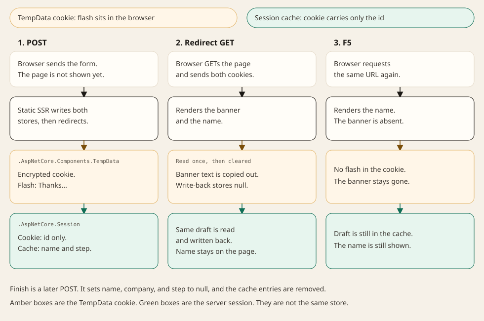

# State Without a Circuit: TempData and Session in Blazor .NET 11 Static SSR

> **.NET 11 RC1.** The attributes and defaults in this article come from the ASP.NET Core 11 release notes and the Blazor server state-management docs: `[SupplyParameterFromTempData]`, `[SupplyParameterFromSession]`, cookie TempData, and cookie-backed session. They apply to **static server-side rendering only**. Interactive Server and WebAssembly leave the property at its CLR default. The browser matrix at the end is the contract to check on the sample, [StaticSsrState](https://github.com/sumeyyeKurtulus/StaticSsrState). It is not a record of a browser run.

A static SSR page is one HTTP request. The component is created, rendered, and thrown away. Nothing you stored in a field is there for the next click. That is a good trade when you do not want a SignalR circuit per user, and it is a problem the moment a form needs to say "Saved." after a redirect, or a three-step wizard needs to remember step one.

.NET 11 gives Blazor static SSR the two stores MVC and Razor Pages have used for years, wired as component parameters:

- `[SupplyParameterFromTempData]` — read-once flash state. The Post-Redirect-Get message.
- `[SupplyParameterFromSession]` — state that must survive several requests. The wizard draft or the cart.

Both are declarative in the same way as `[SupplyParameterFromQuery]` and `[SupplyParameterFromForm]`. You stop injecting `IHttpContextAccessor` and hand-serializing a session key for every property.

Six rules cover the choice. The sections after them are the code, the limits, and how to confirm each rule in the browser.

- **TempData is the flash.** It is written on the POST and read on the next GET. The attribute's first read uses `ITempData.Get()`, which schedules deletion. Copy the value into a display field and clear the parameter before the request ends, because the framework writes the property back at the end of the request.
- **Session is the multi-request store.** Values stay until the idle timeout (20 minutes by default; each access resets it), until you assign `null`, or until the session cookie disappears.
- **Static SSR only.** On an interactive render mode the same property is never supplied.
- **Different boxes.** TempData's default store is an encrypted cookie, `.AspNetCore.Components.TempData`. Session puts the payload in a server-side cache and sends only `.AspNetCore.Session`.
- **The URL is still the shareable store.** A copied link does not carry TempData or Session. Bookmarkable view state belongs in the query string.
- **One provider for TempData.** The cookie provider is the default. Switching to session storage removes the cookie size cap and requires session affinity. Cookie-backed TempData cannot be saved after the response starts streaming.

## Where this state should live

Pick the store from the lifetime you actually need. The rest of the article is the two middle rows.

| Store                                                | Lifetime                                   | Shareable link               | Survives F5                      | New tab                  | Static SSR                          | What you operate                                                              |
| ---------------------------------------------------- | ------------------------------------------ | ---------------------------- | -------------------------------- | ------------------------ | ----------------------------------- | ----------------------------------------------------------------------------- |
| TempData                                             | Next read, then removed                    | No                           | No, once the GET has consumed it | No                       | Yes                                 | Encrypted cookie, or the session store if you switch provider                 |
| Session                                              | Idle timeout, reset on access              | No                           | Yes                              | Yes, same session cookie | Yes                                 | Server cache plus a session cookie; session affinity required                  |
| URL query                                            | As long as the URL is kept                 | Yes                          | Yes                              | Yes                      | Yes                                 | Nothing on the server                                                         |
| Database                                             | Until you delete the row                   | Only if the id is in the URL | Yes                              | Yes                      | Yes                                 | Your database                                                                 |
| Interactive Server, WASM, `PersistentComponentState` | Circuit, prerender handoff, or the browser | No                           | Depends on the mode              | No                       | The page no longer has to be static | A circuit or a client runtime                                                 |

A success banner after save is TempData. A wizard or a cart that must not show up in the address bar is Session. A filtered list someone should send to a colleague is the query string and that is the subject of [QuickGrid in .NET 11: Sorting and Paging That Live in the URL](https://abp.io/community/articles/quickgrid-in-.net-11-sorting-and-paging-that-live-in-the-url-hypzmikw#gsc.tab=0). An order that must still exist after the browser is closed is a database row.



## What a static SSR request actually keeps

Blazor Server holds component fields in a SignalR circuit. WebAssembly holds them in the browser. Static SSR holds them nowhere. The next request starts from the parameters the framework can rebuild: route, query, form, TempData, session.

Circuit persistence, `[PersistentState]`, and auto-pause are interactive-server features. They resume a circuit. They do not implement Post-Redirect-Get on a page that has no circuit. The section [When static SSR is the wrong tool](#when-static-ssr-is-the-wrong-tool) comes back to them.

### TempData

TempData is the bag you fill on the POST so the redirect target can show a message once. `AddRazorComponents()` registers it. You do not call `AddSession` for the default cookie provider.

The full API is a cascading `ITempData`:

```csharp
[CascadingParameter]
public ITempData? TempData { get; set; }
```

`Get` reads a key and schedules it for deletion. `Peek` reads it and leaves it. `Keep()` retains every key for the following request. `Keep(key)` retains one. Keys are case-insensitive. Those methods are how you keep a message alive across an intermediate redirect. The attribute does not expose them — the TempData attribute work left `Peek` and `Keep` on `ITempData` on purpose.

For a single value, `[SupplyParameterFromTempData]` is the shortcut. The key defaults to the property name. Set `Name` when the key should be stable across a rename, or when two properties would otherwise collide:

```csharp
[SupplyParameterFromTempData]
public string? Message { get; set; }

[SupplyParameterFromTempData(Name = "flash_message")]
public string? FlashMessage { get; set; }
```

Two components in the same render tree cannot register the same key. The supplier throws `InvalidOperationException`. Mixing `TempData["flash_message"]` and the attribute for that same key in one request is unsupported; the value that wins depends on order.

The first time the attribute reads a key it calls `Get()`, so the key is marked for deletion. Later reads in the same request return the property's current value, so your submit handler can overwrite it. At the end of the request the supplier writes every bound property back into TempData. That write-back is why a flash you leave sitting in the property can be saved again. The feedback sample below copies the string into a display field and assigns `null` before the response completes.

The supported types are a closed list: `string`, `int`, `bool`, `Guid`, `DateTime`, int-backed enums, the nullable forms of those, `T[]`, `List<T>`, `HashSet<T>`, `Collection<T>`, `Dictionary<string, T>`, and `object[]`. A custom class is not on that list.

A read-side mismatch is the case that becomes `null`. If the stored value's type is not assignable to the property, or deserialization fails, the attribute supplies `null` and writes a log entry. An unsupported non-null value fails later, when the response is persisted, after the component has rendered.

The default provider stores that JSON in an encrypted cookie. Data Protection does the encryption. The docs' defaults are:

| Setting      | Default                           |
| ------------ | --------------------------------- |
| Name         | `.AspNetCore.Components.TempData` |
| HttpOnly     | `true`                            |
| SameSite     | `Lax`                             |
| SecurePolicy | `SameAsRequest`                   |

On a production HTTPS site, set `CookieSecurePolicy.Always`. Override the cookie on the Razor components options:

```csharp
builder.Services.AddRazorComponents(options =>
{
    options.TempDataCookie.Name = ".AspNetCore.Components.TempData";
    options.TempDataCookie.HttpOnly = true;
    options.TempDataCookie.SameSite = SameSiteMode.Lax;
    options.TempDataCookie.SecurePolicy = CookieSecurePolicy.Always;
});
```

Browsers limit a single cookie to about 4 KB. The provider chunks large values with `ChunkingCookieManager`. Past that, call `AddSessionStorageTempDataValueProvider()`. Only one provider is active. Session-backed TempData then needs `AddSession`, `UseSession`, and session affinity. Cookie-backed TempData cannot be saved after the response has started streaming. A page that streams and still needs TempData has to use the session provider.

### Session

Session is the store you read on several requests and never want in the query string: the onboarding draft, the cart id, the step index. Unlike TempData, a read does not delete it.

It is not registered by `AddRazorComponents()` alone:

```csharp
builder.Services.AddDistributedMemoryCache();

builder.Services.AddSession(options =>
{
    options.IdleTimeout = TimeSpan.FromMinutes(20);
    options.Cookie.HttpOnly = true;
    options.Cookie.IsEssential = true;
    options.Cookie.SameSite = SameSiteMode.Lax;
});

builder.Services.AddRazorComponents();

var app = builder.Build();

app.UseSession();
app.MapRazorComponents<App>();
```

`UseSession()` has to run before the component endpoint. `UseAntiforgery()` is optional in .NET 11 and is no longer in the Blazor template. The defaults you are overriding, or accepting, are:

| Setting      | Default                          |
| ------------ | -------------------------------- |
| Cookie name  | `.AspNetCore.Session`            |
| Path         | `/`                              |
| HttpOnly     | `true`                           |
| SameSite     | `Lax`                            |
| SecurePolicy | `None`                           |
| IsEssential  | `false`                          |
| IdleTimeout  | 20 minutes, reset on each access |
| IOTimeout    | 1 minute                         |

`IsEssential` defaults to `false`, so cookie-consent middleware can drop the cookie and the wizard silently restarts. The sample sets it to `true` because the draft is required for the flow. Idle timeout applies to the session contents, not to the cookie's `Expires`. `SecurePolicy` defaults to `None` because apps often mix HTTP and HTTPS in development, and some browsers refuse to overwrite a `Secure` cookie from an insecure URL. That rationale belongs to this cookie, not to TempData.

`[SupplyParameterFromSession]` reads the key on the way in and writes the property back before the response is sent. Allowed values are the same closed list as TempData: `string`, `int`, `bool`, `Guid`, `DateTime`, int-backed enums, their nullables, `T[]`, `List<T>`, `HashSet<T>`, `Collection<T>`, `Dictionary<string, T>`, and `object[]`. A custom class is not on that list. `[SupplyParameterFromSession] OnboardingDraft? Draft` threw `InvalidOperationException`: the type is not supported for session storage. The sample stores `string?` and `int?` instead. A duplicate key across components throws `InvalidOperationException`. Keys are compared case-insensitively.

```csharp
[SupplyParameterFromSession(Name = "onboarding_name")]
public string? Name { get; set; }

[SupplyParameterFromSession(Name = "onboarding_step")]
public int? Step { get; set; }
```

`AddDistributedMemoryCache()` is process-local. Session requires session affinity in a load-balanced deployment, including when the cache is in memory. A second instance does not see the first instance's memory.

Streaming SSR has two separate rules. If the page subscribes with `[SupplyParameterFromSession]`, or the session-storage TempData provider is active, the session cookie is issued before streaming starts, even when the handler writes nothing. Pages that do not touch session are unchanged. Cookie-backed TempData cannot be saved once streaming has started, so a streaming page that needs TempData uses `AddSessionStorageTempDataValueProvider()` and takes on the same affinity requirement.

### What the attributes leave alone

During interactive SSR and interactive client rendering the value is not supplied. The property stays at its default: `null` for `string?`, `null` for `int?`. A page marked `@rendermode InteractiveServer` that expects the wizard to appear will render the empty state.

They also do not replace antiforgery. `EditForm` with a `FormName` emits the token. A plain `<form method="post">` needs `<AntiforgeryToken />` and `@formname`. Leave validation on. Calling `UseAntiforgery()` is optional in .NET 11, and the Blazor template no longer includes it.

## The sample

Create a Blazor web app with no interactivity:

```bash
dotnet new blazor -n StaticSsrState --interactivity None --empty
cd StaticSsrState
dotnet run
```

The sample is [StaticSsrState](https://github.com/sumeyyeKurtulus/StaticSsrState). The matrix in [Behavior to check on the sample](#behavior-to-check-on-the-sample) is the contract from this article. It is not a filled-in record of a browser run.

Suggested layout:

- `Program.cs` — session registration and TempData cookie policy
- `Components/Pages/Feedback.razor` — PRG flash
- `Components/Pages/Onboarding.razor` — three steps and a clear

### Service registration

Add the session services next to `AddRazorComponents`, and call `UseSession()` before the endpoint. Leave the rest of the generated pipeline in place.

```csharp
builder.Services.AddDistributedMemoryCache();

builder.Services.AddSession(options =>
{
    options.IdleTimeout = TimeSpan.FromMinutes(20);
    options.Cookie.HttpOnly = true;
    options.Cookie.IsEssential = true;
    options.Cookie.SameSite = SameSiteMode.Lax;
    options.Cookie.SecurePolicy = CookieSecurePolicy.SameAsRequest;
});

builder.Services.AddRazorComponents(options =>
{
    options.TempDataCookie.HttpOnly = true;
    options.TempDataCookie.SameSite = SameSiteMode.Lax;
    options.TempDataCookie.SecurePolicy = CookieSecurePolicy.SameAsRequest;
});
```

```csharp
app.UseSession();
app.MapRazorComponents<App>();
```

The sample does not call `AddInteractiveServerComponents()`. The two pages below are static on purpose. `UseAntiforgery()` is left out, matching the .NET 11 template. TempData's `SameSite` and `SecurePolicy` in this block are the defaults (`Lax`, `SameAsRequest`). The session cookie's `SecurePolicy` default is `None`; the sample sets `SameAsRequest` instead.

### Post-Redirect-Get flash message

`Feedback.razor` posts a comment, stores a one-line result in TempData, and redirects to itself. Enhanced form handling is off unless the form sets `Enhance` or `data-enhance`. `Enhance="false"` changes nothing, so these forms omit it. The POST is a full document post. `NavigateTo(..., forceLoad: true)` loads the redirect target as a full document.

The handler writes `FlashMessage`. `OnInitialized` copies it into `_notice` and clears the parameter so the end-of-request write-back does not save the banner for the refresh after that.

```razor
@page "/feedback"
@using System.ComponentModel.DataAnnotations
@inject NavigationManager Navigation

<PageTitle>Feedback</PageTitle>

@if (!string.IsNullOrEmpty(_notice))
{
    <p role="status">@_notice</p>
}

<EditForm Model="Input" FormName="feedback" OnValidSubmit="Submit">
    <DataAnnotationsValidator />
    <div>
        <label>
            Comment
            <InputText @bind-Value="Input.Comment" />
        </label>
        <ValidationMessage For="() => Input.Comment" />
    </div>
    <button type="submit">Send</button>
</EditForm>

@code {
    private string? _notice;

    [SupplyParameterFromTempData(Name = "flash_message")]
    public string? FlashMessage { get; set; }

    [SupplyParameterFromForm]
    public FeedbackInput Input { get; set; } = new();

    protected override void OnInitialized()
    {
        _notice = FlashMessage;
        FlashMessage = null;
    }

    private void Submit()
    {
        FlashMessage = $"Thanks. We received \"{Input.Comment}\".";
        Navigation.NavigateTo("/feedback", forceLoad: true);
    }

    public sealed class FeedbackInput
    {
        [Required]
        [StringLength(280)]
        public string? Comment { get; set; }
    }
}
```

[Flash Message](./images/feedback.gif)

`[Required]` keeps an empty submit off the success path, so there is no fake error banner to invent. If you also want an error that survives a redirect, a failure that happens after validation, such as a downstream reject, set `FlashMessage` to that text and redirect the same way.

When one redirect is not enough, drop the attribute for that key and use the cascading dictionary:

```csharp
protected override void OnInitialized()
{
    _notice = TempData?.Get("flash_message") as string;
    TempData?.Keep("flash_message");
}
```

`Keep` is the exception. The feedback page should consume the message.

### Multi-step onboarding in session

`OnboardingDraft` is not a supported session type. The sample stores three values, and `null` removes each key. Finish assigns `Name`, `Company`, and `Step` to `null`. The next GET is written to render step 1.

```razor
@page "/onboarding"
@using System.ComponentModel.DataAnnotations
@inject NavigationManager Navigation

<PageTitle>Onboarding</PageTitle>

@if (Step is null || Step <= 1)
{
    <h1>Your name</h1>
    <EditForm Model="NameInput" FormName="onboarding-name" OnValidSubmit="SaveName">
        <DataAnnotationsValidator />
        <label>
            Name
            <InputText @bind-Value="NameInput.Name" />
        </label>
        <ValidationMessage For="() => NameInput.Name" />
        <button type="submit">Continue</button>
    </EditForm>
}
else if (Step == 2)
{
    <h1>Your company</h1>
    <p>Name on file: @Name</p>
    <EditForm Model="CompanyInput" FormName="onboarding-company" OnValidSubmit="SaveCompany">
        <DataAnnotationsValidator />
        <label>
            Company
            <InputText @bind-Value="CompanyInput.Company" />
        </label>
        <ValidationMessage For="() => CompanyInput.Company" />
        <button type="submit">Continue</button>
    </EditForm>
}
else
{
    <h1>Review</h1>
    <p>@Name, @Company</p>
    <form method="post" @formname="onboarding-finish" @onsubmit="Finish">
        <AntiforgeryToken />
        <button type="submit">Finish and clear</button>
    </form>
}

@code {
    [SupplyParameterFromSession(Name = "onboarding_name")]
    public string? Name { get; set; }

    [SupplyParameterFromSession(Name = "onboarding_company")]
    public string? Company { get; set; }

    [SupplyParameterFromSession(Name = "onboarding_step")]
    public int? Step { get; set; }

    [SupplyParameterFromForm]
    public NameInputModel NameInput { get; set; } = new();

    [SupplyParameterFromForm]
    public CompanyInputModel CompanyInput { get; set; } = new();

    protected override void OnInitialized()
    {
        NameInput ??= new();
        CompanyInput ??= new();
        NameInput.Name ??= Name;
        CompanyInput.Company ??= Company;
    }

    private void SaveName()
    {
        Name = NameInput.Name;
        Step = 2;
        Navigation.NavigateTo("/onboarding", forceLoad: true);
    }

    private void SaveCompany()
    {
        Company = CompanyInput.Company;
        Step = 3;
        Navigation.NavigateTo("/onboarding", forceLoad: true);
    }

    private void Finish()
    {
        Name = null;
        Company = null;
        Step = null;
        Navigation.NavigateTo("/onboarding", forceLoad: true);
    }

    public sealed class NameInputModel
    {
        [Required]
        public string? Name { get; set; }
    }

    public sealed class CompanyInputModel
    {
        [Required]
        public string? Company { get; set; }
    }
}
```

[Session Logic](./images/onboarding.gif)

Idle expiry is the other clear. Set `IdleTimeout` to 30 seconds in Development, wait, and reload. The three properties come back unset, and the page has to show step 1. Treat a missing step as a new draft, never as step 3 with blank fields. The `Step <= 1` branch above is that guard. The sample leaves the timeout at 20 minutes.

A cart uses a supported collection, such as `List<string>` of product ids. `List<CartLine>` is rejected the same way `OnboardingDraft` was.

An interactive render mode does not supply these parameters. The property stays at its default, so a circuit is the wrong place to read the flash or the wizard. That limit is stated in [When static SSR is the wrong tool](#when-static-ssr-is-the-wrong-tool). The sample does not add a page for it.

## Security, scale-out, and the refresh button

### Security and privacy

Data Protection keys have to be the same on every node. A TempData cookie written on node A does not decrypt on node B when each machine has its own key ring. Share the key ring the same way you already share authentication-cookie keys: a file share, Redis, or a vault.

The cookie is encrypted and `HttpOnly`. It still travels on every request and sits in the browser profile. Keep secrets, tokens, and personal data out of it. Session stores the payload on the server and sends the session id. That is the right default as soon as the value identifies a person or grows past a short message.

Both forms still post an antiforgery token. Tampering with the TempData cookie should fail at decryption. Check that on the sample by editing the cookie and reloading: the page should come back with an empty flash and a log entry, not with attacker-controlled text in the paragraph.

### Scale-out

In-memory distributed cache is one process. A second instance, or a recycle, drops every draft stored there. Session requires session affinity so the next request returns to the node that holds that session. Session-backed TempData has the same requirement. Cookie TempData needs shared Data Protection keys and does not need affinity.

### Refresh, Back, and copied links

F5 after the feedback GET drops the banner. That is the lifetime you asked for when you chose TempData. F5 on the wizard keeps the draft.

Back and Forward move through URLs. They do not rewind TempData or Session the way they rewind `?step=2`. If the product needs history, put the step in the query string and keep only the draft body in session.

A copied `/onboarding` link opens step 1 on another computer, because the draft is in the first browser's session cookie. Publish a link only for state that lives in the URL or in a database row the recipient is allowed to read.

### When static SSR is the wrong tool

Use Interactive Server or WebAssembly when the interface itself has to stay alive between requests: a drag-and-drop board, a circuit-scoped service, a component that mutates on `onclick` without a POST. `[PersistentState]` and `PersistentComponentState` carry prerendered values into that interactive runtime, and circuit persistence can resume an Interactive Server circuit after a disconnect. They are the wrong tool for a flash message after a redirect.

A practical split is a static page for the wizard and the banner, and an interactive render mode on the one component that needs a live event. Turning the whole app interactive in order to remember one string gives you a circuit per user and still loses the value on a full reload unless you persist it anyway.

## Behavior to check on the sample

These rows are the contract from the sections above. They are not measured results. The last column is what to look for. If the browser disagrees, change this article.

| Action                                       | TempData contract                                                  | Session contract                        | What to look for                       |
| -------------------------------------------- | ------------------------------------------------------------------ | --------------------------------------- | -------------------------------------- |
| Submit the feedback form                     | `flash_message` is stored, then read on the redirect GET           | —                                       | Banner text after redirect             |
| Submit onboarding step 1, then step 2        | —                                                                  | Name and step retained across both GETs | Name still visible on the company step |
| F5                                           | Consumed by the previous GET, and cleared by the `null` write-back | Name still present                      | Banner gone; name still there          |
| Open the same URL in a new tab               | Flash already consumed                                             | Same `.AspNetCore.Session` cookie       | Banner absent; draft visible           |
| Copy the URL into a private window           | No session cookie                                                  | No session cookie                       | Both pages empty                       |
| Finish onboarding                            | —                                                                  | Name, company, and step set to `null`   | Next GET is step 1                     |
| Idle timeout (set 30 seconds in Development) | —                                                                  | Session abandoned                       | Step 1, empty fields                   |
| Edit the TempData cookie and reload          | Decrypt fails, value becomes null                                  | —                                       | Empty banner, no injected markup       |

Also note, if you hit them: a log line when two components share one session key, cookie chunking if you stuff the feedback string toward 4 KB, and `Set-Cookie: .AspNetCore.Session` on a streaming response before the body. Cookie-backed TempData on that same streaming response cannot be saved.

Constraints that are already part of the contract, whether or not the demo surprises us:

- Both attributes are static SSR only.
- Both attributes accept the closed list: `string`, `int`, `bool`, `Guid`, `DateTime`, int-backed enums, their nullables, `T[]`, `List<T>`, `HashSet<T>`, `Collection<T>`, `Dictionary<string, T>`, and `object[]`. A custom class is rejected. The wizard stores `string?` and `int?`.
- Cookie TempData is a short, non-sensitive message. Large TempData, and any TempData on a streaming response, moves to the session provider and requires session affinity.
- Session does nothing until `AddSession` and `UseSession` are both there. A load-balanced deployment also needs session affinity.
- One TempData provider is active.

## Adoption checklist

- Flash after one redirect → TempData. Several requests, and the value must stay out of the URL → Session. A link someone else can open → query string. Still there after the browser closes → database.
- The page is static SSR. An interactive render mode will not populate these parameters.
- `AddRazorComponents` is registered. Session also has a distributed cache, `AddSession`, and `UseSession` before the endpoint.
- The flash sample copies the TempData value out and assigns `null`, so write-back does not keep the banner.
- TempData holds no secrets and no personal data. Session holds no unbounded blobs.
- Data Protection keys are shared across the farm. Session and session-backed TempData run with session affinity.
- Production cookies set `Secure`. Session is `IsEssential` only when the flow actually requires the cookie.
- Form posts still include the antiforgery token. `UseAntiforgery()` is optional in .NET 11 and is not in the template.
- Finish, cancel, and idle expiry all end on the empty state.
- F5, a new tab, and a copied link were tried, and what you saw matches the "what to look for" column. Until that happens, the matrix stays unchecked.
- Attribute names and cookie defaults were rechecked on the SDK you ship.

## References

- [What's new in ASP.NET Core in .NET 11](https://learn.microsoft.com/en-us/aspnet/core/release-notes/aspnetcore-11) — TempData, `[SupplyParameterFromSession]`, and the streaming-SSR session-cookie fix. This article tracks **.NET 11 RC1**
- [ASP.NET Core Blazor server-side state management](https://learn.microsoft.com/en-us/aspnet/core/blazor/state-management/server) — `ITempData`, both attributes, cookie and session option tables
- [Enhanced navigation and form handling](https://learn.microsoft.com/en-us/aspnet/core/blazor/fundamentals/navigation#enhanced-navigation-and-form-handling) — `Enhance` and `data-enhance` are opt-in
- dotnet/aspnetcore: PR [#64749](https://github.com/dotnet/aspnetcore/pull/64749) (TempData for Blazor SSR), PR [#65306](https://github.com/dotnet/aspnetcore/pull/65306) (`[SupplyParameterFromTempData]`), PR [#65184](https://github.com/dotnet/aspnetcore/pull/65184) (`[SupplyParameterFromSession]`), PR [#66832](https://github.com/dotnet/aspnetcore/pull/66832) (streaming SSR session cookie and TempData persistence)
- [QuickGrid in .NET 11: Sorting and Paging That Live in the URL](https://abp.io/community/articles/quickgrid-in-.net-11-sorting-and-paging-that-live-in-the-url-hypzmikw#gsc.tab=0) — when the query string is the better store
- [Demo](https://github.com/sumeyyeKurtulus/StaticSsrState) `StaticSsrState`
