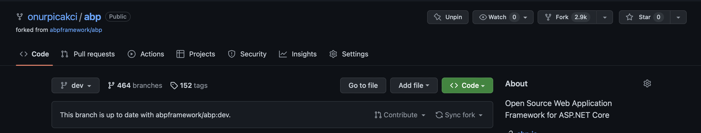
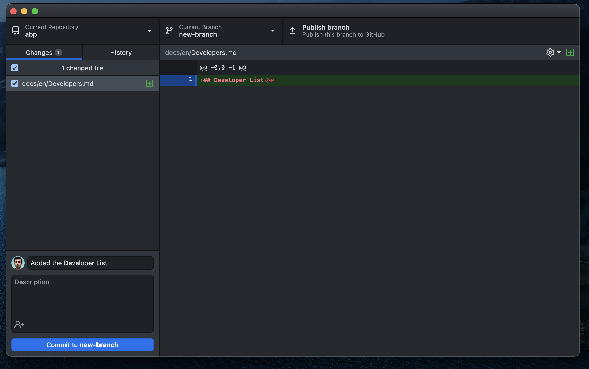
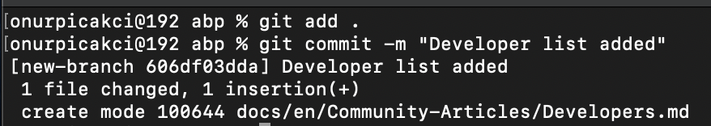

# How to Contribute to ABP Framework

## Introduction

In this article I will explain how you can contribute to the open source ABP Framework. You will learn not only about the ABP Framework, but also how to contribute to an open source project, what are the standard rules, some git operations, etc.

## What is Open Source?

Open source software is code designed to be publicly available. Anyone can view, use, modify and distribute your project and code. The fact that the code is open source makes it a natural community and open for improvement. This enables ideas and thoughts to spread rapidly.

## What is ABP Framework?

ABP Framework is a complete infrastructure to create modern web applications by following the software development best practices and conventions. ABP Framework is completely free, open source and community-driven and provides a free theme and some pre-built modules. ABP is a modular framework and the Application Modules provide pre-built application functionalities.

## Step 1: Fork the Project

The first thing we need to do now is to fork the open source project. Forking will create a copy of the project in your own github account. This will allow users to make changes to the code without affecting the original repository. Just press the fork key in the project.

After forking, it will create a new repo in your own github profile.

## Step 2: Clone the Project

In order to develop on the project, you need to clone it to your local. After clicking on the code button, select your preferred cloning method and copy the link. 

You can run the copied link on your local machine with the `git clone` command, but we will use Github Desktop. Press `Open with Github Desktop` and the repo will be installed on your local machine. 

## Step 3: Create a New Branch

In this step, you need to create a new branch of your own before you start developing it. Open the repo on Github Desktop and create a new branch. When creating a new branch, be careful which branch you create it on.

## Step 4: Development

Choose a suitable IDE to develop on the new branch you created. In order not to complicate things, we will create a `Developers.md` file and process it. Let's enter a sample text in the Developers file.

As you can see, all changes made to the repo are reflected directly in Github Desktop.

## Step 5: Commit

The commit operation is used to save the changes you have made. It is useful to commit after certain operations are done in the project. For the changes you will make, it is useful to write a short sentence describing what you are doing. Press the `Commit to <branch-name>` button to commit. 

## Step 6: Publish the Changes

The changes you have made so far are only visible on your local machine. You need to publish these changes to submit them to your forked repository.

## Step 7: Create a Pull Request

After the push, the pull request `Create Pull Request` button will appear on the Github Desktop. Click it and create a pull request.

You can also make a pull request from the repo in your github profile.

Before requesting a pull request, it is useful to select one of the Abp's tags to indicate the change you are making. Make sure that the branch you created has reached the correct branch. After briefly describing your changes in the title and description, click the `Create pull request` button. This will send a pull request to the original repository. If the pull request is approved and merged, your changes will also appear in the parent repository.

That's it! You have contributed to an open source project with your development.

