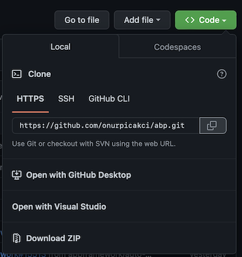
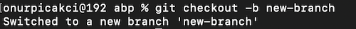

# How to Contribute To ABP Framework
## What is open source?

Open source software is code designed to be publicly available. Anyone can view, use, modify and distribute your project and code. The fact that the code is open source makes it a natural community and open for improvement. This enables ideas and thoughts to spread rapidly.

## Step 1: Fork the Project

The first thing we need to do now is to fork the open source project. Forking will create a copy of the project in your own github account. This will allow users to make changes to the code without affecting the original repository. Just press the fork key in the project.

After forking, it will create a new repo in your own github profile.

## Step 2: Clone the Project

In order to develop on the project, you need to clone it to your local. After clicking on the code button, select your preferred cloning method and copy the link. 

You can run the copied link as on your local machine with the `git clone` command.

`git clone <link to repo> `

If you want you can clone it using Github Desktop and do it in a simpler way, but in this article we will use commands.

## Step 3: Create a New Branch

In this step, you need to create a new branch of your own before you start developing it. Open the main folder of the repo you cloned via a command prompt and use `git checkout -b` to create a new branch. 

`git checkout -b new-branch`

## Step 4: Development

Choose a suitable IDE to develop on the new branch you created. In order not to complicate things, we will create a `Developers.md` file and process it

