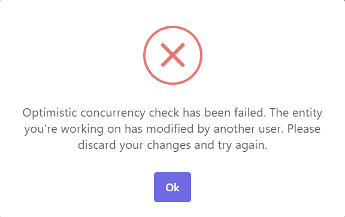

## Concurrency Check

### Introduction

Concurrency Check (also known as **Concurrency Control**) refers to specific mechanisms used to ensure data consistency in presence of concurrent changes (multiple processes or users access or change the same data in a database at the same time).

There are two commonly used concurrency control mechanisms/approaches;
* **Optimistic Locking**: Optimistic Locking is a concurrency control method that does not use record locking. Instead, allows multiple users to attempt to **update** or **delete** the same record without informing the users that others are also attempting to **update/delete** the record. 

    * If a user successfully updates/deletes the record, the other users need to get the latest changes for the current record to be able to make changes. If any other user attempts to change the record without getting the latest state of it, informed that a conflict exists. 

* **Pessimistic Locking**: Pessimistic Locking prevents simultaneous updates to records. As soon as one user starts to edit a record, it is getting locked. Other users who attempt to update this record are informed that another user has an update in progress. The other users must wait until the first user has finished committing their changes, thereby releasing the record lock. Only then other users can make changes to this record.

### Base Classes & Interfaces for Concurrency Stamp

#### `IHasConcurrencyStamp` Interface

It is the base interface for **Concurrency Check** and has a just simple property named `ConcurrencyStamp`. 

```csharp
public interface IHasConcurrencyStamp 
{
    public string ConcurrencyStamp { get; set; }
}
```

To be able to use **Concurrency Check** your entity class should inherit from the `IHasConcurrencyStamp` interface directly or indirectly.

#### Base Classes

Most of the **Entity Classes** provided by ABP Framework, inherit from the `IHasConcurrencyStamp` interface. You can see the full list of the base classes:

- `AggregateRoot`, `AggregateRoot<TKey>`
- `CreationAuditedAggregateRoot`, `CreationAuditedAggregateRoot<TKey>`
- `AuditedAggregateRoot`, `AuditedAggregateRoot<TKey>`
- `FullAuditedAggregateRoot`, `FullAuditedAggregateRoot<TKey>`

### Getting Started 

This is a core feature and it's used by the ABP Framework. There are not any additional packages required. **Optimistic Locking** is applied for ABP modules by default.

#### Usage

You can either inherit your entity from one of [the base classes](#base-classes):

```csharp
public class Book : FullAuditedAggregateRoot<Guid>
{
    //...
}
```

or `IHasConcurrencyStamp` interface directly:

```csharp
public class Book : Entity<Guid>, IHasConcurrencyStamp
{
    public string ConcurrencyStamp { get; set; }
        
    //...
}
```

Then you need to inherit your output and update DTO classes from the `IHasConcurrencyStamp` interface:

```csharp
public class BookDto : EntityDto<Guid>, IHasConcurrencyStamp 
{
    //...

    public string ConcurrencyStamp { get; set; }
}

public class UpdateBookDto : IHasConcurrencyStamp 
{
    //...

    public string ConcurrencyStamp { get; set; }
}
```

Also, you need to set the **ConcurrencyStamp** to the entity in your **UpdateAsync** method of your application service, for that purpose you can use the `SetConcurrencyStampIfNotNull` method like as below:

```csharp
public class BookAppService : ApplicationService, IBookAppService 
{
    //...

    public virtual async Task<BookDto> UpdateAsync(Guid id, UpdateBookDto input) 
    {
        var book = await BookRepository.GetAsync(id);
        book.SetConcurrencyStampIfNotNull(input.ConcurrencyStamp);

        //set other input values to entity ...

        await BookRepository.UpdateAsync(book);
    }
}
```

After that, when multiple users try to change the same record at the same time, concurrency stamp mismatch occurs and `AbpDbConcurrencyException` will be thrown. You can either handle the exception manually or let the ABP Framework handle for you and show a error modal like in the screenshot below.

