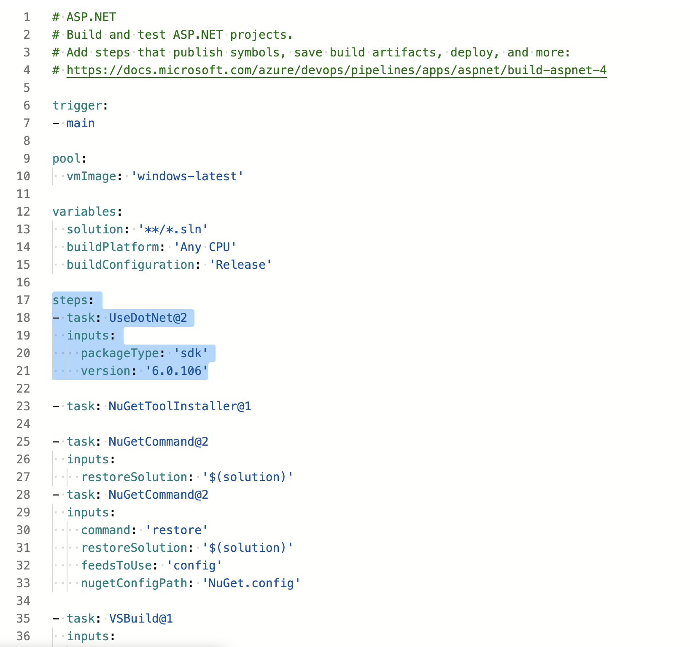

# Deploying ABP Project to Azure App Service

In this document, you will learn how to create and deploy your first ABP web app to [Azure App Service](https://docs.microsoft.com/en-us/azure/app-service/overview). The App Service supports various versions of .NET apps, and provides a highly scalable, self-patching web hosting service. ABP web apps are cross-platform and can be hosted on Linux, Windows or MacOS.

****Prerequisites****

- An Azure account with an active subscription. [Create an account for free](https://azure.microsoft.com/free/dotnet).
- A GitHub account [Create an account for free](http://github.com/).


## Creating a new ABP application

Create a repository on [GitHub.com](https://github.com/) (keep all settings as default).

Open the command prompt and clone the repository into a folder on your computer

```bash
git clone https://github.com/your-username/your-repository-name.git
```

Check your dotnet version. It should be at least 3.1.x

```bash
dotnet --version
```

Install or update the [ABP CLI](https://docs.abp.io/en/abp/latest/cli) with the following command:

```bash
dotnet tool install -g Volo.Abp.Cli || dotnet tool update -g Volo.Abp.Cli
```

Open the command prompt in the *GitHub repository folder* and create a new ABP Blazor solution with the command below:

```bash
abp new YourAppName -u blazor
```


## Running the application

Open the command prompt in the *[YourAppName].DbMigrator* project and enter the command below to apply the database migrations:

```bash
dotnet run
```

Open the command prompt in the *[YourAppName].HttpApi.Host* project to run the API project:

```bash
dotnet run
```

Navigate to the *applicationUrl* specified in *the launchSettings.json* file of the *[YourAppName].HttpApi.Host project*. You should get the *Swagger window*

Open the command prompt in the *[YourAppName].Blazor* folder and enter the command below to run the Blazor project:

```bash
dotnet run
```

Navigate to the *applicationUrl* specified in the *launchSettings.json* file of the *[YourAppName].Blazor* project and you should see the landing page.

Stop both the *API* and the *Blazor* project by pressing **CTRL+C**


## Committing to GitHub

Before the GitHub commit, you have to delete the line "**/wwwroot/libs/*" at *.gitignore* file.


Open the command prompt in the root folder of your project and *add, commit and push* all your changes to your GitHub repository:

```bash
git add .
git commit -m initialcommit
git push
```


## Configuring Azure database connection string

Create a SQL database on Azure and change the connection string in all the *appsettings.json* files.

* Login into [Azure Portal](https://portal.azure.com/)

* Click **Create a resource**

* Search for *SQL Database*

* Click the **Create** button in the *SQL Database window*

* Create a new resource group. Name it *rg[YourAppName]*

* Enter *[YourAppName]Db* as database name

* Create a new Server and name it *[yourappname]server*

* Enter a serveradmin login and passwords. Click the **OK** button

* Select your *Location*

* Check *Allow Azure services to access server*

* Click **Configure database**. Go to the *Basic* version and click the **Apply** button

* Click the **Review + create** button. Click **Create**

* Click **Go to resource** and click **SQL server** when the SQL Database is created

* Click **Networking** under Security left side menu 

* Select **Selected networks** and click **Add your client IP$ address** at the Firewall rules

* Select **Allow Azure and resources to access this seerver** and save

* Go to your **SQL database**, click **Connection strings** and copy the connection string

* Copy/paste the *appsettings.json* files of the *[YourAppName].HttpApi.Host* and the *[YourAppName].DbMigrator* project

* Do not forget to replace {your_password} with the correct server password you entered in Azure SQL Database


## Running DB Migrations

Open the command prompt in the *[YourAppName].DbMigrator* project again and enter the command below to apply the database migrations:

```bash
dotnet run
```

Open the command prompt in the *[YourAppName].HttpApi.Host* project and enter the command below to check your API is working:

```bash
dotnet run
```

Stop the *[YourAppName].HttpApi.Host* by pressing CTRL+C.


## Committing to GitHub

Open the command prompt in the root folder of your project and add, commit and push all your changes to your GitHub repository

```bash
git add .
git commit -m initialcommit
git push
```


## Setting up the Build pipeline in AzureDevops and publish the Build Artifacts

* Sign in Azure DevOps

* Click **New organization** and follow the steps to create a new organisation. Name it [YourAppName]org

* Enter [YourAppName]Proj as project name in the ***Create a project to get started*** window

* Select **Public visibility** and click the **Create project** button

* Click the **Pipelines** button to continue

* Click the **Create Pipeline** button

 Select GitHub in the Select your repository window


* Enter the Connection name. *[YourAppName]GitHubConnection* and click **Authorize using OAuth**

* Select your **GitHub** [YourAppName]repo and click Continue

* Search for **ASP.NET**  in the ***Select a template*** window


* Select the ASP.NET Core template and click the **Apply** button

* Add the below commands block as a first step in the pipeline

  ```
  - task: UseDotNet@2
    inputs:
      packageType: 'sdk'
      version: '6.0.106'
  ```



* Select **Settings** on the second task(Nugetcommand@2) in the pipeline

* Select **Feeds in my Nuget.config** and type **Nuget.config** in the text box


* Add the below commands block to the end of the pipeline

  ```
  - task: PublishBuildArtifacts@1
    displayName: 'Publish Artifact'
    inputs:
      PathtoPublish: '$(build.artifactstagingdirectory)'
      ArtifactName: '$(Parameters.ArtifactName)'
    condition: succeededOrFailed()
  ```

  

```
# ASP.NET
# Build and test ASP.NET projects.
# Add steps that publish symbols, save build artifacts, deploy, and more:
# https://docs.microsoft.com/azure/devops/pipelines/apps/aspnet/build-aspnet-4

trigger:
- main

pool:
  vmImage: 'windows-latest'

variables:
  solution: '**/*.sln'
  buildPlatform: 'Any CPU'
  buildConfiguration: 'Release'

steps:
- task: UseDotNet@2
  inputs:
    packageType: 'sdk'
    version: '6.0.106'

- task: NuGetToolInstaller@1

- task: NuGetCommand@2
  inputs:
    command: 'restore'
    restoreSolution: '$(solution)'
    feedsToUse: 'config'
    nugetConfigPath: 'NuGet.config'

- task: VSBuild@1
  inputs:
    solution: '$(solution)'
    msbuildArgs: '/p:DeployOnBuild=true /p:WebPublishMethod=Package /p:PackageAsSingleFile=true /p:SkipInvalidConfigurations=true /p:PackageLocation="$(build.artifactStagingDirectory)"'
    platform: '$(buildPlatform)'
    configuration: '$(buildConfiguration)'

- task: VSTest@2
  inputs:
    platform: '$(buildPlatform)'
    configuration: '$(buildConfiguration)'

- task: PublishBuildArtifacts@1
  displayName: 'Publish Artifact'
  inputs:
    PathtoPublish: '$(build.artifactstagingdirectory)'
    ArtifactName: '$(Parameters.ArtifactName)'
    publishLocation: 'Container'
  condition: succeededOrFailed()
```

* Click **Save & queue** in the top menu. Click **Save & queue** again and click **Save and run** to run the Build pipeline

* When the Build pipeline has finished. Click **1 published; 1 consumed**


## Creating a Web App in the Azure Portal to deploy [YourAppName].HttpApi.Host project

* Search for Web App in the *Search the Marketplace* field

* Click the **Create** button in the Web App window

* Select rg[YourAppName] in the *Resource Group* dropdown

* Enter [YourAppName]API in the *Name input* field

* Select code, .NET Core 3.1 (LTS) and windows as *Operating System*

* Enter [YourAppName]API in the *Name input* field

* Select .NET Core 3.1 (LTS) in the *Runtime stack* dropdown

* Select Windows as *Operating System*

* Select the same *Region* as in the SQL server you created in Part 3


* Click **Create new** in the Windows Plan. Name it [YourAppName]ApiWinPlan

* Click **Change size** in Sku and size. Go to the Dev/Test Free F1 version and click the **Apply** button


* Click the **Review + create** button. Click the **Create** button

* Click **Go to resource** when the Web App has been created


## Creating a release pipeline in the AzureDevops and deploy [YourAppName].HttpApi.Host project

* Sign in into [Azure DevOps](https://azure.microsoft.com/en-us/services/devops/)

* Click [YourAppName]Proj and click **Releases** in the *Pipelines* menu

* Click the **New pipeline** button in the *No release pipelines found* window

* Select *Azure App Service deployment* and click the **Apply** button


* Enter *[YourAppName]staging* in the *Stage name* field in the *Stage* window. And close the window

* Click **+ Add an artifact** in the *Pipeline* tab

* Select the **Build** icon as *Source type* in the *Add an artifact* window

* Select Build pipeline in the *Source (build pipeline)* dropdown and click the **Add** button


* Click the **Continuous deployment trigger (thunderbolt icon)**

* Set the toggle to **Enabled** in the the *Continuous deployment trigger* window

* Click **+ Add** in *No filters added*. Select **Include** in the *Type* dropdown. Select your branch in the *Build branch* dropdown and close the window


* Click **the little red circle with the exclamation mark** in the *Tasks* tab menu

* Select your subscription in the *Azure subscription* dropdown.


* Click **Authorize** and enter your credentials in the next screens

* After Authorization, select the **[YourAppName]API** in the *App service name* dropdown

* Click the **Deploy Azure App Service** task

* Select **[YourAppName].HttpApi.Host.zip** in the *Package or folder* input field


* Click the **Save** icon in the top menu and click **OK**

* Click **Create release** in the top menu. Click **Create** to create a release

* Click the *Pipeline* tab and wait until the Deployment succeeds


* Open a browser and navigate to the URL of your Web App

```
https://[YourAppName]api.azurewebsites.net
```


## Creating a Web App in Azure Portal to deploy [YourAppName].Blazor project

* Login into [Azure Portal](https://portal.azure.com/)

* Click **Create a resource**

* Search for *Web App* in the *Search the Marketplace* field

* Click the **Create** button in the *Web App* window

* Select *rg[YourAppName]* in the *Resource Group* dropdown

* Enter *[YourAppName]Blazor* in the *Name* input field

* Select *.NET Core 3.1 (LTS)* in the *Runtime stack* dropdown

* Select *Windows* as *Operating System*

* Select the same region as the SQL server you created in Part 3

* Select the [YourAppName]ApiWinPlan in the *Windows Plan* dropdown


* Click the **Review + create** button. Click **Create** button

* Click **Go to resource** when the Web App has been created

* Copy the URL of the Blazor Web App for later use

```
https://[YourAppName]blazor.azurewebsites.net
```


## Changing the Web App configuration for the Azure App Service

Copy the URL of the Api Host and Blazor Web App. Change appsettings.json files in the Web App as follows images.


## Adding an extra Stage in the Release pipeline in the AzureDevops to deploy [YourAppName].Blazor project

* Go to the *Release* pipeline in [Azure DevOps](https://azure.microsoft.com/en-us/services/devops/) and click **Edit**

* Click the **+ Add** link and add a **New Stage**


* Select *Azure App Service deployment* and click the **Apply** button

* Enter *BlazorDeployment* in the *Stage name* input field and close the *Stage* window

* Click the **little red circle with the exclamation mark** in the BlazorDeployment stage

* Select your subscription in the *Azure subscription* dropdown

* Select your Blazor Web App in the *App service name* dropdown

* Click the **Deploy Azure App Service task**

* Select *[YourAppName].Blazor.zip* in the *Package or folder* input field


* Click **Save** in the top menu and click the **OK** button after

* Click **Create release** in the top menu and click the **Create** button


