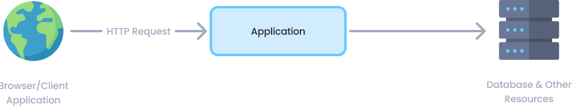
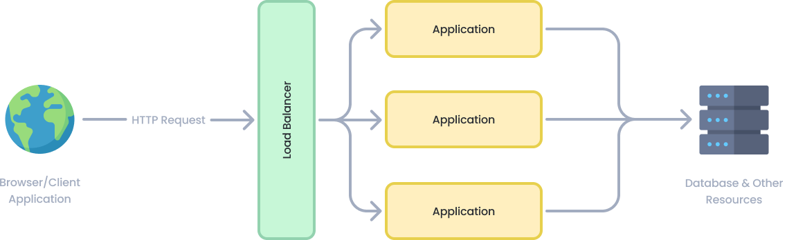

# Deploying to a Clustered Environment

This document introduces the topics that you should consider when you are deploying your application to a clustered environment where **multiple instances of your application run concurrently**, and explains how you can deal with these topics in your ABP based application.

> This document is valid regardless you have a monolith application or a microservice solution. The Application term is used for a process. An application can be a monolith web application, a service in a microservice solution, a console application, or another kind of an executable process.
>
> For example, if you are deploying your application to Kubernetes and configure your application or service to run in multiple pods, then your application or service runs in a clustered environment.

## Understanding the Clustered Environment

> You can skip this section if you are already familiar with clustered deployment and load balancers.

### Single Instance Deployment

Consider an application deployed as a **single instance**, as illustrated in the following figure:

Browsers and other client applications can directly make HTTP requests to your application. You can put a web server (e.g. IIS or NGINX) between the clients and your application, but you still have a single application instance running in a single server or container. Single-instance configuration is **limited to scale** since it runs in a single server and you are limited with the server's capacity.

### Clustered Deployment

**Clustered deployment** is the way of running **multiple instances** of your application **concurrently** in a single or multiple servers. In this way, different instances can serve different requests and you can scale by adding new servers to the system. The following figure shows a typical implementation of clustering using a **load balancer**:

### Load Balancers

[Load balancers](https://en.wikipedia.org/wiki/Load_balancing_(computing)) have a lot of features, but they fundamentally **forward an incoming HTTP request** to an instance of your application and return your response back to the client application.

Load balancers can use different algorithms for selecting the application instance while determining the application instance that is used to deliver the incoming request. **Round Robin** is one of the simplest and most used algorithms. Requests are delivered to the application instances in rotation. First instance gets the first request, second instance gets the second, and so on. It returns to the first instance after all the instances are used, and the algorithm goes like that for the next requests.

### Potential Problems

Once multiple instances of your application run in parallel, you should carefully consider the following topics:

* Any **state (data) stored in memory** of your application will become a problem when you have multiple instances. A state stored in memory of an application instance may not be available in the next request since the next request will be handled by a different application instance. While there are some solutions (like sticky sessions) to overcome this problem user-basis, it is a **best practice to design your application as stateless** if you want to run it in a cluster, container or/and cloud.
* **In-memory caching** is a kind of in-memory state and should not be used in a clustered application. You should use **distributed caching** instead.
* You shouldn't store data in the **local file system**. It should be available to all instances of your application. Different application instance may run in different containers or servers and they may not be able to have access to the same file system. You can use a **cloud or external storage provider** as a solution.
* If you have **background workers** or **job queue managers**, you should be careful since multiple instances may try to execute the same job or perform the same work concurrently. As a result, you may have the same work done multiple times or you may get a lot of errors while trying to access and change the same resources.

You may have more problems with clustered deployment, but these are the most common ones. ABP has been designed to be compatible with the clustered deployment scenario. The following sections explain what you should do when you are deploying your ABP based application to a clustered environment.

## Switching to a Distributed Cache

ASP.NET Core provides different kind of caching features. [In-memory cache](https://docs.microsoft.com/en-us/aspnet/core/performance/caching/memory) stores your objects in the memory of the local server and is only available to the application that stored the object. Non-sticky sessions in a clustered environment should use the [distributed caching](https://docs.microsoft.com/en-us/aspnet/core/performance/caching/distributed) except some specific scenarios (for example, you can cache a local CSS file into memory. It is read-only data and it is the same in all application instances. You can cache it in memory for performance reasons without any problem).

[ABP's Distributed Cache](../Caching.md) extends [ASP.NET Core's distributed cache](https://docs.microsoft.com/en-us/aspnet/core/performance/caching/distributed) infrastructure. It works in-memory by default. You should configure an actual distributed cache provider when you want to deploy your application to a clustered environment.

> You should configure the cache provider for clustered deployment, even if your application doesn't directly use `IDistributedCache`. Because the ABP Framework and the pre-built [application modules](../Modules/Index.md) are using distributed cache.

ASP.NET Core provides multiple integrations to use as your distributed cache provider, like [Redis](https://redis.io/) and [NCache](https://www.alachisoft.com/ncache/). You can follow [Microsoft's documentation](https://docs.microsoft.com/en-us/aspnet/core/performance/caching/distributed) to learn how to use them in your applications.

If you decided to use Redis as your distributed cache provider, **follow [ABP's Redis Cache Integration document](../Redis-Cache.md)** for the steps you need to follow to install it into your application and setup your Redis configuration.

> Based on your preferences while creating a new ABP solution, Redis cache might be pre-installed in your solution. For example, if you have selected the *Tiered* option with the MVC UI, Redis cache comes as pre-installed. Because, in this case, you have two applications in your solution and they should use the same cache source to be consistent.

## Using a Proper BLOB Storage Provider

If you have used ABP's [BLOB Storing](../Blob-Storing.md) feature with the [File System provider](../Blob-Storing-File-System.md), you should use another provider in your clustered environment since the File System provider uses the application's local file system.

The [Database BLOB provider](../Blob-Storing-Database) is the easiest way since it uses your application's main database (or another database if you configure) to store BLOBs. However, you should remember that BLOBs are large objects and may quickly increase your database's size.

> [ABP Commercial](https://commercial.abp.io/) startup solution templates come with the database BLOB provider as pre-installed, and stores BLOBs in the application's database.

Check the [BLOB Storing](../Blob-Storing.md) document to see all the available BLOG storage providers.

## Configuring Background Jobs

ABP's [background job system](../Background-Jobs.md) is used to queue tasks to be executed in the background. Background job queue is persistent and a queued task is guaranteed to be executed (it is re-tried if it fails).

ABP's default background job manager is compatible with clustered environments. It uses a [distributed lock](../Distributed-Locking.md) to ensure that the jobs are executed only in a single application instance at a time. See the *Configuring a Distributed Lock Provider* section below to learn how to configure a distributed lock provider for your application, so the default background job manager properly works in a clustered environment.

If you don't want to use a distributed lock provider, you may go with the following options:

* Stop the background job manager (set `AbpBackgroundJobOptions.IsJobExecutionEnabled` to `false`) in all application instances except one of them, so only the single instance executes the jobs (while other application instances can still queue jobs).
* Stop the background job manager (set `AbpBackgroundJobOptions.IsJobExecutionEnabled` to `false`)  in all application instances and create a dedicated application (maybe a console application running in its own container or a Windows Service running in the background) to execute all the background jobs. This can be a good option if your background jobs consume high system resources (CPU, RAM or Disk), so you can deploy that background application to a dedicated server and your background jobs don't affect your application's performance.

> If you are using an external background job integration (e.g. [Hangfire](../Background-Workers-Hangfire.md) or [Quartz](../Background-Workers-Quartz.md)) instead of the default background job manager, then please refer to your provider's documentation to learn how it should be configured for a clustered environment.

## Configuring a Distributed Lock Provider

ABP provides a distributed locking abstraction with an implementation made with the [DistributedLock](https://github.com/madelson/DistributedLock) library. A distributed lock is used to control concurrent access to a shared resource by multiple applications to prevent corruption of the resource because of concurrent writes. The ABP Framework and some pre-built [application modules](../Modules/Index.md) are using distributed locking for several reasons.

However, the distributed lock system works in-process by default. That means it is not distributed actually, unless you configure a distributed lock provider. So, please follow the [distributed lock](../Distributed-Locking.md) document to configure a provider for your application, if it is not already configured.

## Implementing Background Workers

ASP.NET Core provides [hosted services](https://docs.microsoft.com/en-us/aspnet/core/fundamentals/host/hosted-services) and ABP provides [background workers](../Background-Workers.md) to perform tasks in background threads in your application.

If your application has tasks running in the background, you should consider how they will behave in a clustered environment, especially if your background tasks are using the same resources. You should design your background tasks so that they continue to work properly in the clustered environment.

Assume that your background worker in your SaaS application checks user subscriptions and sends emails if their subscription renewal date approaches. If the background task runs in multiple application instances, it is probable to send the same email many times to some users, which will disturb them.

We suggest you to use one of the following approaches to overcome the problem:

* Implement your background workers so that they work in a clustered environment without any problem. Using the [distributed lock](../Distributed-Locking.md) to ensure concurrency control is a way of doing that. A background worker in an application instance may handle a distributed lock, so the workers in other application instances will wait for the lock. In this way, only one worker does the actual work, while others wait in idle. If you implement this, your workers run safely without caring about how the application is deployed.
* Stop the background workers (set `AbpBackgroundWorkerOptions.IsEnabled` to `false`) in all application instances except one of them, so only the single instance runs the workers.
* Stop the background workers (set `AbpBackgroundWorkerOptions.IsEnabled` to `false`) in all application instances and create a dedicated application (maybe a console application running in its own container or a Windows Service running in the background) to execute all the background tasks. This can be a good option if your background workers consume high system resources (CPU, RAM or Disk), so you can deploy that background application to a dedicated server and your background tasks don't affect your application's performance.