# Implementing Domain Driven Design

## Introduction

This is a **practical guide** for implementing the Domain Driven Design (DDD). While the implementation details rely on the ABP Framework infrastructure, core concepts, principles and patterns are applicable in any kind of solution, even if it is not a .NET solution.

### Goals

The goals of this document are to

* **Introduce and explain** the DDD architecture, concepts, principles, patterns and building blocks.
* Explain the **layered architecture** & solution structure offered by the ABP Framework.
* Introduce **explicit rules** to implement DDD patterns and best practices by giving **concrete examples**.
* Show what **ABP Framework provides** you as the infrastructure for implementing DDD in a proper way.
* And finally, provide **suggestions** based on software development **best practices** and our experiences to create a **maintainable codebase**.

### Simple Code!

> **Playing football** is very **simple**, but **playing simple football** is the **hardest thing** there is.
> &mdash; <cite>Johan Cruyff</cite>

If we take this famous quote for programming, we can say;

> **Writing code** is very **simple**, but **writing simple code** is the **hardest thing** there is.
> &mdash; <cite>???</cite>

In this document, we will introduce **simple rules**, those are **easy to implement**.

Once your **application grows**, it will be **hard to follow** these rules. Sometimes you find **breaking rules** will save you time in a short term. However, the saved time in the short term will bring much **more time loss** in the middle and long term. Your code base becomes **complicated** and hard to maintain. Most of the business applications are **re-written** just because you **can't maintain** it anymore.

If you **follow the rules and best practices**, your code base will be simpler and easier to maintain. Your application **reacts to changes** faster.

## What is the Domain Driven Design?

Domain-driven design (DDD) is an approach to software development for **complex** needs by connecting the implementation to an **evolving** model;

DDD is suitable for **complex domains** and **large-scale** applications rather than simple CRUD applications. It focuses on the **core domain logic** rather than the infrastructure details. It helps to build a **flexible**, modular and **maintainable** code base.

### OOP & SOLID

Implementing DDD highly relies on the Object Oriented Programming (OOP) and [SOLID](https://en.wikipedia.org/wiki/SOLID) principles. Actually, it **implements** and **extends** these principles. So, a **good understanding** of OOP & SOLID helps you a lot while truly implementing the DDD.

### DDD Layers & Clean Architecture

There are four fundamental layers of a Domain Driven Based Solution;

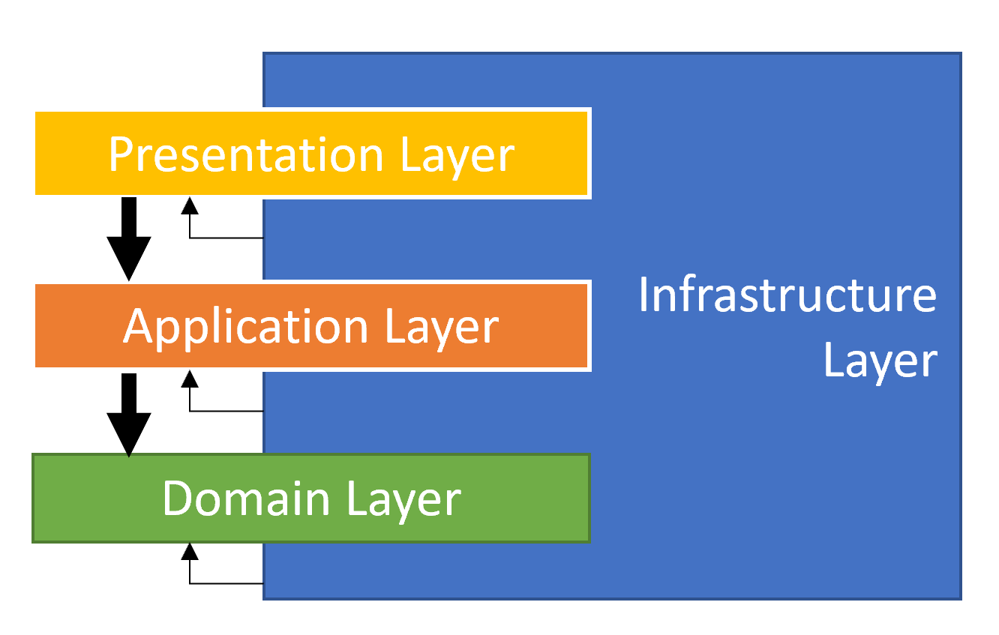

**Business Logic** places into two layers, the *Domain layer* and the *Application Layer*, while they contain different kinds of business logic;

* **Domain Layer** implements the core, use-case independent business logic of the domain/system.
* **Application Layer** implements the use cases of the application based on the domain. A use case can be thought as a user interaction on the User Interface (UI).
* **Presentation Layer** contains the UI elements (pages, components) of the application.
* **Infrastructure Layer** supports other layer by implementing the abstractions and integrations to 3rd-party library and systems.

The same layering can be shown as the diagram below and known as the **Clean Architecture**, or sometimes the **Onion Architecture**:

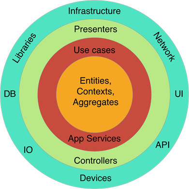

In the Clean Architecture, each layer only **depends on the layer directly inside it**. The most independent layer is shown in the most inner circle and it is the Domain Layer.

### Core Building Blocks

DDD mostly **focuses on the Domain & Application Layers** and ignores the Presentation and Infrastructure. They are seen as *details* and the business layers should not depend on them.

That doesn't mean the Presentation and Infrastructure layers are not important. They are very important. UI frameworks and database providers have their own rules and best practices that you need to know and apply. However these are not in the topics of DDD.

This section introduces the essential building blocks of the Domain & Application Layers.

#### Domain Layer Building Blocks

* **Entity**: An [Entity](Entities.md) is an object with its own properties (state, data) and methods that implements the business logic that is executed on these properties. An entity is represented by its unique identifier (Id). Two entity object with different Ids are considered as different entities.
* **Value Object**: A [Value Object](Value-Objects.md) is another kind of domain object that is identified by its properties rather than a unique Id. That means two Value Objects with same properties are considered as the same object. Value objects are generally implemented as immutable and mostly are much simpler than the Entities.
* **Aggregate & Aggregate Root**: An [Aggregate](Entities.md) is a cluster of objects (entities and value objects) bound together by an **Aggregate Root** object. The Aggregate Root is a specific type of an entity with some additional responsibilities.
* **Repository** (interface): A [Repository](Repositories.md) is a collection-like interface that is used by the Domain and Application Layers to access to the data persistence system (the database). It hides the complexity of the DBMS from the business code. Domain Layer contains the `interface`s of the repositories.
* **Domain Service**: A [Domain Service](Domain-Services.md) is a stateless service that implements core business rules of the domain. It is useful to implement domain logic that depends on multiple aggregate (entity) type or some external services.
* **Specification**: A [Specification](Specifications.md) is used to define named, reusable and combinable filters for entities and other business objects.
* **Domain Event**: A [Domain Event](Event-Bus.md) is a way of informing other services in a loosely coupled manner, when a domain specific event occurs.

#### Application Layer Building Blocks

* **Application Service**: An [Application Service](Application-Services.md) is a stateless service that implements use cases of the application. An application service typically gets and returns DTOs. It is used by the Presentation Layer. It uses and coordinates the domain objects to implement the use cases. A use case is typically considered as a Unit Of Work.
* **Data Transfer Object (DTO)**: A [DTO](Data-Transfer-Objects.md) is a simple object without any business logic that is used to transfer state (data) between the Application and Presentation Layers.
* **Unit of Work (UOW)**: A [Unit of Work](Unit-Of-Work.md) is an atomic work that should be done as a transaction unit. All the operations inside a UOW should be committed on success or rolled back on a failure.

## Implementation: The Big Picture

### Layering of a .NET Solution

The picture below shows a Visual Studio Solution created using the ABP's [application startup template](Startup-Templates/Application.md):

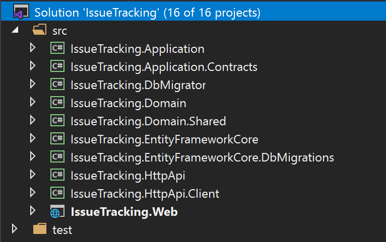

The solution name is `IssueTracking` and it consists of multiple projects. The solution is layered by considering **DDD principles** as well as **development** and **deployment** practicals. The sub sections below explains the projects in the solution;

> Your solution structure may be slightly different if you choose a different UI or Database provider. However, the Domain and Application layers will be same and this is the essential point for the DDD perspective. See the [Application Startup Template](Startup-Templates/Application.md) document if you want to know more about the solution structure.

#### The Domain Layer

The Domain Layer is splitted into two projects;

* `IssueTracking.Domain` is the **essential domain layer** that contains all the **building blocks** (entities, value objects, domain services, specifications, repository interfaces, etc.) introduced before.
* `IssueTracking.Domain.Shared` is a thin project that contains some types those belong to the Domain Layer, but shared with all other layers. For example, it may contain some constants and `enum`s related to the Domain Objects but need to be **reused by other layers**.

#### The Application Layer

The Application Layer is also splitted into two projects;

* `IssueTracking.Application.Contracts` contains the application service **interfaces** and the **DTO**s used by these interfaces. This project can be shared by the client applications (including the UI).
* `IssueTracking.Application` is the **essential application layer** that **implements** the interfaces defined in the Contracts project.

#### The Presentation Layer

* `IssueTracking.Web` is an ASP.NET Core MVC / Razor Pages application for this example. This is the only executable application that serves the application and the APIs.

> ABP Framework also supports different kind of UI frameworks including [Angular](UI/Angular/Quick-Start.md) and [Blazor](UI/Blazor/Overall.md). In these cases, the `IssueTracking.Web` doesn't exist in the solution. Instead, an `IssueTracking.HttpApi.Host` application will be in the solution to serve the HTTP APIs as a standalone endpoint to be consumed by the UI applications via HTTP API calls.

#### The Remote Service Layer

* `IssueTracking.HttpApi` project contains HTTP APIs defined by the solution. It typically contains MVC `Controller`s and related models, if available. So, you write your HTTP APIs in this project.

> Most of the time, API Controllers are just wrappers around the Application Services to expose them to the remote clients. Since ABP Framework's [Automatic API Controller System](API/Auto-API-Controllers.md) **automatically configures and exposes your Application Services as API Controllers**, you typically don't create Controllers in this project. However, the startup solution includes it for the cases you need to manually create API controllers.

* `IssueTracking.HttpApi.Client` project is useful when you have a C# application that needs to consume your HTTP APIs. Once the client application references this project, it can directly [inject](Dependency-Injection.md) & use the Application Services. This is possible by the help of the ABP Framework's [Dynamic C# Client API Proxies System](API/Dynamic-CSharp-API-Clients.md).

> There is a Console Application in the `test` folder of the solution, named `IssueTracking.HttpApi.Client.ConsoleTestApp`. It simply uses the `IssueTracking.HttpApi.Client` project to consume the APIs exposed by the application. It is just a demo application and you can safely delete it. You can even delete the `IssueTracking.HttpApi.Client` project if you think that you don't need to them.

#### The Infrastructure Layer

In a DDD implementation, you may have a single Infrastructure project to implement all the abstractions and integrations, or you may have different projects for each dependency.

We suggest a balanced approach; Create separate projects for main infrastructure dependencies (like Entity Framework Core) and a common infrastructure project for other infrastructure.

ABP's startup solution has two projects for the Entity Framework Core integration;

* `IssueTracking.EntityFrameworkCore` is the essential integration package for the EF Core. Your application's `DbContext`, database mappings, implementations of the repositories and other EF Core related stuff are located here.
* `IssueTracking.EntityFrameworkCore.DbMigrations` is a special project to manage the Code First database migrations. There is a separate `DbContext` in this project to track the migrations. You typically don't touch this project much except you need to create a new database migration or add an [application module](Modules/Index.md) that has some database tables and naturally requires to create a new database migration.

> You may wonder why there are two projects for the EF Core. It is mostly related to [modularity](Module-Development-Basics.md). Each module has its own independent `DbContext` and your application has also one `DbContext`. `DbMigrations` project contains a **union** of the modules to track and apply a **single migration path**. While most of the time you don't need to know it, you can see the [EF Core migrations](Entity-Framework-Core-Migrations.md) document for more information. 

#### Other Projects

There is one more project, `IssueTracking.DbMigrator`, that is a simple Console Application that **migrates** the database schema and **[seeds](Data-Seeding.md) the initial** data when you execute it. It is a useful **utility application** that you can use it in development as well as in production environment.

### Dependencies of the Projects in the Solution

The diagram below shows the essential dependencies (project references) between the projects in the solution (`IssueTracking.` part is not shown to be simple)

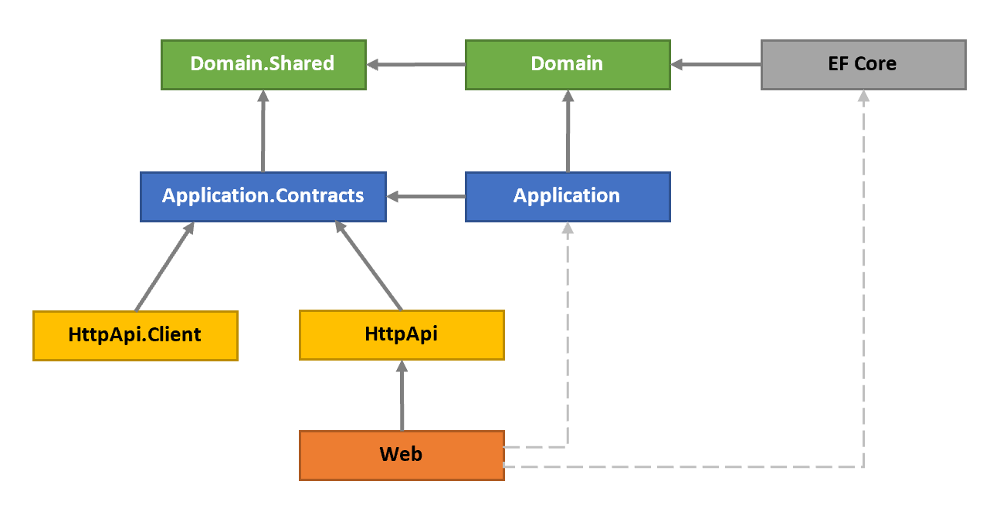

The projects have been explained before. Now, we can explain the reasons of the dependencies;

* `Domain.Shared` is the project that all other projects directly or indirectly depend on. So, all the types in this project are available to all projects.
* `Domain` only depends on the `Domain.Shared` because it is already a (shared) part of the domain. For example, an `IssueType` enum in the `Domain.Shared` can be used by an `Issue` entity in the `Domain` project.
* `Application.Contracts` depends on the `Domain.Shared`. In this way, you can reuse these types in the DTOs. For example, the same `IssueType` enum in the `Domain.Shared` can be used by a `CreateIssueDto` as a property.
* `Application` depends on the `Application.Contracts` since it implements the Application Service interfaces and uses the DTOs inside it. It also depends on the `Domain` since the Application Services are implemented using the Domain Objects defined inside it.
* `EntityFrameworkCore` depends on the `Domain` since it maps the Domain Objects (entities and value types) to database tables (as it is an ORM) and implements the repository interfaces defined in the `Domain`.
* `HttpApi` depends on the `Application.Contacts` since the Controllers inside it inject and use the Application Service interfaces as explained before.
* `HttpApi.Client` depends on the `Application.Contacts` since it can consume the Application Services as explained before.
* `Web` depends on the `HttpApi` since it serves the HTTP APIs defined inside it. Also, in this way, it indirectly depends on the `Application.Contacts` project to consume the Application Services in the Pages/Components.

#### Dashed Dependencies

When you investigate the solution, you will see two more dependencies shown with the dashed lines in the figure above. `Web` project depends on the `Application` and `EntityFrameworkCore` projects which *theoretically* should not be like that but actually it is.

This is because the `Web` is the final project that runs and hosts the application and the **application needs the implementations of the Application Services and the Repositories** while running.

This design decision potentially allows you to use Entities and EF Core objects in the Presentation Layer which **should be strictly avoided**. However, we find the alternative designs over complicated. Here, two of the alternatives if you want to remove this dependency;

* Convert `Web` project to a razor class library and create a new project, like `Web.Host`, that depends on the `Web`, `Application` and `EntityFrameworkCore` projects and hosts the application. You don't write any UI code here, but use **only for hosting**.
* Remove `Application` and `EntityFrameworkCore` dependencies from the `Web` project and load their assemblies on application initialization. You can use ABP's [Plug-In Modules](PlugIn-Modules.md) system for that purpose.

### Execution Flow a DDD Based Application

The figure below shows a typical request flow for a web application that has been developed based on DDD patterns.

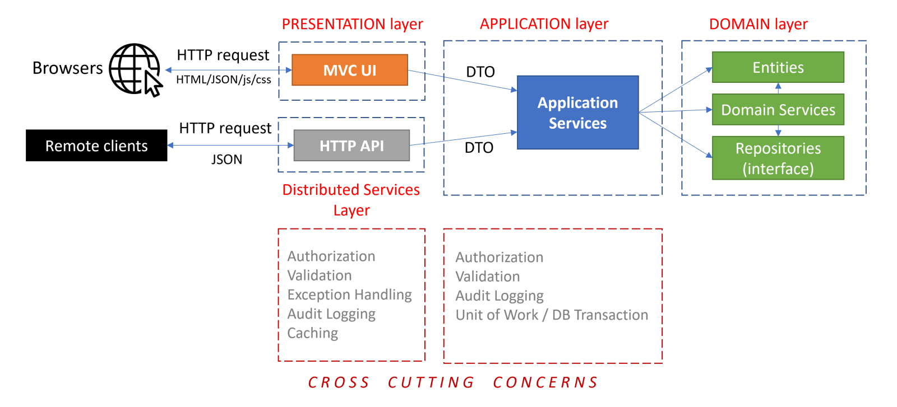

* The request typically begins with a user interaction on the UI (a *use case*) that causes an HTTP request to the server.
* An MVC Controller or a Razor Page Handler in the Presentation Layer (or in the Distributed Services Layer) handles the request and can perform some cross cutting concerns in this stage ([Authorization](Authorization.md), [Validation](Validation.md), [Exception Handling](Exception-Handling.md), etc.). A Controller/Page injects the related Application Service interface and calls its method(s) by sending and receiving DTOs.
* The Application Service uses the Domain Objects (Entities, Repository interfaces, Domain Services, etc.) to implement the *use case*. Application Layer implements some cross cutting concerns (Authorization, Validation, etc.). An Application Service method should be a [Unit Of Work](Unit-Of-Work.md). That means it should be atomic.

Most of the cross cutting concerns are **automatically and conventionally implemented by the ABP Framework** and you typically don't need to write code for them.

### Common Principles

Before going into details, let's see some overall DDD principles;

#### Database Provider / ORM Independence

The domain and the application layers should be ORM / Database Provider agnostic. They should only depend on the Repository interfaces and the Repository interfaces don't use any ORM specific objects.

Here, the main reasons of this principle;

1. To make your domain/application **infrastructure independent** since the infrastructure may change in the future or you may need to support a second database type later.
2. To make your domain/application **focus on the business code** by hiding the infrastructure details behind the repositories.
3. To make your **automated tests** easier since you can mock the repositories in this case.

> As a respect to this principle, none of the projects in the solution has reference to the `EntityFrameworkCore` project, except the startup application.

##### Discussion About the Database Independence Principle

Especially, the **reason 1** deeply effects your domain **object design** (especially, the entity relations) and **application code**. Assume that you are using [Entity Framework Core](Entity-Framework-Core.md) with a relational database. If you are willing to make your application switchable to [MongoDB](MongoDB.md) later, you can't use some very **useful EF Core features**. Examples;

* You can't assume [Change Tracking](https://docs.microsoft.com/en-us/ef/core/querying/tracking) since MongoDB provider can't do it. So, you always need to explicitly update the changed entities.
* You can't use [Navigation Properties](https://docs.microsoft.com/en-us/ef/core/modeling/relationships) (or Collections) to other Aggregates in your entities since this is not possible for a Document Database. See the "Rule: Reference Other Aggregates Only By Id" section for more info.

If you think such features are **important** for you and you **will never stray** from the EF Core, we believe that it is worth **stretching this principle**. We still suggest to use the repository pattern to hide the infrastructure details. But you can assume that you are using EF Core while designing your entity relations and writing your application code. You can even reference to the EF Core NuGet Package from your application layer to be able to directly use the asynchronous LINQ extension methods, like `ToListAsync()` (see the *IQueryable & Async Operations* section in the [Repositories](Repositories.md) document for more info).

#### Presentation Technology Agnostic

The presentation technology (UI Framework) is one of the most changed parts of a real world application. It is very important to design the **Domain and Application Layers** to be completely **unaware** of the presentation technology/framework. This principle is relatively easy to implement and ABP's startup template makes it even easier.

In some cases, you may need to have **duplicate logic** in the application and presentation layers. For example, you may need to duplicate the **validation** and **authorization** checks in both layers. The checks in the UI layer is mostly for **user experience** while checks in the application and domain layers are for **security and data integrity**. That's perfectly normal and necessary.

#### Focus on the State Changes, Not Reporting

DDD focuses on how the domain objects **changes and interactions**; How to create an entity and change its properties by preserving the data **integrity/validity** and implementing the **business rules**.

DDD **ignores reporting** and mass querying. That doesn't mean they are not important. If your application doesn't have fancy dashboards and reports, who would use it? However, reporting is another topic. You typically want to use the full power of the SQL Server or even use a separate data source (like ElasticSearch) for reporting purpose. You will write optimized queries, create indexes and even stored procedures(!). You are free to do all these things as long as you don't infect them into your business logic.

## Implementation: The Building Blocks

This is the essential part of this guide. We will introduce and explain some **explicit rules** with examples. You can follow these rules and apply in your solution while implementing the Domain Driven Design.

### The Example Domain

The examples will use some concepts those are used by GitHub, like `Issue`, `Repository`, `Label` and `User`, you are already familiar with. The figure below shows some of the aggregates, aggregate roots, entities, value object and the relations between them:

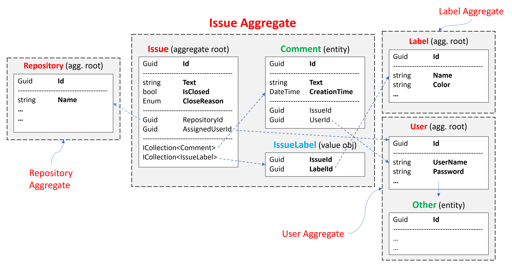

**Issue Aggregate** consists of an `Issue` Aggregate Root that contains `Comment` and `IssueLabel` collections. Other aggregates are shown as simple since we will focus on the Issue Aggregate:

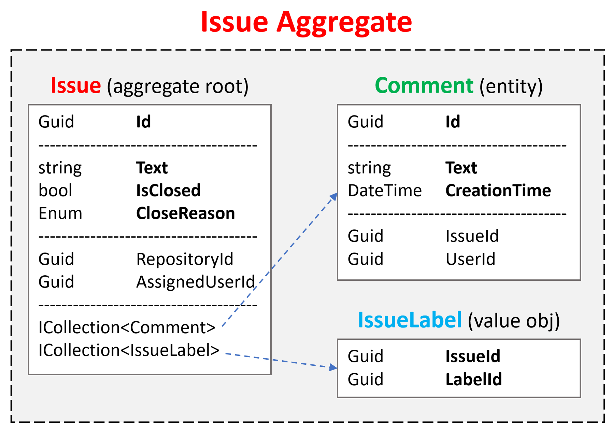

### Aggregates

As said before, an [Aggregate](Entities.md) is a cluster of objects (entities and value objects) bound together by an Aggregate Root object. This section will introduce the principles and rules related to the Aggregates.

> We refer the term *Entity* both for *Aggregate Root* and *sub-collection entities* unless we explicitly write *Aggregate Root* or *sub-collection entity*.

#### Aggregate / Aggregate Root Principles

##### Business Rules

Entities are responsible to implement the business rules related to the properties of their own. The *Aggregate Root Entities* are also responsible for their sub-collection entities.

An aggregate should maintain its self **integrity** and **validity** by implementing domain rules and constraints. That means, unlike the DTOs, Entities have **methods to implement some business logic**. Actually, we should try to implement business rules in the entities wherever possible.

##### Single Unit

An aggregate is **retrieved and saved as a single unit**, with all the sub-collections and properties. For example, if you want to add a `Comment` to an `Issue`, you need to;

* Get the `Issue` from database with including all the sub-collections (`Comment`s and `IssueLabel`s).
* Use methods on the `Issue` class to add a new comment, like `Issue.AddComment(...);`.
* Save the `Issue` (with all sub-collections) to the database as a single database operation (update).

That may seem strange to the developers used to work with **EF Core & Relational Databases** before. Getting the `Issue` with all details seems **unnecessary and inefficient**. Why don't we just execute an SQL `Insert` command to database without querying any data?

The answer is that we should **implement the business** rules and preserve the data **consistency** and **integrity** in the **code**. If we have a business rule like "*Users can not comment on the locked issues*", how can we check the `Issue`'s lock state without retrieving it from the database? So, we can execute the business rules only if the related objects available in the application code.

On the other hand, **MongoDB** developers will find this rule very natural. In MongoDB, an aggregate object (with sub-collections) is saved in a **single collection** in the database (while it is distributed into several tables in a relational database). So, when you get an aggregate, all the sub-collections are already retrieved as a part of the query, without any additional configuration.

ABP Framework helps to implement this principle in your applications.

**Example: Add a comment to an issue**

````csharp
public class IssueAppService : ApplicationService, IIssueAppService
{
    private readonly IRepository<Issue, Guid> _issueRepository;

    public IssueAppService(IRepository<Issue, Guid> issueRepository)
    {
        _issueRepository = issueRepository;
    }

    [Authorize]
    public async Task CreateCommentAsync(CreateCommentDto input)
    {
        var issue = await _issueRepository.GetAsync(input.IssueId);
        issue.AddComment(CurrentUser.GetId(), input.Text);
        await _issueRepository.UpdateAsync(issue);
    }
}
````

`_issueRepository.GetAsync` method retrieves the `Issue` with all details (sub-collections) as a single unit by default. While this works out of the box for MongoDB, you need to configure your aggregate details for the EF Core. But, once you configure, repositories automatically handle it. `_issueRepository.GetAsync` method gets an optional parameter, `includeDetails`, that you can pass `false` to disable this behavior when you need it.

> See the *Loading Related Entities* section of the [EF Core document](Entity-Framework-Core.md) for the configuration and alternative scenarios.

`Issue.AddComment` gets a `userId` and comment `text`, implements the necessary business rules and adds the comment to the Comments collection of the `Issue`.

Finally, we use `_issueRepository.UpdateAsync` to save changes to the database.

> EF Core has a **change tracking** feature. So, you actually don't need to call `_issueRepository.UpdateAsync`. It will be automatically saved thanks to ABP's Unit Of Work system that automatically calls `DbContext.SaveChanges()` at the end of the method. However, for MongoDB, you need to explicitly update the changed entity.
>
> So, if you want to write your code Database Provider independent, you should always call the `UpdateAsync` method for the changed entities.

##### Transaction Boundary

An aggregate is generally considered as a transaction boundary. If a use case works with a single aggregate, reads and saves it as a single unit, all the changes made to the aggregate objects are saved together as an atomic operation and you don't need to an explicit database transaction.

However, in real life, you may need to change **more than one aggregate instances** in a single use case and you need to use database transactions to ensure **atomic update** and **data consistency**. Because of that, ABP Framework uses an explicit database transaction for a use case (an application service method boundary). See the [Unit Of Work](Unit-Of-Work.md) documentation for more info.

##### Serializability

An aggregate (with the root entity and sub-collections) should be serializable and transferrable on the wire as a single unit. For example, MongoDB serializes the aggregate to JSON document while saving to the database and deserializes from JSON while reading from the database.

> This requirement is not necessary when you use relational databases and ORMs. However, it is an important practice of Domain Driven Design.

The following rules will already bring the serializability.

#### Aggregate / Aggregate Root Rules & Best Practices

The following rules ensures implementing the principles introduced above.

##### Reference Other Aggregates Only By Id

The first rule says an Aggregate should reference to other aggregates only by their Id. That means you can not add navigation properties to other aggregates.

* This rule makes it possible to implement the serializability principle.
* It also prevents different aggregates manipulate each other and leaking business logic of an aggregate to one another.

You see two aggregate roots, `GitRepository` and `Issue` in the example below;

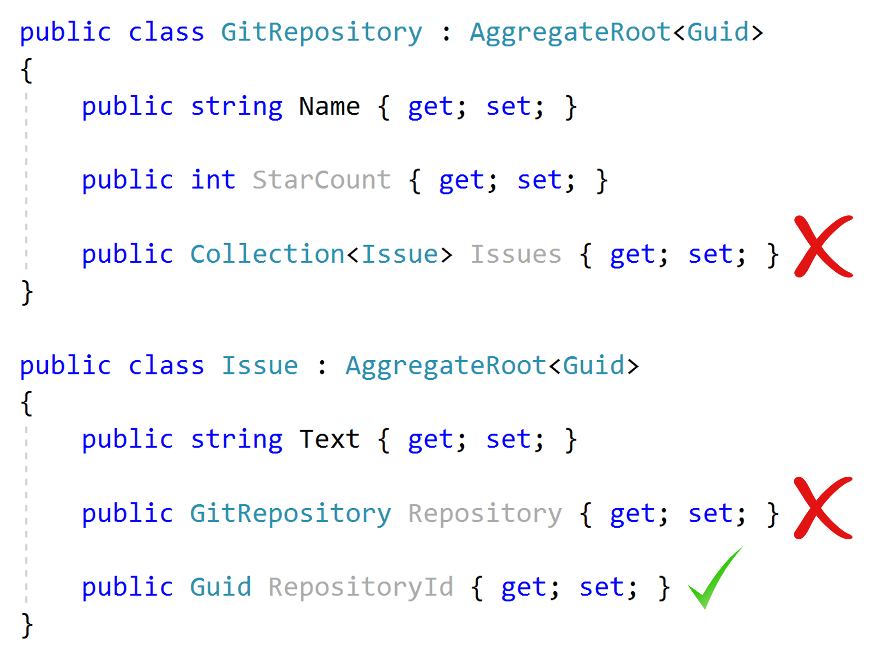

* `GitRepository` should not have a collection of the `Issue`s since they are different aggregates.
* `Issue` should not have a navigation property for the related `GitRepository` since it is a different aggregate.
* `Issue` can have `RepositoryId` (as a `Guid`).

So, when you have an `Issue` and need to have `GitRepository` related to this issue, you need to explicitly query it from database by the `RepositoryId`.

###### For EF Core & Relational Databases

In MongoDB, it is naturally not suitable to have such navigation properties/collections. If you do that, you find a copy of the destination aggregate object in the database collection of the source aggregate since it is being serialized to JSON on save.

However, EF Core & relational database developers may find this restrictive rule unnecessary since EF Core can handle it on database read and write. We see this an important rule that helps to **reduce the complexity** of the domain prevents potential problems and we strongly suggest to implement this rule. However, if you think it is practical to ignore this rule, see the *Discussion About the Database Independence Principle* section above.

##### Keep Aggregates Small

One good practice is to keep an aggregate simple and small. This is because an aggregate will be loaded and saved as a single unit and reading/writing a big object has performance problems. See the example below:

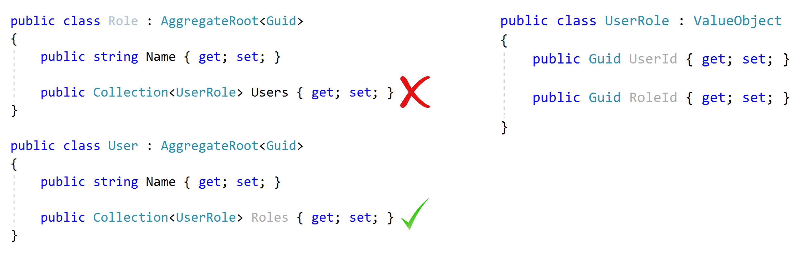

Role aggregate has a collection of `UserRole` value objects to track the users assigned for this role. Notice that `UserRole` is not another aggregate and it is not a problem for the rule *Reference Other Aggregates Only By Id*. However, it is a problem in practical. A role may be assigned to thousands (even millions) of users in a real life scenario and it is a significant performance problem to load thousands of items whenever you query a `Role` from database (remember: Aggregates are loaded by their sub-collections as a single unit).

On the other hand, `User` may have such a `Roles` collection since a user doesn't have much roles in practical and it can be useful to have a list of roles while you are working with a User Aggregate.

If you think carefully, there is one more problem when Role and User both have the list of relation when use a **non-relational database, like MongoDB**. In this case, the same information is duplicated in different collections and it will be hard to maintain data consistency (whenever you add an item to `User.Roles`, you need to add it to `Role.Users` too).

So, determine your aggregate boundaries and size based on the following considerations;

* Objects used together.
* Query (load/save) performance and memory consumption.
* Data integrity, validity and consistency.

In practical;

* Most of the aggregate roots will **not have sub-collections**.
* A sub-collection should not have more than **100-150 items** inside it at the most case. If you think a collection potentially can have more items, don't define the collection as a part of the aggregate and consider to extract another aggregate root for the entity inside the collection.

##### Primary Keys of the Aggregate Roots / Entities

* An aggregate root typically has a single `Id` property for its identifier (Primark Key: PK). We prefer `Guid` as the PK of an aggregate root entity (see the [Guid Genertation document](Guid-Generation.md) to learn why).
* An entity (that's not the aggregate root) in an aggregate can use a composite primary key.

For example, see the Aggregate root and the Entity below:


* `Organization` has a `Guid` identifier (`Id`).
* `OrganizationUser` is a sub-collection of an `Organization` and has a composite primary key consists of the `OrganizationId` and `UserId`.

That doesn't mean sub-collection entities should always have composite PKs. They may have single `Id` properties when it's needed.

> Composite PKs are actually a concept of relational databases since the sub-collection entities have their own tables and needs to a PK. On the other hand, for example, in MongoDB you don't need to define PK for the sub-collection entities at all since they are stored as a part of the aggregate root.

##### Constructors of the Aggregate Roots / Entities

The constructor is located where the lifecycle of an entity begins. There are a some responsibilities of a well designed constructor:

* Gets the **required entity properties** as parameters to **create a valid entity**. Should force to pass only for the required parameters and may get non-required properties as optional parameters.
* **Checks validity** of the parameters.
* Initializes **sub-collections**.

**Example: `Issue` (Aggregate Root) constructor**

````csharp
using System;
using System.Collections.Generic;
using System.Collections.ObjectModel;
using Volo.Abp;
using Volo.Abp.Domain.Entities;

namespace IssueTracking.Issues
{
    public class Issue : AggregateRoot<Guid>
    {
        public Guid RepositoryId { get; set; }
        public string Title { get; set; }
        public string Text { get; set; }
        public Guid? AssignedUserId { get; set; }
        public bool IsClosed { get; set; }
        public IssueCloseReason? CloseReason { get; set; } //enum

        public ICollection<IssueLabel> Labels { get; set; }

        public Issue(
            Guid id,
            Guid repositoryId,
            string title,
            string text = null,
            Guid? assignedUserId = null
            ) : base(id)
        {
            RepositoryId = repositoryId;
            Title = Check.NotNullOrWhiteSpace(title, nameof(title));
            
            Text = text;
            AssignedUserId = assignedUserId;
            
            Labels = new Collection<IssueLabel>();
        }

        private Issue() { /* for deserialization & ORMs */ }
    }
}
````

* `Issue` class properly **forces to create a valid entity** by getting minimum required properties in its constructor as parameters.
* The constructor **validates** the inputs (`Check.NotNullOrWhiteSpace(...)` throws `ArgumentException` if the given value is empty).
* It **initializes the sub-collections**, so you don't get a null reference exception when you try to use the `Labels` collection after creating the `Issue`.
* The constructor also **takes the `id`** and passes to the `base` class. We don't generate `Guid`s inside the constructor to be able to delegate this responsibility to another service (see [Guid Generation](Guid-Generation.md)).
* Private **empty constructor** is necessary for ORMs. We made it `private` to prevent accidently using it in our own code.

> See the [Entities](Entities.md) document to learn more about creating entities with the ABP Framework.

##### Entity Property Accessors & Methods

The example above may seem strange to you! For example, we force to pass a non-null `Title` in the constructor. However, the developer may then set the `Title` property to `null` without any control. This is because the example code above just focuses on the constructor.

If we declare all the properties with **public setters** (like the example `Issue` class above), we can't force **validity** and **integrity** of the entity in its lifecycle. So;

* Use **private setter** for a property when you need to perform any **logic** while setting that property.
* Define public methods to manipulate such properties.

**Example: Methods to change the properties in a controlled way**

````csharp
using System;
using Volo.Abp;
using Volo.Abp.Domain.Entities;

namespace IssueTracking.Issues
{
    public class Issue : AggregateRoot<Guid>
    {
        public Guid RepositoryId { get; private set; } //Never changes
        public string Title { get; private set; } //Needs validation
        public string Text { get; set; } //No validation
        public Guid? AssignedUserId { get; set; } //No validation
        public bool IsClosed { get; private set; } //Should be changed with CloseReason
        public IssueCloseReason? CloseReason { get; private set; } //Should be changed with IsClosed

        //...

        public void SetTitle(string title)
        {
            Title = Check.NotNullOrWhiteSpace(title, nameof(title));
        }

        public void Close(IssueCloseReason reason)
        {
            IsClosed = true;
            CloseReason = reason;
        }

        public void ReOpen()
        {
            IsClosed = false;
            CloseReason = null;
        }
    }
}
````

* `RepositoryId` setter made private and there is no way to change it after creating an `Issue` because this is what we want in this domain: An issue can't be moved to another repository.
* `Title` setter made private and `SetTitle` method has been created if you want to change it later in a controlled way.
* `Text` and `AssignedUserId` has public setters since there is no restriction on them. They can be null or any other value. We think it is unnecessary to define separate methods to set them. If we need later, we can add methods and make the setters private. Breaking changes are not problem in the domain layer since the domain layer is an internal project, it is not exposed to clients.
* `IsClosed` and `IssueCloseReason` are pair properties. Defined `Close` and `ReOpen` methods to change them together. In this way, we prevent to close an issue without any reason.

##### Business Logic & Exceptions in the Entities

When you implement validation and business logic in the entities, you frequently need to manage the exceptional cases. In these cases;

* Create **domain specific exceptions**.
* **Throw these exceptions** in the entity methods when necessary.

**Example**

````csharp
public class Issue : AggregateRoot<Guid>
{
    //...
    
    public bool IsLocked { get; private set; }
    public bool IsClosed { get; private set; }
    public IssueCloseReason? CloseReason { get; private set; }

    public void Close(IssueCloseReason reason)
    {
        IsClosed = true;
        CloseReason = reason;
    }

    public void ReOpen()
    {
        if (IsLocked)
        {
            throw new IssueStateException(
                "Can not open a locked issue! Unlock it first."
            );
        }

        IsClosed = false;
        CloseReason = null;
    }

    public void Lock()
    {
        if (!IsClosed)
        {
            throw new IssueStateException(
                "Can not open a locked issue! Unlock it first."
            );
        }

        IsLocked = true;
    }

    public void Unlock()
    {
        IsLocked = false;
    }
}
````

There are two business rules here;

* A locked issue can not be re-opened.
* You can not lock an open issue.

`Issue` class throws an `IssueStateException` in these cases to force the business rules:

````csharp
using System;

namespace IssueTracking.Issues
{
    public class IssueStateException : Exception
    {
        public IssueStateException(string message)
            : base(message)
        {
            
        }
    }
}
````

There are two potential problems of throwing such exceptions;

1. In case of such an exception, should the **end user** see the exception (error) message? If so, how do you **localize** the exception message? You can not use the [localization](Localization.md) system, because you can't inject and use `IStringLocalizer` in the entities.
2. For a web application or HTTP API, what **HTTP Status Code** should return to the client?

ABP's [Exception Handling](Exception-Handling.md) system solves these and similar problems.

**Example: Throwing a business exception with code**

````csharp
using Volo.Abp;

namespace IssueTracking.Issues
{
    public class IssueStateException : BusinessException
    {
        public IssueStateException(string code)
            : base(code)
        {
            
        }
    }
}
````

* `IssueStateException` class inherits the `BusinessException` class. ABP returns 403 (forbidden) HTTP Status code by default (instead of 500 - Internal Server Error) for the exceptions derived from the `BusinessException`.
* The `code` is used as a key in the localization resource file to find the localized message.

Now, we can change the `ReOpen` method as shown below:

````csharp
public void ReOpen()
{
    if (IsLocked)
    {
        throw new IssueStateException("IssueTracking:CanNotOpenLockedIssue");
    }

    IsClosed = false;
    CloseReason = null;
}
````

> Use constants instead of magic strings.

And add an entry to the localization resource like below:

````json
"IssueTracking:CanNotOpenLockedIssue": "Can not open a locked issue! Unlock it first."
````

* When you throw the exception, ABP automatically uses this localized message (based on the current language) to show to the end user.
* The exception code (`IssueTracking:CanNotOpenLockedIssue` here) is also sent to the client, so it may handle the error case programmatically.

> For this example, you could directly throw `BusinessException` instead of defining a specialized `IssueStateException`. The result will be same. See the [exception handling document](Exception-Handling.md) for all the details.

##### Business Logic in Entities Requiring External Services

It is simple to implement a business rule in an entity method when the business logic only uses the properties of that entity. What if the business logic requires to **query database** or **use any external services** that should be resolved from the [dependency injection](Dependency-Injection.md) system. Remember; **Entities can not inject services!**

There are two common ways of implementing such a business logic:

* Implement the business logic on an entity method and **get external dependencies as parameters** of the method.
* Create a **Domain Service**.

Domain Services will be explained later. But, now let's see how it can be implemented in the entity class.

**Example: Business Rule: Can not assign more than 3 open issues to a user concurrently**

````csharp
public class Issue : AggregateRoot<Guid>
{
    //...
    public Guid? AssignedUserId { get; private set; }

    public async Task AssignToAsync(AppUser user, IUserIssueService userIssueService)
    {
        var openIssueCount = await userIssueService.GetOpenIssueCountAsync(user.Id);

        if (openIssueCount >= 3)
        {
            throw new BusinessException("IssueTracking:ConcurrentOpenIssueLimit");
        }

        AssignedUserId = user.Id;
    }

    public void CleanAssignment()
    {
        AssignedUserId = null;
    }
}
````

* `AssignedUserId` property setter made private. So, the only way to change it to use the `AssignToAsync` and `CleanAssignment` methods.
* `AssignToAsync` gets an `AppUser` entity. Actually, it only uses the `user.Id`, so you could get a `Guid` value, like `userId`. However, this way ensures that the `Guid` value is `Id` of an existing user and not a random `Guid` value.
* `IUserIssueService` is an arbitrary service that is used to get open issue count for a user. It's the responsibility of the code part (that calls the `AssignToAsync`) to resolve the `IUserIssueService` and pass here.
* `AssignToAsync` throws exception if the business rule doesn't meet.
* Finally, if everything is correct, `AssignedUserId` property is set.

This method perfectly guarantees to apply the business logic when you want to assign an issue to a user. However, it has some problems;

* It makes the entity class **depending on an external service** which makes the entity **complicated**.
* It makes **hard to use** the entity. The code that uses the entity now needs to inject `IUserIssueService` and pass to the `AssignToAsync` method.

An alternative way of implementing this business logic is to introduce a **Domain Service**, which will be explained later.

### Repositories

A [Repository](Repositories.md) is a collection-like interface that is used by the Domain and Application Layers to access to the data persistence system (the database) to read and write the Business Objects, generally the Aggregates.

Common Repository principles are;

* Define a repository **interface in the Domain Layer** (because it is used in the Domain and Application Layers), **implement in the Infrastructure Layer** (*EntityFrameworkCore* project in the startup template).
* **Do not include business logic** inside the repositories.
* Repository interface should be **database provider / ORM independent**. For example, do not return a `DbSet` from a repository method. `DbSet` is an object provided by the EF Core.
* **Create repositories for aggregate roots**, not for all entities. Because, sub-collection entities (of an aggregate) should be accessed over the aggregate root.

#### Do Not Include Domain Logic in Repositories

While this rule seems obvious at the beginning, it is easy to leak business logic into repositories.

**Example: Get inactive issues from a repository**

````csharp
using System;
using System.Collections.Generic;
using System.Threading.Tasks;
using Volo.Abp.Domain.Repositories;

namespace IssueTracking.Issues
{
    public interface IIssueRepository : IRepository<Issue, Guid>
    {
        Task<List<Issue>> GetInActiveIssuesAsync();
    }
}
````

`IIssueRepository` extends the standard `IRepository<...>` interface by adding a `GetInActiveIssuesAsync` method. This repository works with such an `Issue` class:

````csharp
public class Issue : AggregateRoot<Guid>, IHasCreationTime
{
    public bool IsClosed { get; private set; }
    public Guid? AssignedUserId { get; private set; }
    public DateTime CreationTime { get; private set; }
    public DateTime? LastCommentTime { get; private set; }
    //...
}
````

(the code shows only the properties we need for this example)

The rule says the repository shouldn't know the business rules. The question here is "**What is an inactive issue**? Is it a business rule definition?"

Let's see the implementation to understand it:

````csharp
using System;
using System.Collections.Generic;
using System.Linq;
using System.Threading.Tasks;
using IssueTracking.EntityFrameworkCore;
using Microsoft.EntityFrameworkCore;
using Volo.Abp.Domain.Repositories.EntityFrameworkCore;
using Volo.Abp.EntityFrameworkCore;

namespace IssueTracking.Issues
{
    public class EfCoreIssueRepository : 
        EfCoreRepository<IssueTrackingDbContext, Issue, Guid>,
        IIssueRepository
    {
        public EfCoreIssueRepository(
            IDbContextProvider<IssueTrackingDbContext> dbContextProvider) 
            : base(dbContextProvider)
        {
        }

        public async Task<List<Issue>> GetInActiveIssuesAsync()
        {
            var daysAgo30 = DateTime.Now.Subtract(TimeSpan.FromDays(30));

            return await DbSet.Where(i =>

                //Open
                !i.IsClosed &&

                //Assigned to nobody
                i.AssignedUserId == null &&

                //Created 30+ days ago
                i.CreationTime < daysAgo30 &&

                //No comment or the last comment was 30+ days ago
                (i.LastCommentTime == null || i.LastCommentTime < daysAgo30)

            ).ToListAsync();
        }
    }
}
````

(Used EF Core for the implementation. See the [EF Core integration document](Entity-Framework-Core.md) to learn how to create custom repositories with the EF Core.)

When we check the `GetInActiveIssuesAsync` implementation, we see a **business rule that defines an in-active issue**: The issue should be **open**, **assigned to nobody**, **created 30+ days ago** and has **no comment in the last 30 days**.

This is an implicit definition of a business rule that is hidden inside a repository method. The problem occurs when we need to reuse this business logic.

For example, let's say that we want to add an `bool IsInActive()` method on the `Issue` entity. In this way, we can check activeness when we have an issue entity.

Let's see the implementation:

````csharp
public class Issue : AggregateRoot<Guid>, IHasCreationTime
{
    public bool IsClosed { get; private set; }
    public Guid? AssignedUserId { get; private set; }
    public DateTime CreationTime { get; private set; }
    public DateTime? LastCommentTime { get; private set; }
    //...

    public bool IsInActive()
    {
        var daysAgo30 = DateTime.Now.Subtract(TimeSpan.FromDays(30));
        return
            //Open
            !IsClosed &&

            //Assigned to nobody
            AssignedUserId == null &&

            //Created 30+ days ago
            CreationTime < daysAgo30 &&

            //No comment or the last comment was 30+ days ago
            (LastCommentTime == null || LastCommentTime < daysAgo30);
    }
}
````

We had to copy/paste/modify the code. What if the definition of the activeness changes? We should not forget to update both places. This is a duplication of a business logic, which is pretty dangerous.

A good solution to this problem is the *Specification Pattern*!

### Specifications

A [specification](Specifications.md) is a **named**, **reusable**, **combinable** and **testable** class to filter the Domain Objects based on the business rules.

ABP Framework provides necessary infrastructure to easily create specification classes and use them inside your application code. Let's implement the in-active issue filter as a specification class:

````csharp
using System;
using System.Linq.Expressions;
using Volo.Abp.Specifications;

namespace IssueTracking.Issues
{
    public class InActiveIssueSpecification : Specification<Issue>
    {
        public override Expression<Func<Issue, bool>> ToExpression()
        {
            var daysAgo30 = DateTime.Now.Subtract(TimeSpan.FromDays(30));
            return i =>

                //Open
                !i.IsClosed &&

                //Assigned to nobody
                i.AssignedUserId == null &&

                //Created 30+ days ago
                i.CreationTime < daysAgo30 &&

                //No comment or the last comment was 30+ days ago
                (i.LastCommentTime == null || i.LastCommentTime < daysAgo30);
        }
    }
}
````

`Specification<T>` base class simplifies to create a specification class by defining an expression. Just moved the expression here, from the repository.

Now, we can re-use the `InActiveIssueSpecification` in the `Issue` entity and `EfCoreIssueRepository` classes.

#### Using within the Entity

`Specification` class provides an `IsSatisfiedBy` method that returns `true` if the given object (entity) satisfies the specification. We can re-write the `Issue.IsInActive` method as shown below:

````csharp
public class Issue : AggregateRoot<Guid>, IHasCreationTime
{
    public bool IsClosed { get; private set; }
    public Guid? AssignedUserId { get; private set; }
    public DateTime CreationTime { get; private set; }
    public DateTime? LastCommentTime { get; private set; }
    //...

    public bool IsInActive()
    {
        return new InActiveIssueSpecification().IsSatisfiedBy(this);
    }
}
````

Just created a new instance of the `InActiveIssueSpecification` and used its `IsSatisfiedBy` method to re-use the expression defined by the specification.

#### Using with the Repositories

First, starting from the repository interface:

````csharp
public interface IIssueRepository : IRepository<Issue, Guid>
{
    Task<List<Issue>> GetIssuesAsync(ISpecification<Issue> spec);
}
````

Renamed `GetInActiveIssuesAsync` to simple `GetIssuesAsync` by taking a specification object. Since the **specification (the filter) has been moved out of the repository**, we no longer need to create different methods to get issues with different conditions (like `GetAssignedIssues(...)`, `GetLockedIssues(...)`, etc.)

Updated implementation of the repository can be like that:

````csharp
public class EfCoreIssueRepository :
    EfCoreRepository<IssueTrackingDbContext, Issue, Guid>,
    IIssueRepository
{
    public EfCoreIssueRepository(
        IDbContextProvider<IssueTrackingDbContext> dbContextProvider)
        : base(dbContextProvider)
    {
    }

    public async Task<List<Issue>> GetIssuesAsync(ISpecification<Issue> spec)
    {
        return await DbSet
            .Where(spec.ToExpression())
            .ToListAsync();
    }
}
````

Since `ToExpression()` method returns an expression, it can be directly passed to the `Where` method to filter the entities.

Finally, we can pass any Specification instance to the `GetIssuesAsync` method:

````csharp
public class IssueAppService : ApplicationService, IIssueAppService
{
    private readonly IIssueRepository _issueRepository;

    public IssueAppService(IIssueRepository issueRepository)
    {
        _issueRepository = issueRepository;
    }

    public async Task DoItAsync()
    {
        var issues = await _issueRepository.GetIssuesAsync(
            new InActiveIssueSpecification()
        );
    }
}
````

##### With Default Repositories

Actually, you don't have to create custom repositories to be able to use specifications. The standard `IRepository` already extends the `IQueryable`, so you can use the standard LINQ extension methods over it:

````csharp
public class IssueAppService : ApplicationService, IIssueAppService
{
    private readonly IRepository<Issue, Guid> _issueRepository;

    public IssueAppService(IRepository<Issue, Guid> issueRepository)
    {
        _issueRepository = issueRepository;
    }

    public async Task DoItAsync()
    {
        var issues = AsyncExecuter.ToListAsync(
            _issueRepository.Where(new InActiveIssueSpecification())
        );
    }
}
````

`AsyncExecuter` is a utility provided by the ABP Framework to use asynchronous LINQ extension methods (like `ToListAsync` here) without depending on the EF Core NuGet package. See the [Repositories document](Repositories.md) for more information.

#### Combining the Specifications

One powerful side of the Specifications is they are combinable. Assume that we have another specification that returns `true` only if the `Issue` is in a Milestone:

````csharp
public class MilestoneSpecification : Specification<Issue>
{
    public Guid MilestoneId { get; }

    public MilestoneSpecification(Guid milestoneId)
    {
        MilestoneId = milestoneId;
    }

    public override Expression<Func<Issue, bool>> ToExpression()
    {
        return i => i.MilestoneId == MilestoneId;
    }
}
````

This Specification is *parametric* as a difference from the `InActiveIssueSpecification`. We can combine both specifications to get a list of inactive issues in a specific milestone:

````csharp
public class IssueAppService : ApplicationService, IIssueAppService
{
    private readonly IRepository<Issue, Guid> _issueRepository;

    public IssueAppService(IRepository<Issue, Guid> issueRepository)
    {
        _issueRepository = issueRepository;
    }

    public async Task DoItAsync(Guid milestoneId)
    {
        var issues = AsyncExecuter.ToListAsync(
            _issueRepository
                .Where(
                    new InActiveIssueSpecification()
                        .And(new MilestoneSpecification(milestoneId))
                        .ToExpression()
                )
        );
    }
}
````

The example above uses the `And` extension method to combine the specifications. There are more combining methods are available, like `Or(...)` and `AndNot(...)`.

> See the [Specifications document](Specifications.md) for more details about the specification infrastructure provided by the ABP Framework.

### Domain Services

Domain Services implement domain logic which;

* Depends on **services and repositories**.
* Needs to work with **multiple aggregates**, so the logic doesn't properly fit in any of the aggregates.

Domain Services work with Domain Objects. Their methods can **get and return entities, value objects, primitive types**... etc. However, **they don't get/return DTOs**. DTOs is a part of the Application Layer.

**Example: Assigning an issue to a user**

Remember how an issue assignment has been implemented in the `Issue` entity:

````csharp
public class Issue : AggregateRoot<Guid>
{
    //...
    public Guid? AssignedUserId { get; private set; }

    public async Task AssignToAsync(AppUser user, IUserIssueService userIssueService)
    {
        var openIssueCount = await userIssueService.GetOpenIssueCountAsync(user.Id);

        if (openIssueCount >= 3)
        {
            throw new BusinessException("IssueTracking:ConcurrentOpenIssueLimit");
        }

        AssignedUserId = user.Id;
    }

    public void CleanAssignment()
    {
        AssignedUserId = null;
    }
}
````

Here, we will move this logic into a Domain Service.

First, changing the `Issue` class:

````csharp
public class Issue : AggregateRoot<Guid>
{
    //...
    public Guid? AssignedUserId { get; internal set; }
}
````

* Removed the assign-related methods.
* Changed `AssignedUserId` property's setter from `private` to `internal`, to allow to set it from the Domain Service.

The next step is to create a domain service, named `IssueManager`, that has `AssignToAsync` to assign the given issue to the given user.

````csharp
public class IssueManager : DomainService
{
    private readonly IRepository<Issue, Guid> _issueRepository;

    public IssueManager(IRepository<Issue, Guid> issueRepository)
    {
        _issueRepository = issueRepository;
    }

    public async Task AssignToAsync(Issue issue, AppUser user)
    {
        var openIssueCount = await _issueRepository.CountAsync(
            i => i.AssignedUserId == user.Id && !i.IsClosed
        );

        if (openIssueCount >= 3)
        {
            throw new BusinessException("IssueTracking:ConcurrentOpenIssueLimit");
        }

        issue.AssignedUserId = user.Id;
    }
}
````

`IssueManager` can inject any service dependency and use to query open issue count on the user.

> We prefer and suggest to use the `Manager` suffix for the Domain Services.

The only problem of this design is that `Issue.AssignedUserId` is now open to set out of the class. However, it is not `public`. It is `internal` and changing it is possible only inside the same Assembly, the `IssueTracking.Domain` project for this example solution. We think this is reasonable;

* Domain Layer developers are already aware of domain rules and they use the `IssueManager`.
* Application Layer developers are already forces to use the `IssueManager` since they don't directly set it.

While there is a tradeoff between two approaches, we prefer to create Domain Services when the business logic requires to work with external services.

> If you don't have a good reason, we think **there is no need to create interfaces** (like `IIssueManager` for the `IssueManager`) for Domain Services.

### Application Services

An [Application Service](Application-Services.md) is a stateless service that implements **use cases** of the application. An application service typically **gets and returns DTOs**. It is used by the Presentation Layer. It **uses and coordinates the domain objects** (entities, repositories, etc.) to implement the use cases.

Common principles of an application service are;

* Implement the **application logic** that is specific to the current use-case. Do not implement the core domain logic inside the application services. We will come back to differences between Application  Domain logics.
* **Never get or return entities** for an application service method. This breaks the encapsulation of the Domain Layer. Always get and return DTOs.

**Example: Assign an Issue to a User**

````csharp
using System;
using System.Threading.Tasks;
using IssueTracking.Users;
using Microsoft.AspNetCore.Authorization;
using Volo.Abp.Application.Services;
using Volo.Abp.Domain.Repositories;

namespace IssueTracking.Issues
{
    public class IssueAppService : ApplicationService, IIssueAppService
    {
        private readonly IssueManager _issueManager;
        private readonly IRepository<Issue, Guid> _issueRepository;
        private readonly IRepository<AppUser, Guid> _userRepository;

        public IssueAppService(
            IssueManager issueManager,
            IRepository<Issue, Guid> issueRepository,
            IRepository<AppUser, Guid> userRepository)
        {
            _issueManager = issueManager;
            _issueRepository = issueRepository;
            _userRepository = userRepository;
        }

        [Authorize]
        public async Task AssignAsync(IssueAssignDto input)
        {
            var issue = await _issueRepository.GetAsync(input.IssueId);
            var user = await _userRepository.GetAsync(input.UserId);

            await _issueManager.AssignToAsync(issue, user);

            await _issueRepository.UpdateAsync(issue);
        }
    }
}
````

An application service method typically has three steps those are implemented here;

1. Get the related domain objects from database to implement the use case.
2. Use domain objects (domain services, entities, etc.) to perform the actual operation.
3. Update the changed entities in the database.

> The last *Update* is not necessary if your are using EF Core since it has a Change Tracking system. If you want to take advantage of this EF Core feature, please see the *Discussion About the Database Independence Principle* section above.

`IssueAssignDto` in this example is a simple DTO class:

````csharp
using System;

namespace IssueTracking.Issues
{
    public class IssueAssignDto
    {
        public Guid IssueId { get; set; }
        public Guid UserId { get; set; }
    }
}
````

### Data Transfer Objects

A [DTO](Data-Transfer-Objects.md) is a simple object that is used to transfer state (data) between the Application and Presentation Layers. So, Application Service methods gets and returns DTOs.

#### Common DTO Principles & Best Practices

* A DTO **should be serializable**, by its nature. Because, most of the time it is transferred over network. So, it should have a **parameterless (empty) constructor**.
* Should not contain any **business logic**.
* **Never** inherit from or reference to **entities**.

**Input DTOs** (those are passed to the Application Service methods) have different natures than **Output DTOs** (those are returned from the Application Service methods). So, they will be treated differently. 

#### Input DTO Best Practices

##### Do not Define Unused Properties for Input DTOs

Define **only the properties needed** for the use case! Otherwise, it will be **confusing for the clients** to use the Application Service method. You can surely define **optional properties**, but they should effect how the use case is working, when the client provides them.

This rule seems unnecessary first. Who would define unused parameters (input DTO properties) for a method? But it happens, especially when you try to reuse input DTOs.

##### Do not Re-Use Input DTOs

Define a **specialized input DTO for each use case** (Application Service method). Otherwise, some properties are not used in some cases and this violates the rule defined above: *Do not Define Unused Properties for Input DTOs*.

Sometimes, it seems appealing to reuse the same DTO class for two use cases, because they are almost same. Even if they are same now, they will probably become different by the time and you will come to the same problem. **Code duplication is a better practice than coupling use cases**.

Another way of reusing input DTOs is **inheriting** DTOs from each other. While this can be useful in some rare cases, most of the time it brings you to the same point.

**Example: User Application Service**

````csharp
public interface IUserAppService : IApplicationService
{
    Task CreateAsync(UserDto input);
    Task UpdateAsync(UserDto input);
    Task ChangePasswordAsync(UserDto input);
}
````

`IUserAppService` uses `UserDto` as the input DTO in all methods (use cases). `UserDto` is defined below:

````csharp
public class UserDto
{
    public Guid Id { get; set; }
    public string UserName { get; set; }
    public string Email { get; set; }
    public string Password { get; set; }
    public DateTime CreationTime { get; set; }
}
````

For this example;

* `Id` is not used in *Create* since the server determines it.
* `Password` is not used in *Update* since we have another method for it.
* `CreationTime` is never used since we can't allow client to send the Creation Time. It should be set in the server.

A true implementation can be like that:

````csharp
public interface IUserAppService : IApplicationService
{
    Task CreateAsync(UserCreationDto input);
    Task UpdateAsync(UserUpdateDto input);
    Task ChangePasswordAsync(UserChangePasswordDto input);
}
````

With the given input DTO classes:

````csharp
public class UserCreationDto
{
    public string UserName { get; set; }
    public string Email { get; set; }
    public string Password { get; set; }
}

public class UserUpdateDto
{
    public Guid Id { get; set; }
    public string UserName { get; set; }
    public string Email { get; set; }
}

public class UserChangePasswordDto
{
    public Guid Id { get; set; }
    public string Password { get; set; }
}
````

This is more maintainable approach although more code is written.

**Exceptional Case**: There can be some exceptions for this rule: If you always want to develop two methods **in parallel**, they may share the same input DTO (by inheritance or direct reuse). For example, if you have a reporting page that has some filters and you have multiple Application Service methods (like screen report, excel report and csv report methods) use the same filters but returns different results, you may want to reuse the same filter input DTO to **couple these use cases**. Because, in this example, whenever you change a filter, you have to make the necessary changes in all the methods to have a consistent reporting system.

##### Input DTO Validation Logic

* Implement only **formal validation** inside the DTO. Use Data Annotation Validation Attributes or implement `IValidatableObject` for formal validation.
* **Do not perform domain validation**. For example, don't try to check unique username constraint in the DTOs.

**Example: Using Data Annotation Attributes**

````csharp
using System.ComponentModel.DataAnnotations;

namespace IssueTracking.Users
{
    public class UserCreationDto
    {
        [Required]
        [StringLength(UserConsts.MaxUserNameLength)]
        public string UserName { get; set; }

        [Required]
        [EmailAddress]
        [StringLength(UserConsts.MaxEmailLength)]
        public string Email { get; set; }

        [Required]
        [StringLength(UserConsts.MaxEmailLength,
        MinimumLength = UserConsts.MinPasswordLength)]
        public string Password { get; set; }
    }
}
````

ABP Framework automatically validates input DTOs, throws `AbpValidationException` and returns HTTP Status `400` to the client in case of an invalid input.

> Some developers think it is better to separate the validation rules and DTO classes. We think the declarative (Data Annotation) approach is practical and useful and doesn't cause any design problem. However, ABP also supports [FluentValidation integration](FluentValidation.md) if you prefer the other approach.

> See the [Validation document](Validation.md) for all validation options.

#### Output DTO Best Practices

* Keep output **DTO count minimum**. **Reuse** where possible (exception: Do not reuse input DTOs as output DTOs).
* Output DTOs can contain **more properties** than used in the client code.
* Return entity DTO from **Create** and **Update** methods.

The main goals of these suggestions are;

* Make client code easy to develop and extend;
  * Dealing with **similar, but not same** DTOs are problematic on the client side.
  * It is common to **need to other properties** on the UI/client in the future. Returning all properties (by considering security and privileges) of an entity makes client code easy to improve without requiring to touch to the backend code.
  * If you are opening your API to **3rd-party clients** that you don't know requirements of each client.
* Make the server side code easy to develop and extend;
  * You have less class to **understand and maintain**.
  * You can reuse the Entity->DTO **object mapping** code.
  * Returning same types from different methods make it easy and clear to create **new methods**.

**Example: Returning Different DTO types from different methods**

````csharp
public interface IUserAppService : IApplicationService
{
    UserDto Get(Guid id);    
    List<UserNameAndEmailDto> GetUserNameAndEmail(Guid id);    
    List<string> GetRoles(Guid id);
    List<UserListDto> GetList();
    UserCreateResultDto Create(UserCreationDto input);
    UserUpdateResultDto Update(UserUpdateDto input);
}
````

*(We didn't use async methods to make the example cleaner, but use async in your real world application!)*

The example code above returns different DTO types for each method. As you can guess, there will be a lot of code duplications for querying data, mapping entities to DTOs.

The `IUserAppService` service above can be simplified:

````csharp
public interface IUserAppService : IApplicationService
{
    UserDto Get(Guid id);
    List<UserDto> GetList();
    UserDto Create(UserCreationDto input);
    UserDto Update(UserUpdateDto input);
}
````

With a single output DTO:

````csharp
public class UserDto
{
    public Guid Id { get; set; }
    public string UserName { get; set; }
    public string Email { get; set; }
    public DateTime CreationTime { get; set; }
    public List<string> Roles { get; set; }
}
````

* Removed `GetUserNameAndEmail` and `GetRoles` since `Get` method already returns the necessary information.
* `GetList` now returns the same with `Get`.
* `Create` and `Update` also returns the same `UserDto`.

Using the same DTO has a lot of advantages as explained before. For example, think a scenario where you show a **data grid** of Users on the UI. After updating a user, you can get the return value and **update it on the UI**. So, you don't need to call `GetList` again. This is why we suggest to return the entity DTO (`UserDto` here) as return value from the `Create` and `Update` operations.

##### Discussion

Some of the output DTO suggestions may not fit in every scenario. These suggestions can be ignored for **performance** reasons, especially when **large data sets** returned or when you create services for your own UI and you have **too many concurrent requests**.

In these cases, you may want to create **specialized output DTOs with minimal information**. The suggestions above are especially for applications where **maintaining the codebase** is more important than **negligible performance lost**.

#### Object to Object Mapping

Automatic [object to object mapping](Object-To-Object-Mapping.md) is a useful approach to copy values from one object to another when two objects have same or similar properties.

DTO and Entity classes generally have same/similar properties and you typically need to create DTO objects from Entities. ABP's [object to object mapping system](Object-To-Object-Mapping.md) with [AutoMapper](http://automapper.org/) integration makes these operations much easier comparing to manual mapping.

* **Use** auto object mapping only for **Entity to output DTO** mappings.
* **Do not use** auto object mapping for **input DTO to Entity** mappings.

There are some reasons why you **should not use** input DTO to Entity auto mapping;

1. An Entity class typically has a **constructor** that takes parameters and ensures valid object creation. Auto object mapping operation generally requires an empty constructor.
2. Most of the entity properties will have **private setters** and you should use methods to change these properties in a controlled way.
3. You typically need to **carefully validate and process** the user/client input rather than blindly mapping to the entity properties.

While some of these problems can be solved through mapping configurations (For example, AutoMapper allows to define custom mapping rules), it makes your business code **implicit/hidden** and **tightly coupled** to the infrastructure. We think the business code should be explicit, clear and easy to understand.

See the *Entity Creation* section below for an example implementation of the suggestions made in this section.

## Example Use Cases

This section will demonstrate some example use cases and discuss alternative scenarios.

### Entity Creation

Creating an object from an Entity / Aggregate Root class is the first step of the lifecycle of that entity. The *Aggregate / Aggregate Root Rules & Best Practices* section suggests to **create a primary constructor** for the Entity class that guarantees to **create a valid entity**. So, whenever we need to create an instance of that entity, we should always **use that constructor**.

See the `Issue` Aggregate Root class below:

````csharp
public class Issue : AggregateRoot<Guid>
{
    public Guid RepositoryId { get; private set; }
    public string Title { get; private set; }
    public string Text { get; set; }
    public Guid? AssignedUserId { get; internal set; }

    public Issue(
        Guid id,
        Guid repositoryId,
        string title,
        string text = null
        ) : base(id)
    {
        RepositoryId = repositoryId;
        Title = Check.NotNullOrWhiteSpace(title, nameof(title));
        Text = text; //Allow empty/null
    }
    
    private Issue() { /* Empty constructor is for ORMs */ }

    public void SetTitle(string title)
    {
        Title = Check.NotNullOrWhiteSpace(title, nameof(title));
    }

    //...
}
````

* This class guarantees to create a valid entity by its constructor.
* If you need to change the `Title` later, you need to use the `SetTitle` method which continues to keep `Title` in a valid state.
* If you want to assign this issue to a user, you need to use `IssueManager` (it implements some business rules before the assignment - see the *Domain Services* section above to remember).
* The `Text` property has a public setter, because it also accepts null values and does not have any validation rules for this example. It is also optional in the constructor.

Let's see an Application Service method that is used to create an issue:

````csharp
public class IssueAppService : ApplicationService, IIssueAppService
{
    private readonly IssueManager _issueManager;
    private readonly IRepository<Issue, Guid> _issueRepository;
    private readonly IRepository<AppUser, Guid> _userRepository;

    public IssueAppService(
        IssueManager issueManager,
        IRepository<Issue, Guid> issueRepository,
        IRepository<AppUser, Guid> userRepository)
    {
        _issueManager = issueManager;
        _issueRepository = issueRepository;
        _userRepository = userRepository;
    }

    public async Task<IssueDto> CreateAsync(IssueCreationDto input)
    {
        // Create a valid entity
        var issue = new Issue(
            GuidGenerator.Create(),
            input.RepositoryId,
            input.Title,
            input.Text
        );

        // Apply additional domain actions
        if (input.AssignedUserId.HasValue)
        {
            var user = await _userRepository.GetAsync(input.AssignedUserId.Value);
            await _issueManager.AssignToAsync(issue, user);
        }

        // Save
        await _issueRepository.InsertAsync(issue);

        // Return a DTO represents the new Issue
        return ObjectMapper.Map<Issue, IssueDto>(issue);
    }
}
````

`CreateAsync` method;

* Uses the `Issue` **constructor** to create a valid issue. It passes the `Id` using the [IGuidGenerator](Guid-Generation.md) service. It doesn't use auto object mapping here.
* If the client wants to **assign this issue to a user** on object creation, it uses the `IssueManager` to do it by allowing the `IssueManager` to perform the necessary checks before this assignment.
* **Saves** the entity to the database.
* Finally uses the `IObjectMapper` to return an `IssueDto` that is automatically created by **mapping** from the new `Issue` entity.

#### Applying Domain Rules on Entity Creation

The example `Issue` entity has no business rule on entity creation, except some formal validations in the constructor. However, there maybe scenarios where entity creation should check some extra business rules.

For example, assume that you **don't want** to allow to create an issue if there is already an issue with **exactly the same `Title`**. Where to implement this rule? It is **not proper** to implement this rule in the **Application Service**, because it is a **core business (domain) rule** that should always be checked.

This rule should be implemented in a **Domain Service**, `IssueManager` in this case. So, we need to force the Application Layer always to use the `IssueManager` to create a new `Issue.`

First, we can make the `Issue` constructor `internal`, instead of `public`:

````csharp
public class Issue : AggregateRoot<Guid>
{
    //...

    internal Issue(
        Guid id,
        Guid repositoryId,
        string title,
        string text = null
        ) : base(id)
    {
        RepositoryId = repositoryId;
        Title = Check.NotNullOrWhiteSpace(title, nameof(title));
        Text = text; //Allow empty/null
    }
        
    //...
}
````

This prevents Application Services to directly use the constructor, so they will use the `IssueManager`. Then we can add a `CreateAsync` method to the `IssueManager`:

````csharp
using System;
using System.Threading.Tasks;
using Volo.Abp;
using Volo.Abp.Domain.Repositories;
using Volo.Abp.Domain.Services;

namespace IssueTracking.Issues
{
    public class IssueManager : DomainService
    {
        private readonly IRepository<Issue, Guid> _issueRepository;

        public IssueManager(IRepository<Issue, Guid> issueRepository)
        {
            _issueRepository = issueRepository;
        }

        public async Task<Issue> CreateAsync(
            Guid repositoryId,
            string title,
            string text = null)
        {
            if (await _issueRepository.AnyAsync(i => i.Title == title))
            {
                throw new BusinessException("IssueTracking:IssueWithSameTitleExists");
            }

            return new Issue(
                GuidGenerator.Create(),
                repositoryId,
                title,
                text
            );
        }
    }
}
````

* `CreateAsync` method checks if there is already an issue with the same title and throws a business exception in this case.
* If there is no duplication, it creates and returns a new `Issue`.

The `IssueAppService` is changed as shown below in order to use the `IssueManager`'s `CreateAsync` method:

````csharp
public class IssueAppService : ApplicationService, IIssueAppService
{
    private readonly IssueManager _issueManager;
    private readonly IRepository<Issue, Guid> _issueRepository;
    private readonly IRepository<AppUser, Guid> _userRepository;

    public IssueAppService(
        IssueManager issueManager,
        IRepository<Issue, Guid> issueRepository,
        IRepository<AppUser, Guid> userRepository)
    {
        _issueManager = issueManager;
        _issueRepository = issueRepository;
        _userRepository = userRepository;
    }

    public async Task<IssueDto> CreateAsync(IssueCreationDto input)
    {
        // Create a valid entity using the IssueManager
        var issue = await _issueManager.CreateAsync(
            input.RepositoryId,
            input.Title,
            input.Text
        );

        // Apply additional domain actions
        if (input.AssignedUserId.HasValue)
        {
            var user = await _userRepository.GetAsync(input.AssignedUserId.Value);
            await _issueManager.AssignToAsync(issue, user);
        }

        // Save
        await _issueRepository.InsertAsync(issue);

        // Return a DTO represents the new Issue
        return ObjectMapper.Map<Issue, IssueDto>(issue);
    }    
}

// *** IssueCreationDto class ***
public class IssueCreationDto
{
    public Guid RepositoryId { get; set; }
    [Required]
    public string Title { get; set; }
    public Guid? AssignedUserId { get; set; }
    public string Text { get; set; }
}
````

##### Discussion: Why is the Issue not saved to the database in `IssueManager`?

You may ask "**Why didn't `IssueManager` save the `Issue` to the database?**". We think it is the responsibility of the Application Service.

Because, the Application Service may require additional changes/operations on the `Issue` object before saving it. If Domain Service saves it, then the *Save* operation is duplicated;

* It causes performance lost because of double database round trip.
* It requires explicit database transaction that covers both operations.
* If additional actions cancel the entity creation because of a business rule, the transaction should be rolled back in the database.

When you check the `IssueAppService`, you will see the advantage of **not saving** `Issue` to the database in the `IssueManager.CreateAsync`. Otherwise, we would need to perform one *Insert* (in the `IssueManager`) and one *Update* (after the Assignment).

##### Discussion: Why is the duplicate Title check not implemented in the Application Service?

We could simple say "Because it is a **core domain logic** and should be implemented in the Domain Layer". However, it brings a new question "**How did you decide** that it is a core domain logic, but not an application logic?" (we will discuss the difference later with more details).

For this example, a simple question can help us to make the decision: "If we have another way (use case) of creating an issue, should we still apply the same rule? Is that rule should *always* be implemented". You may think "Why do we have a second way of creating an issue?". However, in real life, you have;

* **End users** of the application may create issues in your application's standard UI.
* You may have a second **back office** application that is used by your own employees and you may want to provide a way of creating issues (probably with different authorization rules in this case).
* You may have an HTTP API that is open to **3rd-party clients** and they create issues.
* You may have a **background worker** service that do something and creates issues if it detects some problems. In this way, it will create an issue without any user interaction (and probably without any standard authorization check).
* You may have a button on the UI that **converts** something (for example, a discussion) to an issue.

We can give more examples. All of these are should be implemented by **different Application Service methods** (see the *Multiple Application Layers* section below), but they **always** follow the rule: Title of the new issue can not be same of any existing issue! That's why this logic is a **core domain logic**, should be located in the Domain Layer and **should not be duplicated** in all these application service methods.

### Updating / Manipulating An Entity

Once an entity is created, it is updated/manipulated by the use cases until it is deleted from the system. There can be different types of the use cases directly or indirectly changes an entity.

In this section, we will discuss a typical update operation that changes multiple properties of an `Issue`.

This time, beginning from the *Update* DTO:

````csharp
public class UpdateIssueDto
{
    [Required]
    public string Title { get; set; }
    public string Text { get; set; }
    public Guid? AssignedUserId { get; set; }
}
````

By comparing to `IssueCreationDto`, you see no `RepositoryId`. Because, our system doesn't allow to move issues across repositories (think as GitHub repositories). Only `Title` is required and the other properties are optional.

Let's see the *Update* implementation in the `IssueAppService`:

````csharp
public class IssueAppService : ApplicationService, IIssueAppService
{
    private readonly IssueManager _issueManager;
    private readonly IRepository<Issue, Guid> _issueRepository;
    private readonly IRepository<AppUser, Guid> _userRepository;

    public IssueAppService(
        IssueManager issueManager,
        IRepository<Issue, Guid> issueRepository,
        IRepository<AppUser, Guid> userRepository)
    {
        _issueManager = issueManager;
        _issueRepository = issueRepository;
        _userRepository = userRepository;
    }

    public async Task<IssueDto> UpdateAsync(Guid id, UpdateIssueDto input)
    {
        // Get entity from database
        var issue = await _issueRepository.GetAsync(id);

        // Change Title
        await _issueManager.ChangeTitleAsync(issue, input.Title);

        // Change Assigned User
        if (input.AssignedUserId.HasValue)
        {
            var user = await _userRepository.GetAsync(input.AssignedUserId.Value);
            await _issueManager.AssignToAsync(issue, user);
        }

        // Change Text (no business rule, all values accepted)
        issue.Text = input.Text;

        // Update entity in the database
        await _issueRepository.UpdateAsync(issue);

        // Return a DTO represents the new Issue
        return ObjectMapper.Map<Issue, IssueDto>(issue);
    }
}
````

* `UpdateAsync` method gets `id` as a separate parameter. It is not included in the `UpdateIssueDto`. This is a design decision that helps ABP to properly define HTTP routes when you [auto expose](API/Auto-API-Controllers.md) this service as an HTTP API endpoint. So, that's not related to DDD.
* It starts by **getting** the `Issue` entity **from the database**.
* Uses `IssueManager`'s `ChangeTitleAsync` instead of directly calling `Issue.SetTitle(...)`. Because we need to implement the **duplicate Title check** as just done in the *Entity Creation*. This requires some changes in the `Issue` and `IssueManager` classes (will be explained below).
* Uses `IssueManager`'s `AssignToAsync` method if the **assigned user** is being changed with this request.
* Directly sets the `Issue.Text` since there is **no business rule** for that. If we need later, we can always refactor.
* **Saves changes** to the database. Again, saving changed entities is a responsibility of the Application Service method that coordinates the business objects and the transaction. If the `IssueManager` had saved internally in `ChangeTitleAsync` and `AssignToAsync` method, there would be double database operation (see the *Discussion: Why is the Issue not saved to the database in `IssueManager`?* above).
* Finally uses the `IObjectMapper` to return an `IssueDto` that is automatically created by **mapping** from the updated `Issue` entity.

As said, we need some changes in the `Issue` and `IssueManager` classes.

First, made `SetTitle` internal in the `Issue` class:

````csharp
internal void SetTitle(string title)
{
    Title = Check.NotNullOrWhiteSpace(title, nameof(title));
}
````

Then added a new method to the `IssueManager` to change the Title:

````csharp
public async Task ChangeTitleAsync(Issue issue, string title)
{
    if (issue.Title == title)
    {
        return;
    }

    if (await _issueRepository.AnyAsync(i => i.Title == title))
    {
        throw new BusinessException("IssueTracking:IssueWithSameTitleExists");
    }

    issue.SetTitle(title);
}
````

## Domain Logic & Application Logic

As mentioned before, *Business Logic* in the Domain Driven Design is spitted into two parts (layers): *Domain Logic* and *Application Logic*:

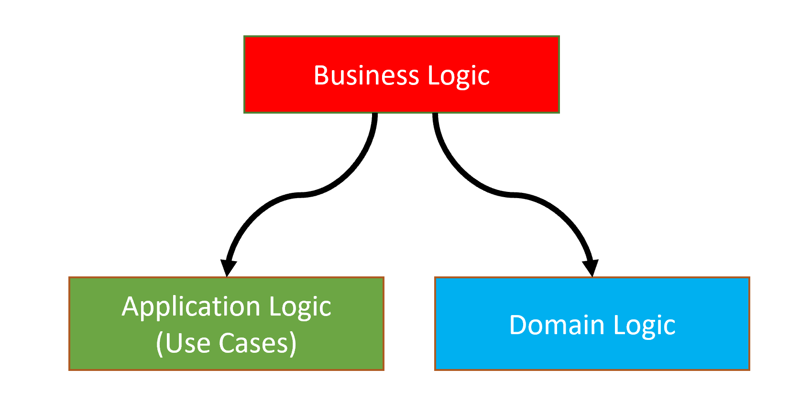

Domain Logic consists of the *Core Domain Rules* of the system while Application Logic implements application specific *Use Cases*.

While the definition is clear, the implementation may not be easy. You may be undecided which code should stand in the Application Layer, which code should be in the Domain Layer.  This section tries to explain the differences.

### Multiple Application Layers

DDD helps to **deal with complexity** when your system is large. Especially, if there are **multiple applications**  are being developed in a **single domain,** then the **Domain Logic vs Application Logic separation** becomes much more important.

Assume that you are building a system that has multiple applications;

* A **Public Web Site Application**, built with ASP.NET Core MVC, to show your products to users. Such a web site doesn't require authentication to see the products. The users login to the web site, only if they are performing some actions (like adding a product to the basket).
* A **Back Office Application**, built with Angular UI (that uses REST APIs). This application used by office workers of the company to manage the system (like editing product descriptions).
* A **Mobile Application** that has much simpler UI compared to the Public Web Site. It may communicate to the server via REST APIs or another technology (like TCP sockets).

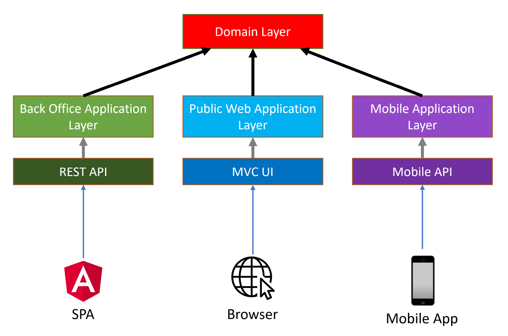

Every application will have different **requirements**, different **use cases** (Application Service methods), different **DTOs**, different **validation** and **authorization** rules... etc.

Mixing all these logics into a single application layer makes your services contain too many `if` conditions with **complicated business logic** makes your code **harder to develop, maintain and test** and leads to potential bugs.

If you've multiple applications with a single domain;

* Create **separate application layers** for each application/client type and implement application specific business logic in these separate layers.
* Use a **single domain layer** to share the core domain logic.

Such a design makes it even more important to distinguish between Domain logic and Application Logic.

To be more clear about the implementation, you can create different projects (`.csproj`) for each application types. For example;

* `IssueTracker.Admin.Application` & `IssueTracker.Admin.Application.Contacts` projects for the Back Office (admin) Application.
* `IssueTracker.Public.Application` & `IssueTracker.Public.Application.Contracts` projects for the Public Web Application.
* `IssueTracker.Mobile.Application` & `IssueTracker.Mobile.Application.Contracts` projects for the Mobile Application.

### Examples

This section contains some Application Service and Domain Service examples to discuss how to decide to place business logic inside these services.

**Example: Creating a new `Organization` in a Domain Service**

````csharp
public class OrganizationManager : DomainService
{
    private readonly IRepository<Organization> _organizationRepository;
    private readonly ICurrentUser _currentUser;
    private readonly IAuthorizationService _authorizationService;
    private readonly IEmailSender _emailSender;

    public OrganizationManager(
        IRepository<Organization> organizationRepository, 
        ICurrentUser currentUser, 
        IAuthorizationService authorizationService, 
        IEmailSender emailSender)
    {
        _organizationRepository = organizationRepository;
        _currentUser = currentUser;
        _authorizationService = authorizationService;
        _emailSender = emailSender;
    }

    public async Task<Organization> CreateAsync(string name)
    {
        if (await _organizationRepository.AnyAsync(x => x.Name == name))
        {
            throw new BusinessException("IssueTracking:DuplicateOrganizationName");
        }

        await _authorizationService.CheckAsync("OrganizationCreationPermission");

        Logger.LogDebug($"Creating organization {name} by {_currentUser.UserName}");

        var organization = new Organization();

        await _emailSender.SendAsync(
            "systemadmin@issuetracking.com",
            "New Organization",
            "A new organization created with name: " + name
        );

        return organization;
    }
}
````

Let's see the `CreateAsync` method step by step to discuss if the code part should be in the Domain Service, or not;

* **CORRECT**: It first checks for **duplicate organization name** and and throws exception in this case. This is something related to core domain rule and we never allow duplicated names.
* **WRONG**: Domain Services should not perform **authorization**. [Authorization](Authorization.md) should be done in the Application Layer.
* **WRONG**: It logs a message with including the [Current User](CurrentUser.md)'s `UserName`. Domain service should not be depend on the Current User. Domain Services should be usable even if there is no user in the system. Current User (Session) should be a Presentation/Application Layer related concept.
* **WRONG**: It sends an [email](Emailing.md) about this new organization creation. We think this is also a use case specific business logic. You may want to create different type of emails in different use cases or don't need to send emails in some cases.

**Example: Creating a new `Organization` in an Application Service**

````csharp
public class OrganizationAppService : ApplicationService
{
    private readonly OrganizationManager _organizationManager;
    private readonly IPaymentService _paymentService;
    private readonly IEmailSender _emailSender;

    public OrganizationAppService(
        OrganizationManager organizationManager,
        IPaymentService paymentService, 
        IEmailSender emailSender)
    {
        _organizationManager = organizationManager;
        _paymentService = paymentService;
        _emailSender = emailSender;
    }

    [UnitOfWork]
    [Authorize("OrganizationCreationPermission")]
    public async Task<Organization> CreateAsync(CreateOrganizationDto input)
    {
        await _paymentService.ChargeAsync(
            CurrentUser.Id,
            GetOrganizationPrice()
        );

        var organization = await _organizationManager.CreateAsync(input.Name);
        
        await _organizationManager.InsertAsync(organization);

        await _emailSender.SendAsync(
            "systemadmin@issuetracking.com",
            "New Organization",
            "A new organization created with name: " + input.Name
        );

        return organization; // !!!
    }

    private double GetOrganizationPrice()
    {
        return 42; //Gets from somewhere else...
    }
}
````

Let's see the `CreateAsync` method step by step to discuss if the code part should be in the Application Service, or not;

* **CORRECT**: Application Service methods should be unit of work (transactional). ABP's [Unit Of Work](Unit-Of-Work.md) system makes this automatic (even without need to add `[UnitOfWork]` attribute for the Application Services).
* **CORRECT**: [Authorization](Authorization.md) should be done in the application layer. Here, it is done by using the `[Authorize]` attribute.
* **CORRECT**: Payment (an infrastructure service) is called to charge money for this operation (Creating an Organization is a paid service in our business).
* **CORRECT**: Application Service method is responsible to save changes to the database.
* **CORRECT**: We can send [email](Emailing.md) as a notification to the system admin.
* **WRONG**: Do not return entities from the Application Services. Return a DTO instead.

**Discussion: Why don't we move the payment logic into the domain service?**

You may wonder why the payment code is not inside the `OrganizationManager`. It is an **important thing** and we never want to **miss the payment**.

However, **being important is not sufficient** to consider a code as a Core Business Logic. We may have **other use cases** where we don't charge money to create a new Organization. Examples;

* An admin user can use a Back Office Application to create a new organization without any payment.
* A background-working data import/integration/synchronization system may also need to create organizations without any payment operation.

As you see, **payment is not a necessary operation to create a valid organization**. It is a use-case specific application logic.

**Example: CRUD Operations**

````csharp
public class IssueAppService
{
    private readonly IssueManager _issueManager;

    public IssueAppService(IssueManager issueManager)
    {
        _issueManager = issueManager;
    }

    public async Task<IssueDto> GetAsync(Guid id)
    {
        return await _issueManager.GetAsync(id);
    }

    public async Task CreateAsync(IssueCreationDto input)
    {
        await _issueManager.CreateAsync(input);
    }

    public async Task UpdateAsync(UpdateIssueDto input)
    {
        await _issueManager.UpdateAsync(input);
    }

    public async Task DeleteAsync(Guid id)
    {
        await _issueManager.DeleteAsync(id);
    }
}
````

This Application Service **does nothing** itself and **delegates all the work** to the *Domain Service*. It even passes the DTOs to the `IssueManager`.

* **Do not** create Domain Service methods just for simple **CRUD** operations **without any domain logic**.
* **Never** pass **DTOs** to or return **DTOs** from the Domain Services.

Application Services can directly work with repositories to query, create, update or delete data unless there are some domain logics should be performed during these operations. In such cases, create Domain Service methods, but only for those really necessary.

> Do not create such CRUD domain service methods just by thinking that they may be needed in the future ([YAGNI](https://en.wikipedia.org/wiki/You_aren%27t_gonna_need_it))! Do it when you need and refactor the existing code. Since the Application Layer gracefully abstracts the Domain Layer, the refactoring process doesn't effect the UI Layer and other clients.

## Reference Books

If you are more interested in the Domain Driven Design and building large-scale enterprise systems, the following books are recommended as reference books;

* "*Domain Driven Design*" by Eric Evans
* "*Implementing Domain Driven Design*" by Vaughn Vernon
* "*Clean Architecture*" by Robert C. Martin
