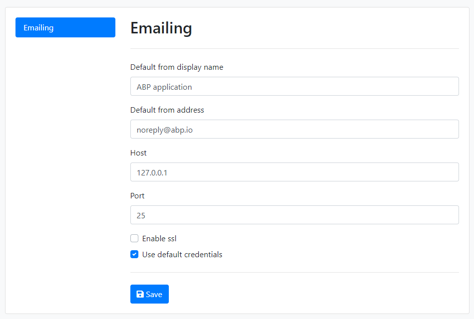

# Email Sending

ABP Framework provides various services, settings and integrations for sending emails;

* Provides `IEmailSender` service that is used to send emails.
* Defines [settings](Settings.md) to configure email sending.
* Integrates to the [background job system](Background-Jobs.md) to send emails via background jobs.
* Provides [MailKit integration](MailKit.md) package.

## Installation

> This package is already installed if you are using the [application startup template](Startup-Templates/Application.md).

It is suggested to use the [ABP CLI](CLI.md) to install this package. Open a command line window in the folder of the project (.csproj file) and type the following command:

````bash
abp add-package Volo.Abp.Emailing
````

If you haven't done it yet, you first need to install the ABP CLI. For other installation options, see [the package description page](https://abp.io/package-detail/Volo.Abp.Emailing).

## Sending Emails

### IEmailSender

[Inject](Dependency-Injection.md) the `IEmailSender` into any service and use the `SendAsync` method to send emails.

**Example**

````csharp
using System.Threading.Tasks;
using Volo.Abp.DependencyInjection;
using Volo.Abp.Emailing;

namespace MyProject
{
    public class MyService : ITransientDependency
    {
        private readonly IEmailSender _emailSender;

        public MyService(IEmailSender emailSender)
        {
            _emailSender = emailSender;
        }

        public async Task DoItAsync()
        {
            await _emailSender.SendAsync(
                "target@domain.com",     // target email address
                "Email subject",         // subject
                "This is email body..."  // email body
            );
        }
    }
}
````

`SendAsync` method has overloads to supply more parameters like;

* **from**: You can set this as the first argument to set a sender email address. If not provided, the default sender address is used (see the email settings below).
* **isBodyHtml**: Indicates whether the email body may contain HTML tags. **Default: true**.

> `IEmailSender` is the suggested way to send emails, since it makes your code provider independent.

#### MailMessage

In addition to primitive parameters, you can pass a **standard `MailMessage` object** ([see](https://docs.microsoft.com/en-us/dotnet/api/system.net.mail.mailmessage)) to the `SendAsync` method to set more options, like adding attachments.

### ISmtpEmailSender

Sending emails is implemented by the standard `SmtpClient` class ([see](https://docs.microsoft.com/en-us/dotnet/api/system.net.mail.smtpclient)) by default. The implementation class is the `SmtpEmailSender`. This class also expose the `ISmtpEmailSender` service (in addition to the `IEmailSender`).

Most of the time you want to directly use the `IEmailSender` to make your code provider independent. However, if you want to create an `SmtpClient` object with the same email settings, you can inject the `ISmtpEmailSender` and use its `BuildClientAsync` method to obtain a `SmtpClient` object and send the email yourself.

## Queueing Emails / Background Jobs

`IEmailSender` has a `QueueAsync` method that can be used to add emails to the background job queue to send them in a background thread. In this way, you don't take time of the user by waiting to send the email. `QueueAsync` method gets the same arguments with the `SendAsync` method.

Queueing emails tolerates errors since the background job system has re-try mechanism to overcome temporary network/server problems. 

See the [background jobs document](Background-Jobs.md) for more about the background job system.

## Email Settings

Email sending uses the [setting system](Settings.md) to define settings and get the values of these settings on the runtime. `Volo.Abp.Emailing.EmailSettingNames` defines constants for the setting names, just listed below:

* **Abp.Mailing.DefaultFromAddress**: Used as the sender's email address when you don't specify a sender when sending emails (just like in the example above).
* **Abp.Mailing.DefaultFromDisplayName**: Used as the sender's display name when you don't specify a sender when sending emails (just like in the example above).
* **Abp.Mailing.Smtp.Host**: The IP/Domain of the SMTP server (default: 127.0.0.1).
* **Abp.Mailing.Smtp.Port**: The Port of the SMTP server (default: 25).
* **Abp.Mailing.Smtp.UserName**: Username, if the SMTP server requires authentication.
* **Abp.Mailing.Smtp.Password**: Password, if the SMTP server requires authentication. **This value is encrypted **(see the section below).
* **Abp.Mailing.Smtp.Domain**: Domain for the username, if the SMTP server requires authentication.
* **Abp.Mailing.Smtp.EnableSsl**: A value that indicates if the SMTP server uses SSL or not ("true" or "false". Default: "false").
* **Abp.Mailing.Smtp.UseDefaultCredentials**: If true, uses default credentials instead of the provided username and password ("true" or "false". Default: "true").

Email settings can be managed from the *Settings Page* of the [Setting Management](Modules/Setting-Management.md) module:



> Setting Management module is already installed if you've created your solution from the ABP Startup template.

If you don't use the Setting Management module, you can simply define the settings inside your `appsettings.json` file:

````json
"Settings": {
  "Abp.Mailing.Smtp.Host": "127.0.0.1",
  "Abp.Mailing.Smtp.Port": "25",
  "Abp.Mailing.Smtp.UserName": "",
  "Abp.Mailing.Smtp.Password": "",
  "Abp.Mailing.Smtp.Domain": "",
  "Abp.Mailing.Smtp.EnableSsl": "false",
  "Abp.Mailing.Smtp.UseDefaultCredentials": "true",
  "Abp.Mailing.DefaultFromAddress": "noreply@abp.io",
  "Abp.Mailing.DefaultFromDisplayName": "ABP application"
}
````

You can set/change these settings programmatically using the `ISettingManager` and store values in a database. See the [setting system document](Settings.md) to understand the setting system better.

### Encrypt the SMTP Password

*Abp.Mailing.Smtp.Password* must be an **encrypted** value. If you use the `ISettingManager` to set the password, you don't have to worry. It internally encrypts the values on set and decrypts on get.

If you use the `appsettings.json` to store the password, you should manually inject the `ISettingEncryptionService` and use its `Encrypt` method to obtain an encrypted value. This can be done by creating a simple code in your application. Then you can delete the code. As better, you can create a UI in your application to configure the email settings. In this case, you can directly use the `ISettingManager` without worrying the encryption.

### ISmtpEmailSenderConfiguration

If you don't want to use the setting system to store the email sending configuration, you can replace the `ISmtpEmailSenderConfiguration` service with your own implementation to get the configuration from any other source. `ISmtpEmailSenderConfiguration` is implemented by the `SmtpEmailSenderConfiguration` by default, which gets the configuration from the setting system as explained above.

## Text Template Integration

ABP Framework provides a strong and flexible [text templating system](Text-Templating.md). You can use the text templating system to create dynamic email contents. Inject the `ITemplateRenderer` and use the `RenderAsync` to render a template. Then use the result as the email body.

While you can define and use your own text templates, email sending system provides two simple built-in text templates.

**Example: Use the standard and simple message template to send emails**

````csharp
using System.Threading.Tasks;
using Volo.Abp.DependencyInjection;
using Volo.Abp.Emailing;
using Volo.Abp.Emailing.Templates;
using Volo.Abp.TextTemplating;

namespace Acme.BookStore.Web
{
    public class MyService : ITransientDependency
    {
        private readonly IEmailSender _emailSender;
        private readonly ITemplateRenderer _templateRenderer;

        public MyService(
        IEmailSender emailSender,
        ITemplateRenderer templateRenderer)
        {
            _emailSender = emailSender;
            _templateRenderer = templateRenderer;
        }

        public async Task DoItAsync()
        {
            var body = await _templateRenderer.RenderAsync(
                StandardEmailTemplates.Message,
                new
                {
                    message = "This is email body..."
                }
            );
            
            await _emailSender.SendAsync(
                "target-address@domain.com",
                "Email subject",
                body
            );
        }
    }
}
````

The resulting email body will be shown below:

````html
<!DOCTYPE html>
<html lang="en" xmlns="http://www.w3.org/1999/xhtml">
<head>
    <meta charset="utf-8" />
</head>
<body>
    This is email body...
</body>
</html>
````

Emailing system defines the built-in text templates with the given names:

"**Abp.StandardEmailTemplates.Message**" is simplest template that has a text message:

````html

````

This template uses the "Abp.StandardEmailTemplates.Layout" as its layout.

"**Abp.StandardEmailTemplates.Layout**" is a simple template to provide an HTML document layout:

````html
<!DOCTYPE html>
<html lang="en" xmlns="http://www.w3.org/1999/xhtml">
<head>
    <meta charset="utf-8" />
</head>
<body>
    
</body>
</html>
````

The final rendered message was shown above.

> These template names are contants defined in the `Volo.Abp.Emailing.Templates.StandardEmailTemplates` class.

### Overriding/Replacing the Standard Templates

You typically want to replace the standard templates with your own ones, so you can prepare a branded email messages. To do that, you can use the power of the [virtual file system](Virtual-File-System.md) (VFS) or replace them in your own template definition provider.

Pathes of the templates in the virtual file system are shown below:

* `/Volo/Abp/Emailing/Templates/Layout.tpl`
* `/Volo/Abp/Emailing/Templates/Message.tpl`

If you add files to the same location in the virtual file system, your files will override them.

Templates are inline localized, that means you can take the power of the [localization system](Localization.md) to make your templates multi-cultural.

See the [text templating system](Text-Templating.md) document for details.

> Notice that you can define and use your own templates for your application, rather than using the standard simple templates. These standard templates are mostly for reusable modules where they don't define their own templates but rely on the built-in ones. This makes easy to customize emails sent by the used modules, by just overriding the standard email layout template.

## NullEmailSender

`NullEmailSender` is a built-in class that implements the `IEmailSender`, but writes email contents to the [standard log system](Logging.md), rathen than actually sending the emails.

This class can be useful especially in development time where you generally don't want to send real emails. The [application startup template](Startup-Templates/Application.md) already uses this class in the **DEBUG mode** with the following configuration in the domain layer:

````csharp
#if DEBUG
  context.Services.Replace(ServiceDescriptor.Singleton<IEmailSender, NullEmailSender>());
#endif
````

So, don't confuse if you don't receive emails on DEBUG mode. Emails will be sent as expected on production (RELEASE mode). Remove these lines if you want to send real emails on DEBUG too.

## See Also

* [MailKit integration for sending emails](MailKit.md)
