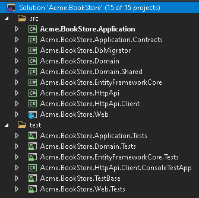
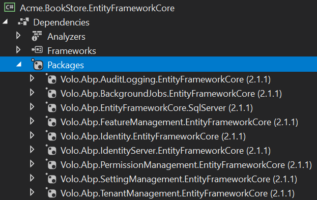
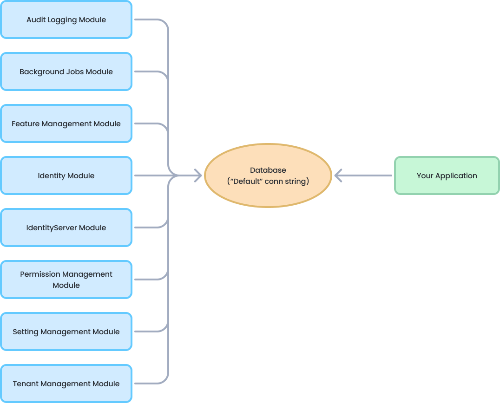
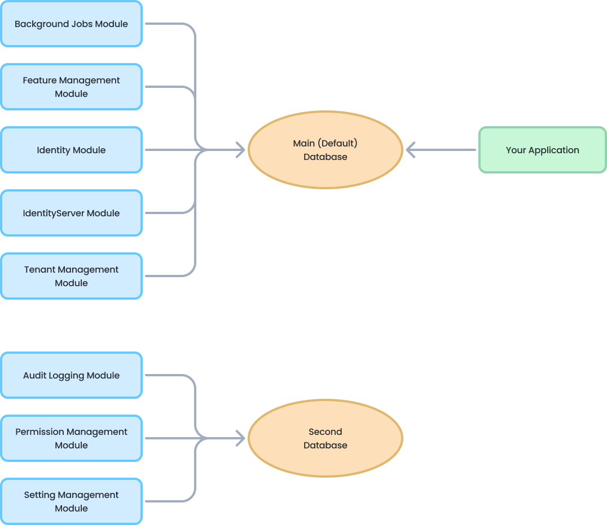

# EF Core Database Migrations

This document begins by **introducing the default structure** provided by [the application startup template](Startup-Templates/Application.md) and **discusses various scenarios** you may want to implement for your own application.

> This document is for who want to fully understand and customize the database structure comes with [the application startup template](Startup-Templates/Application.md). If you simply want to create entities and manage your code first migrations, just follow [the startup tutorials](Tutorials/Part-1.md).

### Source Code

You can find the source code of the example project referenced by this document [here](https://github.com/abpframework/abp-samples/tree/master/EfCoreMigrationDemo). However, you need to read and understand this document in order to understand the example project's source code.

## About the EF Core Code First Migrations

Entity Framework Core provides an easy to use and powerful [database migration system](https://docs.microsoft.com/en-us/ef/core/managing-schemas/migrations/). ABP Framework [startup templates](Startup-Templates/Index.md) take the advantage of this system to allow you to develop your application in a standard way.

However, EF Core migration system is **not so good in a modular environment** where each module maintains its **own database schema** while two or more modules may **share a single database** in practical.

Since ABP Framework cares about modularity in all aspects, it provides a **solution** to this problem. It is important to understand this solution if you need to **customize your database structure**.

> See [EF Core's own documentation](https://docs.microsoft.com/en-us/ef/core/managing-schemas/migrations/) to fully learn the EF Core Code First Migrations and why you need to such a system.

## The Default Solution & Database Configuration

When you [create a new web application](https://abp.io/get-started) (with EF Core, which is the default database provider), your solution structure will be similar to the picture below:



Actual solution structure may be a bit different based on your preferences, but the database part will be same.

> This document will use the `Acme.BookStore` example project name to refer the projects and classes. You need to find the corresponding class/project in your solution.

### The Database Structure

The startup template has some [application modules](Modules/Index.md) pre-installed. Each layer of the solution has corresponding module **package references**. So, the `.EntityFrameworkCore` project has the NuGet references for the `.EntityFrameworkCore` packages of the used modules:



In this way, you collect all the **EF Core dependencies** under the `.EntityFrameworkCore` project.

> In addition to the module references, it references to the `Volo.Abp.EntityFrameworkCore.SqlServer` package since the startup template is pre-configured for the **SQL Server**. See the documentation if you want to [switch to another DBMS](Entity-Framework-Core-Other-DBMS.md).

While every module has its own `DbContext` class by design and can use its **own physical database**, the solution is configured to use a **single shared database** as shown in the figure below:



This is **the simplest configuration** and suitable for most of the applications. `appsettings.json` file has a **single connection string**, named `Default`:

````json
"ConnectionStrings": {
  "Default": "..."
}
````

So, you have a **single database schema** which contains all the tables of the modules **sharing** this database.

ABP Framework's [connection string](Connection-Strings.md) system allows you to easily **set a different connection string** for a desired module:

````json
"ConnectionStrings": {
  "Default": "...",
  "AbpAuditLogging": "..."
}
````

The example configuration tells to the ABP Framework to use the second connection string for the [Audit Logging module](Modules/Audit-Logging.md) (if you don't specify connection string for a module, it uses the `Default` connection string).

**However, this can work only if the audit log database with the given connection string is available**. So, you need to create the second database, create audit log tables inside it and maintain the database tables. No problem if you manually do all these. However, the recommended approach is the code first migrations. One of the main purposes of this document is to guide you on such **database separation** scenarios.

#### Module Tables

Every module uses its **own databases tables**. For example, the [Identity Module](Modules/Identity.md) has some tables to manage the users and roles in the system.

##### Table Prefixes

Since it is allowed to share a single database by all modules (it is the default configuration), a module typically uses a **table name prefix** to group its own tables.

The fundamental modules, like [Identity](Modules/Identity.md), [Tenant Management](Modules/Tenant-Management.md) and [Audit Logs](Modules/Audit-Logging.md), use the `Abp` prefix, while some other modules use their own prefixes. [Identity Server](Modules/IdentityServer.md) module uses the `IdentityServer` prefix for example.

If you want, you can **change the database table name prefix** for a module for your application. Example:

````csharp
Volo.Abp.IdentityServer.AbpIdentityServerDbProperties.DbTablePrefix = "Ids";
````

This code changes the prefix of the [Identity Server](Modules/IdentityServer.md) module. Write this code **at the very beginning** in your application.

> Every module also defines `DbSchema` property (near to `DbTablePrefix`), so you can set it for the databases support the schema usage.

### .EntityFrameworkCore Project

The solution contains a project, which's name ends with `.EntityFrameworkCore`. This project has the `DbContext` class (`BookStoreDbContext` for this sample) of your application.

**Every module uses its own `DbContext` class** to access to the database. Likewise, your application has its own `DbContext`. You typically use this `DbContext` in your application code (in your [repositories](Repositories.md) if you follow the best practices and hide your data access code behind the repositories). It is almost an empty `DbContext` since your application don't have any entities at the beginning:

````csharp
[ReplaceDbContext(typeof(IIdentityDbContext))]
[ReplaceDbContext(typeof(ITenantManagementDbContext))]
[ConnectionStringName("Default")]
public class BookStoreDbContext :
    AbpDbContext<BookStoreDbContext>,
    IIdentityDbContext,
    ITenantManagementDbContext
{
    /* Add DbSet properties for your Aggregate Roots / Entities here. */
        
    /* DbSet for entities from the replaced DbContexts */

    public BookStoreDbContext(DbContextOptions<BookStoreDbContext> options)
        : base(options)
    {

    }

    protected override void OnModelCreating(ModelBuilder builder)
    {
        base.OnModelCreating(builder);
        
        /* Include modules to your migration db context */
        builder.ConfigurePermissionManagement();
        builder.ConfigureSettingManagement();
        builder.ConfigureBackgroundJobs();
        builder.ConfigureAuditLogging();
        builder.ConfigureIdentity();
        builder.ConfigureIdentityServer();
        builder.ConfigureFeatureManagement();
        builder.ConfigureTenantManagement();

        /* Configure your own tables/entities here. Example: */        
        //builder.Entity<YourEntity>(b =>
        //{
        //    b.ToTable("YourEntities");
        //    b.ConfigureByConvention(); //auto configure for the base properties
        //    //...
        //});
    }
}
````

This `DbContext` class needs some explanations:

* It defines `[ReplaceDbContext]` attributes for `IIdentityDbContext` and `ITenantManagementDbContext` those replaces Identity and Tenant Management module's `DbContext`s by your `DbContext` on runtime. This allows us to easily perform LINQ queries by joining your entities with the entities (over the repositories) coming from those modules.
* It defines a `[ConnectionStringName]` attribute which tells ABP to always use the `Default` connection string for this `Dbcontext`.
* It inherits from the `AbpDbContext<T>`  instead of the standard `DbContext` class. You can see the [EF Core integration](Entity-Framework-Core.md) document for more. For now, know that the `AbpDbContext<T>` base class implements some conventions of the ABP Framework to automate some common tasks for you.
* It declares `DbSet` properties for entities from the replaced `DbContext`s (by implementing the corresponding interfaces). These `DbSet` properties are not shown above (for the sake of brevity), but you can find in your application's code in a `region`.
* The constructor takes a `DbContextOptions<T>` instance.
* It overrides the `OnModelCreating` method to define the EF Core mappings.
  * It first calls the the `base.OnModelCreating` method to let the ABP Framework to implement the base mappings for us.
  * It then calls some `builder.ConfigureXXX()` methods for the used modules. This makes possible to add database mappings for these modules to this `DbContext`, so it creates the database tables of the modules when we add a new EF Core database migration.
  * You can configure the mappings for your own entities as commented in the example code. At this point, you can also change mappings for the modules you are using.

### Discussion of an Alternative Scenario: Every Module Manages Its Own Migration Path

As mentioned before, in the `.EntityFrameworkCore` project, we merge all the database mappings of all the modules (plus your application's mappings) to create a unified migration path.

An alternative approach would be to allow each module to have its own migrations to maintain its database tables. While it seems more modular in the beginning, it has some drawbacks in practical:

* **EF Core migration system depends on the DBMS provider**. For example, if a module has created migrations for SQL Server, then you can not use this migration code for MySQL. It is not practical for a module to maintain migrations for all available DBMS providers. Leaving the migration to the application code (as explained in this document) allows you to **choose the DBMS in the application** code. If you can depend on a specific DBMS in your module, that's not an issue for you, however all pre-built ABP modules are DBMS agnostic.
* It would be harder to **customize/enhance** the mapping and the resulting migration code, in the final application.
* It would be harder to track and **apply changes** to database when you use multiple modules.

## Using Multiple Databases

The default startup template is organized to use a **single database** used by all the modules and by your application. However, the ABP Framework and all the pre-built modules are designed so that **they can use multiple databases**. Each module can use its own database or you can group modules into a few databases.

This section will explain how to move Audit Logging, Setting Management and Permission Management module tables to a **second database** while the remaining modules continue to use the main ("Default") database.

The resulting structure will be like the figure below:



### Change the Connection Strings Section

First step is to change the connection string section inside all the `appsettings.json` files. Initially, it is like that:

````json
"ConnectionStrings": {
  "Default": "Server=(LocalDb)\MSSQLLocalDB;Database=BookStore;Trusted_Connection=True"
}
````

Change it as shown below:

````json
"ConnectionStrings": {
  "Default": "Server=(LocalDb)\\MSSQLLocalDB;Database=BookStore;Trusted_Connection=True",
  "AbpPermissionManagement": "Server=(LocalDb)\\MSSQLLocalDB;Database=BookStore_SecondDb;Trusted_Connection=True",
  "AbpSettingManagement": "Server=(LocalDb)\\MSSQLLocalDB;Database=BookStore_SecondDb;Trusted_Connection=True",
  "AbpAuditLogging": "Server=(LocalDb)\MSSQLLocalDB;Database=BookStore_SecondDb;Trusted_Connection=True"
}
````

Added **three more connection strings** for the related module to target the `BookStore_SecondDb` database (they are all the same). For example, `AbpPermissionManagement` is the connection string name used by the permission management module.

The `AbpPermissionManagement` is a constant [defined](https://github.com/abpframework/abp/blob/97eaa6ff5a044f503465455c86332e5a277b077a/modules/permission-management/src/Volo.Abp.PermissionManagement.Domain/Volo/Abp/PermissionManagement/AbpPermissionManagementDbProperties.cs#L11) by the permission management module. ABP Framework [connection string selection system](Connection-Strings.md) selects this connection string for the permission management module if you define. If you don't define, it fallbacks to the `Default` connection string.

### Create a Second DbContext

Defining the connection strings as explained above is enough **on runtime**. However, `BookStore_SecondDb` database doesn't exist yet. You need to create the database and the tables for the related modules.

Just like the main database, we want to use the EF Core Code First migration system to create and maintain the second database. So, create a new `DbContext` class inside the `.EntityFrameworkCore` project:

````csharp
using Microsoft.EntityFrameworkCore;
using Volo.Abp.AuditLogging.EntityFrameworkCore;
using Volo.Abp.Data;
using Volo.Abp.EntityFrameworkCore;
using Volo.Abp.PermissionManagement.EntityFrameworkCore;
using Volo.Abp.SettingManagement.EntityFrameworkCore;

namespace BookStore.EntityFrameworkCore
{
    [ConnectionStringName("AbpPermissionManagement")]
    public class BookStoreSecondDbContext :
        AbpDbContext<BookStoreSecondDbContext>
    {
        public BookStoreSecondDbContext(
            DbContextOptions<BookStoreSecondDbContext> options)
            : base(options)
        {
        }

        protected override void OnModelCreating(ModelBuilder builder)
        {
            base.OnModelCreating(builder);

            /* Include modules to your migration db context */
            builder.ConfigurePermissionManagement();
            builder.ConfigureSettingManagement();
            builder.ConfigureAuditLogging();
        }
    }
}
````

> `[ConnectionStringName(...)]` attribute is important here and tells to the ABP Framework which connection string should be used for this `DbContext`. We've used `AbpPermissionManagement`, but all are the same.

We need to register this `BookStoreSecondDbContext` class to the dependency injection system. Open the `BookStoreEntityFrameworkCoreModule` class in the `BookStore.EntityFrameworkCore` project and add the following line into the `ConfigureServices` method:

````csharp
context.Services.AddAbpDbContext<BookStoreSecondDbContext>();
````

We should also create a **Design Time Db Factory** class, that is used by the EF Core tooling (by `Add-Migration` and `Update-Database` PCM commands for example):

````csharp
using System.IO;
using Microsoft.EntityFrameworkCore;
using Microsoft.EntityFrameworkCore.Design;
using Microsoft.Extensions.Configuration;

namespace BookStore.EntityFrameworkCore
{
    /* This class is needed for EF Core console commands
     * (like Add-Migration and Update-Database commands) */
    public class BookStoreSecondDbContextFactory
        : IDesignTimeDbContextFactory<BookStoreSecondDbContext>
    {
        public BookStoreSecondDbContext CreateDbContext(string[] args)
        {
            var configuration = BuildConfiguration();
            var builder = new DbContextOptionsBuilder<BookStoreSecondDbContext>()
                .UseSqlServer(configuration.GetConnectionString("AbpPermissionManagement"));
            return new BookStoreSecondDbContext(builder.Options);
        }

        private static IConfigurationRoot BuildConfiguration()
        {
            var builder = new ConfigurationBuilder()
                .SetBasePath(Path.Combine(Directory.GetCurrentDirectory(), "../BookStore.DbMigrator/"))
                .AddJsonFile("appsettings.json", optional: false);

            return builder.Build();
        }
    }
}
````

Now, you can open the Package Manager Console, select the `.EntityFrameworkCore` project as the default project (make sure the `.Web` project is still the startup project) and run the following command:

````bash
Add-Migration "Initial" -OutputDir "SecondDbMigrations" -Context BookStoreSecondDbContext
````

This will add a `SecondDbMigrations` folder in the `.EntityFrameworkCore` project and a migration class inside it. `OutputDir` and `Context` parameters are required since we currently have two `DbContext` class and two migrations folder in the same project.

You can now run the following command to create the database and the tables inside it:

````bash
Update-Database -Context BookStoreSecondDbContext
````

A new database, named `BookStore_SecondDb` should be created.

### Remove Modules from the Main Database

We've **created a second database** that contains tables for the Audit Logging, Permission Management and Setting Management modules. So, we should **delete these tables from the main database**. It is pretty easy.

First, remove the following lines from the `BookStoreDbContext` class:

````csharp
builder.ConfigurePermissionManagement();
builder.ConfigureSettingManagement();
builder.ConfigureAuditLogging();
````

Open the Package Manager Console, select the `.EntityFrameworkCore` as the Default project (make sure that the `.Web` project is still the startup project) and run the following command:

````
Add-Migration "Removed_Audit_Setting_Permission_Modules" -Context BookStoreDbContext
````

This command will create a new migration class as shown below:

````csharp
public partial class Removed_Audit_Setting_Permission_Modules : Migration
{
    protected override void Up(MigrationBuilder migrationBuilder)
    {
        migrationBuilder.DropTable(
            name: "AbpAuditLogActions");

        migrationBuilder.DropTable(
            name: "AbpEntityPropertyChanges");

        migrationBuilder.DropTable(
            name: "AbpPermissionGrants");

        migrationBuilder.DropTable(
            name: "AbpSettings");

        migrationBuilder.DropTable(
            name: "AbpEntityChanges");

        migrationBuilder.DropTable(
            name: "AbpAuditLogs");
    }

    ...
}
````

Be careful in this step:

* If you have a **live system**, then you should care about the **data loss**. You need to move the table contents to the second database before deleting the tables.
* If you **haven't started** your project yet, you can consider to **remove all the migrations** and re-create the initial one to have a cleaner migration history.

Run the following command to delete the tables from your main database:

````bash
Update-Database -Context BookStoreDbContext
````

Notice that you've also **deleted some initial seed data** (for example, permission grants for the admin role) if you haven't copied it to the new database. If you run the application, you may not login anymore. The solution is simple: **Re-run the `.DbMigrator` console application** in your solution, it will seed the new database.

### Automate the Second Database Schema Migration

`.DbMigrator` console application can run the database seed code across multiple databases, without any additional configuration. However, it can not apply the EF Core Code First Migrations for the database of the `BookStoreSecondDbContext`. Now, you will see how to configure the console migration application to handle both databases.

`EntityFrameworkCoreBookStoreDbSchemaMigrator` class inside the `Acme.BookStore.EntityFrameworkCore` project is responsible to migrate the database schema for the `BookStoreMigrationsDbContext`. It should be like that:

````csharp
using System;
using System.Threading.Tasks;
using Microsoft.EntityFrameworkCore;
using Microsoft.Extensions.DependencyInjection;
using BookStore.Data;
using Volo.Abp.DependencyInjection;

namespace BookStore.EntityFrameworkCore
{
    public class EntityFrameworkCoreBookStoreDbSchemaMigrator
        : IBookStoreDbSchemaMigrator, ITransientDependency
    {
        private readonly IServiceProvider _serviceProvider;

        public EntityFrameworkCoreBookStoreDbSchemaMigrator(
            IServiceProvider serviceProvider)
        {
            _serviceProvider = serviceProvider;
        }

        public async Task MigrateAsync()
        {
            /* We intentionally resolving the BookStoreDbContext
             * from IServiceProvider (instead of directly injecting it)
             * to properly get the connection string of the current tenant in the
             * current scope.
             */

            await _serviceProvider
                .GetRequiredService<BookStoreDbContext>()
                .Database
                .MigrateAsync();
        }
    }
}
````

Add the following code inside the `MigrateAsync` method:

````csharp
await _serviceProvider
    .GetRequiredService<BookStoreSecondDbContext>()
    .Database
    .MigrateAsync();
````

So, the `MigrateAsync` method should look like the following:

````csharp
public async Task MigrateAsync()
{
    /* We intentionally resolving the BookStoreDbContext
        * from IServiceProvider (instead of directly injecting it)
        * to properly get the connection string of the current tenant in the
        * current scope.
        */

    await _serviceProvider
        .GetRequiredService<BookStoreDbContext>()
        .Database
        .MigrateAsync();

    await _serviceProvider
        .GetRequiredService<BookStoreSecondDbContext>()
        .Database
        .MigrateAsync();
}
````

That's all. You can now run the `.DbMigrator` application to migrate & seed the databases. To test, you can delete both databases and run the `.DbMigrator` application again to see if it creates both of the databases.

### Fixing the Tests

Creating a new DbContext will break the integration tests. It is easy to fix. Open the `BookStoreEntityFrameworkCoreTestModule` class in the `BookStore.EntityFrameworkCore.Tests` project, find the `CreateDatabaseAndGetConnection` method. It should be like that:

````csharp
private static SqliteConnection CreateDatabaseAndGetConnection()
{
    var connection = new SqliteConnection("Data Source=:memory:");
    connection.Open();

    var options = new DbContextOptionsBuilder<BookStoreDbContext>()
        .UseSqlite(connection)
        .Options;

    using (var context = new BookStoreDbContext(options))
    {
        context.GetService<IRelationalDatabaseCreator>().CreateTables();
    }

    return connection;
}
````

Change it as the following:

````csharp
private static SqliteConnection CreateDatabaseAndGetConnection()
{
    var connection = new SqliteConnection("Data Source=:memory:");
    connection.Open();

    var options = new DbContextOptionsBuilder<BookStoreDbContext>()
        .UseSqlite(connection)
        .Options;

    using (var context = new BookStoreDbContext(options))
    {
        context.GetService<IRelationalDatabaseCreator>().CreateTables();
    }

    // Add the following code --------------
    var optionsForSecondDb = new DbContextOptionsBuilder<BookStoreSecondDbContext>()
        .UseSqlite(connection)
        .Options;

    using (var context = new BookStoreSecondDbContext(optionsForSecondDb))
    {
        context.GetService<IRelationalDatabaseCreator>().CreateTables();
    }
    //--------------------------------------

    return connection;
}
````

Integration tests now will work. I've used the same database in the tests to keep it simple.

## Separating Host & Tenant Database Schemas

In a multi-tenant solution, you may want to separate your database schemas, so host-related tables don't locate in the tenant databases when tenants have separate databases.

Some pre-built ABP modules are related only with the host side, like the [Tenant Management](Modules/Tenant-Management.md) module. So, in the tenant `DbContext` class you don't call `modelBuilder.ConfigureTenantManagement()` and that's all. 

Some modules, like the [Identity](Modules/Identity.md) module, is both used in host and tenant sides. It stores tenant users in the tenant database and host users in the host database. However, it stores some entities, like `IdentityClaimType`, only in the host side. In this case, you don't want to add these tables in the tenant database, even if they are not used and will always be empty for tenants.

ABP provides a simple way to set the multi-tenancy side for a `DbContext`, so the modules can check it and decide to map tables to the database, or not.

````csharp
public class MyTenantDbContext : AbpDbContext<MyTenantDbContext>
{
    protected override void OnModelCreating(ModelBuilder modelBuilder)
    {
        modelBuilder.SetMultiTenancySide(MultiTenancySides.Tenant);
        
        base.OnModelCreating(modelBuilder);
        
        modelBuilder.ConfigureIdentity();
        modelBuilder.ConfigureFeatureManagement();
        modelBuilder.ConfigureAuditLogging();
    }
}
````

The first line in the `OnModelCreating` sets multi-tenancy side to `Tenant`. For this example, Feature management tables are not created (because all the tables are host-specific), so calling `modelBuilder.ConfigureFeatureManagement()` has no effect. Also, `ConfigureIdentity()` call respects to the multi-tenancy side and doesn't create host-specific tables for this database.

`SetMultiTenancySide` can get the following values:

* `MultiTenancySides.Both` (**default value**): This `DbContext` (and the related database) is shared by host and tenant.
* `MultiTenancySides.Host`: This `DbContext` (and the related database) is used only by the host side.
* `MultiTenancySides.Tenant`: This `DbContext` (and the related database) is only for tenants.

If you create a re-usable application module or want to check that value in your application code, you can use `modelBuilder.GetMultiTenancySide()` to check the current side.

````csharp
var side = modelBuilder.GetMultiTenancySide();
if (!side.HasFlag(MultiTenancySides.Host))
{
    ...
}
````

Or practically you can use one of the shortcut extension methods:

````csharp
if (modelBuilder.IsTenantOnlyDatabase())
{
    ...
}
````

There are four methods to check the current side:

* `IsHostDatabase()`: Returns `true` if you should create host-related tables. It is equivalent of checking `modelBuilder.GetMultiTenancySide().HasFlag(MultiTenancySides.Host)`.
* `IsHostOnlyDatabase()`: Returns `true` if you should only create host-related tables, but should not create tenant-related tables. It is equivalent of checking `modelBuilder.GetMultiTenancySide() == MultiTenancySides.Host`.
* `IsTenantDatabase()`: Returns `true` if you should create tenant-related tables. It is equivalent of checking `modelBuilder.GetMultiTenancySide().HasFlag(MultiTenancySides.Tenant)`.
* `IsTenantOnlyDatabase()`: Returns `true` if you should only create tenant-related tables, but should not create host-related tables. It is equivalent of checking `modelBuilder.GetMultiTenancySide() == MultiTenancySides.Tenant`.

All pre-built ABP [modules](Modules/Index.md) checks this value in their `modelBuilder.ConfigureXXX()` methods.

## Conclusion

This document explains how to split your databases and manage your database migrations of your solution for Entity Framework Core. In brief, you need to have a separate migration project per different databases.

## Source Code

You can find the source code of the example project referenced by this document [here](https://github.com/abpframework/abp-samples/tree/master/EfCoreMigrationDemo). You can also find the changes explained in this document as a [single commit](https://github.com/abpframework/abp-samples/pull/95/commits/c2ffd76175e0a6fdfcf6477bbaea23dc2793fedd).