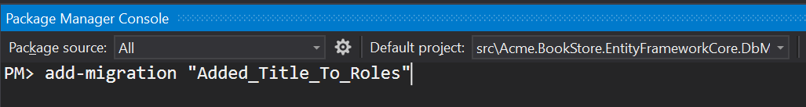
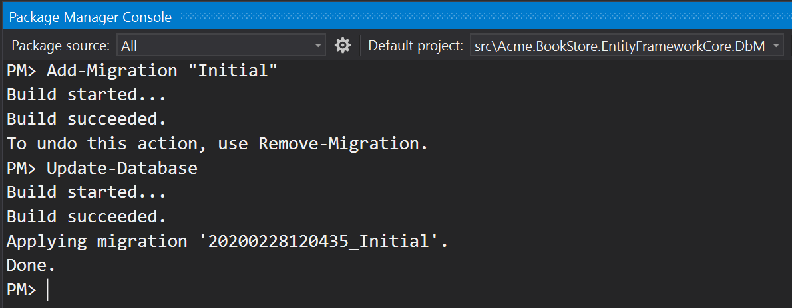

# EF Core Database Migrations

This document begins by **introducing the default structure** provided by [the application startup template](Startup-Templates/Application.md) and **discusses various scenarios** you may want to implement for your own application.

> This document is for who want to fully understand and customize the database structure comes with [the application startup template](Startup-Templates/Application.md). If you simply want to create entities and manage your code first migrations, just follow [the startup tutorials](Tutorials/Part-1.md).

### Source Code

You can find the source code of the example project referenced by this document [here](https://github.com/abpframework/abp-samples/tree/master/EfCoreMigrationDemo). However, you need to read and understand this document in order to understand the example project's source code.

## About the EF Core Code First Migrations

Entity Framework Core provides an easy to use and powerful [database migration system](https://docs.microsoft.com/en-us/ef/core/managing-schemas/migrations/). ABP Framework [startup templates](Startup-Templates/Index.md) take the advantage of this system to allow you to develop your application in a standard way.

However, EF Core migration system is **not so good in a modular environment** where each module maintains its **own database schema** while two or more modules may **share a single database** in practical.

Since ABP Framework cares about modularity in all aspects, it provides a **solution** to this problem. It is important to understand this solution if you need to **customize your database structure**.

> See [EF Core's own documentation](https://docs.microsoft.com/en-us/ef/core/managing-schemas/migrations/) to fully learn the EF Core Code First Migrations and why you need to such a system.

## The Default Solution & Database Configuration

When you [create a new web application](https://abp.io/get-started) (with EF Core, which is the default database provider), your solution structure will be similar to the picture below:


Actual solution structure may be a bit different based on your preferences, but the database part will be same.

> This document will use the `Acme.BookStore` example project name to refer the projects and classes. You need to find the corresponding class/project in your solution.

### The Database Structure

The startup template has some [application modules](Modules/Index.md) pre-installed. Each layer of the solution has corresponding module **package references**. So, the `.EntityFrameworkCore` project has the NuGet references for the `.EntityFrameworkCore` packages of the used modules:


In this way, you collect all the **EF Core dependencies** under the `.EntityFrameworkCore` project.

> In addition to the module references, it references to the `Volo.Abp.EntityFrameworkCore.SqlServer` package since the startup template is pre-configured for the **SQL Server**. See the documentation if you want to [switch to another DBMS](Entity-Framework-Core-Other-DBMS.md).

While every module has its own `DbContext` class by design and can use its **own physical database**, the solution is configured to use a **single shared database** as shown in the figure below:


This is **the simplest configuration** and suitable for most of the applications. `appsettings.json` file has a **single connection string**, named `Default`:

````json
"ConnectionStrings": {
  "Default": "..."
}
````

So, you have a **single database schema** which contains all the tables of the modules **sharing** this database.

ABP Framework's [connection string](Connection-Strings.md) system allows you to easily **set a different connection string** for a desired module:

````json
"ConnectionStrings": {
  "Default": "...",
  "AbpAuditLogging": "..."
}
````

The example configuration about tells to the ABP Framework to use the second connection string for the [Audit Logging module](Modules/Audit-Logging.md).

**However, this is just the beginning**. You also need to create the second database, create audit log tables inside it and maintain the database tables using the code first migrations approach. One of the main purposes of this document is to guide you on such **database separation** scenarios.

#### Module Tables

Every module uses its **own databases tables**. For example, the [Identity Module](Modules/Identity.md) has some tables to manage the users and roles in the system.

##### Table Prefixes

Since it is allowed to share a single database by all modules (it is the default configuration), a module typically uses a **table name prefix** to group its own tables.

The fundamental modules, like [Identity](Modules/Identity.md), [Tenant Management](Modules/Tenant-Management.md) and [Audit Logs](Modules/Audit-Logging.md), use the `Abp` prefix, while some other modules use their own prefixes. [Identity Server](Modules/IdentityServer.md) module uses the `IdentityServer` prefix for example.

If you want, you can **change the database table name prefix** for a module for your application. Example:

````csharp
Volo.Abp.IdentityServer.AbpIdentityServerDbProperties.DbTablePrefix = "Ids";
````

This code changes the prefix of the [Identity Server](Modules/IdentityServer.md) module. Write this code **at the very beginning** in your application.

> Every module also defines `DbSchema` property (near to `DbTablePrefix`), so you can set it for the databases support the schema usage.

### The Projects

From the database point of view, there are three important projects those will be explained in the next sections.

#### .EntityFrameworkCore Project

This project has the `DbContext` class (`BookStoreDbContext` for this sample) of your application.

**Every module uses its own `DbContext` class** to access to the database. Likewise, your application has its own `DbContext`. You typically use this `DbContext` in your application code (in your [repositories](Repositories.md) if you follow the best practices). It is almost an empty `DbContext` since your application don't have any entities at the beginning, except the pre-defined `AppUser` entity:

````csharp
[ConnectionStringName("Default")]
public class BookStoreDbContext : AbpDbContext<BookStoreDbContext>
{
    public DbSet<AppUser> Users { get; set; }

    /* Add DbSet properties for your Aggregate Roots / Entities here. */

    public BookStoreDbContext(DbContextOptions<BookStoreDbContext> options)
        : base(options)
    {

    }

    protected override void OnModelCreating(ModelBuilder builder)
    {
        base.OnModelCreating(builder);

        /* Configure the shared tables (with included modules) here */

        builder.Entity<AppUser>(b =>
        {
            //Sharing the same Users table with the IdentityUser
            b.ToTable(AbpIdentityDbProperties.DbTablePrefix + "Users"); 

            b.ConfigureByConvention();
            b.ConfigureAbpUser();

            /* Configure mappings for your additional properties
             * Also see the MyProjectNameEntityExtensions class
             */
        });

        /* Configure your own tables/entities inside the ConfigureBookStore method */
        builder.ConfigureBookStore();
    }
}
````

This simple `DbContext` class still needs some explanations:

* It defines a `[ConnectionStringName]` attribute which tells ABP to always use the `Default` connection string for this `Dbcontext`.
* It inherits from the `AbpDbContext<T>`  instead of the standard `DbContext` class. You can see the [EF Core integration](Entity-Framework-Core.md) document for more. For now, know that the `AbpDbContext<T>` base class implements some conventions of the ABP Framework to automate some common tasks for you.
* It declares a `DbSet` property for the `AppUser` entity. `AppUser` shares the same table (named `AbpUsers` by default) with the `IdentityUser` entity of the [Identity module](Modules/Identity.md). The startup template provides this entity inside the application since we think that the User entity is generally needs to be customized in your application.
* The constructor takes a `DbContextOptions<T>` instance.
* It overrides the `OnModelCreating` method to define the EF Core mappings.
  * It first calls the the `base.OnModelCreating` method to let the ABP Framework to implement the base mappings for us.
  * It then configures the mapping for the `AppUser` entity. There is a special case for this entity (it shares a table with the Identity module), which will be explained in the next sections.
  * It finally calls the `builder.ConfigureBookStore()` extension method to configure other entities of your application.

This design will be explained in more details after introducing the other database related projects.

#### .EntityFrameworkCore.DbMigrations Project

As mentioned in the previous section, every module (and your application) have **their own** separate `DbContext` classes. Each `DbContext` class only defines the entity to table mappings related to its own module and each module (and your application) use the related `DbContext` class **on runtime**.

As you know, EF Core Code First migration system relies on a `DbContext` class **to track and generate** the code first migrations. So, which `DbContext` we should use for the migrations? The answer is *none of them*. There is another `DbContext` defined in the `.EntityFrameworkCore.DbMigrations` project (which is the `BookStoreMigrationsDbContext` for this example solution).

##### The MigrationsDbContext

The `MigrationsDbContext` is only used to create and apply the database migrations. It is **not used on runtime**. It **merges** all the entity to table mappings of all the used modules plus the application's mappings.

In this way, you create and maintain a **single database migration path**. However, there are some difficulties of this approach and the next sections explains how ABP Framework overcomes these difficulties. But first, see the `BookStoreMigrationsDbContext` class as an example:

````csharp
/* This DbContext is only used for database migrations.
 * It is not used on runtime. See BookStoreDbContext for the runtime DbContext.
 * It is a unified model that includes configuration for
 * all used modules and your application.
 */
public class BookStoreMigrationsDbContext : AbpDbContext<BookStoreMigrationsDbContext>
{
    public BookStoreMigrationsDbContext(
        DbContextOptions<BookStoreMigrationsDbContext> options)
        : base(options)
    {

    }

    protected override void OnModelCreating(ModelBuilder builder)
    {
        base.OnModelCreating(builder);

        /* Include modules to your migration db context */
        builder.ConfigurePermissionManagement();
        builder.ConfigureSettingManagement();
        builder.ConfigureBackgroundJobs();
        builder.ConfigureAuditLogging();
        builder.ConfigureIdentity();
        builder.ConfigureIdentityServer();
        builder.ConfigureFeatureManagement();
        builder.ConfigureTenantManagement();

        /* Configure your own tables/entities inside the ConfigureBookStore method */
        builder.ConfigureBookStore();
    }
}
````

##### Sharing the Mapping Code

First problem is that: A module uses its own `DbContext` which needs to the database mappings. The `MigrationsDbContext` also needs to the same mapping in order to create the database tables for this module. We definitely **don't want to duplicate** the mapping code.

The solution is to define an **extension method** (on the `ModelBuilder`) that can be called by both `DbContext` classes. So, all modules define such extension methods.

For example, the `builder.ConfigureBackgroundJobs()` method call configures the database tables for the [Background Jobs module](Modules/Background-Jobs.md). The definition of this extension method is something like that:

````csharp
public static class BackgroundJobsDbContextModelCreatingExtensions
{
    public static void ConfigureBackgroundJobs(
        this ModelBuilder builder,
        Action<BackgroundJobsModelBuilderConfigurationOptions> optionsAction = null)
    {
        var options = new BackgroundJobsModelBuilderConfigurationOptions(
            BackgroundJobsDbProperties.DbTablePrefix,
            BackgroundJobsDbProperties.DbSchema
        );

        optionsAction?.Invoke(options);
        
        builder.Entity<BackgroundJobRecord>(b =>
        {
            b.ToTable(options.TablePrefix + "BackgroundJobs", options.Schema);

            b.ConfigureCreationTime();
            b.ConfigureExtraProperties();

            b.Property(x => x.JobName)
                .IsRequired()
                .HasMaxLength(BackgroundJobRecordConsts.MaxJobNameLength);
            
            //...
        });
    }
}
````

This extension method also gets options to change the database table prefix and schema for this module, but it is not important here.

The final application calls the extension methods inside the `MigrationsDbContext`  class, so it can decide which modules are included in the database maintained by this `MigrationsDbContext`. If you want to create a second database and move some module tables to the second database, then you need to have a second `MigrationsDbContext` class which only calls the extension methods of the related modules. This topic will be detailed in the next sections.

The same `ConfigureBackgroundJobs` method is also called in the `DbContext` of the Background Jobs module:

````csharp
[ConnectionStringName(BackgroundJobsDbProperties.ConnectionStringName)]
public class BackgroundJobsDbContext
    : AbpDbContext<BackgroundJobsDbContext>, IBackgroundJobsDbContext
{
    public DbSet<BackgroundJobRecord> BackgroundJobs { get; set; }

    public BackgroundJobsDbContext(DbContextOptions<BackgroundJobsDbContext> options) 
        : base(options)
    {

    }

    protected override void OnModelCreating(ModelBuilder builder)
    {
        base.OnModelCreating(builder);

        //Reuse the same extension method!
        builder.ConfigureBackgroundJobs();
    }
}
````

In this way, the mapping configuration of a module can be shared between `DbContext` classes. The code above is inside the related module NuGet package, so you don't care about it.

##### Reusing a Table of a Module

You may want to **reuse a table** of a depended module in your application. In this case, you have two options:

1. You can **directly use the entity** defined by the module (you can still [extend the entity](Customizing-Application-Modules-Extending-Entities.md) in some level).
2. You can **create a new entity** mapping to the same database table.

###### Use the Entity Defined by a Module

Using an entity defined a module is pretty easy and standard. For example, Identity module defines the `IdentityUser` entity. You can inject the [repository](Repositories.md) for the `IdentityUser` and perform the standard repository operations for this entity. Example:

````csharp
using System;
using System.Threading.Tasks;
using Volo.Abp.DependencyInjection;
using Volo.Abp.Domain.Repositories;
using Volo.Abp.Identity;

namespace Acme.BookStore
{
    public class MyService : ITransientDependency
    {
        private readonly IRepository<IdentityUser, Guid> _identityUserRepository;

        public MyService(IRepository<IdentityUser, Guid> identityUserRepository)
        {
            _identityUserRepository = identityUserRepository;
        }

        public async Task DoItAsync()
        {
            //Get all users
            var users = await _identityUserRepository.GetListAsync();
        }
    }
}
````

This example injects the `IRepository<IdentityUser, Guid>` (default repository) which defines the standard repository methods and implements the `IQueryable` interface.

> In addition, Identity module defines the `IIdentityUserRepository` (custom repository) that can also be injected and used by your application. `IIdentityUserRepository` provides additional custom methods for the `IdentityUser` entity while it does not implement the `IQueryable` interface.

###### Create a New Entity

Working with an entity of a module is easy if you want to use the entity as is. However, you may want to define your own entity class and map to the same database table in the following cases;

* You want to **add a new field** to the table and map it to a property in the entity. You can't use the module's entity since it doesn't have the related property.
* You want to **use a subset of the table fields**. You don't want to access to all properties of the entity and hide the unrelated properties (from a security perspective or just by design).
* You don't want to directly **depend on** a module entity class.

In any case, the progress is same. Assume that you want to create an entity, named `AppRole`, mapped to the same table of the `IdentityRole` entity of the [Identity module](Modules/Identity.md).

Here, we will show the implementation, then **will discuss the limitations** of this approach.

First, create a new `AppRole` class in your `.Domain` project:

````csharp
using System;
using Volo.Abp.Domain.Entities;
using Volo.Abp.MultiTenancy;

namespace Acme.BookStore.Roles
{
    public class AppRole : AggregateRoot<Guid>, IMultiTenant
    {
        // Properties shared with the IdentityRole class
        
        public Guid? TenantId { get; private set; }
        public string Name { get; private set; }

        //Additional properties

        public string Title { get; set; }

        private AppRole()
        {
            
        }
    }
}
````

* It's inherited from [the `AggregateRoot<Guid>` class](Entities.md) and implements [the `IMultiTenant` interface](Multi-Tenancy.md) because the `IdentityRole` also does the same.
* You can add any properties defined by the `IdentityRole` entity. This examples add only the `TenantId` and `Name` properties since we only need them here. You can make the setters private (like in this example) to prevent changing Identity module's properties accidently.
* You can add custom (additional) properties. This example adds the `Title` property.
* The **constructor is private**, so it is not allowed to directly create a new `AppRole` entity. Creating a role is a responsibility of the Identity module. You can query roles, set/update your custom properties, but you should not create or delete a role in your code, as a best practice (while there is nothing restricts you).

Now, it is time to define the EF Core mappings. Open the `DbContext` of your application (`BookStoreDbContext` in this sample) and add the following property:

````csharp
public DbSet<AppRole> Roles { get; set; }
````

Then configure the mapping inside the `OnModelCreating` method (after calling the `base.OnModelCreating(builder)`):

````csharp
protected override void OnModelCreating(ModelBuilder builder)
{
    base.OnModelCreating(builder);

    /* Configure the shared tables (with included modules) here */

    //CONFIGURE THE AppRole ENTITY
    builder.Entity<AppRole>(b =>
    {
        b.ToTable("AbpRoles");
        b.ConfigureByConvention();
        b.Property(x => x.Title).HasMaxLength(128);
    });

    ...

    /* Configure your own tables/entities inside the ConfigureBookStore method */

    builder.ConfigureBookStore();
}
````

We added the following lines:

````csharp
builder.Entity<AppRole>(b =>
{
    b.ToTable("AbpRoles");    
    b.ConfigureByConvention();
    b.Property(x => x.Title).HasMaxLength(128);
});
````

* It maps to the same `AbpRoles` table shared with the `IdentityRole` entity.
* `ConfigureByConvention()` configures the standard/base properties (like `TenantId`) and recommended to always call it.

You've configured the custom property for your `DbContext` that is used by your application on the runtime. We also need to configure the `MigrationsDbContext`.

Instead of directly changing the `MigrationsDbContext`, we **should** use the entity extension system of the ABP Framework. Find the `YourProjectNameEfCoreEntityExtensionMappings` class in the `.EntityFrameworkCore` project of your solution (`BookStoreEfCoreEntityExtensionMappings` for this example) and change it as shown below:

````csharp
public static class MyProjectNameEntityExtensions
{
    private static readonly OneTimeRunner OneTimeRunner = new OneTimeRunner();

    public static void Configure()
    {
        OneTimeRunner.Run(() =>
        {
            ObjectExtensionManager.Instance
                .MapEfCoreProperty<IdentityRole, string>(
                    "Title",
                    (entityBuilder, propertyBuilder) =>
                    {
                        propertyBuilder.HasMaxLength(128);
                    }
                );
        });
    }
}
````

> Instead of hard-coded "Title" string, we suggest to use `nameof(AppRole.Title)` or use a constant string.

`ObjectExtensionManager` is used to add properties to existing entities. Since `ObjectExtensionManager.Instance` is a static instance (singleton), we should call it once. `OneTimeRunner` is a simple utility class defined by the ABP Framework.

See the [EF Core integration documentation](Entity-Framework-Core.md) for more about the entity extension system.

> We've repeated a similar database mapping code, like `HasMaxLength(128)`, in both classes.

Now, you can add a new EF Core database migration using the standard `Add-Migration` command in the Package Manager Console (remember to select `.EntityFrameworkCore.DbMigrations` as the Default Project in the PMC and make sure that the `.Web` project is still the startup project):



This command will create a new code first migration class as shown below:

````csharp
public partial class Added_Title_To_Roles : Migration
{
    protected override void Up(MigrationBuilder migrationBuilder)
    {
        migrationBuilder.AddColumn<string>(
            name: "Title",
            table: "AbpRoles",
            maxLength: 128,
            nullable: true);
    }

    protected override void Down(MigrationBuilder migrationBuilder)
    {
        migrationBuilder.DropColumn(
            name: "Title",
            table: "AbpRoles");
    }
}
````

All done! Just run the `Update-Database` command in the PMC or run the `.DbMigrator` project in your solution to apply changes to database.

Now, you can work with the `AppRole` entity just like any other entity of your application. An example [application service](Application-Services.md) that queries and updates roles:

````csharp
public class AppRoleAppService : ApplicationService, IAppRoleAppService
{
    private readonly IRepository<AppRole, Guid> _appRoleRepository;

    public AppRoleAppService(IRepository<AppRole, Guid> appRoleRepository)
    {
        _appRoleRepository = appRoleRepository;
    }

    public async Task<List<AppRoleDto>> GetListAsync()
    {
        var roles = await _appRoleRepository.GetListAsync();

        return roles
            .Select(r => new AppRoleDto
            {
                Id = r.Id,
                Name = r.Name,
                Title = r.Title
            })
            .ToList();
    }

    public async Task UpdateTitleAsync(Guid id, string title)
    {
        var role = await _appRoleRepository.GetAsync(id);
        
        role.Title = title;
        
        await _appRoleRepository.UpdateAsync(role);
    }
}
````

There are some **limitations** of creating a new entity and mapping it to a table of a depended module:

* Your **custom properties must be nullable**. For example, `AppRole.Title` was nullable here. Otherwise, Identity module throws exception because it doesn't know and can not fill the Title when it inserts a new role to the database.
* As a good practice, you should not update the **properties defined by the module**, especially if it requires a business logic. You typically want to manage your own properties.

##### Alternative Approaches

Instead of creating a new entity class to add a custom property, you can use the following approaches.

###### Using the ExtraProperties

All entities derived from the `AggregateRoot ` class can store name-value pairs in their `ExtraProperties` property (because they implement the `IHasExtraProperties` interface), which is a `Dictionary<string, object>` serialized to JSON in the database table. So, you can add values to this dictionary and query again without changing the entity.

For example, you can store query the title Property inside an `IdentityRole` instead of creating a new entity. Example:

````csharp
public class IdentityRoleExtendingService : ITransientDependency
{
    private readonly IIdentityRoleRepository _identityRoleRepository;

    public IdentityRoleExtendingService(IIdentityRoleRepository identityRoleRepository)
    {
        _identityRoleRepository = identityRoleRepository;
    }

    public async Task<string> GetTitleAsync(Guid id)
    {
        var role = await _identityRoleRepository.GetAsync(id);
        return role.GetProperty<string>("Title");
    }

    public async Task SetTitleAsync(Guid id, string newTitle)
    {
        var role = await _identityRoleRepository.GetAsync(id);
        role.SetProperty("Title", newTitle);
        await _identityRoleRepository.UpdateAsync(role);
    }
}
````

* `GetProperty` and `SetProperty` methods are shortcuts to get and set a value in the `role.ExtraProperties` dictionary and they are the recommended way to work with the extra properties.

In this way, you can easily attach any type of value to an entity of a depended module. However, there are some drawbacks of this usage:

* All the extra properties are stored as **a single JSON object** in the database. They are not stored as new table fields, as you may expect. Creating database table indexes and using SQL queries against these properties will be harder compared to simple table fields.
* Property names are strings, so they are **not type safe**. It is recommended to define constants for these kind of properties to prevent typo errors.

###### Using the Entity Extensions System

Entity extension system solves the main problem of the extra properties: It can store an extra property in a **standard table field** in the database.

All you need to do is to use the `ObjectExtensionManager` to define the extra property as explained above, in the `AppRole` example. Then you can continue to use the same `GetProperty` and `SetProperty` methods  defined above to get/set the related property on the entity, but this time stored as a separate field in the database.

See the [entity extension system](Customizing-Application-Modules-Extending-Entities.md) for details.

###### Creating a New Table

Instead of creating a new entity and mapping to the same table, you can also create **your own table** to store your properties. You typically duplicate some values of the original entity. For example, you can add `Name` field to your own table which is a duplication of the `Name` field in the original table.

In this case, you don't deal with migration problems, however you need to deal with the problems of data duplication. When the duplicated value changes, you should reflect the same change in your table. You can use local or distributed [event bus](Event-Bus.md) to subscribe to the change events for the original entity. This is the recommended way of depending on a microservice's data from another microservice, especially if they have separate physical databases (you can search on the web on data sharing on a microservice design, it is a wide topic to cover here).

> See the "[extending entities](Customizing-Application-Modules-Extending-Entities.md)" guide for more details on extending entities, including data duplication and synchronization tips.

#### Discussion of an Alternative Scenario: Every Module Manages Its Own Migration Path

As mentioned before, `.EntityFrameworkCore.DbMigrations` merges all the database mappings of all the modules (plus your application's mappings) to create a unified migration path.

An alternative approach would be to allow each module to have its own migrations to maintain its database tables. While it seems more module in the beginning, it has some important drawbacks:

* **EF Core migration system depends on the DBMS provider**. For example, if a module has created migrations for SQL Server, then you can not use this migration code for MySQL. It is not practical for a module to maintain migrations for all available DBMS providers. Leaving the migration to the application code (as explained in this document) allows you to **choose the DBMS in the application** code.
* It would be harder or impossible to **share a table** between modules or **re-use a table** of a module in your application. Because EF Core migration system can not handle it and will throw exceptions like "Table XXX is already exists in the database".
* It would be harder to **customize/enhance** the mapping and the resulting migration code.
* It would be harder to track and **apply changes** to database when you use multiple modules.

## Using Multiple Databases

The default startup template is organized to use a single database used by all the modules and by your application. However, the ABP Framework and all the pre-built modules are designed so that **they can use multiple databases**. Each module can use its own database or you can group modules into a few databases.

This section will explain how to move Audit Logging, Setting Management and Permission Management module tables to a **second database** while the remaining modules continue to use the main ("Default") database.

The resulting structure will be like the figure below:


### Change the Connection Strings Section

First step is to change the connection string section inside all the `appsettings.json` files. Initially, it is like that:

````json
"ConnectionStrings": {
  "Default": "Server=localhost;Database=BookStore;Trusted_Connection=True"
}
````

Change it as shown below:

````json
"ConnectionStrings": {
  "Default": "Server=localhost;Database=BookStore;Trusted_Connection=True",
  "AbpPermissionManagement": "Server=localhost;Database=BookStore_SecondDb;Trusted_Connection=True",
  "AbpSettingManagement": "Server=localhost;Database=BookStore_SecondDb;Trusted_Connection=True",
  "AbpAuditLogging": "Server=localhost;Database=BookStore_SecondDb;Trusted_Connection=True"
}
````

Added **three more connection strings** for the related module to target the `BookStore_SecondDb` database (they are all same). For example, `AbpPermissionManagement` is the connection string for the permission management module.

The `AbpPermissionManagement` is a constant [defined](https://github.com/abpframework/abp/blob/97eaa6ff5a044f503465455c86332e5a277b077a/modules/permission-management/src/Volo.Abp.PermissionManagement.Domain/Volo/Abp/PermissionManagement/AbpPermissionManagementDbProperties.cs#L11) by the permission management module. ABP Framework [connection string selection system](Connection-Strings.md) selects this connection string for the permission management module if you define. If you don't define, it fallbacks to the `Default` connection string.

### Create a Second Migration Project

Defining the connection strings as explained above is enough **on runtime**. However, `BookStore_SecondDb` database doesn't exist yet. You need to create the database and the tables for the related modules.

Just like the main database, we want to use the EF Core Code First migration system to create and maintain the second database.

An easy way is to create a second project (`.csproj`) for the second migration `DbContext`.

So, create a new **class library project** in your solution named `Acme.BookStore.EntityFrameworkCore.DbMigrationsForSecondDb` (or name it better if you didn't like it).

The `.csproj` content should be something like that:

````xml
<Project Sdk="Microsoft.NET.Sdk">

  <Import Project="..\..\common.props" />

  <PropertyGroup>
    <TargetFramework>netcoreapp3.1</TargetFramework>
    <RootNamespace>Acme.BookStore.DbMigrationsForSecondDb</RootNamespace>
  </PropertyGroup>

  <ItemGroup>
    <ProjectReference Include="..\Acme.BookStore.EntityFrameworkCore\Acme.BookStore.EntityFrameworkCore.csproj" />
  </ItemGroup>

  <ItemGroup>
    <PackageReference Include="Microsoft.EntityFrameworkCore.Design" Version="3.1.0" />
  </ItemGroup>

</Project>
````

You can just copy & modify the content of the original `.DbMigrations` project. This project references to the `.EntityFrameworkCore` project. **Only difference** is the `RootNamespace` value.

**Add a reference** to this project from the `.Web` project (otherwise, EF Core tooling doesn't allow to use the `Add-Migration` command).

### Create the Second DbMigrationDbContext

Create a new `DbContext` for the migrations and call the **extension methods** of the modules to configure the database tables for the related modules:

````csharp
[ConnectionStringName("AbpPermissionManagement")]
public class BookStoreSecondMigrationsDbContext :
               AbpDbContext<BookStoreSecondMigrationsDbContext>
{
    public BookStoreSecondMigrationsDbContext(
        DbContextOptions<BookStoreSecondMigrationsDbContext> options)
        : base(options)
    {
    }

    protected override void OnModelCreating(ModelBuilder builder)
    {
        base.OnModelCreating(builder);

        /* Include modules to your migration db context */

        builder.ConfigurePermissionManagement();
        builder.ConfigureSettingManagement();
        builder.ConfigureAuditLogging();
    }
}
````

> `[ConnectionStringName(...)]` attribute is important here and tells to the ABP Framework which connection string should be used for this `DbContext`. We've used `AbpPermissionManagement`, but all are the same.

Create a **Design Time Db Factory** class, that is used by the EF Core tooling (by `Add-Migration` and `Update-Database` PCM commands for example):

````csharp
/* This class is needed for EF Core console commands
 * (like Add-Migration and Update-Database commands) */
public class BookStoreSecondMigrationsDbContextFactory
    : IDesignTimeDbContextFactory<BookStoreSecondMigrationsDbContext>
{
    public BookStoreSecondMigrationsDbContext CreateDbContext(string[] args)
    {
        var configuration = BuildConfiguration();

        var builder = new DbContextOptionsBuilder<BookStoreSecondMigrationsDbContext>()
            .UseSqlServer(configuration.GetConnectionString("AbpPermissionManagement"));

        return new BookStoreSecondMigrationsDbContext(builder.Options);
    }

    private static IConfigurationRoot BuildConfiguration()
    {
        var builder = new ConfigurationBuilder()
            .SetBasePath(Directory.GetCurrentDirectory())
            .AddJsonFile("appsettings.json", optional: false);

        return builder.Build();
    }
}
````

This is similar to the class inside the `.EntityFrameworCore.DbMigrations`  project, except this one uses the `AbpPermissionManagement` connection string.

Now, you can open the Package Manager Console, select the `.EntityFrameworkCore.DbMigrationsForSecondDb` project as the default project (make sure the `.Web` project is still the startup project) and run the `Add-Migration "Initial"` and `Update-Database` commands as shown below:



Now, you should have a new database contains only the tables needed by the related modules:


### Remove Modules from the Main Database

We've **created a second database** contains tables for the Audit Logging, Permission Management and Setting Management modules. So, we should **delete these tables from the main database**. It is pretty easy.

First, remove the following lines from the `MigrationsDbContext` class (`BookStoreMigrationsDbContext` for this example):

````csharp
builder.ConfigurePermissionManagement();
builder.ConfigureSettingManagement();
builder.ConfigureAuditLogging();
````

Open the Package Manager Console, select the `.EntityFrameworkCore.DbMigrations` as the Default project (make sure that the `.Web` project is still the startup project) and run the following command:

````
Add-Migration "Removed_Audit_Setting_Permission_Modules"
````

This command will create a new migration class as shown below:

````csharp
public partial class Removed_Audit_Setting_Permission_Modules : Migration
{
    protected override void Up(MigrationBuilder migrationBuilder)
    {
        migrationBuilder.DropTable(
            name: "AbpAuditLogActions");

        migrationBuilder.DropTable(
            name: "AbpEntityPropertyChanges");

        migrationBuilder.DropTable(
            name: "AbpPermissionGrants");

        migrationBuilder.DropTable(
            name: "AbpSettings");

        migrationBuilder.DropTable(
            name: "AbpEntityChanges");

        migrationBuilder.DropTable(
            name: "AbpAuditLogs");
    }

    ...
}
````

Be careful in this step:

* If you have a **live system**, then you should care about the **data loss**. You need to move the table contents to the second database before deleting the tables.
* If you **haven't started** your project yet, you can consider to **remove all the migrations** and re-create the initial one to have a cleaner migration history.

Run the `Update-Database` command to delete the tables from your main database.

Notice that you've also **deleted some initial seed data** (for example, permission grants for the admin role) if you haven't copied it to the new database. If you run the application, you may not login anymore. The solution is simple: **Re-run the `.DbMigrator` console application** in your solution, it will seed the new database.

### Automate the Second Database Schema Migration

`.DbMigrator` console application can run the database seed code across multiple databases, without any additional configuration. However, it can not run the EF Core Code First Migrations inside the second database migration project. Now, you will see how to configure the console migration application to handle both databases.

#### Implementing the IBookStoreDbSchemaMigrator

`EntityFrameworkCoreBookStoreDbSchemaMigrator` class inside the `Acme.BookStore.EntityFrameworkCore.DbMigrations` project is responsible to migrate the database schema for the `BookStoreMigrationsDbContext`. It should be like that:

````csharp
[Dependency(ReplaceServices = true)]
public class EntityFrameworkCoreBookStoreDbSchemaMigrator
    : IBookStoreDbSchemaMigrator, ITransientDependency
{
    private readonly IServiceProvider _serviceProvider;

    public EntityFrameworkCoreBookStoreDbSchemaMigrator(
        IServiceProvider serviceProvider)
    {
        _serviceProvider = serviceProvider;
    }

    public async Task MigrateAsync()
    {
        /* We are intentionally resolving the BookStoreMigrationsDbContext
         * from IServiceProvider (instead of directly injecting it)
         * to properly get the connection string of the current tenant in the
         * current scope.
         */

        await _serviceProvider
            .GetRequiredService<BookStoreMigrationsDbContext>()
            .Database
            .MigrateAsync();
    }
}
````

It implements the `IBookStoreDbSchemaMigrator` and **replaces existing services** (see the first line).

Remove the `[Dependency(ReplaceServices = true)]` line, because we will have two implementations of this interface and we want to use both. We don't want to replace one of them.

Create a copy of this class inside the new migration project (`Acme.BookStore.EntityFrameworkCore.DbMigrationsForSecondDb`), but use the `BookStoreSecondMigrationsDbContext`. Example implementation:

````csharp
public class EntityFrameworkCoreSecondBookStoreDbSchemaMigrator 
    : IBookStoreDbSchemaMigrator, ITransientDependency
{
    private readonly IServiceProvider _serviceProvider;

    public EntityFrameworkCoreSecondBookStoreDbSchemaMigrator(
        IServiceProvider serviceProvider)
    {
        _serviceProvider = serviceProvider;
    }

    public async Task MigrateAsync()
    {
        /* We are intentionally resolving the BookStoreSecondMigrationsDbContext
         * from IServiceProvider (instead of directly injecting it)
         * to properly get the connection string of the current tenant in the
         * current scope.
         */

        await _serviceProvider
            .GetRequiredService<BookStoreSecondMigrationsDbContext>()
            .Database
            .MigrateAsync();
    }
}
````

> Name of this class is important for [dependency injection](Dependency-Injection.md). It should end with `BookStoreDbSchemaMigrator` to be injectable by `IBookStoreDbSchemaMigrator` reference.

We, now, have two implementations of the `IBookStoreDbSchemaMigrator` interface, each one responsible to migrate the related database schema.

#### Define a Module Class for the Second Migration Project

It is time to define the [module](Module-Development-Basics.md) class for this second migrations (`Acme.BookStore.EntityFrameworkCore.DbMigrationsForSecondDb`) project:

````csharp
[DependsOn(
    typeof(BookStoreEntityFrameworkCoreModule)
    )]
public class BookStoreEntityFrameworkCoreSecondDbMigrationsModule : AbpModule
{
    public override void ConfigureServices(ServiceConfigurationContext context)
    {
        context.Services.AddAbpDbContext<BookStoreSecondMigrationsDbContext>();
    }
}
````

Now, reference `Acme.BookStore.EntityFrameworkCore.DbMigrationsForSecondDb` project from the `Acme.BookStore.DbMigrator` project and `typeof(BookStoreEntityFrameworkCoreSecondDbMigrationsModule)` to the dependency list of the `BookStoreDbMigratorModule`. `BookStoreDbMigratorModule` class should be something like that:

````csharp
[DependsOn(
    typeof(AbpAutofacModule),
    typeof(BookStoreEntityFrameworkCoreDbMigrationsModule),
    typeof(BookStoreEntityFrameworkCoreSecondDbMigrationsModule), // ADDED THIS!
    typeof(BookStoreApplicationContractsModule)
    )]
public class BookStoreDbMigratorModule : AbpModule
{
    ...
}
````

We had a reference to the `Acme.BookStore.EntityFrameworkCore.DbMigrationsForSecondDb` project from the `Acme.BookStore.Web` project, but hadn't added module dependency since we hadn't created it before. But, now we have it and we need to add `typeof(BookStoreEntityFrameworkCoreSecondDbMigrationsModule)` to the dependency list of the `BookStoreWebModule` class.

#### Run the Database Migrator!

You can run the `.DbMigrator` application to migrate & seed the databases. To test, you can delete both databases and run the `.DbMigrator` application again to see if it creates both of the databases.

## Conclusion

This document explains how to split your databases and manage your database migrations of your solution for Entity Framework Core. In brief, you need to have a separate migration project per different databases.

## Source Code

You can find the source code of the example project referenced by this document [here](https://github.com/abpframework/abp-samples/tree/master/EfCoreMigrationDemo). However, you need to read and understand this document in order to understand the example project's source code.