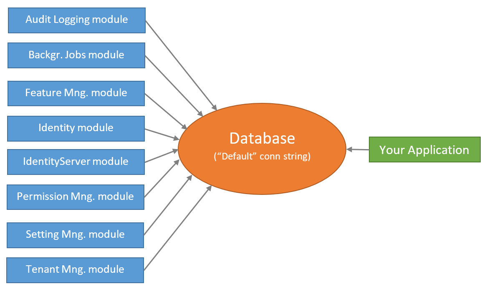

# EF Core Advanced Database Migrations

This document begins by **introducing the default structure** provided by [the application startup template](Startup-Templates/Application.md) and **discusses various scenarios** you may want to implement for your own application.

> This document is for who want to fully understand and customize the database structure comes with [the application startup template](Startup-Templates/Application.md). If you simply want to create entities and manage your code first migrations, just follow [the startup tutorials](Tutorials/Index.md).

## About the EF Core Code First Migrations

Entity Framework Core provides an easy to use and powerful [database migration system](https://docs.microsoft.com/en-us/ef/core/managing-schemas/migrations/). ABP Framework [startup templates](Startup-Templates/Index.md) take the advantage of this system to allow you to develop your application in a standard way.

However, EF Core migration system is **not so good in a modular environment** where each module maintains its **own database schema** while two or more modules may **share a single database** in practical.

Since ABP Framework cares about modularity in all aspects, it provides a **solution** to this problem. It is important to understand this solution if you need to **customize your database structure**.

> See [EF Core's own documentation](https://docs.microsoft.com/en-us/ef/core/managing-schemas/migrations/) to fully learn the EF Core Code First Migrations and why you need to such a system.

## The Default Solution & Database Configuration

When you [create a new web application](https://abp.io/get-started) (with EF Core, which is the default database provider), your solution structure will be similar to the picture below:


> Actual solution structure may be a bit different based on your preferences, but the database part will be same.

### The Database Structure

The startup template has some [application modules](Modules/Index.md) pre-installed. Each layer of the solution has corresponding module package references. So, the `.EntityFrameworkCore` project has the NuGet references for the `.EntityFrameworkCore` packages of the used modules:


In this way, you collect all the EF Core dependencies under the `.EntityFrameworkCore` project.

> In addition to the module references, it references to the `Volo.Abp.EntityFrameworkCore.SqlServer` package since the startup template is pre-configured for the SQL Server. See the documentation if you want to [switch to another DBMS](Entity-Framework-Core-Other-DBMS.md).

While every module has its own `DbContext` class by design and can use its **own physical database**, the solution is configured to use a **single shared database** as shown in the figure below:



This is **the simplest configuration** and suitable for most of the applications. `appsettings.json` file has a **single connection string**, named `Default`:

````json
"ConnectionStrings": {
  "Default": "..."
}
````

So, you have a **single database schema** which contains all the tables of the modules **sharing** this database.

ABP Framework's [connection string](Connection-Strings.md) system allows you to easily **set a different connection string** for a desired module:

````json
"ConnectionStrings": {
  "Default": "...",
  "AbpAuditLogging": "..."
}
````

The example configuration about tells to the ABP Framework to use the second connection string for the [Audit Logging module](Modules/Audit-Logging.md).

However, this is just the beginning. You also need to create the second database, create audit log tables inside it and maintain the database tables using the code first approach. One of the main purposes of this document is to guide you on such database separation scenarios.

#### Module Tables

Every module uses its own databases tables. For example, the [Identity Module](Modules/Identity.md) has some tables to manage the users and roles in the system.

#### Table Prefixes

Since it is allowed to share a single database by all modules (it is the default configuration), a module typically uses a prefix to group its own tables.

The fundamental modules, like [Identity](Modules/Identity.md), [Tenant Management](Modules/Tenant-Management.md) and [Audit Logs](Modules/Audit-Logging.md), use the `Abp` prefix, while some other modules use their own prefixes. [Identity Server](Modules/IdentityServer.md) module uses the `IdentityServer` prefix for example.

If you want, you can change the database table name prefix for a module for your application. Example:

````csharp
Volo.Abp.IdentityServer.AbpIdentityServerDbProperties.DbTablePrefix = "Ids";
````

This code changes the prefix of the [Identity Server](Modules/IdentityServer.md) module. Write this code at the very beginning in your application.

> Every module also defines `DbSchema` property (near to `DbTablePrefix`), so you can set it for the databases support the schema usage.

### The Projects

From the database point of view, there are three important projects those will be explained in the next sections.

#### .EntityFrameworkCore Project

This project has the `DbContext` class (`BookStoreDbContext` for this sample) of your application.

Every module uses its own `DbContext` class to access to the database. Likewise, your application has its own `DbContext`. You typically use this `DbContext` in your application code (in your custom [repositories](Repositories.md) if you follow the best practices). It is almost an empty `DbContext` since your application don't have any entities at the beginning, except the pre-defined `AppUser` entity:

````csharp
[ConnectionStringName("Default")]
public class BookStoreDbContext : AbpDbContext<BookStoreDbContext>
{
    public DbSet<AppUser> Users { get; set; }

    /* Add DbSet properties for your Aggregate Roots / Entities here. */

    public BookStoreDbContext(DbContextOptions<BookStoreDbContext> options)
        : base(options)
    {

    }

    protected override void OnModelCreating(ModelBuilder builder)
    {
        base.OnModelCreating(builder);

        /* Configure the shared tables (with included modules) here */

        builder.Entity<AppUser>(b =>
        {
            //Sharing the same table "AbpUsers" with the IdentityUser
            b.ToTable("AbpUsers"); 
            
            //Configure base properties
            b.ConfigureByConvention();
            b.ConfigureAbpUser();

            //Moved customization of the "AbpUsers" table to an extension method
            b.ConfigureCustomUserProperties();
        });

        /* Configure your own tables/entities inside the ConfigureBookStore method */
        builder.ConfigureBookStore();
    }
}
````

This simple `DbContext` class still needs some explanations:

* It defines a `[ConnectionStringName]` attribute which tells ABP to always use the `Default` connection string for this `Dbcontext`.
* It inherits from the `AbpDbContext<T>`  instead of the standard `DbContext` class. You can see the [EF Core integration](Entity-Framework-Core.md) document for more. For now, know that the `AbpDbContext<T>` base class implements some conventions of the ABP Framework to automate some common tasks for you.
* It declares a `DbSet` property for the `AppUser` entity. `AppUser` shares the same table (named `AbpUsers` by default) with the `IdentityUser` entity of the [Identity module](Modules/Identity.md). The startup template provides this entity inside the application since we think that the User entity is generally needs to be customized in your application.
* The constructor takes a `DbContextOptions<T>` instance.
* It overrides the `OnModelCreating` method to define the EF Core mappings.
  * It first calls the the `base.OnModelCreating` method to let the ABP Framework to implement the base mappings for us.
  * It then configures the mapping for the `AppUser` entity. There is a special case for this entity (it shares a table with the Identity module), which will be explained in the next sections.
  * It finally calls the `builder.ConfigureBookStore()` extension method to configure other entities of your application.

This design will be explained in more details after introducing the other database related projects.

#### .EntityFrameworkCore.DbMigrations Project

As mentioned in the previous section, every module (and your application) have **their own** separate `DbContext` classes. Each `DbContext` class only defines the entity to table mappings related to its own module and each module (and your application) use the related `DbContext` class **on runtime**.

As you know, EF Core Code First migration system relies on a `DbContext` class **to track and generate** the code first migrations. So, which `DbContext` we should use for the migrations? The answer is *none of them*. There is another `DbContext` defined in the `.EntityFrameworkCore.DbMigrations` project (which is the `BookStoreMigrationsDbContext` for this example solution).

##### The MigrationsDbContext

The `MigrationsDbContext` is only used to create and apply the database migrations. It is **not used on runtime**. It **merges** all the entity to table mappings of all the used modules plus the application's mappings.

In this way, you create and maintain a **single database migration path**. However, there are some difficulties of this approach and the next sections explains how ABP Framework overcomes these difficulties. But first, see the `BookStoreMigrationsDbContext` class as an example:

````csharp
/* This DbContext is only used for database migrations.
 * It is not used on runtime. See BookStoreDbContext for the runtime DbContext.
 * It is a unified model that includes configuration for
 * all used modules and your application.
 */
public class BookStoreMigrationsDbContext : AbpDbContext<BookStoreMigrationsDbContext>
{
    public BookStoreMigrationsDbContext(
        DbContextOptions<BookStoreMigrationsDbContext> options)
        : base(options)
    {

    }

    protected override void OnModelCreating(ModelBuilder builder)
    {
        base.OnModelCreating(builder);

        /* Include modules to your migration db context */
        builder.ConfigurePermissionManagement();
        builder.ConfigureSettingManagement();
        builder.ConfigureBackgroundJobs();
        builder.ConfigureAuditLogging();
        builder.ConfigureIdentity();
        builder.ConfigureIdentityServer();
        builder.ConfigureFeatureManagement();
        builder.ConfigureTenantManagement();

        /* Configure customizations for entities from the modules included  */
        builder.Entity<IdentityUser>(b =>
        {
            b.ConfigureCustomUserProperties();
        });

        /* Configure your own tables/entities inside the ConfigureBookStore method */
        builder.ConfigureBookStore();
    }
}
````

##### Sharing the Mapping Code

First problem is that: A module uses its own `DbContext` which needs to the database mappings. The `MigrationsDbContext` also needs to the same mapping in order to create the database tables for this module. We definitely don't want to duplicate the mapping code.

The solution is to define an extension method (on the `ModelBuilder`) that can be called by both `DbContext` classes. So, every module defines such an extension method.

For example, the `builder.ConfigureBackgroundJobs()` method call configures the database tables for the [Background Jobs module](Modules/Background-Jobs.md). The definition of this extension method is something like that:

````csharp
public static class BackgroundJobsDbContextModelCreatingExtensions
{
    public static void ConfigureBackgroundJobs(
        this ModelBuilder builder,
        Action<BackgroundJobsModelBuilderConfigurationOptions> optionsAction = null)
    {
        var options = new BackgroundJobsModelBuilderConfigurationOptions(
            BackgroundJobsDbProperties.DbTablePrefix,
            BackgroundJobsDbProperties.DbSchema
        );

        optionsAction?.Invoke(options);
        
        builder.Entity<BackgroundJobRecord>(b =>
        {
            b.ToTable(options.TablePrefix + "BackgroundJobs", options.Schema);

            b.ConfigureCreationTime();
            b.ConfigureExtraProperties();

            b.Property(x => x.JobName)
                .IsRequired()
                .HasMaxLength(BackgroundJobRecordConsts.MaxJobNameLength);
            
            //...
        });
    }
}
````

This extension method also gets options to change the database table prefix and schema for this module, but it is not important here.

The final application calls the extension methods inside the `MigrationsDbContext`  class, so it can decide which modules are included to the database maintained by this `MigrationsDbContext`. If you want to create a second database and move some module tables to the second database, then you need to have a second `MigrationsDbContext` class which only calls the extension methods of the related modules. This topic will be detailed in the next sections.

The same `ConfigureBackgroundJobs` method is also called the `DbContext` of the Background Jobs module:

````csharp
[ConnectionStringName(BackgroundJobsDbProperties.ConnectionStringName)]
public class BackgroundJobsDbContext
    : AbpDbContext<BackgroundJobsDbContext>, IBackgroundJobsDbContext
{
    public DbSet<BackgroundJobRecord> BackgroundJobs { get; set; }

    public BackgroundJobsDbContext(DbContextOptions<BackgroundJobsDbContext> options) 
        : base(options)
    {

    }

    protected override void OnModelCreating(ModelBuilder builder)
    {
        base.OnModelCreating(builder);

        //Reuse the same extension method!
        builder.ConfigureBackgroundJobs();
    }
}
````

In this way, the mapping configuration of a module can be shared between `DbContext` classes.

##### Reusing a Table Defined by a Module

TODO

##### Discussion of an Alternative Scenario: Every Module Manages Its Own Migration Path

TODO