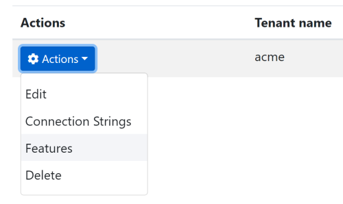

# Features

ABP Feature system is used to **enable**, **disable** or **change the behavior** of the application features **on runtime**.

The runtime value for a feature is generally a `boolean` value, like `true` (enabled) or `false` (disabled). However, you can get/set **any kind** of value for feature.

Feature system was originally designed to control the tenant features in a **[multi-tenant](Multi-Tenancy.md)** application. However, it is **extensible** and capable of determining the features by any condition.

> The feature system is implemented with the [Volo.Abp.Features](https://www.nuget.org/packages/Volo.Abp.Features) NuGet package. Most of the times you don't need to manually [install it](https://abp.io/package-detail/Volo.Abp.Features) since it comes pre-installed with the [application startup template](Startup-Templates/Application.md).

## Checking for the Features

Before explaining to define features, let's see how to check a feature value in your application code.

### RequiresFeature Attribute

`[RequiresFeature]` attribute (defined in the `Volo.Abp.Features` namespace) is used to declaratively check if a feature is `true` (enabled) or not. It is a useful shortcut for the `boolean` features.

**Example: Check if the "PDF Reporting" feature enabled**

```csharp
public class ReportingAppService : ApplicationService, IReportingAppService
{
    [RequiresFeature("MyApp.PdfReporting")]
    public async Task<PdfReportResultDto> GetPdfReportAsync()
    {
        //TODO...
    }
}
```

* `RequiresFeature(...)` simply gets a feature name to check if it is enabled or not. If not enabled, an authorization [exception](Exception-Handling.md) is thrown and a proper response is returned to the client side.
* `[RequiresFeature]` can be used for a **method** or a **class**. When you use it for a class, all the methods of that class require the given feature.
* `RequiresFeature` may get multiple feature names, like `[RequiresFeature("Feature1", "Feature2")]`. In this case ABP checks if any of the features enabled. Use `RequiresAll` option, like `[RequiresFeature("Feature1", "Feature2", RequiresAll = true)]` to force to check all of the features to be enabled.
* Multiple usage of `[RequiresFeature]` attribute is supported for a method or class. ABP check checks all of them in that case.

> Feature name can be any arbitrary string. It should be unique for a feature.

#### About the Interception

ABP Framework uses the interception system to make the `[RequiresFeature]` attribute working. So, it can work with any class (application services, controllers...) that is injected from the [dependency injection](Dependency-Injection.md).

However, there are **some rules should be followed** in order to make it working;

* If you are **not injecting** the service over an interface (like `IMyService`), then the methods of the service must be `virtual`. Otherwise, [dynamic proxy / interception](Dynamic-Proxying-Interceptors.md) system can not work.
* Only `async` methods (methods returning a `Task` or `Task<T>`) are intercepted.

> There is an exception for the **controller and razor page methods**. They **don't require** the following the rules above, since ABP Framework uses the action/page filters to implement the feature checking in this case.

### IFeatureChecker Service

`IFeatureChecker` allows to check a feature in your application code.

#### IsEnabledAsync

Returns `true` if the given feature is enabled. So, you can conditionally execute your business flow.

**Example: Check if the "PDF Reporting" feature enabled**

```csharp
public class ReportingAppService : ApplicationService, IReportingAppService
{
    private readonly IFeatureChecker _featureChecker;

    public ReportingAppService(IFeatureChecker featureChecker)
    {
        _featureChecker = featureChecker;
    }

    public async Task<PdfReportResultDto> GetPdfReportAsync()
    {
        if (await _featureChecker.IsEnabledAsync("MyApp.PdfReporting"))
        {
            //TODO...
        }
        else
        {
            //TODO...   
        }
    }
}
```

`IsEnabledAsync` has overloads to check multiple features in one method call.

#### GetOrNullAsync

Gets the current value for a feature. This method returns a `string`, so you store any kind of value inside it, by converting to or from `string`.

**Example: Check the maximum product count allowed**

```csharp
public class ProductController : AbpController
{
    private readonly IFeatureChecker _featureChecker;

    public ProductController(IFeatureChecker featureChecker)
    {
        _featureChecker = featureChecker;
    }

    public async Task<IActionResult> Create(CreateProductModel model)
    {
        var currentProductCount = await GetCurrentProductCountFromDatabase();

        //GET THE FEATURE VALUE
        var maxProductCountLimit =
            await _featureChecker.GetOrNullAsync("MyApp.MaxProductCount");

        if (currentProductCount >= Convert.ToInt32(maxProductCountLimit))
        {
            throw new BusinessException(
                "MyApp:ReachToMaxProductCountLimit",
                $"You can not create more than {maxProductCountLimit} products!"
            );
        }

        //TODO: Create the product in the database...
    }

    private async Task<int> GetCurrentProductCountFromDatabase()
    {
        throw new System.NotImplementedException();
    }
}
```

This example uses a numeric value as a feature limit product counts for a user/tenant in a SaaS application.

Instead of manually converting the value to `int`, you can use the generic overload of the `GetAsync` method:

```csharp
var maxProductCountLimit = await _featureChecker.GetAsync<int>("MyApp.MaxProductCount");
```

#### Extension Methods

There are some useful extension methods for the `IFeatureChecker` interface;

* `Task<T> GetAsync<T>(string name, T defaultValue = default)`: Used to get a value of a feature with the given type `T`. Allows to specify a `defaultValue` that is returned when the feature value is `null`.
* `CheckEnabledAsync(string name)`: Checks if given feature is enabled. Throws an `AbpAuthorizationException` if the feature was not `true` (enabled).

## Defining the Features

A feature should be defined to be able to check it.

### FeatureDefinitionProvider

Create a class inheriting the `FeatureDefinitionProvider` to define permissions.

**Example: Defining permissions**

```csharp
using Volo.Abp.Features;

namespace FeaturesDemo
{
    public class MyFeatureDefinitionProvider : FeatureDefinitionProvider
    {
        public override void Define(IFeatureDefinitionContext context)
        {
            var myGroup = context.AddGroup("MyApp");

            myGroup.AddFeature("MyApp.PdfReporting", defaultValue: "false");
            myGroup.AddFeature("MyApp.MaxProductCount", defaultValue: "10");
        }
    }
}
```

> ABP automatically discovers this class and registers the features. No additional configuration required.

> This class is generally created in the `Application.Contracts` project of your solution.

* In the `Define` method, you first need to add a **feature group** for your application/module or get an existing group then add **features** to this group.
* First feature, named `MyApp.PdfReporting`, is a `boolean` feature with `false` as the default value.
* Second feature, named `MyApp.MaxProductCount`, is a numeric feature with `10` as the default value.

Default value is used if there is no other value set for the current user/tenant.

### Other Feature Properties

While these minimal definitions are enough to make the feature system working, you can specify the **optional properties** for the features;

* `DisplayName`: A localizable string that will be used to show the feature name on the user interface.
* `Description`: A longer localizable text to describe the feature.
* `ValueType`: Type of the feature value. Can be a class implementing the `IStringValueType`. Built-in types:
  * `ToggleStringValueType`: Used to define `true`/`false`, `on`/`off`, `enabled`/`disabled` style features. A checkbox is shown on the UI.
  * `FreeTextStringValueType`: Used to define free text values. A textbox is shown on the UI.
  * `SelectionStringValueType`: Used to force the value to be selected from a list. A dropdown list is shown on the UI.
* `IsVisibleToClients` (default: `true`): Set false to hide the value of this feature from clients (browsers). Sharing the value with the clients helps them to conditionally show/hide/change the UI parts based on the feature value.
* `Properties`: A dictionary to set/get arbitrary key-value pairs related to this feature. This can be a point for customization.

So, based on these descriptions, it would be better to define these features as shown below:

```csharp
using FeaturesDemo.Localization;
using Volo.Abp.Features;
using Volo.Abp.Localization;
using Volo.Abp.Validation.StringValues;

namespace FeaturesDemo
{
    public class MyFeatureDefinitionProvider : FeatureDefinitionProvider
    {
        public override void Define(IFeatureDefinitionContext context)
        {
            var myGroup = context.AddGroup("MyApp");

            myGroup.AddFeature(
                "MyApp.PdfReporting",
                defaultValue: "false",
                displayName: LocalizableString
                                 .Create<FeaturesDemoResource>("PdfReporting"),
                valueType: new ToggleStringValueType()
            );

            myGroup.AddFeature(
                "MyApp.MaxProductCount",
                defaultValue: "10",
                displayName: LocalizableString
                                 .Create<FeaturesDemoResource>("MaxProductCount"),
                valueType: new FreeTextStringValueType(
                               new NumericValueValidator(0, 1000000))
            );
        }
    }
}
```

* `FeaturesDemoResource` is the project name in this example code. See the [localization document](Localization.md) for details about the localization system.
* First feature is set to `ToggleStringValueType`, while the second one is set to `FreeTextStringValueType` with a numeric validator that allows to the values from `0` to `1,000,000`.

Remember to define the localization the keys in your localization file:

````json
"PdfReporting": "PDF Reporting",
"MaxProductCount": "Maximum number of products"
````

See the [localization document](Localization.md) for details about the localization system.

### Feature Management Modal

The [application startup template](Startup-Templates/Application.md) comes with the [tenant management](Modules/Tenant-Management.md) and the [feature management](Modules/Feature-Management.md) modules pre-installed.

Whenever you define a new feature, it will be available on the **feature management modal**. To open this modal, navigate to the **tenant management page** and select the `Features` action for a tenant (create a new tenant if there is no tenant yet):



This action opens a modal to manage the feature values for the selected tenant:


So, you can enable, disable and set values for a tenant. These values will be used whenever a user of this tenant uses the application.

See the *Feature Management* section below to learn more about managing the features.

### Child Features

A feature may have child features. This is especially useful if you want to create a feature that is selectable only if another feature was enabled.

**Example: Defining child features**

```csharp
using FeaturesDemo.Localization;
using Volo.Abp.Features;
using Volo.Abp.Localization;
using Volo.Abp.Validation.StringValues;

namespace FeaturesDemo
{
    public class MyFeatureDefinitionProvider : FeatureDefinitionProvider
    {
        public override void Define(IFeatureDefinitionContext context)
        {
            var myGroup = context.AddGroup("MyApp");

            var reportingFeature = myGroup.AddFeature(
                "MyApp.Reporting",
                defaultValue: "false",
                displayName: LocalizableString
                                 .Create<FeaturesDemoResource>("Reporting"),
                valueType: new ToggleStringValueType()
            );

            reportingFeature.CreateChild(
                "MyApp.PdfReporting",
                defaultValue: "false",
                displayName: LocalizableString
                                 .Create<FeaturesDemoResource>("PdfReporting"),
                valueType: new ToggleStringValueType()
            );

            reportingFeature.CreateChild(
                "MyApp.ExcelReporting",
                defaultValue: "false",
                displayName: LocalizableString
                                 .Create<FeaturesDemoResource>("ExcelReporting"),
                valueType: new ToggleStringValueType()
            );
        }
    }
}
```

The example above defines a *Reporting* feature with two children: *PDF Reporting* and *Excel Reporting*.

### Changing Features Definitions of a Depended Module

A class deriving from the `FeatureDefinitionProvider` (just like the example above) can also get the existing permission definitions (defined by the depended [modules](Module-Development-Basics.md)) and change their definitions.

**Example: Manipulate an existing feature definition**

```csharp
var someGroup = context.GetGroupOrNull("SomeModule");
var feature = someGroup.Features.FirstOrDefault(f => f.Name == "SomeFeature");
if (feature != null)
{
    feature.Description = ...
    feature.CreateChild(...);
}
```

## Check a Feature in the Client Side

A feature value is available at the client side too, unless you set `IsVisibleToClients` to `false` on the feature definition. The feature values are exposed from the [Application Configuration API](API/Application-Configuration.md) and usable via some services on the UI.

See the following documents to learn how to check features in different UI types:

* [ASP.NET Core MVC / Razor Pages / JavaScript API](UI/AspNetCore/JavaScript-API/Features.md)
* [Angular](UI/Angular/Features.md)

**Blazor** applications can use the same `IFeatureChecker` service as explained above.

## Feature Management

Feature management is normally done by an admin user using the feature management modal:


This modal is available on the related entities, like tenants in a multi-tenant application. To open it, navigate to the **Tenant Management** page (for a multi-tenant application), click to the **Actions** button left to the Tenant and select the **Features** action.

If you need to manage features by code, inject the `IFeatureManager` service.

**Example: Enable PDF reporting for a tenant**

```csharp
public class MyService : ITransientDependency
{
    private readonly IFeatureManager _featureManager;

    public MyService(IFeatureManager featureManager)
    {
        _featureManager = featureManager;
    }

    public async Task EnablePdfReporting(Guid tenantId)
    {
        await _featureManager.SetForTenantAsync(
            tenantId,
            "MyApp.PdfReporting",
            true.ToString()
        );
    }
}
```

`IFeatureManager` is defined by the Feature Management module. It comes pre-installed with the application startup template. See the [feature management module documentation](Modules/Feature-Management.md) for more information.

## Advanced Topics

### Feature Value Providers

Feature system is extensible. Any class derived from `FeatureValueProvider` (or implements `IFeatureValueProvider`) can contribute to the feature system. A value provider is responsible to **obtain the current value** of a given feature.

Feature value providers are **executed one by one**. If one of them return a non-null value, then this feature value is used and the other providers are not executed.

There are three pre-defined value providers, executed by the given order:

* `TenantFeatureValueProvider` tries to get if the feature value is explicitly set for the **current tenant**.
* `EditionFeatureValueProvider` tries to get the feature value for the current edition. Edition Id is obtained from the current principal identity (`ICurrentPrincipalAccessor`) with the claim name `editionid` (a constant defined as`AbpClaimTypes.EditionId`). Editions are not implemented for the [tenant management](Modules/Tenant-Management.md) module. You can implement it yourself or consider to use the [SaaS module](https://commercial.abp.io/modules/Volo.Saas) of the ABP Commercial.
* `DefaultValueFeatureValueProvider` gets the default value of the feature.

You can write your own provider by inheriting the `FeatureValueProvider`.

**Example: Enable all features for a user with "SystemAdmin" as a "User_Type" claim value**

```csharp
using System.Threading.Tasks;
using Volo.Abp.Features;
using Volo.Abp.Security.Claims;
using Volo.Abp.Validation.StringValues;

namespace FeaturesDemo
{
    public class SystemAdminFeatureValueProvider : FeatureValueProvider
    {
        public override string Name => "SA";

        private readonly ICurrentPrincipalAccessor _currentPrincipalAccessor;

        public SystemAdminFeatureValueProvider(
            IFeatureStore featureStore,
            ICurrentPrincipalAccessor currentPrincipalAccessor)
            : base(featureStore)
        {
            _currentPrincipalAccessor = currentPrincipalAccessor;
        }

        public override Task<string> GetOrNullAsync(FeatureDefinition feature)
        {
            if (feature.ValueType is ToggleStringValueType &&
                _currentPrincipalAccessor.Principal?.FindFirst("User_Type")?.Value == "SystemAdmin")
            {
                return Task.FromResult("true");
            }

            return null;
        }
    }
}
```

If a provider returns `null`, then the next provider is executed.

Once a provider is defined, it should be added to the `AbpFeatureOptions` as shown below:

```csharp
Configure<AbpFeatureOptions>(options =>
{
    options.ValueProviders.Add<SystemAdminFeatureValueProvider>();
});
```

Use this code inside the `ConfigureServices` of your [module](Module-Development-Basics.md) class.

### Feature Store

`IFeatureStore` is the only interface that needs to be implemented to read the value of features from a persistence source, generally a database system. The Feature Management module implements it and pre-installed in the application startup template. See the [feature management module documentation](https://docs.abp.io/en/abp/latest/Modules/Feature-Management) for more information