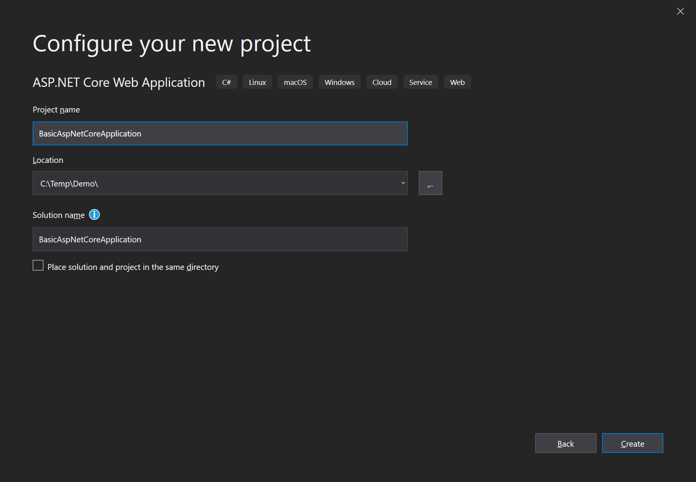
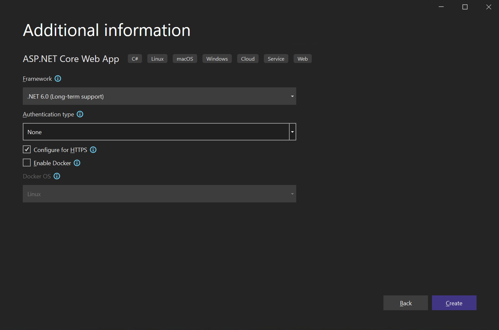

# Getting Started With an ABP and AspNet Core MVC Web Application

This tutorial explains how to start ABP from scratch with minimal dependencies. You generally want to start with the **[startup template](Getting-Started-AspNetCore-MVC-Template.md)**.

## Create a New Project

1. Create a new AspNet Core Web Application with Visual Studio 2022 (17.0.0+):


2. Configure your new project:



3. Press the create button:



## Install Volo.Abp.AspNetCore.Mvc Package

Volo.Abp.AspNetCore.Mvc is the AspNet Core MVC integration package for ABP. So, install it on your project:

````
Install-Package Volo.Abp.AspNetCore.Mvc
````

## Create the First ABP Module

ABP is a modular framework and it requires a **startup (root) module** class derived from ``AbpModule``:

````C#
using Microsoft.AspNetCore.Builder;
using Microsoft.Extensions.Hosting;
using Volo.Abp;
using Volo.Abp.AspNetCore.Mvc;
using Volo.Abp.Modularity;

namespace BasicAspNetCoreApplication
{
    [DependsOn(typeof(AbpAspNetCoreMvcModule))]
    public class AppModule : AbpModule
    {
        public override void OnApplicationInitialization(ApplicationInitializationContext context)
        {
            var app = context.GetApplicationBuilder();
            var env = context.GetEnvironment();

            // Configure the HTTP request pipeline.
            if (env.IsDevelopment())
            {
                app.UseExceptionHandler("/Error");
                // The default HSTS value is 30 days. You may want to change this for production scenarios, see https://aka.ms/aspnetcore-hsts.
                app.UseHsts();
            }

            app.UseHttpsRedirection();
            app.UseStaticFiles();
            app.UseRouting();
            app.UseConfiguredEndpoints();
        }
    }
}
````

``AppModule`` is a good name for the startup module for an application.

ABP packages define module classes and a module can depend on another. In the code above, the ``AppModule`` depends on the ``AbpAspNetCoreMvcModule`` (defined by the [Volo.Abp.AspNetCore.Mvc](https://www.nuget.org/packages/Volo.Abp.AspNetCore.Mvc) package). It's common to add a ``DependsOn`` attribute after installing a new ABP NuGet package.

Instead of the Startup class, we are configuring an ASP.NET Core pipeline in this module class.

## The Program Class

Next step is to modify the Program class to integrate to the ABP module system:

````C#
using BasicAspNetCoreApplication;

var builder = WebApplication.CreateBuilder(args);

builder.Services.ReplaceConfiguration(builder.Configuration);

builder.Services.AddApplication<AppModule>();

var app = builder.Build();

app.InitializeApplication();

app.Run();
````

``builder.Services.AddApplication<AppModule>();`` adds all services defined in all modules starting from the ``AppModule``.

``app.InitializeApplication()`` initializes and starts the application.

## Run the Application!

That's all! Run the application, it will just work as expected.

## Using Autofac as the Dependency Injection Framework

While AspNet Core's Dependency Injection (DI) system is fine for basic requirements, [Autofac](https://autofac.org/) provides advanced features like Property Injection and Method Interception which are required by ABP to perform advanced application framework features.

Replacing AspNet Core's DI system by Autofac and integrating to ABP is pretty easy.

1. Install [Volo.Abp.Autofac](https://www.nuget.org/packages/Volo.Abp.Autofac) package

````
Install-Package Volo.Abp.Autofac
````

2. Add the ``AbpAutofacModule`` Dependency

````C#
[DependsOn(typeof(AbpAspNetCoreMvcModule))]
[DependsOn(typeof(AbpAutofacModule))] //Add dependency to ABP Autofac module
public class AppModule : AbpModule
{
    ...
}
````

3. Update `Program.cs` to use Autofac:

````C#
using BasicAspNetCoreApplication;

var builder = WebApplication.CreateBuilder(args);

builder.Host.UseAutofac();  //Add this line

builder.Services.ReplaceConfiguration(builder.Configuration);

builder.Services.AddApplication<AppModule>();

var app = builder.Build();

app.InitializeApplication();

app.Run();

````

## Source Code

Get source code of the sample project created in this tutorial from [here](https://github.com/abpframework/abp-samples/tree/master/BasicAspNetCoreApplication).

