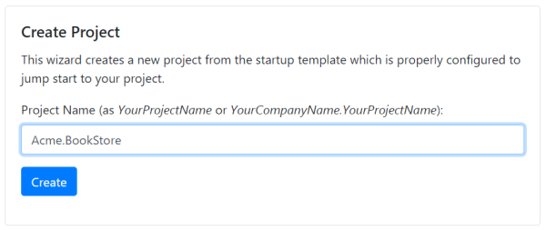
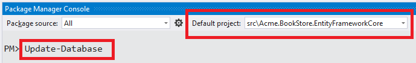
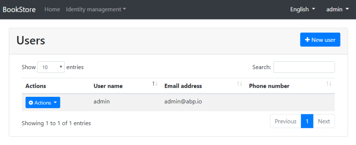

## ASP.NET Core MVC Template

This tutorials explains how to create a new ASP.NET Core MVC web application using the startup template, configure and run it.

### Creating a new project

Go to [the template creation page](https://abp.io/Templates), enter a project name and create your project as shown below:



When you click the *create* button, a new Visual Studio solution is created and downloaded with the name you have provided.

#### Pre Requirements

The downloaded project requires;

* [Visual Studio 2017 (v15.7.0+)](https://visualstudio.microsoft.com/tr/downloads/)
* [.NET Core 2.1.1+](https://www.microsoft.com/net/download/dotnet-core/)

### The Solution Structure

Extract the zip file downloaded and open in **Visual Studio 2017 (15.7.0+)**:


The solution has a layered structure (based on Domain Driven Design) where;

* ``.Domain`` is the domain layer.
* ``.Application`` is the application layer.
* ``.Web`` is the presentation layer.
* ``.EntityFrameworkCore`` is the EF Core integration package.

The solution also contains unit & integration test projects properly configured to work with **EF Core** & **SQLite in-memory** database.

### Creating the Database

Check the **connection string** in the `appsettings.json` file under the `.Web` project:

````json
{
  "ConnectionStrings": {
    "Default": "Server=localhost;Database=BookStore;Trusted_Connection=True"
  }
}
````

The solution is configured to use **Entity Framework Core** with **MS SQL Server**. EF Core supports [various](https://docs.microsoft.com/en-us/ef/core/providers/) database providers, so you can use another DBMS if you want.

Right click to the `.Web` project and select **Set as StartUp Project**:


Open the **Package Manager Console**, select `.EntityFrameworkCore` project as the **Default Project** and run the `Update-Database` command:



This will create a new database based on the configured connection string.

### Running the Application

You can now run the application which will open the **home** page:


Click the **Login** button, enter `admin` as the username and `1q2w3E*` as the password to login to the application.

The startup template includes the **identity management** module. Once you login, the Identity management menu will be available where you can manage **roles**, **users** and their **permissions**.



### What's Next?

* [Application development tutorial](Tutorials/AspNetCore-Mvc/Part-I.md)
