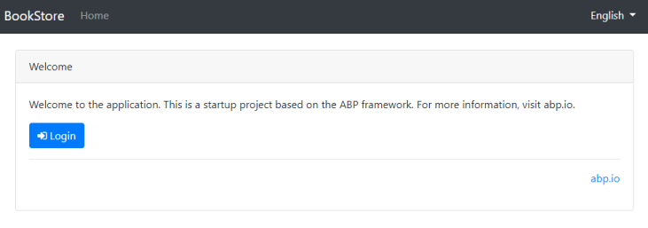
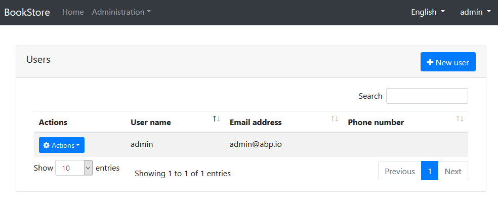

## Getting Started With the ASP.NET Core MVC Template

This tutorial explains how to create a new ASP.NET Core MVC web application using the startup template, configure and run it.

### Creating a New Project

This tutorial uses **ABP CLI** to create a new project. See the [Get Started](https://abp.io/get-started) page for other options.

Install the ABP CLI using a command line window, if you've not installed before:

````bash
dotnet tool install -g Volo.Abp.Cli
````

Use `abp new` command in an empty folder to create your project:

````bash
abp new Acme.BookStore
````

> You can use different level of namespaces; e.g. BookStore, Acme.BookStore or Acme.Retail.BookStore.

`new` command creates a **layered MVC application** with **Entity Framework Core** as the database provider. However, it has additional options. See the [CLI documentation](CLI.md) for all available options.

#### Pre Requirements

The created solution requires;

* [Visual Studio 2017 (v15.9.0+)](https://visualstudio.microsoft.com/tr/downloads/)
* [.NET Core 2.2+](https://www.microsoft.com/net/download/dotnet-core/)

### The Solution Structure

Open the solution in **Visual Studio**:


The solution has a layered structure (based on [Domain Driven Design](Domain-Driven-Design.md)) and contains unit & integration test projects properly configured to work with **EF Core** & **SQLite in-memory** database.

> See [Application template document](Startup-Templates/Application.md) to understand the solution structure in details.

### Database Connection String

Check the **connection string** in the `appsettings.json` file under the `.Web` project:

````json
{
  "ConnectionStrings": {
    "Default": "Server=localhost;Database=BookStore;Trusted_Connection=True"
  }
}
````

The solution is configured to use **Entity Framework Core** with **MS SQL Server**. EF Core supports [various](https://docs.microsoft.com/en-us/ef/core/providers/) database providers, so you can use another DBMS if you want. Change the connection string if you need.

### Create Database & Apply Database Migrations

You have two options to create the database.

#### Using the DbMigrator Application

The solution contains a console application (named `Acme.BookStore.DbMigrator` in this sample) that can create database, apply migrations and seed initial data. It is useful on development as well as on production environment.

> `.DbMigrator` project has its own `appsettings.json`. So, if you have changed the connection string above, you should also change this one.

Right click to the `.DbMigrator` project and select **Set as StartUp Project**:


Hit F5 (or Ctrl+F5) to run the application. It will have an output like shown below:


#### Using EF Core Update-Database Command

Ef Core has `Update-Database` command which creates database if necessary and applies pending migrations. Right click to the `.Web` project and select **Set as StartUp Project**:


Open the **Package Manager Console**, select `.EntityFrameworkCore.DbMigrations` project as the **Default Project** and run the `Update-Database` command:


This will create a new database based on the configured connection string.

> Using the `.Migrator` tool is the suggested way, because it also seeds the initial data to be able to properly run the web application.

### Running the Application

Ensure that the `.Web` project is the startup project. Run the application which will open the **home** page in your browser:



Click the **Login** button, enter `admin` as the username and `1q2w3E*` as the password to login to the application.

The startup template includes the **identity management** and **tenant management** modules. Once you login, the Administration menu will be available where you can manage **tenants**, **roles**, **users** and their **permissions**. User management page is shown below:



### What's Next?

* [Application development tutorial](Tutorials/AspNetCore-Mvc/Part-I.md)
