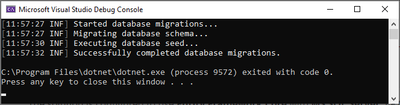
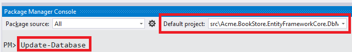
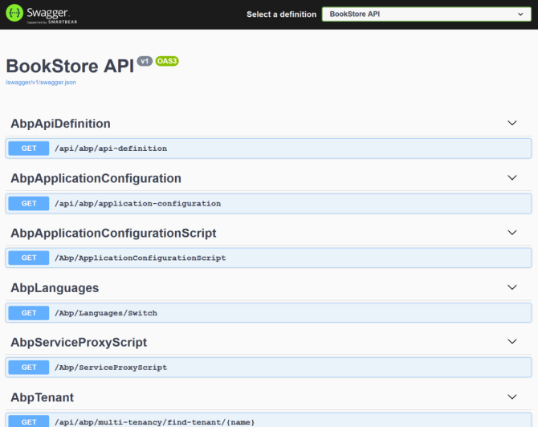
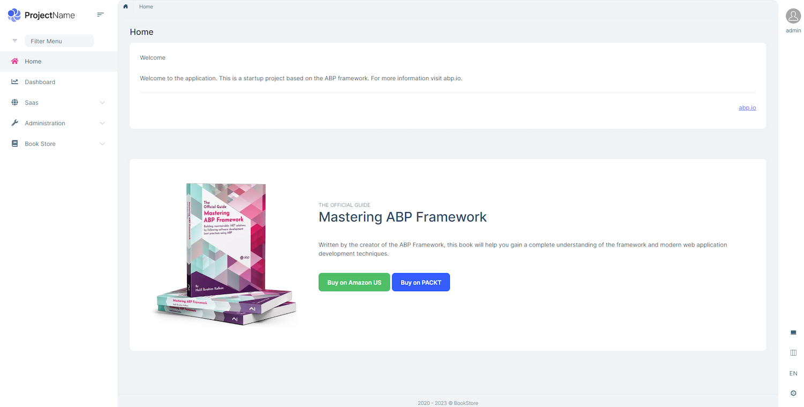
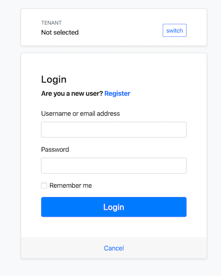

# Getting Started

````json
//[doc-params]
{
    "UI": ["MVC", "Blazor", "NG"],
    "DB": ["EF", "Mongo"],
    "Tiered": ["Yes", "No"]
}
````

This tutorial explains how to create a new web application using the [application startup template](Startup-Templates/Application.md).

> This document assumes that you prefer to use **{{ UI_Value }}** as the UI framework and **{{ DB_Value }}** as the database provider. For other options, please change the preference on top of this document.


## Setup Your Development Environment

First things first! Let's setup your development environment before creating the first project.

### Pre-Requirements

The following tools should be installed on your development machine:

* [Visual Studio 2019](https://visualstudio.microsoft.com/vs/) (v16.8+) for Windows / [Visual Studio for Mac](https://visualstudio.microsoft.com/vs/mac/). <sup id="a-editor">[1](#f-editor)</sup>
* [.NET Core 5.0+](https://www.microsoft.com/net/download/dotnet-core/)
{{ if UI != "Blazor" }}
* [Node v12 or v14](https://nodejs.org/)
* [Yarn v1.20+ (not v2)](https://classic.yarnpkg.com/en/docs/install) <sup id="a-yarn">[2](#f-yarn)</sup> or npm v6+ (already installed with Node)
{{ end }}
{{ if Tiered == "Yes" }}
* [Redis](https://redis.io/) (the startup solution uses the Redis as the [distributed cache](Caching.md)).
{{ end }}

<sup id="f-editor"><b>1</b></sup> _You can use another editor instead of Visual Studio as long as it supports .NET Core and ASP.NET Core._ <sup>[↩](#a-editor)</sup>

<sup id="f-yarn"><b>2</b></sup> _Yarn v2 works differently and is not supported._ <sup>[↩](#a-yarn)</sup>

### Install the ABP CLI

[ABP CLI](./CLI.md) is a command line interface that is used to automate some common tasks for ABP based solutions.

> ABP CLI is a free & open source tool for the ABP framework.

First, you need to install the ABP CLI using the following command:

````shell
dotnet tool install -g Volo.Abp.Cli
````

If you've already installed, you can update it using the following command:

````shell
dotnet tool update -g Volo.Abp.Cli
````

## Create a New Project

Use the `new` command of the ABP CLI to create a new project:

````shell
abp new Acme.BookStore{{if UI == "NG"}} -u angular{{else if UI == "Blazor"}} -u blazor{{end}}{{if DB == "Mongo"}} -d mongodb{{end}}{{if Tiered == "Yes"}}{{if UI == "MVC"}} --tiered{{else}} --separate-identity-server{{end}}{{end}}
````

> You can use different level of namespaces; e.g. BookStore, Acme.BookStore or Acme.Retail.BookStore. 

> Alternatively, you can select the "Direct Download" tab from the [ABP Framework web site](https://abp.io/get-started) to create a new solution.

{{ if Tiered == "Yes" }}

{{ if UI == "MVC" }}

* `--tiered` argument is used to create N-tiered solution where authentication server, UI and API layers are physically separated.

{{ else }}

* `--separate-identity-server` argument is used to separate the identity server application from the API host application. If not specified, you will have a single endpoint on the server.

{{ end }}

{{ end }}

### ABP CLI Commands & Options

[ABP CLI document](./CLI.md) covers all of the available commands and options for the ABP CLI. This document uses the [application startup template](Startup-Templates/Application.md) to create a new web application. See the [ABP Startup Templates](Startup-Templates/Index.md) document for other templates.

### The Solution Structure

The solution has a layered structure (based on the [Domain Driven Design](Domain-Driven-Design.md)) and contains unit & integration test projects. See the [application template document](Startup-Templates/Application.md) to understand the solution structure in details. 

{{ if DB == "Mongo" }}

#### MongoDB Transactions

The [startup template](Startup-templates/Index.md) **disables** transactions in the `.MongoDB` project by default. If your MongoDB server supports transactions, you can enable the it in the *YourProjectMongoDbModule* class:

  ```csharp
  Configure<AbpUnitOfWorkDefaultOptions>(options =>
  {
      options.TransactionBehavior = UnitOfWorkTransactionBehavior.Auto;
  });
  ```

> Or you can delete this code since this is already the default behavior.

{{ end }}

## Create the Database

### Connection String

Check the **connection string** in the `appsettings.json` file under the {{if Tiered == "Yes"}}`.IdentityServer` and `.HttpApi.Host` projects{{else}}{{if UI=="MVC"}}`.Web` project{{else}}`.HttpApi.Host` project{{end}}{{end}}

{{ if DB == "EF" }}

````json
"ConnectionStrings": {
  "Default": "Server=localhost;Database=BookStore;Trusted_Connection=True"
}
````

The solution is configured to use **Entity Framework Core** with **MS SQL Server** by default. EF Core supports [various](https://docs.microsoft.com/en-us/ef/core/providers/) database providers, so you can use any supported DBMS. See [the Entity Framework integration document](Entity-Framework-Core.md) to learn how to [switch to another DBMS](Entity-Framework-Core-Other-DBMS.md).

### Apply the Migrations

The solution uses the [Entity Framework Core Code First Migrations](https://docs.microsoft.com/en-us/ef/core/managing-schemas/migrations/?tabs=dotnet-core-cli). So, you need to apply migrations to create the database. There are two ways of applying the database migrations.

#### Apply Migrations Using the DbMigrator

The solution comes with a `.DbMigrator` console application which applies migrations and also **seeds the initial data**. It is useful on **development** as well as on **production** environment.

> `.DbMigrator` project has its own `appsettings.json`. So, if you have changed the connection string above, you should also change this one. 

Right click to the `.DbMigrator` project and select **Set as StartUp Project**


 Hit F5 (or Ctrl+F5) to run the application. It will have an output like shown below:

 

> Initial [seed data](Data-Seeding.md) creates the `admin` user in the database (with the password is `1q2w3E*`) which is then used to login to the application. So, you need to use `.DbMigrator` at least once for a new database.

#### Using EF Core Update-Database Command

Ef Core has `Update-Database` command which creates database if necessary and applies pending migrations.

{{ if UI == "MVC" }}

Right click to the {{if Tiered == "Yes"}}`.IdentityServer`{{else}}`.Web`{{end}} project and select **Set as StartUp project**: 

{{ else if UI != "MVC" }}

Right click to the `.HttpApi.Host` project and select **Set as StartUp Project**: 

{{ end }}


Open the **Package Manager Console**, select `.EntityFrameworkCore.DbMigrations` project as the **Default Project** and run the `Update-Database` command:



This will create a new database based on the configured connection string.

> **Using the `.DbMigrator` tool is the suggested way**, because it also seeds the initial data to be able to properly run the web application.
>
> If you just use the `Update-Database` command, you will have an empty database, so you can not login to the application since there is no initial admin user in the database. You can use the `Update-Database` command in development time when you don't need to seed the database. However, using the `.DbMigrator` application is easier and you can always use it to migrate the schema and seed the database.

{{ else if DB == "Mongo" }}

````json
"ConnectionStrings": {
  "Default": "mongodb://localhost:27017/BookStore"
}
````

The solution is configured to use **MongoDB** in your local computer, so you need to have a MongoDB server instance up and running or change the connection string to another MongoDB server.

### Seed Initial Data

The solution comes with a `.DbMigrator` console application which **seeds the initial data**. It is useful on **development** as well as on **production** environment.

> `.DbMigrator` project has its own `appsettings.json`. So, if you have changed the connection string above, you should also change this one. 

Right click to the `.DbMigrator` project and select **Set as StartUp Project**


 Hit F5 (or Ctrl+F5) to run the application. It will have an output like shown below:

 

> Initial [seed data](Data-Seeding.md) creates the `admin` user in the database (with the password is `1q2w3E*`) which is then used to login to the application. So, you need to use `.DbMigrator` at least once for a new database.

{{ end }}

## Run the Application

{{ if UI == "MVC" }}

{{ if Tiered == "Yes" }}

> Tiered solutions use Redis as the distributed cache. Ensure that it is installed and running in your local computer. If you are using a remote Redis Server, set the configuration in the `appsettings.json` files of the projects below.

1. Ensure that the `.IdentityServer` project is the startup project. Run this application that will open a **login** page in your browser.

> Use Ctrl+F5 in Visual Studio (instead of F5) to run the application without debugging. If you don't have a debug purpose, this will be faster.

You can login, but you cannot enter to the main application here. This is **just the authentication server**.

2. Ensure that the `.HttpApi.Host` project is the startup project and run the application which will open a **Swagger UI** in your browser.



This is the HTTP API that is used by the web application.

3. Lastly, ensure that the `.Web` project is the startup project and run the application which will open a **welcome** page in your browser



Click to the **login** button which will redirect you to the *authentication server* to login to the application:



{{ else # Tiered != "Yes" }}

Ensure that the `.Web` project is the startup project. Run the application which will open the **login** page in your browser:

> Use Ctrl+F5 in Visual Studio (instead of F5) to run the application without debugging. If you don't have a debug purpose, this will be faster.


{{ end # Tiered }}

{{ else # UI != "MVC" }}

### Running the HTTP API Host (Server Side)

{{ if Tiered == "Yes" }}

> Tiered solutions use Redis as the distributed cache. Ensure that it is installed and running in your local computer. If you are using a remote Redis Server, set the configuration in the `appsettings.json` files of the projects below.

Ensure that the `.IdentityServer` project is the startup project. Run the application which will open a **login** page in your browser.

> Use Ctrl+F5 in Visual Studio (instead of F5) to run the application without debugging. If you don't have a debug purpose, this will be faster.

You can login, but you cannot enter to the main application here. This is just the authentication server.

Ensure that the `.HttpApi.Host` project is the startup project and run the application which will open a Swagger UI:

{{ else # Tiered == "No" }}

Ensure that the `.HttpApi.Host` project is the startup project and run the application which will open a Swagger UI:

> Use Ctrl+F5 in Visual Studio (instead of F5) to run the application without debugging. If you don't have a debug purpose, this will be faster.

{{ end # Tiered }}


You can see the application APIs and test them here. Get [more info](https://swagger.io/tools/swagger-ui/) about the Swagger UI.

> ##### Authorization for the Swagger UI
>
> Most of the HTTP APIs require authentication & authorization. If you want to test authorized APIs, manually go to the `/Account/Login` page, enter `admin` as the username and `1q2w3E*` as the password to login to the application. Then you will be able to execute authorized APIs too.

{{ end # UI }}

{{ if UI == "Blazor" }}

### Running the Blazor Application (Client Side)

Ensure that the `.Blazor` project is the startup project and run the application.

> Use Ctrl+F5 in Visual Studio (instead of F5) to run the application without debugging. If you don't have a debug purpose, this will be faster.

Once the application starts, click to the **Login** link on to header, which redirects you to the authentication server to enter a username and password:


{{ else if UI == "NG" }}

### Running the Angular Application (Client Side)

Go to the `angular` folder, open a command line terminal, type the `yarn` command (we suggest to the [yarn](https://yarnpkg.com/) package manager while `npm install` will also work)

```bash
yarn
```

Once all node modules are loaded, execute `yarn start` (or `npm start`) command:

```bash
yarn start
```

It may take a longer time for the first build. Once it finishes, it opens the Angular UI in your default browser with the [localhost:4200](http://localhost:4200/) address.


{{ end }}

Enter **admin** as the username and **1q2w3E*** as the password to login to the application. The application is up and running. You can start developing your application based on this startup template.

## Mobile Development

If you want to include a [React Native](https://reactnative.dev/) project in your solution, add `-m react-native` (or `--mobile react-native`) argument to project creation command. This is a basic React Native startup template to develop mobile applications integrated to your ABP based backends.

See the [Getting Started with the React Native](Getting-Started-React-Native.md) document to learn how to configure and run the React Native application.

## Next

* [Web Application Development Tutorial](Tutorials/Part-1.md)
