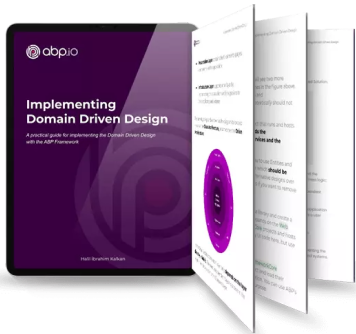

# ABP Documentation

ABP Framework is a complete **infrastructure** based on the **ASP.NET Core** to create **modern web applications** and **APIs** by following the software development **best practices** and the **latest technologies**.

## Getting Started

* [Quick Start](Tutorials/Todo/Index.md) is a single-part, quick-start tutorial to build a simple application with the ABP Framework. Start with this tutorial if you want to quickly understand how ABP works.
* [Getting Started](Getting-Started.md) guide can be used to create and run ABP based solutions with different options and details.
* [Web Application Development Tutorial](Tutorials/Part-1.md) is a complete tutorial to develop a full stack web application with all aspects of a real-life solution.

### UI Framework Options

ABP Framework can work with any UI framework, while the following frameworks are supported out of the box:

### Database Provider Options

ABP Framework can work with any database provider, while the following providers are supported out of the box:

## Exploring the Documentation

ABP has a **comprehensive documentation** that not only explains the ABP Framework, but also includes **guides** and **samples** to help you on creating a **maintainable solution** by introducing and discussing common **software development principle and best practices**.

### Architecture

ABP offers a complete, modular and layered software architecture based on [Domain Driven Design](Domain-Driven-Design.md) principles and patterns. It also provides the necessary infrastructure to implement this architecture.

* See the [Modularity](Module-Development-Basics.md) document to understand the module system.
* [Implementing Domain Driven Design Book](https://abp.io/books/implementing-domain-driven-design) is an ultimate guide for who want to understand and implement the DDD.
* [Microservice Architecture](Microservice-Architecture.md) document explains how ABP helps to create a microservice solution.
* [Multi-Tenancy](Multi-Tenancy.md) document introduces multi-tenancy and explores the ABP multi-tenancy infrastructure.

### Infrastructure

There are a lot of features provided by the ABP Framework to achieve real world scenarios easier, like [Event Bus](Event-Bus.md), [Background Job System](Background-Jobs.md), [Audit Logging](Audit-Logging.md), [BLOB Storing](Blob-Storing.md), [Data Seeding](Data-Seeding.md), [Data Filtering](Data-Filtering.md).

### Cross Cutting Concerns

ABP also simplifies (and even automates wherever possible) cross cutting concerns and common non-functional requirements like [Exception Handling](Exception-Handling.md), [Validation](Validation.md), [Authorization](Authorization.md), [Localization](Localization.md), [Caching](Caching.md), [Dependency Injection](Dependency-Injection.md), [Setting Management](Settings.md), etc. 

### Application Modules

Application Modules provides pre-built application functionalities;

* [**Account**](Modules/Account.md): Provides UI for the account management and allows user to login/register to the application.
* **[Identity](Modules/Identity.md)**: Manages organization units, roles, users and their permissions, based on the Microsoft Identity library.
* [**IdentityServer**](Modules/IdentityServer.md): Integrates to IdentityServer4.
* [**Tenant Management**](Modules/Tenant-Management.md): Manages tenants for a [multi-tenant](Multi-Tenancy.md) (SaaS) application.

See the [Application Modules](Modules/Index.md) document for all pre-built modules.

### Startup Templates

The [Startup templates](Startup-Templates/Index.md) are pre-built Visual Studio solution templates. You can create your own solution based on these templates to **immediately start your development**.

## Free E-Book: Implementing Domain Driven Design

A **practical guide** for implementing Domain Driven Design (DDD). While the implementation details are **based on the ABP Framework** infrastructure, the basic concepts, principles and models can be applied to any solution, even if it is not a .NET solution.

[Click here to get your free copy](https://abp.io/books/implementing-domain-driven-design).

## ABP Community

### The Source Code

ABP is hosted on GitHub. See [the source code](https://github.com/abpframework).

### ABP Community Web Site

The [ABP Community](https://community.abp.io/) is a website to publish articles and share knowledge about the ABP Framework. You can also create content for the community!

### Blog

Follow the [ABP Blog](https://blog.abp.io/) to learn the latest happenings in the ABP Framework.

### Samples

See the [sample projects](Samples/Index.md) built with the ABP Framework.

### Want to Contribute?

ABP is a community-driven open source project. See [the contribution guide](Contribution/Index.md) if you want to be a part of this project.
