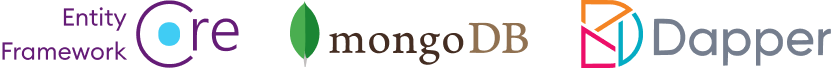

# ABP Documentation

ABP offers an **opinionated architecture** to build enterprise software solutions with **best practices** on top of the **.NET** and the **ASP.NET Core** platforms. It provides the fundamental infrastructure, production-ready startup templates, pre-built application modules, UI themes, tooling, guides and documentation to implement that architecture properly and **automate the details** and repetitive works as much as possible.

## Getting Started

The [getting started](Getting-Started.md) guide can be used to create and run ABP based solutions with different options and details. Then you can follow the [todo tutorial](Tutorials/Todo/Overall.md) to create your first application with ABP, or build a full-featured and real-life web application by following the [web application development tutorial](Tutorials/Part-1.md).

### UI Framework Options

ABP can work with any UI framework, while the following frameworks are supported out of the box:

### Database Provider Options

ABP can work with any database provider, while the following providers are supported out of the box:

## Exploring the Documentation

ABP has a **comprehensive documentation** that not only explains the ABP Framework, but also includes **guides** and **samples** to help you on creating a **maintainable solution** by introducing and discussing common **software development principle and best practices**.

### The Framework

#### Architecture

ABP offers a complete, modular and layered software architecture based on [Domain Driven Design](Domain-Driven-Design.md) principles and patterns. It also provides the necessary infrastructure to implement this architecture.

* See the [Modularity](Module-Development-Basics.md) document to understand the module system.
* [Implementing Domain Driven Design book](https://abp.io/books/implementing-domain-driven-design?ref=doc) is an ultimate guide for who want to understand and implement the DDD with the ABP Framework.
* [Microservice Architecture](Microservice-Architecture.md) document explains how ABP helps to create a microservice solution.
* [Multi-Tenancy](Multi-Tenancy.md) document introduces multi-tenancy and explores the ABP multi-tenancy infrastructure.

#### Infrastructure

There are a lot of features provided by the ABP Framework to achieve real world scenarios easier, like [Event Bus](Event-Bus.md), [Background Job System](Background-Jobs.md), [Audit Logging](Audit-Logging.md), [BLOB Storing](Blob-Storing.md), [Data Seeding](Data-Seeding.md), [Data Filtering](Data-Filtering.md).

#### Cross Cutting Concerns

ABP also simplifies (and even automates wherever possible) cross cutting concerns and common non-functional requirements like [Exception Handling](Exception-Handling.md), [Validation](Validation.md), [Authorization](Authorization.md), [Localization](Localization.md), [Caching](Caching.md), [Dependency Injection](Dependency-Injection.md), [Setting Management](Settings.md), etc. 

### Tooling

ABP.IO Platform provides tooling to help you in your daily development.

#### ABP Studio

[ABP Studio](studio/index.md) is a cross-platform desktop application for ABP and .NET developers. It aims to provide a comfortable development environment for you by automating things, providing insights about your solution, making develop, run, browse, monitor, trace and deploy your solutions much easier.

#### ABP Suite

[ABP Suite](suite/index.md) is a tool to assist your application development. Its main functionality is to automatically generate CRUD-style pages once you define your entities and their relations.

#### ABP CLI

[ABP CLI](CLI.md) is a command-line tool to create new solutions and automate the things with your ABP based solutions.

### Startup Templates

The [Startup templates](Startup-Templates/Index.md) are pre-built Visual Studio solution templates. You can create your own solution based on these templates to **immediately start your development**.

### Application Modules

Application Modules provides pre-built application modules those implement common business requirements;

* [**Account**](Modules/Account.md): Provides UI for the account management and allows user to login/register to the application.
* **[Identity](Modules/Identity.md)**: Manages organization units, roles, users and their permissions, based on the Microsoft Identity library.
* [**OpenIddict**](Modules/OpenIddict.md): Integrates to OpenIddict.
* [**Tenant Management**](Modules/Tenant-Management.md): Manages tenants for a [multi-tenant](Multi-Tenancy.md) (SaaS) application.

See the [Application Modules](Modules/Index.md) document for all pre-built modules.

## Books

### Mastering ABP Framework

*Mastering ABP Framework* is an ultimate guide to get started and expertise with the ABP Framework. It is authored by Halil İbrahim Kalkan, the creator and the lead developer of the ABP Framework.

**[You can order it from Amazon now](https://www.amazon.com/Mastering-ABP-Framework-maintainable-implementing-dp-1801079242/dp/1801079242)!**

### Free E-Book: Implementing Domain Driven Design

A **practical guide** for implementing Domain Driven Design (DDD). While the implementation details are **based on the ABP Framework** infrastructure, the basic concepts, principles and models can be applied to any solution, even if it is not a .NET solution.

**[Click here to get your free copy](https://abp.io/books/implementing-domain-driven-design?ref=doc).**

## ABP Community

### The Source Code

ABP Framework's source code is hosted on GitHub. See [the source code](https://github.com/abpframework).

### ABP Community Web Site

The [ABP Community](https://community.abp.io/) is a website to publish articles and share knowledge about the ABP Framework. You can also create content for the community!

### Blog

Follow the [ABP Blog](https://blog.abp.io/) to learn the latest happenings in the ABP.IO Platform.

### Samples

See the [sample projects](Samples/Index.md) built with ABP.

### Want to Contribute?

ABP Framework is a community-driven open source project. See [the contribution guide](Contribution/Index.md) if you want to be a part of this project.
