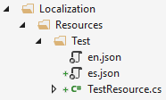

# Localization

ABP's localization system is seamlessly integrated to the `Microsoft.Extensions.Localization` package and compatible with the [Microsoft's localization documentation](https://docs.microsoft.com/en-us/aspnet/core/fundamentals/localization). It adds some useful features and enhancements to make it easier to use in real life application scenarios.

## Installation

> This package is already installed by default with the startup template. So, most of the time, you don't need to install it manually.

Volo.Abp.Localization is the core package of the localization system. Install it to your project using the package manager console (PMC):

```
Install-Package Volo.Abp.Localization
```

Then you can add **AbpLocalizationModule** dependency to your module:

```c#
using Volo.Abp.Modularity;
using Volo.Abp.Localization;

namespace MyCompany.MyProject
{
    [DependsOn(typeof(AbpLocalizationModule))]
    public class MyModule : AbpModule
    {
        //...
    }
}
```

## Creating A Localization Resource

A localization resource is used to group related localization strings together and separate them from other localization strings of the application. A [module](Module-Development-Basics.md) generally defines its own localization resource. Localization resource is just a plain class. Example:

````C#
public class TestResource
{
}
````

Then it should be added using `AbpLocalizationOptions` as shown below:

````C#
[DependsOn(typeof(AbpLocalizationModule))]
public class MyModule : AbpModule
{
    public override void ConfigureServices(ServiceConfigurationContext context)
    {
        Configure<AbpVirtualFileSystemOptions>(options =>
        {
            // "YourRootNameSpace" is the root namespace of your project. It can be empty if your root namespace is empty.
            options.FileSets.AddEmbedded<MyModule>("YourRootNameSpace");
        });

        Configure<AbpLocalizationOptions>(options =>
        {
            //Define a new localization resource (TestResource)
            options.Resources
                .Add<TestResource>("en")
                .AddVirtualJson("/Localization/Resources/Test");
        });
    }
}
````

Translation files' (en.json, tr.json, etc) `Build Action` should be set as `Embedded Resource`.

In this example;

* Added a new localization resource with "en" (English) as the default culture.
* Used JSON files to store the localization strings.
* JSON files are embedded into the assembly using `AbpVirtualFileSystemOptions` (see [virtual file system](Virtual-File-System.md)).

JSON files are located under "/Localization/Resources/Test" project folder as shown below:



A JSON localization file content is shown below:

````json
{
  "culture": "en",
  "texts": {
    "HelloWorld": "Hello World!"
  }
}
````

* Every localization file should define the `culture` code for the file (like "en" or "en-US").
* `texts` section just contains key-value collection of the localization strings (keys may have spaces too).

### Default Resource

`AbpLocalizationOptions.DefaultResourceType` can be set to a resource type, so it is used when the localization resource was not specified:

````csharp
Configure<AbpLocalizationOptions>(options =>
{
    options.DefaultResourceType = typeof(TestResource);
});
````

> The [application startup template](Startup-Templates/Application.md) sets `DefaultResourceType` to the localization resource of the application.

### Short Localization Resource Name

Localization resources are also available in the client (JavaScript) side. So, setting a short name for the localization resource makes it easy to use localization texts. Example:

````C#
[LocalizationResourceName("Test")]
public class TestResource
{
}
````

See the Getting Localized Test / Client Side section below.

### Inherit From Other Resources

A resource can inherit from other resources which makes possible to re-use existing localization strings without referring the existing resource. Example:

````C#
[InheritResource(typeof(AbpValidationResource))]
public class TestResource
{
}
````

Alternative inheritance by configuring the `AbpLocalizationOptions`:

````C#
services.Configure<AbpLocalizationOptions>(options =>
{
    options.Resources
        .Add<TestResource>("en") //Define the resource by "en" default culture
        .AddVirtualJson("/Localization/Resources/Test") //Add strings from virtual json files
        .AddBaseTypes(typeof(AbpValidationResource)); //Inherit from an existing resource
});
````

* A resource may inherit from multiple resources.
* If the new resource defines the same localized string, it overrides the string.

### Extending Existing Resource

Inheriting from a resource creates a new resource without modifying the existing one. In some cases, you may want to not create a new resource but directly extend an existing resource. Example:

````C#
services.Configure<AbpLocalizationOptions>(options =>
{
    options.Resources
        .Get<TestResource>()
        .AddVirtualJson("/Localization/Resources/Test/Extensions");
});
````

* If an extension file defines the same localized string, it overrides the string.

## Getting the Localized Texts

Getting the localized text is pretty standard.

### Simplest Usage In A Class

Just inject the `IStringLocalizer<TResource>` service and use it like shown below:

````csharp
public class MyService : ITransientDependency
{
    private readonly IStringLocalizer<TestResource> _localizer;

    public MyService(IStringLocalizer<TestResource> localizer)
    {
        _localizer = localizer;
    }

    public void Foo()
    {
        var str = _localizer["HelloWorld"];
    }
}
````

##### Format Arguments

Format arguments can be passed after the localization key. If your message is `Hello {0}, welcome!`, then you can pass the `{0}` argument to the localizer like `_localizer["HelloMessage", "John"]`.

> Refer to the [Microsoft's localization documentation](https://docs.microsoft.com/en-us/aspnet/core/fundamentals/localization) for details about using the localization.

### Using In A Razor View/Page

Use `IHtmlLocalizer<T>` in razor views/pages;

````c#
@inject IHtmlLocalizer<TestResource> Localizer

<h1>@Localizer["HelloWorld"]</h1>
````

### Special Base Classes

Some ABP Framework base classes provide a `L` property to use the localizer even easier.

**Example: Localize a text in an application service method**

```csharp
using System.Threading.Tasks;
using MyProject.Localization;
using Volo.Abp.Application.Services;

namespace MyProject
{
    public class TestAppService : ApplicationService
    {
        public TestAppService()
        {
            LocalizationResource = typeof(MyProjectResource);
        }

        public async Task DoIt()
        {
            var str = L["HelloWorld"];
        }
    }
}
```

When you set the `LocalizationResource` in the constructor, the `ApplicationService` class uses that resource type when you use the `L` property, just like in the `DoIt()` method.

Setting `LocalizationResource` in every application service can be tedious. You can create an abstract base application service class, set it there and derive your application services from that base class. This is already implemented when you create a new project with the [startup templates](Startup-Templates/Application.md). So, you can simply inherit from the base class directly use the `L` property:

```csharp
using System.Threading.Tasks;

namespace MyProject
{
    public class TestAppService : MyProjectAppService
    {
        public async Task DoIt()
        {
            var str = L["HelloWorld"];
        }
    }
}
```

The `L` property is also available for some other base classes like `AbpController` and `AbpPageModel`.

## The Client Side

See the following documents to learn how to reuse the same localization texts in the JavaScript side;

* [Localization for the MVC / Razor Pages UI](UI/AspNetCore/JavaScript-API/Localization.md)
* [Localization for the Blazor UI](UI/Blazor/Localization.md)
* [Localization for the Angular UI](UI/Angular/Localization.md)