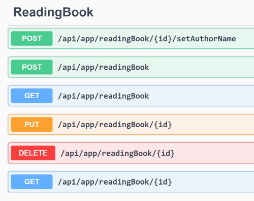
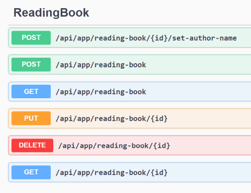

# ABP Framework 3.3 to 4.0 Migration Guide

This document introduces the breaking changes done in the ABP Framework 4.0 and explains how to fix your 3.x based solutions while upgrading to the ABP Framework 4.0.

> See [the blog post](https://blog.abp.io/abp/ABP.IO-Platform-v4.0-RC-Has-Been-Released-based-on-.NET-5.0) to learn what's new with the ABP Framework 4.0. This document only focuses on the breaking changes.

## Overall

Here, the overall list of the changes;

* Upgraded to the .NET 5.0 [(#6118](https://github.com/abpframework/abp/issues/6118)).
* Moved from Newtonsoft.Json to System.Text.Json [(#1198](https://github.com/abpframework/abp/issues/1198)).
* Upgraded to the Identity Server 4.1.1 ([#4461](https://github.com/abpframework/abp/issues/4461)).
* Switched to `kebab-case` for conventional URLs for the auto API controller routes ([#5325](https://github.com/abpframework/abp/issues/5325)).
* Removed Retry for the Dynamic HTTP Client Proxies ([#6090](https://github.com/abpframework/abp/issues/6090)).
* Creation audit properties of the entities made read-only ([#6020](https://github.com/abpframework/abp/issues/6020)).
* Changed type of the IHasExtraProperties.ExtraProperties ([#3751](https://github.com/abpframework/abp/issues/3751)).
* Use IBrandingProvider in the Volo.Abp.UI package and remove the one in the Volo.Abp.AspNetCore.Mvc.UI.Theme.Shared ([#5375](https://github.com/abpframework/abp/issues/5375)).
* Removed the Angular Account Module Public UI (login, register... pages) since they are not being used in the default (authorization code) flow ([#5652](https://github.com/abpframework/abp/issues/5652)).
* Removed the SessionState in the @abp/ng.core package ([#5606](https://github.com/abpframework/abp/issues/5606)).
* Made some API revisions & startup template changes for the Blazor UI.

## Upgraded to .NET 5.0

ABP Framework has been moved to .NET 5.0. So, if you want to upgrade to the ABP Framework 4.0, you also need to upgrade to .NET 5.0.

See the [Migrate from ASP.NET Core 3.1 to 5.0](https://docs.microsoft.com/en-us/aspnet/core/migration/31-to-50) document to learn how to upgrade your solution to .NET 5.0.

## Moved to System.Text.Json

ABP Framework 4.0 uses the System.Text.Json by default as the JSON serialization library. It, actually, using a hybrid approach: Continues to use the Newtonsoft.Json when it needs to use features not supported by the System.Text.Json.

### Unsupported Types

If you want to use the Newtonsoft.Json to serialize/deserialize for some specific types, you can configure the `AbpSystemTextJsonSerializerOptions` in your module's `ConfigureServices` method.

**Example: Use Newtonsoft.Json for `MySpecialClass`**

````csharp
Configure<AbpSystemTextJsonSerializerOptions>(options =>
{
    options.UnsupportedTypes.AddIfNotContains(typeof(MySpecialClass));
});
````

### Always Use the Newtonsoft.Json

If you want to continue to use the Newtonsoft.Json library for all the types, you can set `UseHybridSerializer` to false in the `PreConfigureServices` method of your module class:

````csharp
PreConfigure<AbpJsonOptions>(options =>
{
    options.UseHybridSerializer = false;
});
````

## Upgraded to Identity Server 4.1.1

ABP Framework upgrades the [IdentityServer4](https://www.nuget.org/packages/IdentityServer4) library from 3.x to 4.1.1 with the ABP Framework version 4.0. IdentityServer 4.x has a lot of changes. Some of them are **breaking changes in the data structure**.

### Entity Changes

Entity changes don't directly affect your application; however, it is good to know.

#### ApiScope

As the **most critical breaking change**; Identity Server 4.x defines the `ApiScope` as an independent aggregate root. Previously, it was the child entity of the `ApiResource`. This change requires manual operation. See the _Database Changes_ section.

Also, added `Enabled(string)` and `Description(bool,true)` properties.

#### ApiResource

- Added `AllowedAccessTokenSigningAlgorithms (string)` and `ShowInDiscoveryDocument(bool, default: true)` properties

#### Client

- Added `RequireRequestObject <bool>` and `AllowedIdentityTokenSigningAlgorithms <string>` properties.
- Changed the default value of `RequireConsent` from `true` to `false`.
- Changed the default value of `RequirePkce` from `false` to `true`.

#### DeviceFlowCodes

- Added `SessionId <string>` and `Description <string>` properties.

#### PersistedGrant

- Added `SessionId <string>`, `Description <string>` and `ConsumedTime <DateTime?>` properties

### Database Changes

> Attention: **Please backup your database** before the migration!

**If you are upgrading from 3.x, then there are some steps should be done in your database.**

#### Database Schema Migration

If you are using **Entity Framework Core**, you need to add a new database migration, using the `Add-Migration` command, and apply changes to the database. Please **review the migration** script and read the sections below to understand if it affects your existing data. Otherwise, you may **lose some of your configuration**, which may not be easy to remember and re-configure.

#### Seed Code

If you haven't customized the `IdentityServerDataSeedContributor` and haven't customized the initial data inside the `IdentityServer*` tables;

1. Update `IdentityServerDataSeedContributor` class by comparing to [the latest code](https://github.com/abpframework/abp/blob/dev/templates/app/aspnet-core/src/MyCompanyName.MyProjectName.Domain/IdentityServer/IdentityServerDataSeedContributor.cs). You probably only need to add the `CreateApiScopesAsync` method and the code related to it.
2. Then you can simply clear all the **data** in these tables then execute the `DbMigrator` application to fill it with the new configuration.

#### Migrating the Configuration Data

If you've customized your IdentityServer configuration in the database or in the seed data, you should understand the changes and upgrade your code/data accordingly. Especially, the following changes will affect your application:

- `IdentityServerApiScopes` table's `Enabled` field is dropped and re-created. So, you need to enable the API scopes again manually.
- `IdentityServerApiResourceScopes` table is dropped and recreated. So, you need to backup and move your current data to the new table.
- `IdentityServerIdentityResourceClaims` table is dropped and recreated. So, you need to backup and move your current data to the new table.

You may need to perform additional steps based on how much you made custom configurations.

### Other IdentityServer Changes

IdentityServer has removed the [public origin option](https://github.com/IdentityServer/IdentityServer4/pull/4335). It was resolving HTTP/HTTPS conversion issues, but they decided to leave this to the developer. This is especially needed if you use a reverse proxy where your external protocol is HTTPS but internal protocol is HTTP.

One simple solution is to add such a middleware at the begingning of your ASP.NET Core pipeline.

```csharp
app.Use((httpContext, next) =>
{
    httpContext.Request.Scheme = "https";
    return next();
});
```

> This sample is obtained from the [ASP.NET Core documentation](https://docs.microsoft.com/en-us/aspnet/core/host-and-deploy/proxy-load-balancer#scenarios-and-use-cases). You can use it if you always use HTTPS in all environments.

### Related Resources

- https://leastprivilege.com/2020/06/19/announcing-identityserver4-v4-0/
- https://github.com/IdentityServer/IdentityServer4/issues/4592

## Auto API Controller Route Changes

The route calculation for the [Auto API Controllers](https://docs.abp.io/en/abp/latest/API/Auto-API-Controllers) is changing with the ABP Framework version 4.0 ([#5325](https://github.com/abpframework/abp/issues/5325)). Before v4.0 the route paths were **camelCase**. After version 4.0, it's changed to **kebab-case** route paths where it is possible.

**A typical auto API before v4.0**



**camelCase route parts become kebab-case with 4.0**



### How to Fix?

You may not take any action for the MVC & Blazor UI projects.

For the Angular UI, this change may effect your client UI. If you have used the [ABP CLI Service Proxy Generation](../UI/Angular/Service-Proxies.md), you can run the server side and re-generate the service proxies. If you haven't used this tool, you should manually update the related URLs in your application.

If there are other type of clients (e.g. 3rd-party companies) using your APIs, they also need to update the URLs.

### Use the v3.x style URLs

If it is hard to change it in your application, you can still to use the version 3.x route strategy, by following one of the approaches;

- Set `UseV3UrlStyle` to `true` in the options of the `options.ConventionalControllers.Create(...)` method. Example:

```csharp
options.ConventionalControllers
    .Create(typeof(BookStoreApplicationModule).Assembly, opts =>
        {
            opts.UseV3UrlStyle = true;
        });
```

This approach affects only the controllers for the `BookStoreApplicationModule`.

- Set `UseV3UrlStyle` to `true` for the `AbpConventionalControllerOptions` to set it globally. Example:

```csharp
Configure<AbpConventionalControllerOptions>(options =>
{
    options.UseV3UrlStyle = true;
});
```

Setting it globally affects all the modules in a modular application.

## Removed Retry for the Dynamic HTTP Client Proxies

[Dynamic C# HTTP Client Proxies](../API/Dynamic-CSharp-API-Clients.md) were trying up to 3 times if a request fails using the [Polly](https://github.com/App-vNext/Polly) library. Starting from the version 4.0, this logic has been removed. If you need it, you should configure it in your own application, by configuring the `AbpHttpClientBuilderOptions` in the `PreConfigureServices` method of your module.

**Example: Retry 3 times on failure by incremental waiting between tries**

````csharp
public override void PreConfigureServices(ServiceConfigurationContext context)
{
    PreConfigure<AbpHttpClientBuilderOptions>(options =>
    {
        options.ProxyClientBuildActions.Add((remoteServiceName, clientBuilder) =>
        {
            clientBuilder.AddTransientHttpErrorPolicy(
                policyBuilder => policyBuilder
                    .WaitAndRetryAsync(3, i => TimeSpan.FromSeconds(Math.Pow(2, i)))
            );
        });
    });
}
````

This example uses the Microsoft.Extensions.Http.Polly NuGet package.

If you create a new solution, you can find the same configuration in the `.HttpApi.Client.ConsoleTestApp` project's module class, as an example.

## Creation Audit Properties Made Read-Only

Removed setters from the `IHasCreationTime.CreationTime`, ` IMustHaveCreator.CreatorId` and `IMayHaveCreator.CreatorId` properties to accidently set the creation properties while updating an existing entity.

Since the ABP Framework automatically sets these properties, you normally don't need to directly set them. If you want to set them, as a best practice, it is suggested to make it in the constructor to not provide a way to change it later.

These properties implemented with `protected set` in the `Entity` and `AggregateRoot` base classes. That means you can still set in a derived class, if you need it. Alternatively, you can use reflection to set them (Or use `ObjectHelper.TrySetProperty` which internally uses reflection) out of the class if you have to do.

## Changed type of the IHasExtraProperties.ExtraProperties

`IHasExtraProperties.ExtraProperties` was a regular `Dictionary<string, object>`. With the version 4.0, it is replaced with `ExtraPropertyDictionary` class which inherits the `Dictionary<string, object>`. 

Most of the applications don't be affected by this change. If you've directly implemented this interface, replace the standard dictionary to the `ExtraPropertyDictionary`.

## Other Changes

### IdentityOptions Usage

Previously, when you inject `IOptions<IdentityOptions>`, you get a dynamically overridden options value. For example, when you get `IdentityOptions.Password.RequiredLength`, the value is being changed based on the setting (`IdentitySettingNames.Password.RequiredLength`) of the current tenant. That means `IdentityOptions` changes per tenant. However, this caused an [issue](https://github.com/abpframework/abp/issues/6318) and we [had to change](https://github.com/abpframework/abp/pull/6333) the usage.

With the version 4.0, you need to inject `IOptions<IdentityOptions>` and call the new `SetAsync` method before using it, to be able to override the options by the settings. Otherwise, you get the default (statically configured) values of the options.

Example usage:

````csharp
public class MyService : ITransientDependency
{
    private readonly IOptions<IdentityOptions> _options;

    public MyService(IOptions<IdentityOptions> options)
    {
        _options = options;
    }

    public async Task DoItAsync()
    {
        await _options.SetAsync();

        var requiredLength = _options.Value.Password.RequiredLength;
    }
}
````

Pre-built modules already handles this. However, if you have used `IdentityOptions` directly in your code, you also need to follow this new pattern.
Please make sure that the injected `IOptions<IdentityOptions>` service and the service consuming it are in the same scope of dependency injection container.

### LDAP module full async

In order to solve the problem of async over sync, `ILdapManager` uses async method instead of sync. And use [`ldap4net`](https://github.com/flamencist/ldap4net) to replace [`Novell.Directory.Ldap.NETStandard`](https://github.com/dsbenghe/Novell.Directory.Ldap.NETStandard) package.

### Dynamic external login provider system

You need to change the `WithDynamicOptions` method and pass the `Handler` class of the external login provider.
Use the `goto definition` function in Visual Studio or Rider to check `Handler` in the extension method like `AddGoogle`.

```csharp
- WithDynamicOptions<GoogleOptions>()
+ WithDynamicOptions<GoogleOptions, GoogleHandler>()
````

## ASP.NET Core MVC / Razor Pages UI

See the [ASP.NET Core MVC / Razor Pages UI Migration Guide](Abp-4_0-MVC-Razor-Pages.md).

## Angular UI

See the [Angular UI Migration Guide](Abp-4_0-Angular.md).

## Blazor UI

See the [Blazor UI Migration Guide](Abp-4_0-Blazor.md).
