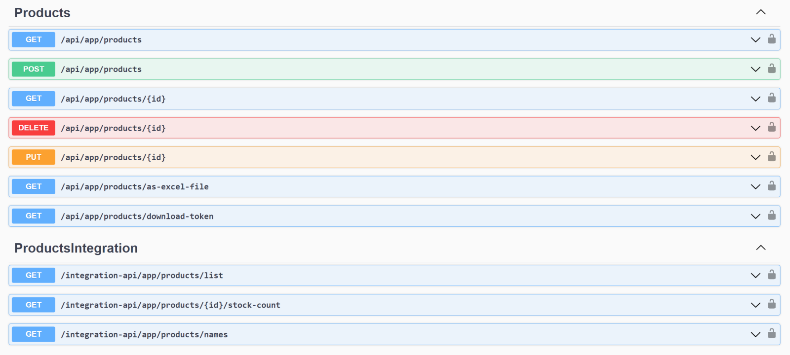

# ABP Version 8.0 Migration Guide

This document is a guide for upgrading ABP v7.x solutions to ABP v8.0. There are some changes in this version that may affect your applications, please read it carefully and apply the necessary changes to your application.

> ABP Framework upgraded to .NET 8.0, so you need to move your solutions to .NET 8.0 if you want to use the ABP 8.0. You can check the [Migrate from ASP.NET Core 7.0 to 8.0](https://learn.microsoft.com/en-us/aspnet/core/migration/70-80) documentation.

## Injected the `IDistributedEventBus` Dependency into the `IdentityUserManager`

In this version, `IDistributedEventBus` service has been injected to the `IdentityUserManager` service, to publish a distributed event when the email or username is changed for a user, this was needed because sometimes there may be scenarios where the old email/username is needed for the synchronization purposes. 

Therefore, you might need to update the `IdentityUserManager`'s constructor if you have overridden the class and are using it. 

> See the issue for more information: https://github.com/abpframework/abp/pull/17990

## Updated Method Signatures in the Bundling System

In this version, ABP Framework introduced the CDN support for bundling. During the development, we have made some improvements on the bundling system and changed some method signatures.

See https://github.com/abpframework/abp/issues/17864 for more information.

## Replaced `IdentityUserLookupAppService` with the `IIdentityUserIntegrationService`

[Integration Services](../Integration-Services.md) are built for module-to-module (or microservice-to-microservice) communication rather than consumed from a UI or a client application as [Application Services](../Application-Services.md) are intended to do.

In that regard, we are discarding the `IIdentityUserLookupAppService` in the Identity Module and moving its functionality to the `IIdentityUserIntegrationService`. Therefore, if you have used that application service directly, use the integration service (`IIdentityUserIntegrationService`) instead. `IIdentityUserLookupAppService` will be removed in thes next versions, so you may need to create a similar service in your application.

> Notice that integration services have no authorization and are not exposed as HTTP API by default.
Also, if you have overridden the `IdentityUserLookupAppService` and `IdentityUserIntegrationService` classes in your application, you should update these classes' constructors as follows:

*IdentityUserLookupAppService.cs*
```csharp
    public IdentityUserLookupAppService(IIdentityUserIntegrationService identityUserIntegrationService)
    {
        IdentityUserIntegrationService = identityUserIntegrationService;
    }
```

*IdentityUserIntegrationService.cs*

```diff
    public IdentityUserIntegrationService(
        IUserRoleFinder userRoleFinder,
+       IdentityUserRepositoryExternalUserLookupServiceProvider userLookupServiceProvider)
    {
        UserRoleFinder = userRoleFinder;
+       UserLookupServiceProvider = userLookupServiceProvider;
    }
```

## MongoDB Event Bus Enhancements

In this version, we have made some enhancements in the transactional inbox/outbox pattern implementation and defined two new methods: `ConfigureEventInbox` and `ConfigureEventOutbox` for MongoDB Event Box collections.

If you call one of these methods in your DbContext class, then this introduces a breaking-change because if you do it, MongoDB collection names will be changed. Therefore, it should be carefully done since existing (non-processed) event records are not automatically moved to new collection and they will be lost. Existing applications with event records should rename the collection manually while deploying their solutions.

See https://github.com/abpframework/abp/pull/17723 for more information. Also, check the documentation for the related configurations: [Distributed Event Bus](../Distributed-Event-Bus.md)

## Moved the CMS Kit Pages Feature's Routing to a `DynamicRouteValueTransformer`

In this version, we have made some improvements in the [CMS Kit's Pages Feature](../Modules/Cms-Kit/Pages.md), such as moving the routing logic to a `DynamicRouteValueTransformer` and etc...

These enhancements led to some breaking changes as listed below that should be taken care of:

* Page routing has been moved to **DynamicRouteValueTransformer**. If you use `{**slug}` pattern in your routing, it might conflict with new CMS Kit routing.
* `PageConsts.UrlPrefix` has been removed, instead, the default prefix is *pages* for now. Still `/pages/{slug}` route works for backward compatibility alongside with `/{slug}` route. 

* **Endpoints changed:**  
  * `api/cms-kit-public/pages/{slug}` endpoint is changed to `api/cms-kit-public/pages/by-slug?slug={slug}`. Now multiple level of page URLs can be used and `/` characters will be transferred as URL Encoded in querysting to the HTTP API.
  * `api/cms-kit-public/pages` changed to `api/cms-kit-public/pages/home`

>_CmsKit Client Proxies are updated. If you don't send a **custom request** to this endpoint, **you don't need to take an action**_

## Added Integration Postfix for Auto Controllers

With this version on, the `Integration` suffix from controller names while generating [auto controllers](../API/Auto-API-Controllers.md) are not going to be removed, to differ the integration services from application services in the OpenAPI specification:



> This should not affect most of the applications since you normally do not depend on the controller names in the client side.

See https://github.com/abpframework/abp/issues/17625 for more information (how to preserve the existing behaviour, etc...).

## Revised the reCaptcha Generator for CMS Kit's Comment Feature

In this version, we have made improvements on the [CMS Kit's Comment Feature](../Modules/Cms-Kit/Comments.md) and revised the reCaptcha generation process, and made a performance improvement.

This introduced some breaking changes that you should aware of:

* Lifetime of the `SimpleMathsCaptchaGenerator` changed from singleton to transient,
* Changed method signatures for `SimpleMathsCaptchaGenerator` class. (all of its methods are now async)

If you haven't override the comment view component, then you don't need to make any changes, however if you have overriden the component and used the `SimpleMathsCaptchaGenerator` class, then you should make the required changes as described.

## Disabled Logging for `HEAD` HTTP Methods

HTTP GET requests should not make any change in the database normally and audit log system of ABP Framework doesn't save audit log objects for GET requests by default. You can configure the `AbpAuditingOptions` and set the `IsEnabledForGetRequests` to **true** if you want to record _GET_ requests as described in [the documentation](../Audit-Logging.md).

Prior to this version, only the _GET_ requests were not saved as audit logs. From this version on, also the _HEAD_ requests will not be saved as audit logs, if the `IsEnabledForGetRequests` explicitly set as **true**.

You don't need to make any changes related to that, however it's important to know this change.

## Obsolete the `AbpAspNetCoreIntegratedTestBase` Class

In this version, `AbpAspNetCoreAsyncIntegratedTestBase` class has been set as `Obsolete` and it's recommended to use `AbpWebApplicationFactoryIntegratedTest` instead.

## Use NoTracking for readonly repositories for EF core. 

In this version, ABP Framework provides read-only [repository](Repositories.md) interfaces (`IReadOnlyRepository<...>` or `IReadOnlyBasicRepository<...>`) to explicitly indicate that your purpose is to query data, but not change it. If so, you can inject these interfaces into your services.

Entity Framework Core read-only repository implementation uses [EF Core's No-Tracking feature](https://learn.microsoft.com/en-us/ef/core/querying/tracking#no-tracking-queries). That means the entities returned from the repository will not be tracked by the EF Core [change tracker](https://learn.microsoft.com/en-us/ef/core/change-tracking/), because it is expected that you won't update entities queried from a read-only repository.

> This behavior works only if the repository object is injected with one of the read-only repository interfaces (`IReadOnlyRepository<...>` or `IReadOnlyBasicRepository<...>`). It won't work if you have injected a standard repository (e.g. `IRepository<...>`) then casted it to a read-only repository interface.

> See the issue for more information: https://github.com/abpframework/abp/pull/17421

## Upgraded NuGet Dependencies

You can see the following list of NuGet libraries that have been upgraded with .NET 8.0 upgrade, if you are using one of these packages explicitly, you may consider upgrading them in your solution:

| Package             | Old Version | New Version |
| ------------------- | ----------- | ----------- |
| All Microsoft packages | 7.x       | 8.x       |
| Microsoft.CodeAnalysis | 4.2.0       | 4.5.0      |
| NUglify | 1.20.0       | 1.21.0       |
| Polly | 7.2.3       | 8.2.0       |
| aliyun-net-sdk-sts | 3.1.0       | 3.1.2       |
| Autofac | 7.0.0       | 7.1.0       |
| Autofac.Extras.DynamicProxy | 6.0.1       | 7.1.0       |
| AutoMapper | 12.0.0       | 12.0.1       |
| AsyncKeyedLock | 6.2.1       | 6.2.2       |
| AWSSDK.S3 | 3.7.9.2       | 3.7.300.2       | 
| AWSSDK.SecurityToken | 3.7.1.151       | 3.7.300.2       |
| Azure.Storage.Blobs | 12.15.0       | 12.19.1       |
| ConfigureAwait.Fody | 3.3.1       | 3.3.2       |
| Confluent.Kafka | 1.8.2       | 2.3.0       |
| Dapper | 2.0.123       | 2.1.21       |
| Dapr.Client | 1.11.0       | 1.12.0       |
| DistributedLock.Core | 1.0.4       | 1.0.5       |
| DistributedLock.Redis | 1.0.1       | 1.0.2       |
| EphemeralMongo.Core | 1.1.0       | 1.1.3       |
| EphemeralMongo6.runtime.linux-x64 | 1.1.0       | 1.1.3       |
| EphemeralMongo6.runtime.osx-x64 | 1.1.0       | 1.1.3       |
| EphemeralMongo6.runtime.win-x64 | 1.1.0       | 1.1.3       |
| FluentValidation | 11.0.1       | 11.8.0       |
| Fody | 6.6.1       | 6.8.0       |
| Hangfire.AspNetCore | 1.8.2       | 1.8.6       |
| Hangfire.SqlServer | 1.8.2       | 1.8.6       |
| HtmlSanitizer | 5.0.331       | 8.0.746       |
| IdentityModel | 6.0.0       | 6.2.0       |
| IdentityServer4.AspNetIdentity | 4.1.1       | 4.1.2       |
| JetBrains.Annotations | 2022.1.0       | 2023.3.0       |
| LibGit2Sharp | 0.26.2       | 0.28.0       |
| Magick.NET-Q16-AnyCPU | 13.2.0       | 13.4.0       |
| MailKit | 3.2.0       | 4.3.0       |
| Markdig.Signed | 0.26.0       | 0.33.0       |
| Microsoft.AspNetCore.Mvc.Versioning | 5.0.0       | 5.1.0       |
| Microsoft.AspNetCore.Razor.Language | 6.0.8       | 6.0.25       |
| Microsoft.NET.Test.Sdk | 17.2.0       | 17.8.0       |
| Minio | 4.0.6       | 6.0.1       |
| MongoDB.Driver | 2.19.1       | 2.22.0       |
| NEST | 7.14.1       | 7.17.5       |
| Newtonsoft.Json | 13.0.1       | 13.0.3       |
| NSubstitute | 4.3.0       | 5.1.0       |
| NSubstitute.Analyzers.CSharp | 1.0.15       | 1.0.16       |
| NuGet.Versioning | 5.11.0       | 6.7.0       |
| Octokit | 0.50.0       | 9.0.0       |
| Quartz | 3.4.0       | 3.7.0       |
| Quartz.Extensions.DependencyInjection | 3.4.0       | 3.7.0       |
| Quartz.Plugins.TimeZoneConverter | 3.4.0       | 3.7.0       |
| RabbitMQ.Client | 6.3.0       | 6.6.0       |
| Rebus | 6.6.5       | 7.2.1       |
| Rebus.ServiceProvider | 7.0.0       | 9.1.0       |
| Scriban | 5.4.4       | 5.9.0       |
| Serilog.AspNetCore | 5.0.0       | 8.0.0       |
| Serilog.Extensions.Hosting | 3.1.0       | 8.0.0       |
| Serilog.Extensions.Logging | 3.1.0       | 8.0.0       |
| Serilog.Sinks.Async | 1.4.0       | 1.5.0       |
| SharpZipLib | 1.3.3       | 1.4.2       |
| Shouldly | 4.1.0       | 4.2.1       |
| SixLabors.ImageSharp | 1.0.4       | 3.0.2       |
| Slugify.Core | 3.0.0       | 4.0.1       |
| Spectre.Console | 0.46.1-preview.0.7       | 0.47.0       |
| Swashbuckle.AspNetCore | 6.2.1       | 6.5.0       |
| System.Linq.Dynamic.Core | 1.3.3       | 1.3.5       |
| TimeZoneConverter | 5.0.0       | 6.1.0       |
| xunit | 2.4.1       | 2.6.1       |
| xunit.extensibility.execution | 2.4.1       | 2.6.1       |
| xunit.runner.visualstudio | 2.4.5       | 2.6.1       |
