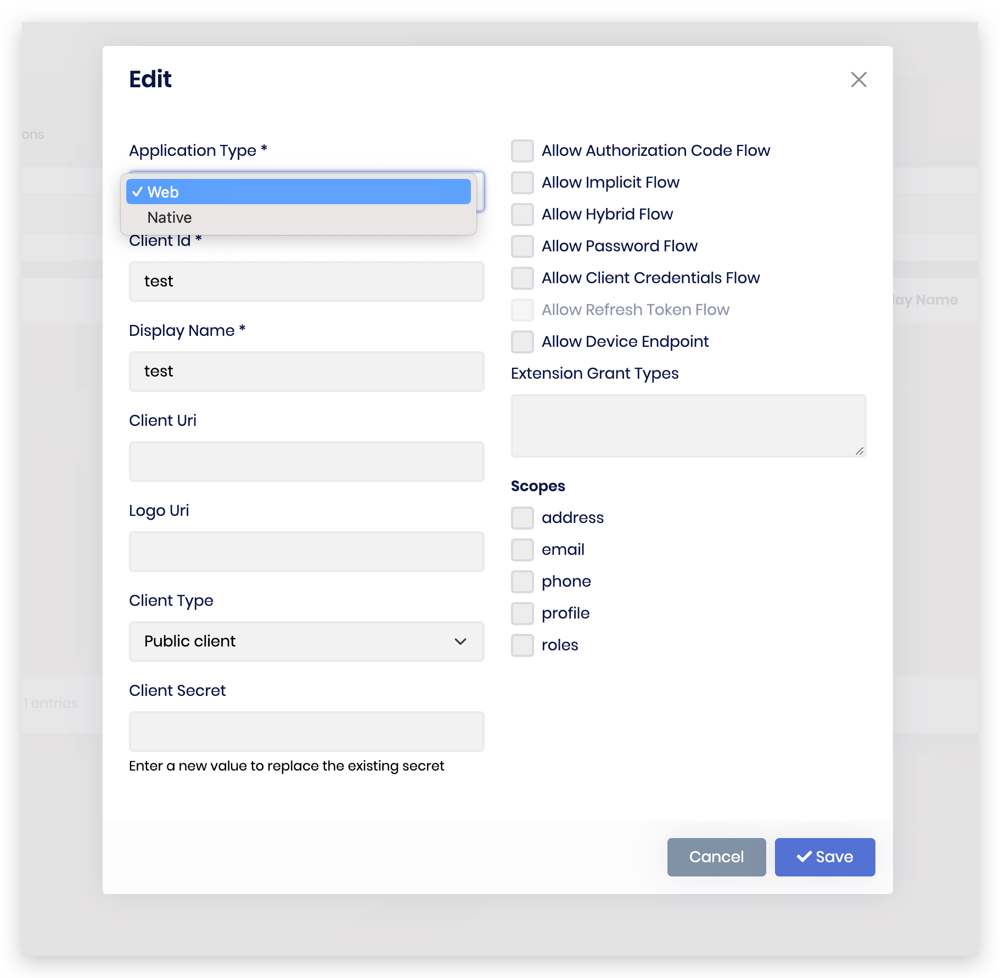
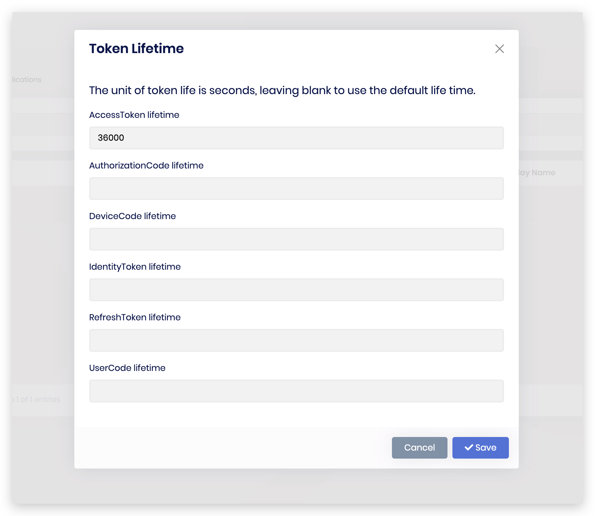

# OpenIddict 4.x to 5.x Migration Guide

The 5.0 release of OpenIddict is a major release that introduces breaking changes.

Check this blog [OpenIddict 5.0 general availability](https://kevinchalet.com/2023/12/18/openiddict-5-0-general-availability/) for the new features introduced in OpenIddict 5.0.

I will show the changes you need to make to do the migration.

> Please backup your database before doing the migration.

## OpenIddictApplication changes

1. The `Type(string)` of the `OpenIddictApplication` has been renamed to `ClientType(string)`.
2. The `ApplicationType(string)` has been added to the `OpenIddictApplication` entity.
3. The `JsonWebKeySet(string)` has been added to the `OpenIddictApplication` entity.
4. The `Settings(string)` has been added to the `OpenIddictApplication` entity.

The new migration looks like this:

````csharp
using Microsoft.EntityFrameworkCore.Migrations;

#nullable disable

namespace OpenIddict.Demo.Server.Migrations
{
    /// <inheritdoc />
    public partial class openiddict5 : Migration
    {
        /// <inheritdoc />
        protected override void Up(MigrationBuilder migrationBuilder)
        {
            migrationBuilder.RenameColumn(
                name: "Type",
                table: "OpenIddictApplications",
                newName: "ClientType");

            migrationBuilder.AddColumn<string>(
                name: "ApplicationType",
                table: "OpenIddictApplications",
                type: "nvarchar(50)",
                maxLength: 50,
                nullable: true);

            migrationBuilder.AddColumn<string>(
                name: "JsonWebKeySet",
                table: "OpenIddictApplications",
                type: "nvarchar(max)",
                nullable: true);

            migrationBuilder.AddColumn<string>(
                name: "Settings",
                table: "OpenIddictApplications",
                type: "nvarchar(max)",
                nullable: true);
        }

        /// <inheritdoc />
        protected override void Down(MigrationBuilder migrationBuilder)
        {
            migrationBuilder.DropColumn(
                name: "ApplicationType",
                table: "OpenIddictApplications");

            migrationBuilder.DropColumn(
                name: "JsonWebKeySet",
                table: "OpenIddictApplications");

            migrationBuilder.DropColumn(
                name: "Settings",
                table: "OpenIddictApplications");

            migrationBuilder.RenameColumn(
                name: "ClientType",
                table: "OpenIddictApplications",
                newName: "Type");
        }
    }
}
````

## OpenIddictApplicationModel changes

1. The `Type(string)` of the `OpenIddictApplicationModel` has been renamed to `ClientType(string)`.
2. The `ApplicationType(string)` has been added to the `OpenIddictApplicationModel` entity.
3. The `JsonWebKeySet`([JsonWebKeySet](https://learn.microsoft.com/en-us/dotnet/api/microsoft.identitymodel.tokens.jsonwebkeyset)) has been added to the `OpenIddictApplicationModel` entity. 
4. The `Settings(string)` has been added to the `OpenIddictApplicationModel` entity.

## OpenIddictApplicationDescriptor changes

You have to change the `Type` to `ClientType` when creating a new `AbpApplicationDescriptor` or `OpenIddictApplicationDescriptor`.

````csharp
var application = new AbpApplicationDescriptor {
    ClientId = name,
-   Type = type,
+   ClientType = type,
    ClientSecret = secret,
    ConsentType = consentType,
    DisplayName = displayName,
````

## OpenIddict Pro module UI changes

You can change the `ApplicationType` when creating/editing a OpenIddict's application, also set time life of the tokens for each application.



