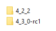
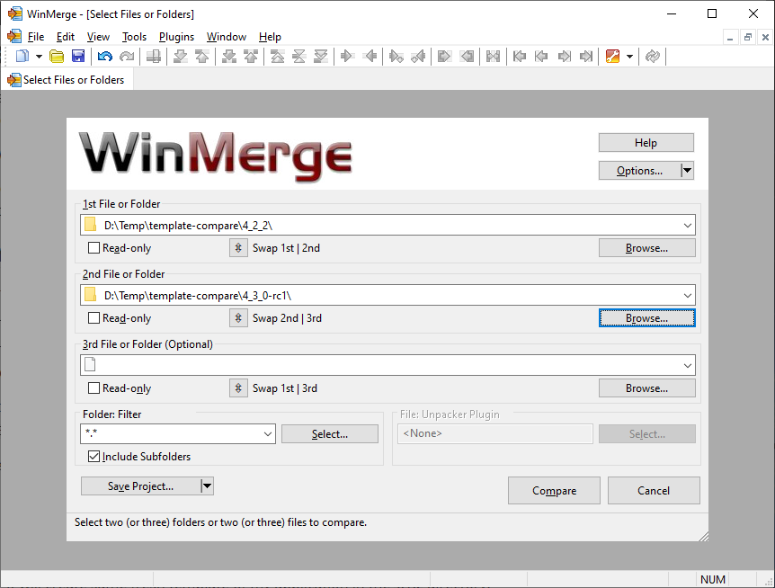
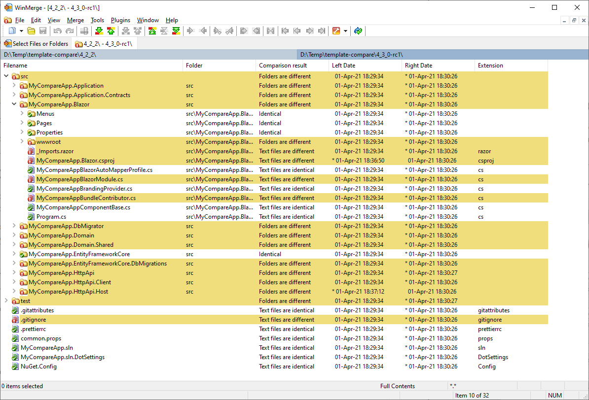
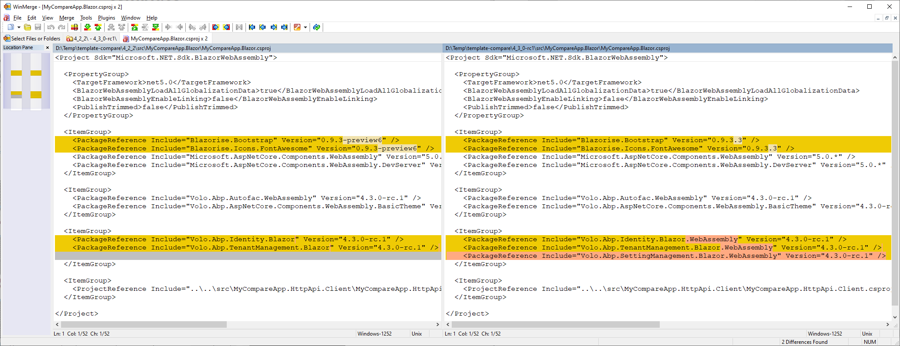

# Upgrading the Startup Template

Sometimes we introduce new features/changes that requires to **make changes in the startup template**. We already implement the changes in the startup template for new applications. However, in some cases you need to manually make some minor changes in your existing solution.

This guide explains a suggested way of upgrading your solution templates, using the WinMerge tool.

> See also the [Upgrading document](../Upgrading.md) for an overall progress of upgrading. This document focuses on upgrading the startup template.

## 1) Create Dummy Solutions

We will create two solutions to compare the changes;

* The first solution is with your existing version
* The second solution is the version you want to upgrade

Assume that we are upgrading from the version **4.2.2** to version **4.3.0-rc.1**. First, create two empty folders:



**A)** Open a command-line terminal inside the `4_2_2` folder and create a new solution with the version `4.2.2` using the ABP [CLI](../CLI.md) (install it if you haven't installed before).

**Example:**

````bash
abp new MyCompareApp -u blazor -v 4.2.2
````

> Important: You need to create the solution with the exact configuration of your solution. If your application has Angular UI and MongoDB, you should use the same options here.

**B)** Then open a command-line terminal inside the `4_3_0-rc1` folder and create a new solution with the version `4.3.0-rc.1` using the ABP [CLI](../CLI.md).

**Example:**

````bash
abp new MyCompareApp -u blazor -v 4.3.0-rc.1
````

Now, we have the same application with different versions.

## 2) Upgrade the Old Application

If we compare two folders now, we will see unnecessary differences because of NuGet & NPM package differences. It is better to upgrade the old application to the new version before comparing them.

Open a command-line terminal inside the `4_2_2` folder and type the following command:

````bash
abp update -v 4.3.0-rc.1
````

This will update all NuGet & NPM packages in your solution. We are ready to compare the folders to see the differences.

## 3) Compare the Folders

We will use the [WinMerge](https://winmerge.org/) utility for the comparison. So, please install it if it wasn't installed before. After installation, open the WinMerge application, select the the *File > Open* menu item, select the folders you want to compare:



Now, we can click to the *Compare* button to see all the differences. Here, a screenshot from the comparison:



See the *Comparison result* column or the yellow coloring to understand if two files or folder are different. It shows almost all folders are different. However, don't worry. Generally a few files will be different in a folder and a few lines will be different in a file comparison.

For example, I select the `MyCompareApp.Blazor.csproj` to understand what's changed in this file:



We see that;

* `Blazorise.Bootstrap` package is upgraded from version `0.9.3-preview6` to version `0.9.3.3`.
* `Blazorise.Icons.FontAwesome` package is upgraded from version `0.9.3-preview6` to version `0.9.3.3`.
* `Volo.Abp.Identity.Blazor` package is replaced by `Volo.Abp.Identity.Blazor.WebAssembly`.
* `Volo.Abp.TenantManagement.Blazor` package is replaced by `Volo.Abp.TenantManagement.Blazor.WebAssembly`.
* `Volo.Abp.SettingManagement.Blazor.WebAssembly` package is newly added.

In this way, we can understand all the changes.

## 4) Apply Changes on Your Solution

Comparison result clearly shows the necessary changes should be done on upgrade. All you need to do is to apply the same changes in your own solution.

> **It is important you first upgrade your own solution to the new version, using the `abp update` command. Then you can apply the manual changes**

## Notes

* Sometimes, you may find some changes are unnecessary for your own solution. You may deleted these or already customized. In these cases, you can just ignore it.
* If you do not upgrade your solution as described in this document, your application will continue to work as long as you implement the breaking changes documented in the [migration guide](Index.md). However, you may not get benefit of some new features those require changes in your solution files.
* Most of the times, there will be a few or no differences on the startup templates. When there are  important changes, we write a note to the related migration guide, so you apply them manually.