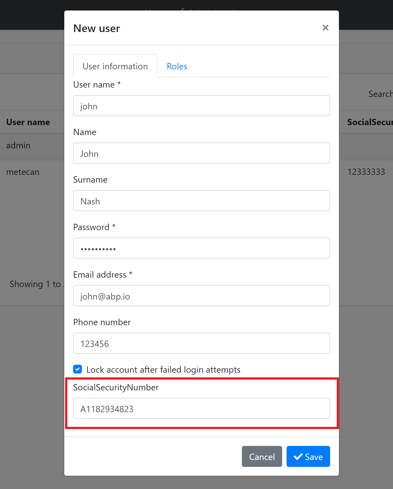
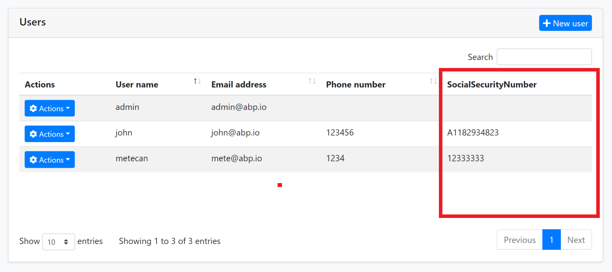
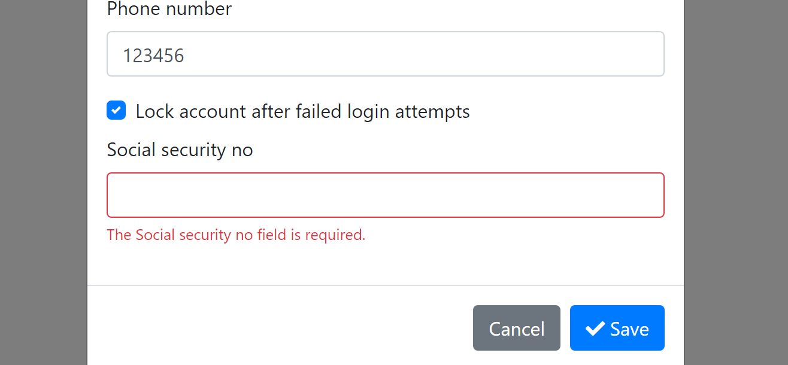
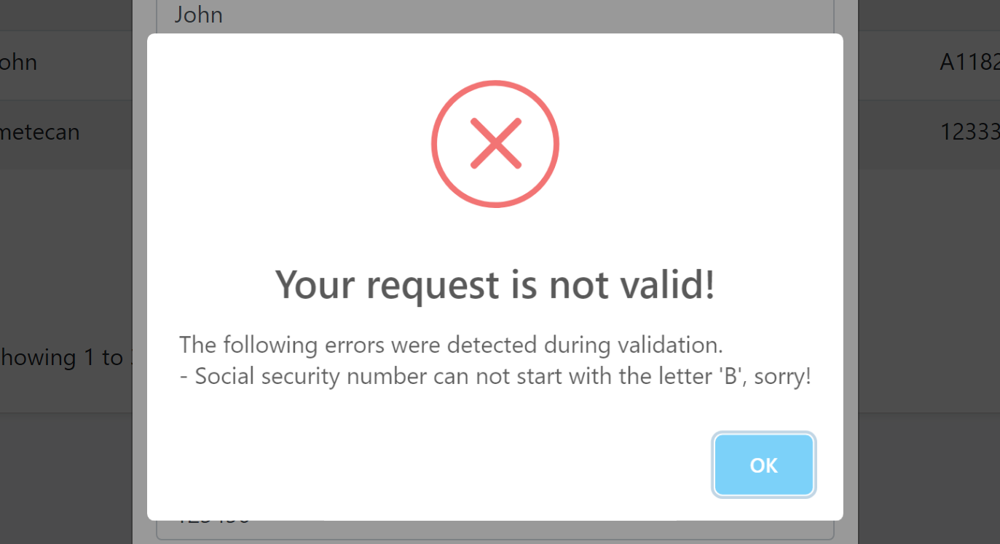
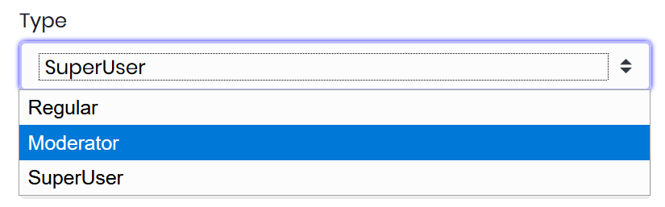
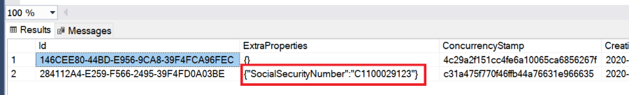
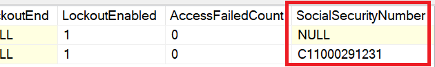

# Module Entity Extensions

## Introduction

Module entity extension system is a **high level** extension system that allows you to **define new properties** for existing entities of the depended modules. It automatically **adds properties to the entity, database, HTTP API and the user interface** in a single point.

> The module must be developed the *Module Entity Extensions* system in mind. All the **official modules** supports this system wherever possible.

## Quick Example

Open the *YourProjectNameModuleExtensionConfigurator* class inside the `Domain.Shared` project of your solution and change the `ConfigureExtraProperties`method  as shown below to add a `SocialSecurityNumber` property to the `IdentityUser` entity of the [Identity Module](Modules/Identity.md).

````csharp
public static void ConfigureExtraProperties()
{
    OneTimeRunner.Run(() =>
    {
        ObjectExtensionManager.Instance.Modules()
            .ConfigureIdentity(identity =>
            {
                identity.ConfigureUser(user =>
                {
                    user.AddOrUpdateProperty<string>( //property type: string
                        "SocialSecurityNumber", //property name
                        property =>
                        {
                            //validation rules
                            property.Attributes.Add(new RequiredAttribute());
                            property.Attributes.Add(
                                new StringLengthAttribute(64) {
                                    MinimumLength = 4
                                }
                            );

                            //...other configurations for this property
                        }
                    );
                });
            });
    });
}
````

>This method is called inside the `YourProjectNameDomainSharedModule` at the beginning of the application. `OneTimeRunner` is a utility class that guarantees to execute this code only one time per application, since multiple calls are unnecessary.

* `ObjectExtensionManager.Instance.Modules()` is the starting point to configure a module. `ConfigureIdentity(...)`  method is used to configure the entities of the Identity Module.
* `identity.ConfigureUser(...)` is used to configure the user entity of the identity module. Not all entities are designed to be extensible (since it is not needed). Use the intellisense to discover the extensible modules and entities.
* `user.AddOrUpdateProperty<string>(...)` is used to add a new property to the user entity with the `string` type (`AddOrUpdateProperty` method can be called multiple times for the same property of the same entity. Each call can configure the options of the same property, but only one property is added to the entity with the same property name). You can call this method with different property names to add more properties.
* `SocialSecurityNumber` is the name of the new property.
* `AddOrUpdateProperty` gets a second argument (the `property =>` lambda expression) to configure additional options for the new property.
  * We can add data annotation attributes like shown here, just like adding a data annotation attribute to a class property.

#### Create & Update Forms

Once you define a property, it appears in the create and update forms of the related entity:



`SocialSecurityNumber` field comes into the form. Next sections will explain the localization and the validation for this new property.

### Data Table

New properties also appear in the data table of the related page:



`SocialSecurityNumber` column comes into the table. Next sections will explain the option to hide this column from the data table.

## Property Options

There are some options that you can configure while defining a new property.

### Display Name

You probably want to set a different (human readable) display name for the property that is shown on the user interface.

#### Don't Want to Localize?

If your application is not localized, you can directly set the `DisplayName` for the property to a `FixedLocalizableString` object. Example:

````csharp
property =>
{
    property.DisplayName = new FixedLocalizableString("Social security no");
}
````

#### Localizing the Display Name

If you want to localize the display name, you have two options.

##### Localize by Convention

Instead of setting the `property.DisplayName`, you can directly open your localization file (like `en.json`) and add the following entry to the `texts` section:

````json
"SocialSecurityNumber": "Social security no"
````

Define the same `SocialSecurityNumber` key (the property name you've defined before) in your localization file for each language you support. That's all!

In some cases, the localization key may conflict with other keys in your localization files. In such cases, you can use the `DisplayName:` prefix for display names in the localization file (`DisplayName:SocialSecurityNumber` as the localization key for this example). Extension system looks for prefixed version first, then fallbacks to the non prefixed name (it then fallbacks to the property name if you haven't localized it).

> This approach is recommended since it is simple and suitable for most scenarios.

##### Localize using the `DisplayName` Property

If you want to specify the localization key or the localization resource, you can still set the `DisplayName` option:

````csharp
property =>
{
    property.DisplayName =
        LocalizableString.Create<MyProjectNameResource>(
            "UserSocialSecurityNumberDisplayName"
        );
}
````

* `MyProjectNameResource` is the localization resource and `UserSocialSecurityNumberDisplayName` is the localization key in the localization resource.

> See [the localization document](Localization.md) if you want to learn more about the localization system.

#### Default Value

A default value is automatically set for the new property, which is the natural default value for the property type, like `null` for `string`, `false` for `bool` or `0` for `int`.

There are two ways to override the default value:

##### DefaultValue Option

`DefaultValue` option can be set to any value:

````csharp
property =>
{
    property.DefaultValue = 42;
}
````

##### DefaultValueFactory Options

`DefaultValueFactory` can be set to a function that returns the default value:

````csharp
property =>
{
    property.DefaultValueFactory = () => DateTime.Now;
}
````

`options.DefaultValueFactory` has a higher priority than the `options.DefaultValue` .

> Tip: Use `DefaultValueFactory` option only if the default value may change over the time (like `DateTime.Now` in this example). If it is a constant value, then use the `DefaultValue` option.

### Validation

Entity extension system allows you to define validation for extension properties in a few ways.

#### Data Annotation Attributes

`Attributes` is a list of attributes associated to this property. The example code below adds two [data annotation validation attributes](https://docs.microsoft.com/en-us/aspnet/core/mvc/models/validation) to the property:

````csharp
property =>
{
    property.Attributes.Add(new RequiredAttribute());
    property.Attributes.Add(new StringLengthAttribute(64) {MinimumLength = 4});
}
````

When you run the application, you see that the validation works out of the box:



Since we've added the `RequiredAttribute`, it doesn't allow to left it blank. The validation system works;

* On the user interface (with automatic localization).
* On the HTTP API. Even if you directly perform an HTTP request, you get validation errors with a proper HTTP status code.
* On the `SetProperty(...)` method on the entity (see [the document](Entities.md) if you wonder what is the `SetProperty()` method).

So, it automatically makes a full stack validation.

> See the [ASP.NET Core MVC Validation document](https://docs.microsoft.com/en-us/aspnet/core/mvc/models/validation) to learn more about the attribute based validation.

##### Default Validation Attributes

There are some attributes **automatically added** when you create certain type of properties;

* `RequiredAttribute` is added for **non nullable** primitive property types (e.g. `int`, `bool`, `DateTime`...) and `enum` types. If you want to allow nulls, make the property nullable (e.g. `int?`).
* `EnumDataTypeAttribute` is added for **enum types**, to prevent to set invalid enum values.

Use `property.Attributes.Clear();` if you don't want these attributes.

#### Validation Actions

Validation actions allows you to execute a custom code to perform the validation. The example below checks if the `SocialSecurityNumber` starts with `B` and adds a validation error if so:

````csharp
property =>
{
    property.Attributes.Add(new RequiredAttribute());
    property.Attributes.Add(new StringLengthAttribute(64) {MinimumLength = 4});

    property.Validators.Add(context =>
    {
        if (((string) context.Value).StartsWith("B"))
        {
            context.ValidationErrors.Add(
                new ValidationResult(
                    "Social security number can not start with the letter 'B', sorry!",
                    new[] {"extraProperties.SocialSecurityNumber"}
                )
            );
        }
    });

}
````

Using a `RegularExpressionAttribute` might be better in this case, but this is just an example. Anyway, if you enter a value starts with the letter `B` you get the following error **while saving the form**:



##### The Context Object

The `context` object has useful properties that can be used in your custom validation action. For example, you can use the `context.ServiceProvider` to resolve services from the [dependency injection system](Dependency-Injection.md). The example below gets the localizer and adds a localized error message:

````csharp
if (((string) context.Value).StartsWith("B"))
{
    var localizer = context.ServiceProvider
        .GetRequiredService<IStringLocalizer<MyProjectNameResource>>();

    context.ValidationErrors.Add(
        new ValidationResult(
            localizer["SocialSecurityNumberCanNotStartWithB"],
            new[] {"extraProperties.SocialSecurityNumber"}
        )
    );
}
````

>`context.ServiceProvider` is nullable! It can be `null` only if you use the `SetProperty(...)` method on the object. Because DI system is not available on this time. While this is a rare case, you should perform a fallback logic when `context.ServiceProvider` is `null`. For this example, you would add a non-localized error message. This is not a problem since setting an invalid value to a property generally is a programmer mistake and you mostly don't need to localization in this case. In any way, you would not be able to use localization even in a regular property setter. But, if you are serious about localization, you can throw a business exception (see the [exception handling document](https://docs.abp.io/en/abp/latest/Exception-Handling) to learn how to localize a business exception).

### UI Visibility

When you define a property, it appears on the data table, create and edit forms on the related UI page. However, you can control each one individually. Example:

````csharp
property =>
{
    property.UI.OnTable.IsVisible = false;
    //...other configurations
}
````

Use `property.UI.OnCreateForm` and `property.UI.OnEditForm` to control forms too. If a property is required, but not added to the create form, you definitely get a validation exception, so use this option carefully. But a required property may not be in the edit form if that's your requirement.

### HTTP API Availability

Even if you disable a property on UI, it can be still available through the HTTP API. By default, a property is available on all APIs.

Use the `property.Api` options to make a property unavailable in some API endpoints.

````csharp
property =>
{
    property.Api.OnUpdate.IsAvailable = false;
}
````

In this example, Update HTTP API will not allow to set a new value to this property. In this case, you also want to disable this property on the edit form:

````csharp
property =>
{
    property.Api.OnUpdate.IsAvailable = false;
    property.UI.OnEditForm.IsVisible = false;
}
````

In addition to the `property.Api.OnUpdate`, you can set `property.Api.OnCreate` and `property.Api.OnGet` for a fine control the API endpoint.

## Special Types

### Enum

Module extension system naturally supports the `enum` types.

An example enum type:

````csharp
public enum UserType
{
    Regular,
    Moderator,
    SuperUser
}
````

You can add enum properties just like others:

````csharp
user.AddOrUpdateProperty<UserType>("Type");
````

An enum properties is shown as combobox (select) in the create/edit forms:



#### Localization

Enum member name is shown on the table and forms by default. If you want to localize it, just create a new entry on your [localization](https://docs.abp.io/en/abp/latest/Localization) file:

````json
"UserType.SuperUser": "Super user" 
````

One of the following names can be used as the localization key:

* `Enum:UserType.SuperUser`
* `UserType.SuperUser`
* `SuperUser`

Localization system searches for the key with the given order. Localized text are used on the table and the create/edit forms.

## Database Mapping

For relational databases, all extension property values are stored in a single field in the table:



`ExtraProperties` field stores the properties as a JSON object. While that's fine for some scenarios, you may want to create a dedicated field for your new property. Fortunately, it is very easy to configure.

If you are using the Entity Framework Core database provider, you can configure the database mapping as shown below:

````csharp
ObjectExtensionManager.Instance
    .MapEfCoreProperty<IdentityUser, string>(
        "SocialSecurityNumber",
        (entityBuilder, propertyBuilder) =>
        {
            propertyBuilder.HasMaxLength(64);
        }
    );
````

Write this inside the `YourProjectNameEfCoreEntityExtensionMappings` class in your `.EntityFrameworkCore` project. Then you need to use the standard `Add-Migration` and `Update-Database` commands to create a new database migration and apply the change to your database.

Add-Migration create a new migration as shown below:

````csharp
public partial class Added_SocialSecurityNumber_To_IdentityUser : Migration
{
    protected override void Up(MigrationBuilder migrationBuilder)
    {
        migrationBuilder.AddColumn<string>(
            name: "SocialSecurityNumber",
            table: "AbpUsers",
            maxLength: 128,
            nullable: true);
    }

    protected override void Down(MigrationBuilder migrationBuilder)
    {
        migrationBuilder.DropColumn(
            name: "SocialSecurityNumber",
            table: "AbpUsers");
    }
}
````

Once you update your database, you will see that the `AbpUsers` table has the new property as a standard table field:



> If you first created a property without a database table field, then you later needed to move this property to  a database table field, it is suggested to execute an SQL command in your migration to copy the old values to the new field.
>
> However, if you don't make it, the ABP Framework seamlessly manages it. It uses the new database field, but fallbacks to the `ExtraProperties` field if it is null. When you save the entity, it moves the value to the new field.

See the [Extending Entities](Customizing-Application-Modules-Extending-Entities.md) document for more.

## More

See the [Customizing the Modules](Customizing-Application-Modules-Guide.md) guide for an overall index for all the extensibility options.

Here, a few things you can do:

* You can create a second entity that maps to the same database table with the extra property as a standard class property (if you've defined the EF Core mapping). For the example above, you can add a `public string SocialSecurityNumber {get; set;}` property to the `AppUser` entity in your application, since the `AppUser` entity is mapped to the same `AbpUser` table. Do this only if you need it, since it brings more complexity to your application.
* You can override a domain or application service to perform custom logics with your new property.
* You can low level control how to add/render a field in the data table on the UI.

