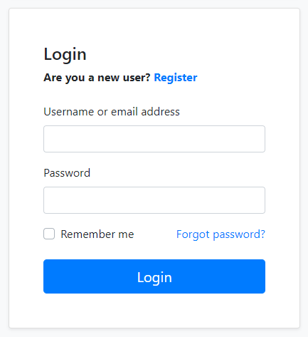
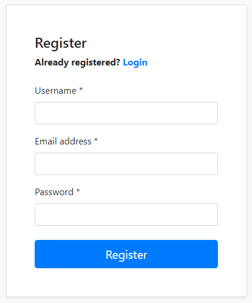
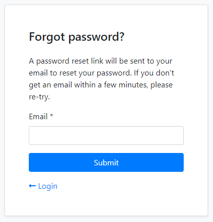
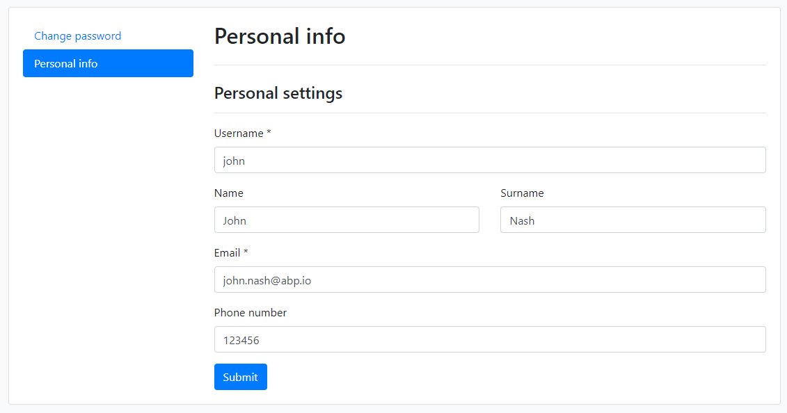

# Account Module

Account module implements the basic authentication features like **login**, **register**, **forgot password** and **account management**.

This module is based on [Microsoft's Identity library](https://docs.microsoft.com/en-us/aspnet/core/security/authentication/identity) and the [Identity Module](Identity.md). It has [IdentityServer](https://github.com/IdentityServer) integration (based on the [IdentityServer Module](IdentityServer.md)) to provide **single sign-on**, access control and other advanced authentication features.

## How to Install

This module comes as pre-installed (as NuGet/NPM packages) when you [create a new solution](https://abp.io/get-started) with the ABP Framework. You can continue to use it as package and get updates easily, or you can include its source code into your solution (see `get-source` [CLI](../CLI.md) command) to develop your custom module.

### The Source Code

The source code of this module can be accessed [here](https://github.com/abpframework/abp/tree/dev/modules/account). The source code is licensed with [MIT](https://choosealicense.com/licenses/mit/), so you can freely use and customize it.

## User Interface

This section introduces the main pages provided by this module.

### Login

`/Account/Login` page provides the login functionality.



Social/external login buttons becomes visible if you setup it. See the *Social/External Logins* section below. Register and Forgot password and links redirect to the pages explained in the next sections.

### Register

`/Account/Register` page provides the new user registration functionality.



### Forgot Password & Reset Password

`/Account/ForgotPassword` page provides a way of sending password reset link to user's email address. The user then clicks to the link and determines a new password.



### Account Management

`/Account/Manage` page is used to change password and personal information of the user.



## IdentityServer Integration

[Volo.Abp.Account.Web.IdentityServer](https://www.nuget.org/packages/Volo.Abp.Account.Web.IdentityServer) package provides integration for the [IdentityServer](https://github.com/IdentityServer). This package comes as installed with the [application startup template](../Startup-Templates/Application.md). See the [IdentityServer Module](IdentityServer.md) documentation.

## Social/External Logins

The Account Module has already configured to handle social or external logins out of the box. You can follow the ASP.NET Core documentation to add a social/external login provider to your application.

### Example: Facebook Authentication

Follow the [ASP.NET Core Facebook integration document](https://docs.microsoft.com/en-us/aspnet/core/security/authentication/social/facebook-logins) to support the Facebook login for your application.

#### Add the NuGet Package

Add the [Microsoft.AspNetCore.Authentication.Facebook](https://www.nuget.org/packages/Microsoft.AspNetCore.Authentication.Facebook) package to your project. Based on your architecture, this can be `.Web`, `.IdentityServer` (for tiered setup) or `.Host` project.

#### Configure the Provider

Use the `.AddFacebook(...)` extension method in the `ConfigureServices` method of your [module](../Module-Development-Basics.md), to configure the client:

````csharp
context.Services.AddAuthentication()
    .AddFacebook(facebook =>
    {
        facebook.AppId = "...";
        facebook.AppSecret = "...";
        facebook.Scope.Add("email");
        facebook.Scope.Add("public_profile");
    });
````

> It would be a better practice to use the `appsettings.json` or the ASP.NET Core User Secrets system to store your credentials, instead of a hard-coded value like that. Follow the [Microsoft's document](https://docs.microsoft.com/en-us/aspnet/core/security/authentication/social/facebook-logins) to learn the user secrets usage.
