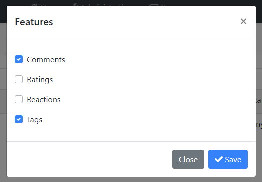
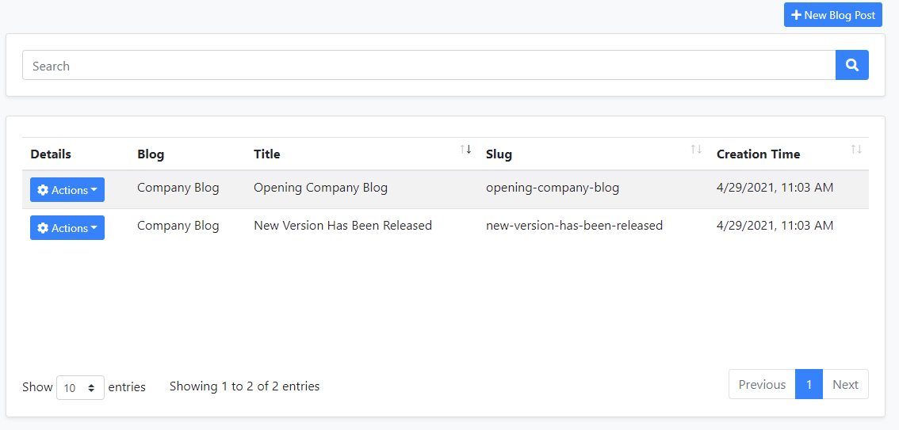
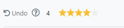

# CMS Kit Module

This module provides CMS(Content Management System) capabilities for your application.

* Provides a **page** management system to manage dynamic pages.
* Provides a **blog** system to create blogs and publish posts.
* Provides a **tag** system to tag any kind of resources, like blog posts.
* Provides a **comment** system to add comments feature to any kind of resource, like blog posts.
* Provides a **reaction** system to add reactions feature to any kind of resource, like blog posts or comments.
* Provides a **rating** system to add ratings feature to any kind of resource.

## How to install

The ABP CLI allows adding a module to a solution using `add-module` command. CMS kit module can be added using the command below;

```bash
abp add-module Volo.CmsKit
```
Open the `GlobalFeatureConfigurator` class in the `Domain.Shared` project and place the following code to the `Configure` method to enable all features in the CMS kit module.

```csharp
GlobalFeatureManager.Instance.Modules.CmsKit(cmsKit =>
{
    cmsKit.EnableAll();
});

```

> If you are using EntityFrameworkCore, do not forget to add a new migration and update your database.

## Packages

This module follows the [module development best practices guide](https://docs.abp.io/en/abp/latest/Best-Practices/Index) and consists of several NuGet and NPM packages. See the guide if you want to understand the packages and relations between them.

CMS kit packages are designed for various usage scenarios. When you visit the [CMS kit package list page](https://www.nuget.org/packages?q=Volo.CmsKit), you will see that packages have admin, public and unified versions. 
For example,
 - `Volo.CmsKit.Admin.Application`: Contains functionality required by admin websites.
 - `Volo.CmsKit.Public.Application`: Contains functionality required by public websites.
 - `Volo.CmsKit.Application` : Unified package dependent on both public and admin packages.

If you want to want to separate admin and public website codes, you can use the admin and public packages. However, if you want to keep admin and public website codes in a shared project, you can use the unified packages to include both admin and public packages. 

It is recommeded to use the unified packages instead of adding both admin and public packages.

## Feature System

CMS kit uses the [global feature](https://docs.abp.io/en/abp/latest/Global-Features) system for all implemented features. You can use the global feature system to enable all features or only enabled specific features easily.

To enable all features in the CMS kit, open the `GlobalFeatureConfigurator` class in the `Domain.Shared` project.

```csharp
GlobalFeatureManager.Instance.Modules.CmsKit(cmsKit =>
{
    cmsKit.EnableAll();
});
```

You can only enable specific features such as pages, like below.

```csharp
GlobalFeatureManager.Instance.Modules.CmsKit(cmsKit =>
{
    cmsKit.Pages.Enable();
});
```

## User interface

### Menu items

CMS kit module adds the following items to the "Main" menu, under the "CMS" menu item:

* **Pages**: Page management page.
* **Blogs**: Blog management page.
* **Blog Posts**: Blog post management page.
* **Tags**: Tag management page.
* **Comments**: Comment management page.

`CmsKitAdminMenus` class has the constants for the menu item names.

### Pages

### Page Management

Pages page is used to manage dynamic pages in the system.


You can create or edit an existing page on this page.


* When you create a page, you can access the created page via `pages/{slug}` URL.

### Blog Management

Blogs page is used to create and manage blogs in your system. 


A screenshot from the new blog creation modal:


#### Blog Features

You can enable or disable a specific feature for blogs by clicking the features action.


You can select/deselect the desired features for blog posts. 



### Blog Post Management

When you create blogs, you can manage blog posts on this page.



You can create and edit an existing blog post on this page. If you enable specific features such as tags, you can set tags for the blog post on this page.


### Tag Management

CMS Kit provides an extensible tagging mechanism to add tagging capabilities to various places. 


You can create or edit an existing tag on this page.


### Comment Management

CMS Kit provides an extensible commenting mechanism to add comments to various places. You can add comment control to anywhere you want and manage the comments.

You can view and manage comments on this page.


You can manage and view replies on this page.


### Reactions

CMS Kit provides an extensible reaction component system to allow users to send reactions to your content. Here how the reactions component looks on a sample page. 


You can also customize the reaction icons shown in the reaction component.

### Ratings

You can use the rating component to add rating a mechanism to your content. Here how the rating component looks on  a sample page.


