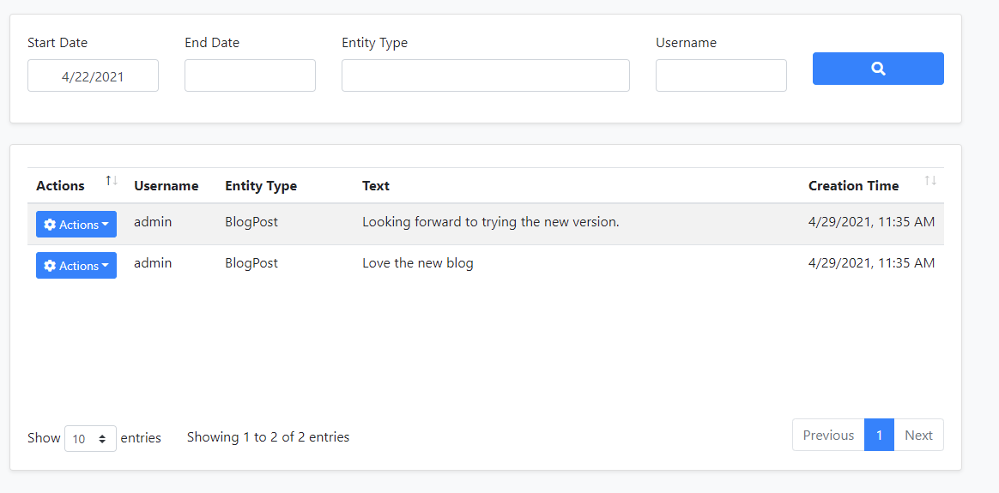

# CMS Kit: Comments

CMS kit provides a **comment** system to add comments feature to any kind of resource, like blog posts, products, etc.

## Options

The comment system provides a mechanism to group comment definitions by entity types. For example, if you want to use comment system for blog posts and products, you need to define two entity types named `BlogPosts` and `Product`, and add comments under these entity types.

`CmsKitCommentOptions` can be configured in the domain layer, in the `ConfigureServices` method of your [module](https://docs.abp.io/en/abp/latest/Module-Development-Basics). Example:

```csharp
Configure<CmsKitCommentOptions>(options =>
{
    options.EntityTypes.Add(new CommentEntityTypeDefinition("Product"));
});
```

> If you're using the blog feature, the ABP framework defines an entity type for the blog feature automatically. You can easily override or remove the predefined entity types in `Configure` method like shown above.

`CmsKitCommentOptions` properties:

- `EntityTypes`: List of defined entity types(`CmsKitCommentOptions`) in the comment system.

`CommentEntityTypeDefinition` properties:

- `EntityType`: Name of the entity type.

## The Comments Widget

The comment system provides a commenting [widget](../../UI/AspNetCore/Widgets.md) to allow users to send comments to resources on public websites. You can simply place the widget on a page like below. 

```csharp
@await Component.InvokeAsync(typeof(CommentingViewComponent), new
{
  entityType = "Product",
  entityId = "..."
})
```

`entityType` was explained in the previous section. `entityId` should be the unique id of the product, in this example. If you have a Product entity, you can use its Id here.

## User Interface

### Menu Items

The following menu items are added by the commenting feature to the admin application:

* **Comments**: Opens the comment management page.

### Pages

#### Comment Management

You can view and manage comments on this page.



You can also view and manage replies on this page.


## Internals

### Domain Layer

#### Aggregates

This module follows the [Entity Best Practices & Conventions](https://docs.abp.io/en/abp/latest/Best-Practices/Entities) guide.

##### Comment

A comment represents a written comment from a user.

- `Comment` (aggregate root): Represents a written comment in the system.

#### Repositories

This module follows the [Repository Best Practices & Conventions](https://docs.abp.io/en/abp/latest/Best-Practices/Repositories) guide.

Following custom repositories are defined for this feature:

- `ICommentRepository`

#### Domain services

This module follows the [Domain Services Best Practices & Conventions](https://docs.abp.io/en/abp/latest/Best-Practices/Domain-Services) guide.

##### Comment Manager

`CommentManager` is used to perform some operations for the `Comment` aggregate root.

### Application layer

#### Application services

- `CommentAdminAppService` (implements `ICommentAdminAppService`): Implements the use cases of comment management system, like listing or removing comments etc.
- `CommentPublicAppService` (implements `ICommentPublicAppService`):  Implements the use cases of comment management on the public websites, like listing comments, adding comments etc.

### Database providers

#### Common

##### Table / collection prefix & schema

All tables/collections use the `Cms` prefix by default. Set static properties on the `CmsKitDbProperties` class if you need to change the table prefix or set a schema name (if supported by your database provider).

##### Connection string

This module uses `CmsKit` for the connection string name. If you don't define a connection string with this name, it fallbacks to the `Default` connection string.

See the [connection strings](https://docs.abp.io/en/abp/latest/Connection-Strings) documentation for details.

#### Entity Framework Core

##### Tables

- CmsComments

#### MongoDB

##### Collections

- **CmsComments**

