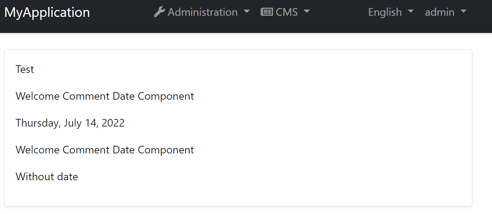

# Dynamic Widget

CMS kit provides a widget system to allow render dynamic [widgets](https://docs.abp.io/en/abp/latest/UI/AspNetCore/Widgets) in pages and blog posts. Its mean, in static content you can use the dynamic content. We will mention how you can do it.

## Options 
To configure the widget, you should define as the below code in YourModule.cs 

```csharp
Configure<CmsKitContentWidgetOptions>(options =>
    {
        options.AddWidget(widgetKey: "ExampleWidget", widgetName: "ExampleDate", editorWidgetName: "ExampleModalDate");
    }); 
```

Let's look at these parameters in detail
* `widgetKey` is used for end-user and more readable names. The following bold word represents widgetKey.
    [Widget Type="**ExampleWidget**" Code="SelectedValue"]

* `widgetName` is used for your widget name used in code via [Widget] attribute.
```csharp
public class ExampleDateViewComponent : AbpViewComponent
{
    public IViewComponentResult Invoke(string isShow)
    {
        return View("YourRazorPage.cshtml", 
        new ExampleDateModel() { IsShow = bool.Parse(isShow) });
    }
} 
```
```html
<p>Welcome Comment Date Component</p>
@if (Model.IsShow)
{
    <p> @DateTime.Today.ToLongDateString()</p>
}
else
{
    <p>Without date</p>
}
```
* `editorWidgetName` is used the for editor component side to see on the `Add Widget` modal.
After choosing the widget type from listbox and renders this widget automatically.

```csharp
[Widget]
public class ExampleModalDateViewComponent : AbpViewComponent
{
    public IViewComponentResult Invoke()
    {
        return View("YourModalRazorPage.cshtml", 
        new ExampleModalDateViewModel() { IsShow = bool.Parse(isShow) });
    }
}
```
> Important Note: To get properties properly you should set `name` property on razor page or you may use abp component. It handles that automatically

```html
 <abp-input asp-for="IsShow" />
```

Now ready to see the changes on Page/Blogpost create/update pages. Right of the editor you will see the customized the `W` button to add a dynamic widget like the below image. Don't forget please this is design mode and you need to view your page in view mode after saving. Also `Preview` tab on the editor will be ready to check your output easily for widget configurations in the next features.


In this image, after choosing your wwidget (on the other case, it changes automatically up to your configuration, mine is `Example Widget`. Its parameter name `editorWidgetName` and its value is `ExampleModalDate`) you will see the next widget. Enter input values or choose them and click `Add`. You will see the below output.

> [Widget Type="ExampleWidget" IsShow="true"]

You can edit this output manually if do any wrong coding for that (wrong value or typo) you won't see the widget (ex, first two lines have wrong values in the editor ), even so, your page will be viewed successfully. 

After completing the above steps, you should see the above screenshot by going `Pages/Slug`
