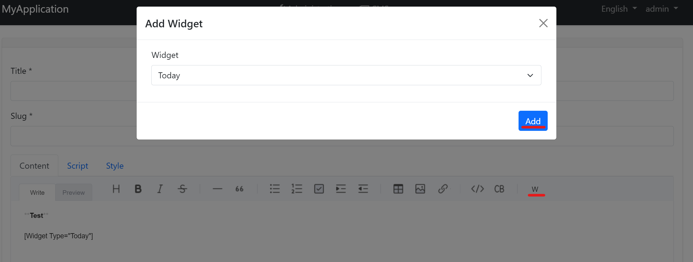

# Dynamic Widget

CMS kit provides a dynamic [widget](https://docs.abp.io/en/abp/latest/UI/AspNetCore/Widgets) used to render the components previously developed by the software in the content of the pages and blog posts. Its means, that in static content you can use dynamic content. We will mention how you can do it. You have two choices to define the widget in the system: Writing and UI.

### Adding the widget
Firstly we will show how to use the widget system via writing manually in the page and blogpost contents.

Let's define the view component

```csharp
[Widget]
[ViewComponent(Name = "CmsToday")]
public class TodayViewComponent : AbpViewComponent
{
    public IViewComponentResult Invoke()
    {
        return View("~/ViewComponents/Today.cshtml",
         new TodayViewComponent());
    }
} 
```

```html
@model Volo.CmsKit.ViewComponents.TodayViewComponent

<p>Welcome Today Component</p>
<p>@DateTime.Now.ToString()</p>

```

Now configuration time on YourModule.cs
```csharp
Configure<CmsKitContentWidgetOptions>(options =>
    {
        options.AddWidget("Today","CmsToday");
    }); 
```

Now you're ready to add your widget by writing.
[Widget Type="Today"]

After completing the above steps, you can see the output at the right of the below screenshot.


### Adding by using UI 
Now we will mention the second option, using UI.
Once writing these definitions can make some mistakes hence we added a new feature to use the widget system easily. To the right of the editor, you will see the customized `W` button to add a dynamic widget like the below image. Don't forget please this is design mode and you need to view your page in view mode after saving. Also `Preview` tab on the editor will be ready to check your output easily for widget configurations in the next features.



### Adding by using UI with parameters
Let's improve the above example by adding a new parameter named format. Via this feature, we can use the widget system with many different scenarios but not prolong the document. Also, these examples can be expandable with dependency injection and getting values from the database, but we will use a basic example. We will add the format parameter to customize the date.

```csharp
[Widget]
[ViewComponent(Name = "CmsToday")]
public class TodayViewComponent : AbpViewComponent
{
    public string Format { get; set; }

    public IViewComponentResult Invoke(string format)
    {
        return View("~/ViewComponents/Today.cshtml",
         new TodayViewComponent() { Format = format });
    }
} 
```

```html
@model Volo.CmsKit.ViewComponents.TodayViewComponent

<p>Welcome Today Component</p>
<p>@DateTime.Now.ToString(Format)</p>

```

Let's define the format component.
```csharp
[Widget]
[ViewComponent(Name = "Format")]
public class FormatViewComponent : AbpViewComponent
{
    public IViewComponentResult Invoke()
    {
        return View("~/ViewComponents/Format.cshtml",
         new FormatViewModel());
    }  
}

public class FormatViewModel
{
    [DisplayName("Format your date in the component")]
    public string Format { get; set; }
}
```
> Important Note: To get properties properly you should set the `name` property on the razor page or you may use the ABP component. ABP handles that automatically.

```html
@using Volo.CmsKit.ViewComponents
@model FormatViewModel

<div>
    <abp-input asp-for="Format" />
</div>
```

```csharp
Configure<CmsKitContentWidgetOptions>(options =>
    {
        options.AddWidget("Today", "CmsToday", "Format");
    }); 
```


In this image, after choosing your widget (on the other case, it changes automatically up to your configuration, mine is `Today`. Its parameter name `parameterWidgetName` and its value is `Format`) you will see the next widget. Enter input values or choose them and click `Add`. You will see the underlined output in the editor. Right of the image, also you can see its previewed output.

You can edit this output manually if do any wrong coding for that (wrong value or typo) you won't see the widget, even so, your page will be viewed successfully. 

## Options 
To configure the widget, you should define the below code in YourModule.cs 

```csharp
Configure<CmsKitContentWidgetOptions>(options =>
    {
        options.AddWidget(widgetType: "Today", widgetName: "CmsToday", parameterWidgetName: "Format");
    }); 
```

Let's look at these parameters in detail
* `widgetType` is used for end-user and more readable names. The following bold word represents widgetType.
[Widget Type="**Today**" Format="yyyy-dd-mm HH:mm:ss"].

* `widgetName` is used for your widget name used in code for the name of the `ViewComponent`.

* `parameterWidgetName` is used the for editor component side to see on the `Add Widget` modal.
After choosing the widget type from listbox (now just defined `Format`) and renders this widget automatically. It's required only to see UI once using parameters