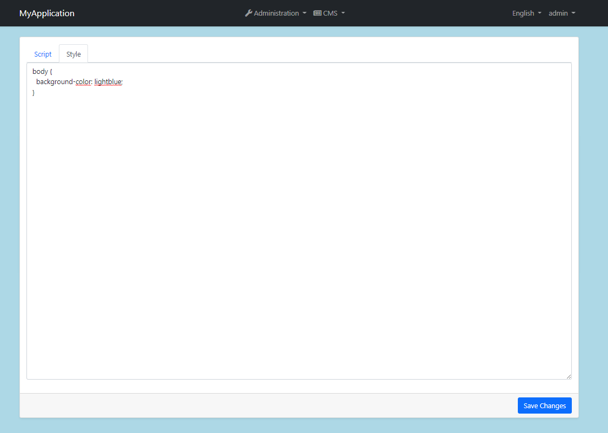

# CMS Kit: Global Resources

CMS Kit Global Resources system allows to add global styles and scripts dynamically.

## The User Interface

### Menu items

CMS Kit module admin side adds the following items to the main menu, under the *Global Resources* menu item:

* **Global Resources**: Global resources management page.

`CmsKitAdminMenus` class has the constants for the menu item names.

### Global Resources Page

Global Resources page is used to manage global styles and scripts in the system.

# Internals

## Domain Layer

#### Aggregates

This module follows the [Entity Best Practices & Conventions](https://docs.abp.io/en/abp/latest/Best-Practices/Entities) guide.

- `GlobalResource` (aggregate root): Stores a resource.

#### Repositories

This module follows the [Repository Best Practices & Conventions](https://docs.abp.io/en/abp/latest/Best-Practices/Repositories) guide.

Following custom repositories are defined for this feature:

- `IGlobalResourceRepository`

#### Domain services

This module follows the [Domain Services Best Practices & Conventions](https://docs.abp.io/en/abp/latest/Best-Practices/Domain-Services) guide.

##### Global Resource Manager

`GlobalResourceManager` is used to perform operations for the `GlobalResource` aggregate root.

### Application layer

#### Application services

- `GlobalResourceAdminAppService` (implements `IGlobalResourceAdminAppService`): Implements the management operations of global resources system.
- `GlobalResourcePublicAppService` (implements `IGlobalResourcePublicAppService`): Implements the public use cases of global resources system.

#### Database

#### Entity Framework Core

##### Tables

- CmsGlobalResources

#### MongoDB

##### Collections

- CmsGlobalResources