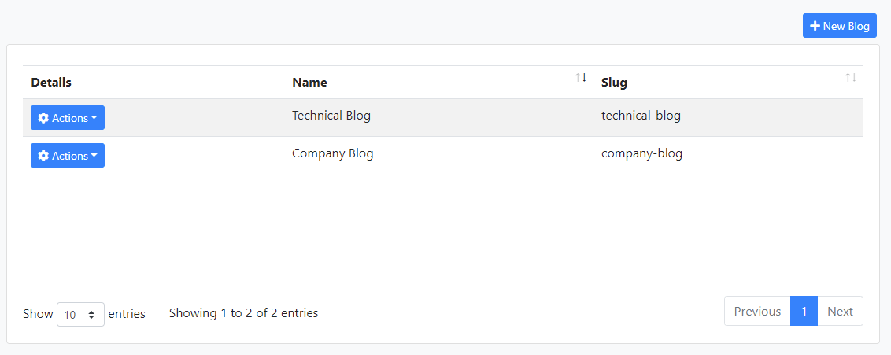
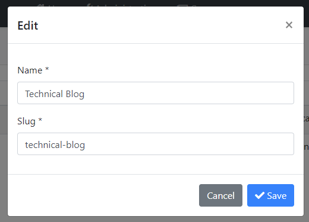
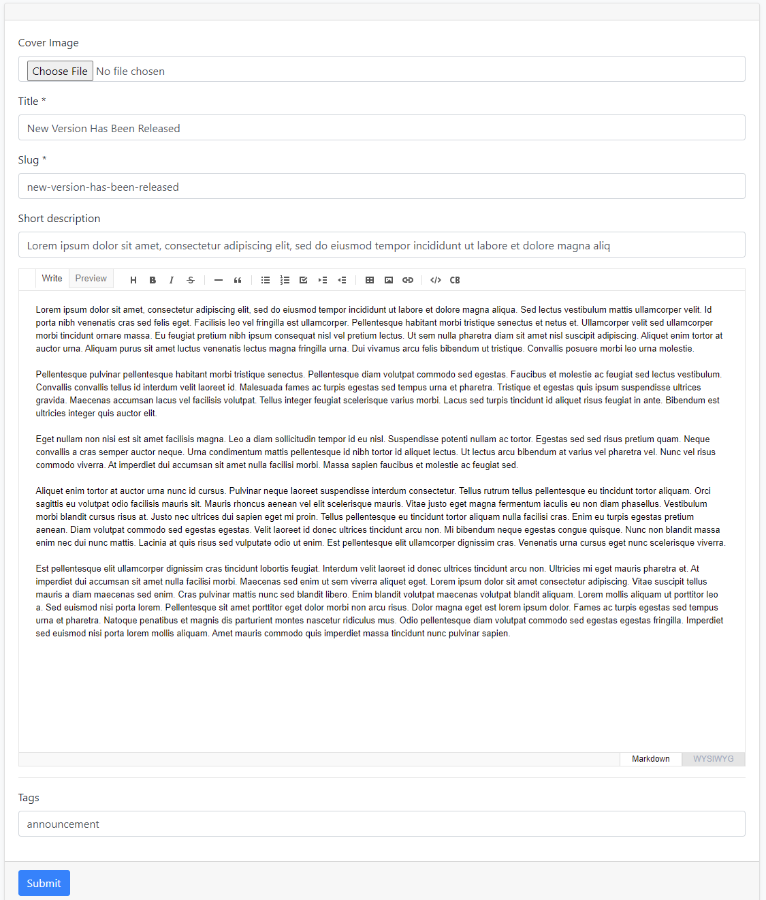
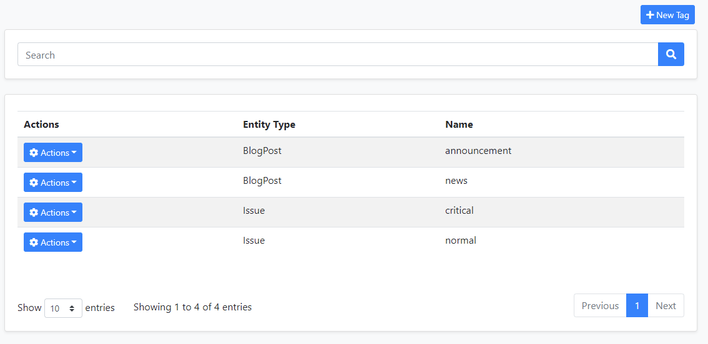

# CMS Kit Module

This module provides CMS (Content Management System) capabilities for your application. It provides **core building blocks** and fully working **sub-systems** to create your own website with CMS features enabled, or use the building blocks in your web sites with any purpose.

> **This module currently available only for the MVC UI**. While there is no official Blazor package, it can also work in a Blazor Server UI since a Blazor Server UI application is actually a hybrid application that runs within the MVC UI.

The following features are currently available:

* Provides a [**page**](Pages.md) management system to manage dynamic pages with dynamic URLs.
* Provides a [**blogging**](Blogging.md) system to create publish blog posts with multiple blog support.
* Provides a [**tagging**](Tags.md) system to tag any kind of resource, like a blog post.
* Provides a [**comment**](Comments.md) system to add comments feature to any kind of resource, like blog post or a product review page.
* Provides a [**reaction**](Reactions.md) system to add reactions (smileys) feature to any kind of resource, like a blog post or a comment.
* Provides a [**rating**](Ratings.md) system to add rating feature to any kind of resource.

Click to a feature to understand and learn how to use it.

All features are individually usable. If you disable a feature, it completely disappears from your application, even from the database tables, by the help of the [Global Features](../../Global-Features.md) system.

## How to Install

[ABP CLI](../../CLI.md) allows installing a module to a solution using the `add-module` command. You can install the CMS Kit module in a command-line terminal with the following command:

```bash
abp add-module Volo.CmsKit
```
After the installation process, open the `GlobalFeatureConfigurator` class in the `Domain.Shared` project of your solution and place the following code into the `Configure` method to enable all the features in the CMS Kit module.

```csharp
GlobalFeatureManager.Instance.Modules.CmsKit(cmsKit =>
{
    cmsKit.EnableAll();
});
```

Instead of enabling all, you may prefer to enable the features one by one. The following example enables only the [tags](Tags.md) and [comments](Comments.md) features:

````csharp
GlobalFeatureManager.Instance.Modules.CmsKit(cmsKit =>
{
    cmsKit.Tags.Enable();
    cmsKit.Comments.Enable();
});
````

> If you are using Entity Framework Core, do not forget to add a new migration and update your database.

## The Packages

This module follows the [module development best practices guide](https://docs.abp.io/en/abp/latest/Best-Practices/Index) and consists of several NuGet and NPM packages. See the guide if you want to understand the packages and relations between them.

CMS kit packages are designed for various usage scenarios. If you check the [CMS kit packages](https://www.nuget.org/packages?q=Volo.CmsKit), you will see that some packages have `Admin` and `Public` suffixes. The reason is that the module has two application layers, considering they might be used in different type of applications. These application layers uses a single domain layer.

 - `Volo.CmsKit.Admin.*` packages contain the functionalities required by admin (back office) applications.
 - `Volo.CmsKit.Public.*` packages contain the functionalities used in public websites where users read blog posts or leave comments.
 - `Volo.CmsKit.*` (without Admin/Public suffix) packages are called as unified packages. Unified packages are shortcuts for adding Admin & Public packages (of the related layer) separately. If you have a single application for administration and public web site, you can use these packages.

## The User Interface

### Menu items

CMS Kit module admin side adds the following items to the main menu, under the *CMS* menu item:

* **Pages**: Page management page.
* **Tags**: Tag management page.
* **Comments**: Comment management page.

`CmsKitAdminMenus` class has the constants for the menu item names.

### Pages

### Page Management

Pages page is used to manage dynamic pages in the system.


You can create or edit an existing page on this page.


* When you create a page, you can access the created page via `pages/{slug}` URL.

### Blog Management

Blogs page is used to create and manage blogs in your system. 



A screenshot from the new blog creation modal:



#### Blog Features

You can enable or disable a specific feature for blogs by clicking the features action.


You can select/deselect the desired features for blog posts. 


### Blog Post Management

When you create blogs, you can manage blog posts on this page.


You can create and edit an existing blog post on this page. If you enable specific features such as tags, you can set tags for the blog post on this page.



### Tag Management

CMS Kit provides an extensible tagging mechanism to add tagging capabilities to various places. 



You can create or edit an existing tag on this page.


### Comment Management

CMS Kit provides an extensible commenting mechanism to add comments to various places. You can add comment control to anywhere you want and manage the comments.

You can view and manage comments on this page.


You can manage and view replies on this page.


### Reactions

CMS Kit provides an extensible reaction component system to allow users to send reactions to your content. Here how the reactions component looks on a sample page. 


You can also customize the reaction icons shown in the reaction component.

### Ratings

You can use the rating component to add rating a mechanism to your content. Here how the rating component looks on a sample page.


## Internals

### Table / collection prefix & schema

All tables/collections use the `Cms` prefix by default. Set static properties on the `CmsKitDbProperties` class if you need to change the table prefix or set a schema name (if supported by your database provider).

### Connection string

This module uses `CmsKit` for the connection string name. If you don't define a connection string with this name, it fallbacks to the `Default` connection string.

See the [connection strings](https://docs.abp.io/en/abp/latest/Connection-Strings) documentation for details.