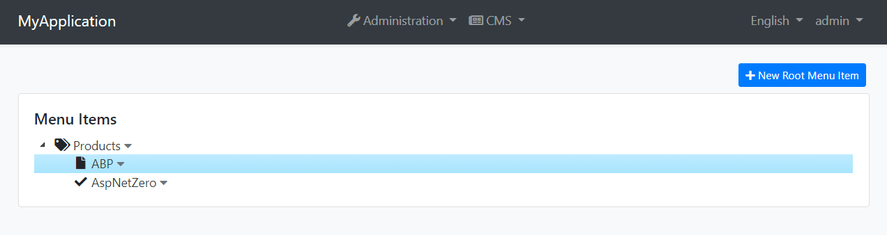
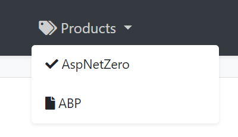

# CMS Kit: Menus

CMS Kit Menu system allows to manage public menus dynamically.

## Enabling the Menu Feature

By default, CMS Kit features are disabled. Therefore, you need to enable the features you want, before starting to use it. You can use the [Global Feature](../../Global-Features.md) system to enable/disable CMS Kit features on development time. Alternatively, you can use the ABP Framework's [Feature System](https://docs.abp.io/en/abp/latest/Features) to disable a CMS Kit feature on runtime.

> Check the ["How to Install" section of the CMS Kit Module documentation](Index.md#how-to-install) to see how to enable/disable CMS Kit features on development time.

## The User Interface

### Menu items

CMS Kit module admin side adds the following items to the main menu, under the *CMS* menu item:

* **Menus**: Menu management page.

`CmsKitAdminMenus` class has the constants for the menu item names.

### Menus

#### Menu Management

Menus page is used to manage dynamic public menus in the system.

The created menu items will be visible on the public-web side, as shown below:

## Internals

### Domain Layer

#### Aggregates

This module follows the [Entity Best Practices & Conventions](https://docs.abp.io/en/abp/latest/Best-Practices/Entities) guide.

- `MenuItem` (aggregate root): A Menu Item presents a single node at menu tree.

#### Repositories

This module follows the [Repository Best Practices & Conventions](https://docs.abp.io/en/abp/latest/Best-Practices/Repositories) guide.

Following custom repositories are defined for this feature:

- `IMenuItemRepository`

#### Domain services

This module follows the [Domain Services Best Practices & Conventions](https://docs.abp.io/en/abp/latest/Best-Practices/Domain-Services) guide.

##### Menu Item Manager

`MenuItemManager` is used to perform some operations for the `MenuItemManager` aggregate root.

### Application layer

#### Application services

- `MenuItemAdminAppService` (implements `IMenuItemAdminAppService`): Implements the management operations of menu system.
- `MenuItemPublicAppService` (implements `IMenuItemPublicAppService`): Implements the public use cases of menu system.

### Database providers

#### Common

##### Table / collection prefix & schema

All tables/collections use the `Cms` prefix by default. Set static properties on the `CmsKitDbProperties` class if you need to change the table prefix or set a schema name (if supported by your database provider).

##### Connection string

This module uses `CmsKit` for the connection string name. If you don't define a connection string with this name, it fallbacks to the `Default` connection string.

See the [connection strings](https://docs.abp.io/en/abp/latest/Connection-Strings) documentation for details.

#### Entity Framework Core

##### Tables

- CmsMenuItems

#### MongoDB

##### Collections

- CmsMenuItems