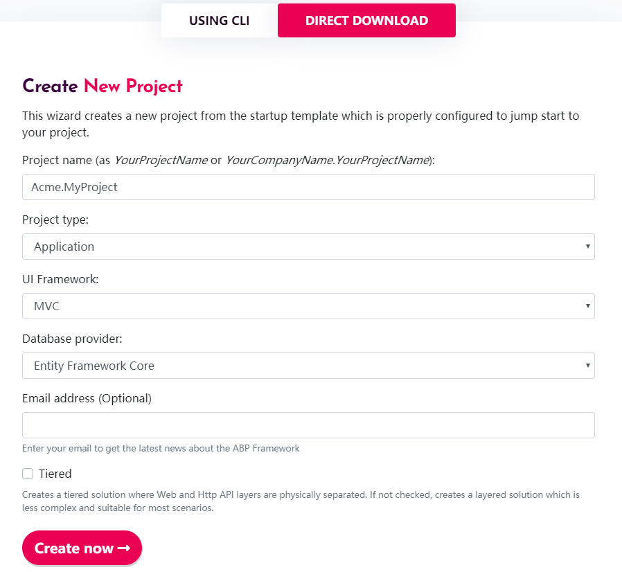
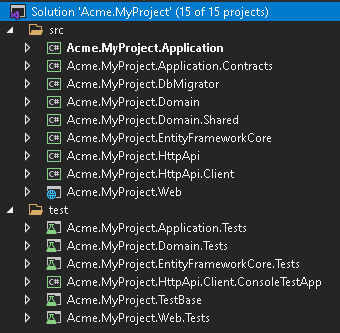
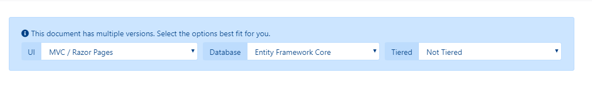
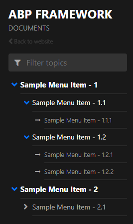

# Docs Module

## What is Docs Module?

Docs module is an application module for ABP framework. It simplifies software documentation. This module is free and open-source.

### Integration

Currently docs module provides you to store your docs both on GitHub and file system. 

### Hosting

Docs module is an application module and does not offer any hosting solution. You can host your docs on-premise or on cloud.

### Versioning

When you use GitHub to store your docs, Docs Module supports versioning. If you have multiple versions for your docs, there will be a combo-box on the UI to switch between versions. If you choose file system to store your docs, it does not support multiple versions. 

[The documents](docs.abp.io) for ABP framework is also using this module.

> Docs module follows the [module architecture best practices](../Best-Practices/Module-Architecture.md) guide.


## Installation

### 1- Download 

If you do not have an existing ABP project, this step shows you how to create a new project from [abp.io](https://abp.io) to add the Docs Module. If you already have an ABP project, you can skip this step. 

Navigate to https://abp.io/Templates. Enter your project name as `Acme.MyProject`, select `ASP.NET Core Mvc Application` and select `Entity Framework Core` for the database provider.

Note that this document covers `Entity Framework Core` provider but you can also select `MongoDB` as your database provider. 



### 2- Running The Empty Application

After you download the project, extract the ZIP file and open `Acme.MyProject.sln`. You will see that the solution consists of `Application`, `Domain `, `EntityFrameworkCore` and `Web` projects. Right click on `Acme.MyProject.Web` project and **Set as StartUp Project**.



The database connection string is located in `appsettings.json` of your `Acme.MyProject.Web` project. If you have a different database configuration, change the connection string.

```json
{
  "ConnectionStrings": {
    "Default": "Server=localhost;Database=MyProject;Trusted_Connection=True;MultipleActiveResultSets=true"
  }
}
```


Open `Package Manager Console`  in the Visual Studio and choose `src\Acme.MyProject.EntityFrameworkCore` as the default project. Run `Update-Database` command to create your new database. The database `MyProject` will be created in your database server.

Now an empty ABP project has been created! You can now run your project and see the empty website. 

To login your website enter `admin` as the username and `1q2w3E*` as the password.

### 2- Referencing Docs Module Packages

Docs module packages are hosted on NuGet. There are 4 packages that needs be to installed to your application. Each package has to be installed to the relevant project.  

* [Volo.Docs.Domain](https://www.nuget.org/packages/Volo.Docs.Domain/)  needs to be referenced to `Acme.MyProject.Domain` project.

  * Edit `Acme.MyProject.Domain.csproj`file and add the below line to as a reference. Note that you need to change version (v0.9.0) to the latest.

    ```csharp
     <PackageReference Include="Volo.Docs.Domain" Version="0.9.0" />
    ```
* [Volo.Docs.EntityFrameworkCore](https://www.nuget.org/packages/Volo.Docs.EntityFrameworkCore/) needs to be referenced to `Acme.MyProject.EntityFrameworkCore` project.

  - Edit `Acme.MyProject.EntityFrameworkCore.csproj`file and add the below line to as a reference. Note that you need to change version (v0.9.0) to the latest.

    ```csharp
    <PackageReference Include="Volo.Docs.EntityFrameworkCore" Version="0.9.0" />
    ```
* [Volo.Docs.Application](https://www.nuget.org/packages/Volo.Docs.Application/) needs to be referenced to `Acme.MyProject.Application` project.

  * Edit `Acme.MyProject.Application.csproj`file and add the below line to as a reference. Note that you need to change version (v0.9.0) to the latest.

    ```csharp
    <PackageReference Include="Volo.Docs.Application" Version="0.9.0" />
    ```
* [Volo.Docs.Web ](https://www.nuget.org/packages/Volo.Docs.Web/)needs to be referenced to `Acme.MyProject.Web` project.

  - Edit `Acme.MyProject.Web.csproj`file and add the below line to as a reference. Note that you need to change version (v0.9.0) to the latest.

    ```csharp
    <PackageReference Include="Volo.Docs.Web" Version="0.9.0" />
    ```


### 3- Adding Module Dependencies

An ABP module must declare `[DependsOn]` attribute if it has a dependency upon another module. Each module has to be added in`[DependsOn]` attribute to the relevant project.

* Open `MyProjectDomainModule.cs`and add `typeof(DocsDomainModule)` as shown below;

  ```csharp
   [DependsOn(
          typeof(DocsDomainModule),
          typeof(AbpIdentityDomainModule),
          typeof(AbpAuditingModule),
          typeof(BackgroundJobsDomainModule),
          typeof(AbpAuditLoggingDomainModule)
          )]
      public class MyProjectDomainModule : AbpModule
      {
          //...
      }
  ```

* Open `MyProjectEntityFrameworkCoreModule.cs`and add `typeof(DocsEntityFrameworkCoreModule)` as shown below;

  ```csharp
      [DependsOn(
          typeof(DocsEntityFrameworkCoreModule),
          typeof(MyProjectDomainModule),
          typeof(AbpIdentityEntityFrameworkCoreModule),
          typeof(AbpPermissionManagementEntityFrameworkCoreModule),
          typeof(AbpSettingManagementEntityFrameworkCoreModule),
          typeof(AbpEntityFrameworkCoreSqlServerModule),
          typeof(BackgroundJobsEntityFrameworkCoreModule),
          typeof(AbpAuditLoggingEntityFrameworkCoreModule)
          )]
      public class MyProjectEntityFrameworkCoreModule : AbpModule
      {
          //...
      }
  ```


* Open `MyProjectApplicationModule.cs`and add `typeof(DocsApplicationModule)` as shown below;

  ```csharp
     [DependsOn(
          typeof(DocsApplicationModule),
          typeof(MyProjectDomainModule),
          typeof(AbpIdentityApplicationModule))]
      public class MyProjectApplicationModule : AbpModule
      {
          public override void ConfigureServices(ServiceConfigurationContext context)
          {
              Configure<PermissionOptions>(options =>
              {
                  options.DefinitionProviders.Add<MyProjectPermissionDefinitionProvider>();
              });
  
              Configure<AbpAutoMapperOptions>(options =>
              {
                  options.AddProfile<MyProjectApplicationAutoMapperProfile>();
              });
          }
      }
  ```


* Open `MyProjectWebModule.cs`and add `typeof(DocsWebModule)` as shown below;

  ```csharp
     [DependsOn(
          typeof(DocsWebModule),
          typeof(MyProjectApplicationModule),
          typeof(MyProjectEntityFrameworkCoreModule),
          typeof(AbpAutofacModule),
          typeof(AbpIdentityWebModule),
          typeof(AbpAccountWebModule),
          typeof(AbpAspNetCoreMvcUiBasicThemeModule)
      )]
      public class MyProjectWebModule : AbpModule
      {
          //...
      }
  ```


### 4- Database Integration

#### 4.1- Entity Framework Integration

If you choose Entity Framework as your database provider, you need to configure the Docs Module in your DbContext. To do this;

- Open `MyProjectDbContext.cs` and add `modelBuilder.ConfigureDocs()` to the `OnModelCreating()` 

  ```csharp
  [ConnectionStringName("Default")]
  public class MyProjectDbContext : AbpDbContext<MyProjectDbContext>
  {
      public MyProjectDbContext(DbContextOptions<MyProjectDbContext> options)
          : base(options)
      {
  
      }
  
      protected override void OnModelCreating(ModelBuilder modelBuilder)
      {      
         //...
         modelBuilder.ConfigureDocs();
      }
  }
  ```

* Open `Package Manager Console` in `Visual Studio` and choose `Acme.MyProject.EntityFrameworkCore` as default project. Then write the below command to add the migration for Docs Module.

  ```csharp
  add-migration Added_Docs_Module
  ```

  When the command successfully executes , you will see a new migration file named as `20181221111621_Added_Docs_Module` in the folder `Acme.MyProject.EntityFrameworkCore\Migrations`.

  Now, update the database for Docs module database changes. To do this run the below code on `Package Manager Console` in `Visual Studio`.  Be sure `Acme.MyProject.EntityFrameworkCore` is still default project.

  ```csharp
  update-database
  ```

  Finally, you can check your database to see the newly created tables. For example you can see `DocsProjects` table must be added to your database.


### 5- Linking Docs Module

The default route for Docs module is;

```
/Documents
```

To add Docs module link to your application menu;

* Open `MyProjectMenuContributor.cs` and add the below line to the method `ConfigureMainMenuAsync()`.

  ```csharp
  context.Menu.Items.Add(new ApplicationMenuItem("MyProject.Docs", l["Menu:Docs"], "/Documents"));
  ```

  Final look of **MyProjectMenuContributor.cs**

  ```csharp
      private async Task ConfigureMainMenuAsync(MenuConfigurationContext context)
      {
          var l = context.ServiceProvider.GetRequiredService<IStringLocalizer<MyProjectResource>>();
  
          context.Menu.Items.Insert(0, new ApplicationMenuItem("MyProject.Home", l["Menu:Home"], "/"));
  
          context.Menu.Items.Add(new ApplicationMenuItem("MyProject.Docs", l["Menu:Docs"], "/Documents"));
      }
  ```

The `Menu:Docs` keyword is a localization key. To localize the menu text, open `Localization\MyProject\en.json` in the project `Acme.MyProject.Domain`. And add the below line 

```json
"Menu:Docs": "Documents"
```

Final look of **en.json**

```json
{
  "culture": "en",
  "texts": {
    "Menu:Home": "Home",
    "Welcome": "Welcome",
    "LongWelcomeMessage": "Welcome to the application. This is a startup project based on the ABP framework. For more information, visit abp.io.",
    "Menu:Docs": "Documents"
  }
}
```

The new menu item for Docs Module is added to the menu. Run your web application and browse to `http://localhost:YOUR_PORT_NUMBER/documents` URL. 

You will see a warning says;

```
There are no projects yet!
```

As we have not added any projects yet, this warning is normal.

### 6- Adding New Docs Project

Open `DocsProjects` in your database, and insert a new record with the following field information;

* **Name**: The display name of the document name which will be shown on the web page.
* **ShortName**: A short and URL friendly name that will be used in your docs URL.
* **Format**: The format of the document (for Markdown: `md`, for HTML: `html`)
* **DefaultDocumentName**: The document for the initial page.
* **NavigationDocumentName**: The document to be used for the navigation menu (index).
* **MinimumVersion**: The minimum version to show the docs. Below version will not be listed.
* **DocumentStoreType**: The source of the documents (for GitHub:`GitHub`, for file system`FileSystem`)
* **ExtraProperties**: A serialized `JSON` that stores special configuration for the selected `DocumentStoreType`. 
* **MainWebsiteUrl**: The URL when user clicks to the logo of the Docs module page. You can simply set as `/` to link to your website root address.
* **LatestVersionBranchName**: This is a config for GitHub. It's the branch name which to retrieve the docs. You can set it as `master`.

#### Sample Project Record for "GitHub"

You can use [ABP Framework](https://github.com/abpframework/abp/) GitHub documents to configure your GitHub document store.

- Name: `ABP framework (GitHub)`

- ShortName: `abp`

- Format: `md`

- DefaultDocumentName: `Index`

- NavigationDocumentName: `docs-nav.json`

- MinimumVersion: `<NULL>` (no minimum version)

- DocumentStoreType: `GitHub`

- ExtraProperties: 

  ```json
  {"GitHubRootUrl":"https://github.com/abpframework/abp/tree/{version}/docs","GitHubAccessToken":"***"}
  ```

  Note that `GitHubAccessToken` is masked with `***`. It's a private token that you must get it from GitHub. See https://help.github.com/articles/creating-a-personal-access-token-for-the-command-line/

- MainWebsiteUrl: `/` 

- LatestVersionBranchName: `master`

For `SQL` databases, you can use the below `T-SQL` command to insert the specified sample into your `DocsProjects` table:

```mssql
INSERT [dbo].[DocsProjects] ([Id], [Name], [ShortName], [Format], [DefaultDocumentName], [NavigationDocumentName], [MinimumVersion], [DocumentStoreType], [ExtraProperties], [MainWebsiteUrl], [LatestVersionBranchName], [ParametersDocumentName]) VALUES (N'12f21123-e08e-4f15-bedb-ae0b2d939658', N'ABP framework (GitHub)', N'abp', N'md', N'Index', N'docs-nav.json', NULL, N'GitHub', N'{"GitHubRootUrl":"https://github.com/abpframework/abp/tree/{version}/docs","GitHubAccessToken":"***"}', N'/', N'master', N'')
```

Be aware that `GitHubAccessToken` is masked. It's a private token and you must get your own token and replace the `***` string.

#### Sample Project Record for "FileSystem"

You can use [ABP Framework](https://github.com/abpframework/abp/) GitHub documents to configure your GitHub document store.

- Name: `ABP framework (FileSystem)`

- ShortName: `abp`

- Format: `md`

- DefaultDocumentName: `Index`

- NavigationDocumentName: `docs-nav.json`

- MinimumVersion: `<NULL>` (no minimum version)

- DocumentStoreType: `FileSystem`

- ExtraProperties: 

  ```json
  {"Path":"C:\\Github\\abp\\docs"}
  ```

  Note that `Path` must be replaced with your local docs directory. You can fetch the ABP Framework's documents from https://github.com/abpframework/abp/tree/master/docs and copy to the directory `C:\\Github\\abp\\docs` to get it work.

- MainWebsiteUrl: `/`

- LatestVersionBranchName: `<NULL>`

For `SQL` databases, you can use the below `T-SQL` command to insert the specified sample into your `DocsProjects` table:

```mssql
INSERT [dbo].[DocsProjects] ([Id], [Name], [ShortName], [Format], [DefaultDocumentName], [NavigationDocumentName], [MinimumVersion], [DocumentStoreType], [ExtraProperties], [MainWebsiteUrl], [LatestVersionBranchName], [ParametersDocumentName]) VALUES (N'12f21123-e08e-4f15-bedb-ae0b2d939659', N'ABP framework (FileSystem)', N'abp', N'md', N'Index', N'docs-nav.json', NULL, N'FileSystem', N'{"Path":"C:\\Github\\abp\\docs"}', N'/', NULL, N'')
```

Add one of the sample projects above and run the application. In the menu you will see `Documents` link, click the menu link to open the documents page. 

So far, we have created a new application from abp.io website and made it up and ready for Docs module. 

### 7- Creating a New Document

In the sample Project records, you see that `Format` is specified as `md` which refers to [Mark Down](https://en.wikipedia.org/wiki/Markdown).  You can see the mark down cheat sheet following the below link;

https://github.com/adam-p/markdown-here/wiki/Markdown-Cheatsheet

ABP Docs Module can render mark down to HTML. 

Now let's have a look a sample document in markdown format. 

~~~markdown
# This is a header

Welcome to Docs Module.

## This is a sub header

 [This is a link](https://abp.io) 


## This is a code block

```csharp
public class Person
{
    public string Name { get; set; }

    public string Address { get; set; }
}
```
~~~

As an example you can see ABP Framework documentation:

[https://github.com/abpframework/abp/blob/master/docs/en/](https://github.com/abpframework/abp/blob/master/docs/en/)

#### Conditional sections feature (Using Scriban)

Docs module uses [Scriban](<https://github.com/lunet-io/scriban/tree/master/doc> ) for conditionally show or hide some parts of a document. In order to use that feature, you have to create a JSON file as **Parameter document** per every language. It will contain all the key-values, as well as their display names.

For example, [en/docs-params.json](https://github.com/abpio/abp-commercial-docs/blob/master/en/docs-params.json):

```json
{
    "parameters": [{
        "name": "UI",
        "displayName": "UI",
		"values": {
			"MVC": "MVC / Razor Pages",
			"NG": "Angular"
		}
    },
	{
        "name": "DB",
        "displayName": "Database",
		"values": {
			"EF": "Entity Framework Core",
			"Mongo": "MongoDB"			
		}
    },
	{
        "name": "Tiered",
        "displayName": "Tiered",
		"values": {
			"No": "Not Tiered",
			"Yes": "Tiered"
		}
    }]
}
```

Since not every single document in your projects may not have sections or may not need all of those parameters, you have to declare which of those parameters will be used for sectioning the document, as a JSON block anywhere on the document. 

For example [Getting-Started.md](https://github.com/abpio/abp-commercial-docs/blob/master/en/getting-started.md):

```
.....

​````json
//[doc-params]
{
    "UI": ["MVC","NG"],
    "DB": ["EF", "Mongo"],
    "Tiered": ["Yes", "No"]
}
​````

........
```

This section will be automatically deleted during render. And f course, those key values must match with the ones in **Parameter document**.



Now you can use **Scriban** syntax to create sections in your document.

For example:

````
{{ if UI == "NG" }}

* `-u` argument specifies the UI framework, `angular` in this case.

{{ end }}

{{ if DB == "Mongo" }}

* `-d` argument specifies the database provider, `mongodb` in this case.

{{ end }}

{{ if Tiered == "Yes" }}

* `--tiered` argument is used to create N-tiered solution where authentication server, UI and API layers are physically separated.

{{ end }}

````

You can also use variables in a text, adding **_Value** postfix to its key:

````
This document assumes that you prefer to use **{{ UI_Value }}** as the UI framework and **{{ DB_Value }}** as the database provider.
````

Also, **Document_Language_Code** and **Document_Version** keys are pre-defined if you want to get the language code or the version of the current document (This may be useful for creating links that redirects to another documentation system in another domain).

------

**IMPORTANT NOTICE**: Scriban uses "{{" and "}}" for syntax. Therefore, you must use escape blocks if you are going to use those in your document (an Angular document, for example). See [Scriban docs](<https://github.com/lunet-io/scriban/blob/master/doc/language.md#13-escape-block> ) for more information.

### 8- Creating the Navigation Document

Navigation document is the main menu of the documents page. It is located on the left side of the page. It is a `JSON` file. Take a look at the below sample navigation document to understand the structure.

```json
{  
   "items":[  
      {  
         "text":"Sample Menu Item - 1",
         "items":[  
            {  
               "text":"Sample Menu Item - 1.1",
               "items":[  
                  {  
                     "text":"Sample Menu Item - 1.1.1",
                     "path":"SampleMenuItem_1_1_1.md"
                  }
               ]
            },
            {  
               "text":"Sample Menu Item - 1.2",
               "items":[  
                  {  
                     "text":"Sample Menu Item - 1.2.1",
                     "path":"SampleMenuItem_1_2_1.md"
                  },
                  {  
                     "text":"Sample Menu Item - 1.2.2",
                     "path":"SampleMenuItem_1_2_2.md"
                  }
               ]
            }
         ]
      },
      {  
         "text":"Sample Menu Item - 2",
         "items":[  
            {  
               "text":"Sample Menu Item - 2.1",
               "items":[  
                  {  
                     "text":"Sample Menu Item - 2.1.1",
                     "path":"SampleMenuItem_2_1_1.md"
                  }
               ]
            }
         ]
      }
   ]
}
```

The upper sample `JSON` file renders the below navigation menu as `HTML`.




Finally a new Docs Module is added to your project which is feeded with GitHub.

## Next

Docs Module is also available as a standalone application. Check out [VoloDocs](../Apps/VoloDocs).

