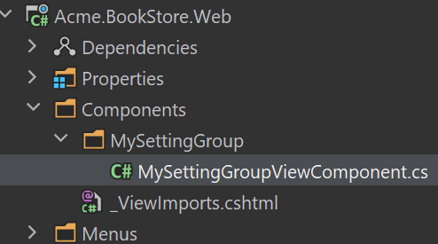
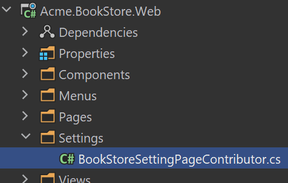
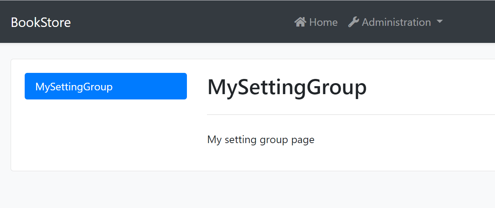
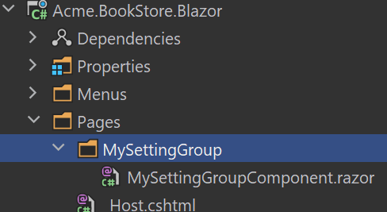
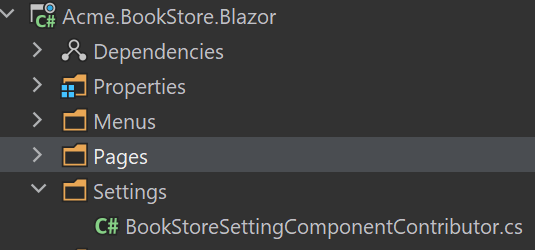
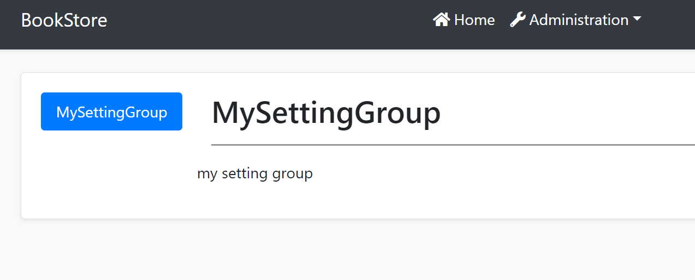

# Setting Management Module

Setting Management Module implements the `ISettingStore` (see [the setting system](../Settings.md)) to store the setting values in a database and provides the `ISettingManager` to manage (change) the setting values in the database.

> Setting Management module is already installed and configured for [the startup templates](../Startup-Templates/Index.md). So, most of the times you don't need to manually add this module to your application.

## ISettingManager

`ISettingManager` is used to get and set the values for the settings. Examples:

````csharp
using System;
using System.Threading.Tasks;
using Volo.Abp.DependencyInjection;
using Volo.Abp.SettingManagement;

namespace Demo
{
    public class MyService : ITransientDependency
    {
        private readonly ISettingManager _settingManager;

        //Inject ISettingManager service
        public MyService(ISettingManager settingManager)
        {
            _settingManager = settingManager;
        }

        public async Task FooAsync()
        {
            Guid user1Id = ...;
            Guid tenant1Id = ...;

            //Get/set a setting value for the current user or the specified user
            
            string layoutType1 =
                await _settingManager.GetOrNullForCurrentUserAsync("App.UI.LayoutType");
            string layoutType2 =
                await _settingManager.GetOrNullForUserAsync("App.UI.LayoutType", user1Id);

            await _settingManager.SetForCurrentUserAsync("App.UI.LayoutType", "LeftMenu");
            await _settingManager.SetForUserAsync(user1Id, "App.UI.LayoutType", "LeftMenu");

            //Get/set a setting value for the current tenant or the specified tenant
            
            string layoutType3 =
                await _settingManager.GetOrNullForCurrentTenantAsync("App.UI.LayoutType");
            string layoutType4 =
                await _settingManager.GetOrNullForTenantAsync("App.UI.LayoutType", tenant1Id);
            
            await _settingManager.SetForCurrentTenantAsync("App.UI.LayoutType", "LeftMenu");
            await _settingManager.SetForTenantAsync(tenant1Id, "App.UI.LayoutType", "LeftMenu");

            //Get/set a global and default setting value
            
            string layoutType5 =
                await _settingManager.GetOrNullGlobalAsync("App.UI.LayoutType");
            string layoutType6 =
                await _settingManager.GetOrNullDefaultAsync("App.UI.LayoutType");

            await _settingManager.SetGlobalAsync("App.UI.LayoutType", "TopMenu");
        }
    }
}

````

So, you can get or set a setting value for different setting value providers (Default, Global, User, Tenant... etc).

> Use the `ISettingProvider` instead of the `ISettingManager` if you only need to read the setting values, because it implements caching and supports all deployment scenarios. You can use the `ISettingManager` if you are creating a setting management UI.

### Setting Cache

Setting values are cached using the [distributed cache](../Caching.md) system. Always use the `ISettingManager` to change the setting values which manages the cache for you.

## Setting Management Providers

Setting Management module is extensible, just like the [setting system](../Settings.md).  You can extend it by defining setting management providers. There are 5 pre-built setting management providers registered it the following order:

* `DefaultValueSettingManagementProvider`: Gets the value from the default value of the setting definition. It can not set the default value since default values are hard-coded on the setting definition.
* `ConfigurationSettingManagementProvider`: Gets the value from the [IConfiguration service](../Configuration.md). It can not set the configuration value because it is not possible to change the configuration values on runtime.
* `GlobalSettingManagementProvider`: Gets or sets the global (system-wide) value for a setting.
* `TenantSettingManagementProvider`: Gets or sets the setting value for a tenant.
* `UserSettingManagementProvider`: Gets the setting value for a user.

`ISettingManager` uses the setting management providers on get/set methods. Typically, every setting management provider defines extension methods on the `ISettingManagement` service (like `SetForUserAsync` defined by the user setting management provider).

If you want to create your own provider, implement the `ISettingManagementProvider` interface or inherit from the `SettingManagementProvider` base class:

````csharp
public class CustomSettingProvider : SettingManagementProvider
{
    public override string Name => "Custom";

    public CustomSettingProvider(ISettingManagementStore store) 
        : base(store)
    {
    }
}
````

`SettingManagementProvider` base class makes the default implementation (using the `ISettingManagementStore`) for you. You can override base methods as you need. Every provider must have a unique name, which is `Custom` in this example (keep it short since it is saved to database for each setting value record).

Once you create your provider class, you should register it using the `SettingManagementOptions` [options class](../Options.md):

````csharp
Configure<SettingManagementOptions>(options =>
{
    options.Providers.Add<CustomSettingProvider>();
});
````

The order of the providers are important. Providers are executed in the reverse order. That means the `CustomSettingProvider` is executed first for this example. You can insert your provider in any order in the `Providers` list.

## See Also

* [Settings](../Settings.md)

## Setting Management UI

Setting Mangement module provided the email setting UI by default, and it is extensible; You can add your tabs to this page for your application settings.

### MVC UI

#### Create a setting View Component

Create `MySettingGroup` folder under the `Components` folder. Add a new view component. Name it as `MySettingGroupViewComponent`:



Open the `MySettingGroupViewComponent.cs` and change the whole content as shown below:

```csharp
public class MySettingGroupViewComponent : AbpViewComponent
{
    public virtual IViewComponentResult Invoke()
    {
        return View("~/Components/MySettingGroup/Default.cshtml");
    }
}
```

> You can also use the `InvokeAsync` method, In this example, we use the `Invoke` method.

#### Default.cshtml

Create a `Default.cshtml` file under the `MySettingGroup` folder.

Open the `Default.cshtml` and change the whole content as shown below:

```html
<div>
  <p>My setting group page</p>
</div>
```

#### BookStoreSettingPageContributor

Create a `BookStoreSettingPageContributor.cs` file under the `Settings` folder:



The content of the file is shown below:

```csharp
public class BookStoreSettingPageContributor : ISettingPageContributor
{
    public Task ConfigureAsync(SettingPageCreationContext context)
    {
        context.Groups.Add(
            new SettingPageGroup(
                "Volo.Abp.MySettingGroup",
                "MySettingGroup",
                typeof(MySettingGroupViewComponent)
            )
        );

        return Task.CompletedTask;
    }

    public Task<bool> CheckPermissionsAsync(SettingPageCreationContext context)
    {
        // You can check the permissions here
        return Task.FromResult(true);
    }
}
```

Open the `BookStoreWebModule.cs` file and add the following code:

```csharp
Configure<SettingManagementPageOptions>(options =>
{
    options.Contributors.Add(new BookStoreSettingPageContributor());
});
```

#### Run the Application

Navigate to `/SettingManagement` route to see the changes:



### Blazor UI

#### Create a Razor Component

Create `MySettingGroup` folder under the `Pages` folder. Add a new razor component. Name it as `MySettingGroupComponent`:



Open the `MySettingGroupComponent.razor` and change the whole content as shown below:

```csharp
<Row>
    <p>my setting group</p>
</Row>
```

#### BookStoreSettingComponentContributor

Create a `BookStoreSettingComponentContributor.cs` file under the `Settings` folder:



The content of the file is shown below:

```csharp
public class BookStoreSettingComponentContributor : ISettingComponentContributor
{
    public Task ConfigureAsync(SettingComponentCreationContext context)
    {
        context.Groups.Add(
            new SettingComponentGroup(
                "Volo.Abp.MySettingGroup",
                "MySettingGroup",
                typeof(MySettingGroupComponent)
            )
        );

        return Task.CompletedTask;
    }

    public Task<bool> CheckPermissionsAsync(SettingComponentCreationContext context)
    {
        // You can check the permissions here
        return Task.FromResult(true);
    }
}
```

Open the `BookStoreBlazorModule.cs` file and add the following code:

```csharp
Configure<SettingManagementComponentOptions>(options =>
{
    options.Contributors.Add(new BookStoreSettingComponentContributor());
});
```

#### Run the Application

Navigate to `/setting-management` route to see the changes:



### Angular UI

#### Create a Component

Create a component with the following command:

```bash
yarn ng generate component my-settings
```

Open the `app.component.ts` and modify the file as shown below:

```js
import { Component } from '@angular/core';
import { SettingTabsService } from '@abp/ng.setting-management/config'; // imported SettingTabsService
import { MySettingsComponent } from './my-settings/my-settings.component'; // imported MySettingsComponent

@Component(/* component metadata */)
export class AppComponent {
  constructor(private settingTabs: SettingTabsService) // injected MySettingsComponent
  {
    // added below
    settingTabs.add([
      {
        name: 'MySettings',
        order: 1,
        requiredPolicy: 'policy key here',
        component: MySettingsComponent,
      },
    ]);
  }
}
```

#### Run the Application

Navigate to `/setting-management` route to see the changes:


