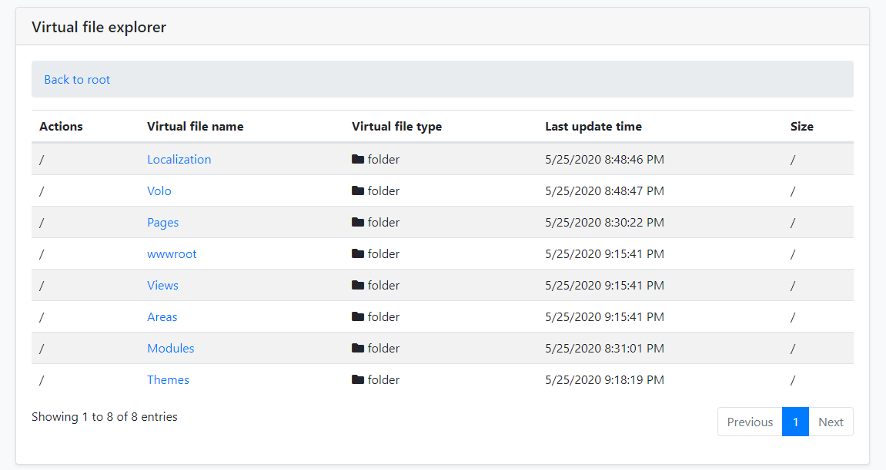

# Virtual File Explorer Module

## What is Virtual File Explorer Module?

Virtual File Explorer Module provided a simple UI to view all files in [virtual file system](../Virtual-File-System.md).

> Virtual File Explorer Module is not installed for [the startup templates](../Startup-Templates/Index.md). So, you need to manually add this module to your application.

### Installation

#### 1- Use ABP CLI

It is recommended to use the ABP CLI to install the module, open the CMD window in the solution file (`.sln`) directory, and run the following command:

`abp add-module Volo.VirtualFileExplorer`

#### 2- Manually install

Or you can also manually install nuget package to `Acme.MyProject.Web` project:

* Install [Volo.Abp.VirtualFileExplorer.Web](https://www.nuget.org/packages/Volo.Abp.VirtualFileExplorer.Web/) nuget package to `Acme.MyProject.Web` project.

  `Install-Package Volo.Abp.VirtualFileExplorer.Web`

##### 2.1- Adding Module Dependencies

  * Open `MyProjectWebModule.cs`and add `typeof(AbpVirtualFileExplorerWebModule)` as shown below;

  ```csharp
     [DependsOn(
          typeof(AbpVirtualFileExplorerWebModule),
          typeof(MyProjectApplicationModule),
          typeof(MyProjectEntityFrameworkCoreModule),
          typeof(AbpAutofacModule),
          typeof(AbpIdentityWebModule),
          typeof(AbpAccountWebModule),
          typeof(AbpAspNetCoreMvcUiBasicThemeModule)
      )]
      public class MyProjectWebModule : AbpModule
      {
          //...
      }
  ```

##### 2.2- Adding NPM Package

 * Open `package.json` and add `@abp/virtual-file-explorer": "^2.9.0` as shown below:

  ```json
    {
        "version": "1.0.0",
        "name": "my-app",
        "private": true,
        "dependencies": {
            "@abp/aspnetcore.mvc.ui.theme.basic": "^2.9.0",
            "@abp/virtual-file-explorer": "^2.9.0"
        }
    }
  ```

  Then open the command line terminal in the `Acme.MyProject.Web` project folder and run the following command:

  1. `yarn`
  2. `gulp`

That's all,Now run the application and Navigate to `/VirtualFileExplorer`. You will see virtual file explorer page:



### Options

You can disabled virtual file explorer module via `AbpVirtualFileExplorerOptions` options:

```csharp
public override void PreConfigureServices(ServiceConfigurationContext context)
{
    PreConfigure<AbpVirtualFileExplorerOptions>(options =>
    {
        options.IsEnabled = false;
    });
}
```