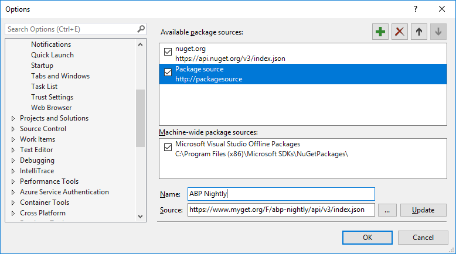
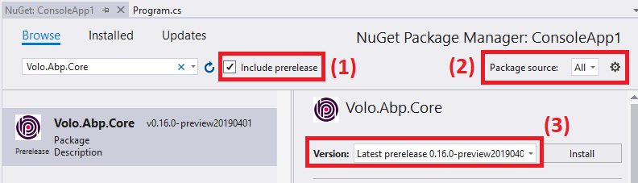

# Nightly Builds

All framework & module packages are deployed to MyGet every night in weekdays. So, you can use or test the latest code without waiting the next release.

## Configure Visual Studio

> Requires Visual Studio 2017+

1. Go to `Tools > Options > NuGet Package Manager > Package Source`.
2. Click the green `+` icon.
3. Set `ABP Nightly` as *Name* and `https://www.myget.org/F/abp-nightly/api/v3/index.json` as the *Source* as shown below:
   
4. Click the `Update` button.
5. Click the `OK` button to save changes.

## Install Package

Now, you can install preview / nightly packages to your project from Nuget Browser or Package Manager Console.



1. In the nuget browser, select "Include prereleases".
2. Change package source to "All".
3. Search a package. You will see prereleases of the package formatted as `(VERSION)-preview(DATE)` (like *v0.16.0-preview20190401* in this sample).
4. You can click to the `Install` button to add package to your project.

## Install & Uninstall Preview NPM Packages

The latest version of preview NPM packages can be installed by the running below command in the root folder of application:

```bash
abp switch-to-preview
```

If you're using the ABP Framework preview packages, you can switch back to stable version using this command:

```bash
abp switch-to-stable
```

See the [ABP CLI documentation](./CLI.md) for more information.