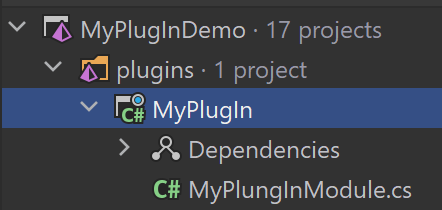
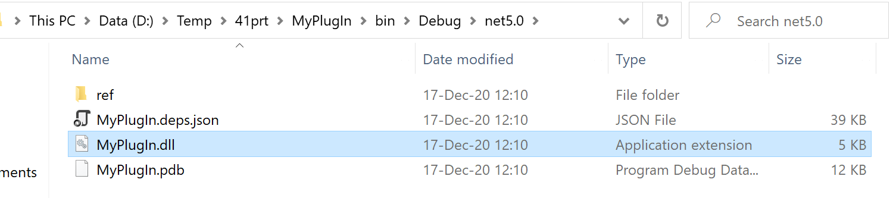
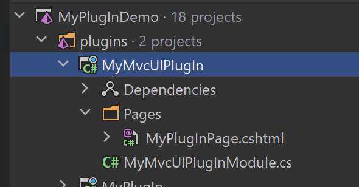
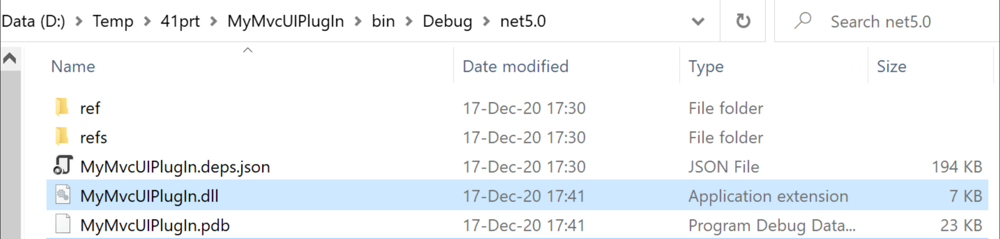
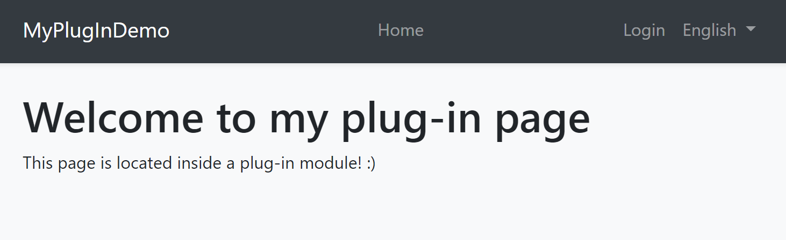

# Plug-In Modules

It is possible to load [modules](Module-Development-Basics.md) as plug-ins. That means you may not reference to a module's assembly in your solution, but you can load that module in the application startup just like any other module.

## Basic Usage

`IServiceCollection.AddApplication<T>()` extension method can get options to configure the plug-in sources.

**Example: Load plugins from a folder**

````csharp
using Microsoft.AspNetCore.Builder;
using Microsoft.Extensions.DependencyInjection;
using Volo.Abp.Modularity.PlugIns;

namespace MyPlugInDemo.Web
{
    public class Startup
    {
        public void ConfigureServices(IServiceCollection services)
        {
            services.AddApplication<MyPlugInDemoWebModule>(options =>
            {
                options.PlugInSources.AddFolder(@"D:\Temp\MyPlugIns");
            });
        }

        public void Configure(IApplicationBuilder app)
        {
            app.InitializeApplication();
        }
    }
}
````

* This is the `Startup` class of a typical ASP.NET Core application.
* `PlugInSources.AddFolder` gets a folder path and to load assemblies (typically `dll`s) in that folder.

That's all. ABP will discover the modules in the given folder, configure and initialize them just like regular modules.

### Plug-In Sources

`options.PlugInSources` is actually a list of `IPlugInSource` implementations and `AddFolder` is just a shortcut for the following expression:

````csharp
options.PlugInSources.Add(new FolderPlugInSource(@"D:\Temp\MyPlugIns"));
````

> `AddFolder()` only looks for the assembly file in the given folder, but not looks for the sub-folders. You can pass `SearchOption.AllDirectories` as a second parameter to explore plug-ins also from the sub-folders, recursively.

There are two more built-in Plug-In Source implementations:

* `PlugInSources.AddFiles()` gets a list of assembly (typically `dll`) files. This is a shortcut of using `FilePlugInSource` class.
* `PlugInSources.AddTypes()` gets a list of module class types. If you use this, you need to load the assemblies of the modules yourself, but it provides flexibility when needed. This is a shortcut of using `TypePlugInSource` class.

If you need, you can create your own `IPlugInSource` implementation and add to the `options.PlugInSources` just like the others.

## Example: Creating a Simple Plug-In

Create a simple **Class Library Project** in a solution:



You can add ABP Framework packages you need to use in the module. At least, you should add the `Volo.Abp.Core` package to the project:

````
Install-Package Volo.Abp.Core
````

Every [module](Module-Development-Basics.md) must declare a class derived from the `AbpModule`. Here, a simple module class that resolves a service and initializes it on the application startup:

````csharp
using Microsoft.Extensions.DependencyInjection;
using Volo.Abp;
using Volo.Abp.Modularity;

namespace MyPlugIn
{
    public class MyPlungInModule : AbpModule
    {
        public override void OnApplicationInitialization(ApplicationInitializationContext context)
        {
            var myService = context.ServiceProvider
                .GetRequiredService<MyService>();
            
            myService.Initialize();
        }
    }
}
````

`MyService` can be any class registered to [Dependency Injection](Dependency-Injection.md) system, as show below:

````csharp
using Microsoft.Extensions.Logging;
using Volo.Abp.DependencyInjection;

namespace MyPlugIn
{
    public class MyService : ITransientDependency
    {
        private readonly ILogger<MyService> _logger;

        public MyService(ILogger<MyService> logger)
        {
            _logger = logger;
        }

        public void Initialize()
        {
            _logger.LogInformation("MyService has been initialized");
        }
    }
}
````

Build the project, open the build folder, find the `MyPlugIn.dll`:



Copy `MyPlugIn.dll` into the plug-in folder (`D:\Temp\MyPlugIns` for this example).

If you have configured the main application like described above (see Basic Usage section), you should see the `MyService has been initialized` log in the application startup.

## Example: Creating a Plug-In With Razor Pages

Creating plug-ins with views inside requires a bit more attention.

> This example assumes you've [created a new web application](https://abp.io/get-started) using the application startup template and MVC / Razor Pages UI.

Create a new **Class Library** project in a solution:



Edit the `.csproj` file content:

````xml
<Project Sdk="Microsoft.NET.Sdk.Web">

    <PropertyGroup>
        <TargetFramework>net5.0</TargetFramework>
        <OutputType>Library</OutputType>
        <IsPackable>true</IsPackable>
    </PropertyGroup>

    <ItemGroup>
      <PackageReference Include="Volo.Abp.AspNetCore.Mvc.UI.Theme.Shared" Version="4.0.1" />
    </ItemGroup>

</Project>
````

* Changed `Sdk` to `Microsoft.NET.Sdk.Web`.
* Added `OutputType` and `IsPackable` properties.
* Added `Volo.Abp.AspNetCore.Mvc.UI.Theme.Shared` NuGet package.

> Depending on [Volo.Abp.AspNetCore.Mvc.UI.Theme.Shared](https://www.nuget.org/packages/Volo.Abp.AspNetCore.Mvc.UI.Theme.Shared) package is not required. You can reference to a more base package like [Volo.Abp.AspNetCore.Mvc](https://www.nuget.org/packages/Volo.Abp.AspNetCore.Mvc/). However, if you will build a UI page/component, it is suggested to reference to the [Volo.Abp.AspNetCore.Mvc.UI.Theme.Shared](https://www.nuget.org/packages/Volo.Abp.AspNetCore.Mvc.UI.Theme.Shared) package since it is the most high-level package without depending on a particular [theme](UI/AspNetCore/Theming.md). If there is no problem to depend on a particular theme, you can directly reference to the theme's package to be able to use the theme-specific features in your plug-in.

Then create your module class in the plug-in:

````csharp
using System.IO;
using System.Reflection;
using Microsoft.AspNetCore.Mvc.ApplicationParts;
using Microsoft.Extensions.DependencyInjection;
using Volo.Abp.AspNetCore.Mvc.UI.Theme.Shared;
using Volo.Abp.Modularity;

namespace MyMvcUIPlugIn
{
    [DependsOn(typeof(AbpAspNetCoreMvcUiThemeSharedModule))]
    public class MyMvcUIPlugInModule : AbpModule
    {
        public override void PreConfigureServices(ServiceConfigurationContext context)
        {
            PreConfigure<IMvcBuilder>(mvcBuilder =>
            {
                //Add plugin assembly
                mvcBuilder.PartManager.ApplicationParts.Add(new AssemblyPart(typeof(MyMvcUIPlugInModule).Assembly));

                //Add views assembly
                var viewDllPath = Path.Combine(Path.GetDirectoryName(typeof(MyMvcUIPlugInModule).Assembly.Location), "MyMvcUIPlugIn.Views.dll");
                var viewAssembly = new CompiledRazorAssemblyPart(Assembly.LoadFrom(viewDllPath));
                mvcBuilder.PartManager.ApplicationParts.Add(viewAssembly);
            });
        }
    }
}
````

* Depending on the `AbpAspNetCoreMvcUiThemeSharedModule` since we added the related NuGet package.
* Adding the plug-in's assembly to the `PartManager` of ASP.NET Core MVC. This is required by ASP.NET Core. Otherwise, your controllers inside the plug-in doesn't work.
* Adding the plug-in's views assembly to the `PartManager` of ASP.NET Core MVC. This is required by ASP.NET Core. Otherwise, your views inside the plug-in doesn't work.

You can now add a razor page, like `MyPlugInPage.cshtml` inside the `Pages` folder:

````html
@page
@model MyMvcUIPlugIn.Pages.MyPlugInPage
<h1>Welcome to my plug-in page</h1>
<p>This page is located inside a plug-in module! :)</p>
````

Now, you can build the plug-in project. It will produce the following output:



Copy the `MyMvcUIPlugIn.dll` and `MyMvcUIPlugIn.Views.dll` into the plug-in folder (`D:\Temp\MyPlugIns` for this example).

If you have configured the main application like described above (see Basic Usage section), you should be able to visit the `/MyPlugInPage` URL when your application:



## Discussions

In real world, your plug-in may have some external dependencies. Also, your application might be designed to support plug-ins. All these are your own system requirements. What ABP does is just loading modules on the application startup. What you do inside that modules is up to you.

However, we can provide a few suggestions for some common cases.

### Library Dependencies

For package/dll dependencies, you can copy the related dlls to the plug-in folder. ABP automatically loads all assemblies in the folder and your plug-in will work as expected.

> See [Microsoft's documentation](https://docs.microsoft.com/en-us/dotnet/core/tutorials/creating-app-with-plugin-support#plugin-with-library-dependencies) for some additional explanations for that case.

### Database Schema

If your module uses a relational database and [Entity Framework Core](Entity-Framework-Core.md), it will need to have its tables available in the database. There are different ways to ensure the tables have been created when an application uses the plug-in. Some examples;

1. The Plugin may check if the database tables does exists and create the tables on the application startup or migrate them if the plug-in has been updated and requires some schema changes. You can use EF Core's migration API to do that.
2. You can improve the `DbMigrator` application to find migrations of the plug-ins and execute them.

There may be other solutions. For example, if your DB admin doesn't allow you to change the database schema in the application code, you may need to manually send a SQL file to the database admin to apply it to the database.