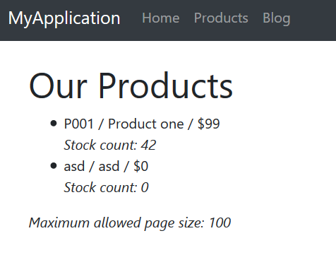

# Microservice Demo Solution

*"Microservices are a software development technique—a variant of the **service-oriented architecture** (SOA) architectural style that structures an application as a collection of **loosely coupled services**. In a microservices architecture, services are **fine-grained** and the protocols are **lightweight**. The benefit of decomposing an application into different smaller services is that it improves **modularity**. This makes the application easier to understand, develop, test, and become more resilient to architecture erosion. It **parallelizes development** by enabling small autonomous teams to **develop, deploy and scale** their respective services independently. It also allows the architecture of an individual service to emerge through **continuous refactoring**. Microservices-based architectures enable **continuous delivery and deployment**."*

— [Wikipedia](https://en.wikipedia.org/wiki/Microservices)

## Introduction

One of the major goals of the ABP framework is to provide a [convenient infrastructure to create microservice solutions](../Microservice-Architecture.md).

This sample aims to demonstrate a simple yet complete microservice solution;

* Has multiple, independent, self-deployable **microservices**.
* Multiple **web applications**, each uses a different API gateway.
* Has multiple **gateways** / BFFs (Backend for Frontends) developed using the [Ocelot](https://github.com/ThreeMammals/Ocelot) library.
* Has an **authentication service** developed using the [IdentityServer](https://identityserver.io/) framework. It's also a SSO (Single Sign On) application with necessary UIs.
* Has **multiple databases**. Some microservices has their own database while some services/applications shares a database (to demonstrate different use cases).
* Has different types of databases: **SQL Server** (with **Entity Framework Core** ORM) and **MongoDB**.
* Has a **console application** to show the simplest way of using a service by authenticating.
* Uses [Redis](https://redis.io/) for **distributed caching**.
* Uses [RabbitMQ](https://www.rabbitmq.com/) for service-to-service **messaging**.
* Uses [Docker](https://www.docker.com/) & [Kubernates](https://kubernetes.io/) to **deploy** & run all services and applications.
* Uses [Elasticsearch](https://www.elastic.co/products/elasticsearch) & [Kibana](https://www.elastic.co/products/kibana) to store and visualize the logs (written using [Serilog](https://serilog.net/)).

The diagram below shows the system:


### Source Code

You can get the source code from [the GitHub repository](https://github.com/abpframework/abp/tree/master/samples/MicroserviceDemo).

### Status

This sample is still in development, not completed yet.

## Running the Solution

You can either run from the **source code** or from the pre-configured **docker-compose** file.

### Using the Docker Containers

#### Pre Requirements

Running as docker containers is easier since all dependencies are pre-configured. You only need to install the [latest docker](https://docs.docker.com/compose/install/).

#### Running Containers

- Clone or download the [ABP repository](https://github.com/abpframework/abp).

- Open a command line in the `samples/MicroserviceDemo` folder of the repository.

- Restore SQL Server databases:

  ```
  docker-compose -f docker-compose.yml -f docker-compose.migrations.yml run restore-database
  ```

- Start the containers:

  ```
  docker-compose up -d
  ```

  At the first run, it will take a **long time** because it will build all docker images.

- Add this line to the end of your `hosts` file:

  ```
  127.0.0.1	auth-server
  ```

  hosts file is located inside the `C:\Windows\System32\Drivers\etc\hosts` folder on Windows and `/etc/hosts` for Linux/MacOS.

#### Run the Applications

There are a few applications running in the containers you may want to explore:

* Backend Admin Application (BackendAdminApp.Host): `http://localhost:51512`
  *(Used to manage users & products in the system)*
* Public Web Site (PublicWebsite.Host): `http://localhost:51513`
  *(Used to list products and run/manage the blog module)*
* Authentication Server (AuthServer.Host): `http://auth-server:51511/`
  *(Used as a single sign on and authentication server built with IdentityServer4)*
* Kibana UI: `http://localhost:51510`
  *(Use to show/trace logs written by all services/applications/gateways)*

### Running From the Source Code

#### Pre Requirements

To be able to run the solution from source code, following tools should be installed and running on your computer:

* [SQL Server](https://www.microsoft.com/en-us/sql-server/sql-server-downloads) 2015+ (can be [express edition](https://www.microsoft.com/en-us/sql-server/sql-server-editions-express))
* [Redis](https://redis.io/download) 5.0+
* [RabbitMQ](https://www.rabbitmq.com/install-windows.html) 3.7.11+
* [MongoDB](https://www.mongodb.com/download-center) 4.0+
* [ElasticSearch](https://www.elastic.co/downloads/elasticsearch) 6.6+
* [Kibana](https://www.elastic.co/downloads/kibana) 6.6+ (optional, recommended to show logs)

#### Open & Build the Visual Studio Solution

* Open the `samples\MicroserviceDemo\MicroserviceDemo.sln` in Visual Studio 2017 (15.9.0+).
* Run `dotnet restore` from the command line inside the `samples\MicroserviceDemo` folder.
* Build the solution in Visual Studio.

#### Restore Databases

Open `MsDemo_Identity.zip` and `MsDemo_ProductManagement.zip` inside the `samples\MicroserviceDemo\databases` folder and restore to the SQL Server.

> Notice that: These databases have EF Core migrations in the solution, however they don't have seed data, especially required for IdentityServer4 configuration. So, restoring the databases is much more easier.

#### Run Projects

Run the projects with the following order (right click to each project, set as startup project an press Ctrl+F5 to run without debug):

* AuthServer.Host
* IdentityService.Host
* BloggingService.Host
* ProductService.Host
* InternalGateway.Host
* BackendAdminAppGateway.Host
* PublicWebSiteGateway.Host
* BackendAdminApp.Host
* PublicWebSite.Host

## A Brief Overview of the Solution

The Visual Studio solution consists of multiple projects each have different roles in the system:


### Applications

These are the actual applications those have user interfaces to interact to the users and use the system.

- **AuthServer.Host**: Host the IdentityServer4 to provide an authentication service to other services and applications. It is a single-sign server and contains the login page.
- **BackendAdminApp.Host**: This is a backend admin application that host UI for Identity and Product management modules.
- **PubicWebSite.Host**: As public web site that contains a simple product list page and blog module UI.
- **ConsoleClientDemo**: A simple console application to demonstrate the usage of services from a C# application.

### Gateways / BFFs (Backend for Frontend)

Gateways are used to provide a single entry point to the applications. It can also used for rate limiting, load balancing... etc. Used the [Ocelot](https://github.com/ThreeMammals/Ocelot) library.

* **BackendAdminAppGateway.Host**: Used by the BackendAdminApp.Host application as backend.
* **PublicWebSiteGateway.Host**: Used by the PublicWebSite.Host application as backend.
* **InternalGateway.Host**: Used for inter-service communication (the communication between microservices).

### Microservices

Microservices have no UI, but exposes some REST APIs.

- **IdentityService.Host**: Host the ABP Identity module which is used to manage users & roles. It has no additional service, but only hosts the Identity module's API.
- **BloggingService.Host**: Host the ABP Blogging module which is used to manage blog & posts (a typical blog application). It has no additional service, but only hosts the Blogging module's API.
- **ProductService.Host**: Hosts the Product module (that is inside the solution) which is used to manage products. It also contains the EF Core migrations to create/update the Product Management database schema.

### Modules

* **Product**: A layered module that is developed with the [module development best practices](../Best-Practices/Index.md). It can be embedded into a monolithic application or can be hosted as a microservice by separately deploying API and UI (as done in this demo solution).

### Databases

This solution is using multiple databases:

* **MsDemo_Identity**: An SQL database. Used **SQL Server** by default, but can be any DBMS supported by the EF Core. Shared by AuthServer and IdentityService. Also audit logs, permissions and settings are stored in this database (while they could easily have their own databases, shared the same database to keep it simple).
* **MsDemo_ProductManagement**: An SQL database. Again, used **SQL Server** by default, but can be any DBMS supported by the EF Core. Used by the ProductService as a dedicated database.
* **MsDemo_Blogging**: A **MongoDB** database. Used by the BloggingService.
* **Elasticsearch**: Used to write logs over Serilog.

## Applications

### Authentication Server (AuthServer.Host)

This project is used by all other services and applications for authentication & single sign on. Mainly, uses **IdentityServer4** to provide these services. It uses some of the [pre-build ABP modules](../Modules/Index) like *Identity*, *Audit Logging* and *Permission Management*.

#### Database & EF Core Configuration

This application uses a SQL database (named it as **MsDemo_Identity**) and maintains its schema via **Entity Framework Core migrations.**

It has a DbContext named **AuthServerDbContext** and defined as shown below:

````csharp
public class AuthServerDbContext : AbpDbContext<AuthServerDbContext>
{
    public AuthServerDbContext(DbContextOptions<AuthServerDbContext> options) 
        : base(options)
    {

    }

    protected override void OnModelCreating(ModelBuilder modelBuilder)
    {
        base.OnModelCreating(modelBuilder);

        modelBuilder.ConfigureIdentity();
        modelBuilder.ConfigureIdentityServer();
        modelBuilder.ConfigureAuditLogging();
        modelBuilder.ConfigurePermissionManagement();
        modelBuilder.ConfigureSettingManagement();
    }
}
````

In the **OnModelCreating**, you see **ConfigureX()** method calls. A module with a database schema generally declares such an extension method to configure EF Core mappings for its own entities. This is a flexible approach where you can arrange your databases and modules inside them; You can use a different database for each module, or combine some of them in a shared database. In the AuthServer project, we decided to combine multiple module schemas in a single EF Core DbContext, in a single physical database. These modules are Identity, IdentityServer, AuditLogging, PermissionManagement and SettingManagement modules.

#### User Interface

AuthServer has a simple home page that shows the current user info if the current user has logged in:


It also provides Login & Register pages:


These pages are not included in the project itself. Instead, AuthServer project uses the prebuilt ABP [account module](https://github.com/abpframework/abp/tree/master/modules/account) with IdentityServer extension. That means it can also act as an OpenId Connect server with necessary UI and logic.

#### Other Dependencies

* **RabbitMQ** for messaging to other services.
* **Redis** for distributed/shared caching.
* **Elasticsearch** for storing logs.

### Backend Admin Application (BackendAdminApp.Host)

This is a web application that is used to manage users, roles, permissions and products in the system.

#### Authentication

BackendAdminApp redirects to the AuthServer for authentication. Once the user enters a correct username & password, the page is redirected to the backend application again. Authentication configuration is setup in the `BackendAdminAppHostModule` class:

````charp
context.Services.AddAuthentication(options =>
{
    options.DefaultScheme = "Cookies";
    options.DefaultChallengeScheme = "oidc";
})
.AddCookie("Cookies", options =>
{
    options.Cookie.Expiration = TimeSpan.FromDays(365);
    options.ExpireTimeSpan = TimeSpan.FromDays(365);
})
.AddOpenIdConnect("oidc", options =>
{
    options.Authority = configuration["AuthServer:Authority"];
    options.ClientId = configuration["AuthServer:ClientId"];
    options.ClientSecret = configuration["AuthServer:ClientSecret"];
    options.RequireHttpsMetadata = false;
    options.ResponseType = OpenIdConnectResponseType.CodeIdToken;
    options.SaveTokens = true;
    options.GetClaimsFromUserInfoEndpoint = true;
    options.Scope.Add("role");
    options.Scope.Add("email");
    options.Scope.Add("phone");
    options.Scope.Add("BackendAdminAppGateway");
    options.Scope.Add("IdentityService");
    options.Scope.Add("ProductService");
    options.ClaimActions.MapAbpClaimTypes();
});
````

* It adds "Cookies" authentication as the primary authentication type.
* "oidc" authentication is configured to use the AuthServer application as the authentication server.
* It requires the additional identity scopes *role*, *email* and *phone*.
* It requires the API resource scopes *BackendAdminAppGateway*, *IdentityService* and *ProductService* because it will use these services as APIs.

IdentityServer client settings are stored inside the `appsettings.json` file:

````json
"AuthServer": {
  "Authority": "http://localhost:64999",
  "ClientId": "backend-admin-app-client",
  "ClientSecret": "1q2w3e*"
}
````

#### User Interface

The BackendAdminApp.Host project itself has not a single UI element/page. It is only used to serve UI pages of the Identity and Product Management modules. `BackendAdminAppHostModule` adds dependencies to `AbpIdentityWebModule` (*[Volo.Abp.Identity.Web](https://www.nuget.org/packages/Volo.Abp.Identity.Web)* package) and `ProductManagementWebModule` (*ProductManagement.Web* project) for that purpose.

A screenshot from the user management page:


A screenshot from the permission management modal for a role:


#### Using Microservices

Backend admin application uses the Identity and Product microservices for all operations, over the Backend Admin Gateway (BackendAdminAppGateway.Host).

##### Remote End Point

`appsettings.json` file contains the `RemoteServices` section to declare the remote service endpoint(s). Each microservice will normally have different endpoints. However, this solution uses the API Gateway pattern to provide a single endpoint for the applications:

````json
"RemoteServices": {
  "Default": {
    "BaseUrl": "http://localhost:65115/"
  }
}
````

`http://localhost:65115/` is the URL of the *BackendAdminAppGateway.Host* project. It knows where are Identity and Product services are located.

##### HTTP Clients

ABP application modules generally provides C# client libraries to consume services (APIs) easily (they generally uses the [Dynamic C# API Clients](../AspNetCore/Dynamic-CSharp-API-Clients.md) feature of the ABP framework). That means if you need to consume Identity service API, you can reference to its client package and easily use the APIs by provided interfaces.

For that purpose, `BackendAdminAppHostModule` class declares dependencies for `AbpIdentityHttpApiClientModule` and `ProductManagementHttpApiClientModule`.

Once you refer these client packages, you can directly inject an application service interface (e.g. `IIdentityUserAppService`) and use its methods like a local method call. It actually invokes remote service calls over HTTP to the related service endpoint.

##### Passing the Access Token

Since microservices requires authentication & authorization, each remote service call should contain an Authentication header. This header is obtained from the `access_token` inside the current `HttpContext` for the current user. This is automatically done when you use the `Volo.Abp.Http.Client.IdentityModel` package. `BackendAdminAppHostModule` declares dependencies to this package and to the related `AbpHttpClientIdentityModelModule` class. It is integrated to the HTTP Clients explained above.

#### Other Dependencies

- **Redis** for distributed/shared caching.
- **Elasticsearch** for storing logs.

### Public Web Site (PublicWebSite.Host)

This is a public web site project that has a web blog and product list page.

#### Authentication

PublicWebSite can show blog posts and product list without login. If you login, you can also manage blogs. It redirects to the AuthServer for authentication. Once the user enters a correct username & password, the page is redirected to the public web site application again. Authentication configuration is setup in the `PublicWebSiteHostModule` class:

```charp
context.Services.AddAuthentication(options =>
{
    options.DefaultScheme = "Cookies";
    options.DefaultChallengeScheme = "oidc";
})
.AddCookie("Cookies", options =>
{
    options.Cookie.Expiration = TimeSpan.FromDays(365);
    options.ExpireTimeSpan = TimeSpan.FromDays(365);
})
.AddOpenIdConnect("oidc", options =>
{
    options.Authority = configuration["AuthServer:Authority"];
    options.ClientId = configuration["AuthServer:ClientId"];
    options.ClientSecret = configuration["AuthServer:ClientSecret"];
    options.RequireHttpsMetadata = false;
    options.ResponseType = OpenIdConnectResponseType.CodeIdToken;
    options.SaveTokens = true;
    options.GetClaimsFromUserInfoEndpoint = true;
    options.Scope.Add("role");
    options.Scope.Add("email");
    options.Scope.Add("phone");
    options.Scope.Add("PublicWebSiteGateway");
    options.Scope.Add("ProductService");
    options.Scope.Add("BloggingService");
    options.ClaimActions.MapAbpClaimTypes();
});
```

- It adds "Cookies" authentication as the primary authentication type.
- "oidc" authentication is configured to use the AuthServer application as the authentication server.
- It requires the additional identity scopes *role*, *email* and *phone*.
- It requires the API resource scopes *PublicWebSiteGateway*, *BloggingService* and *ProductService* because it will use these services as APIs.

IdentityServer client settings are stored inside the `appsettings.json` file:

```json
"AuthServer": {
  "Authority": "http://localhost:64999",
  "ClientId": "public-website-client",
  "ClientSecret": "1q2w3e*"
}
```

#### User Interface

The PublicWebSite.Host project has a page to list products (`Pages/Products.cshtml`). It also uses the UI from the blogging module. `PublicWebSiteHostModule` adds dependencies to `BloggingWebModule` (*[Volo.Blogging.Web](https://www.nuget.org/packages/Volo.Blogging.Web)* package) for that purpose.

A screenshot from the Products page:



#### Using Microservices

Publc web site application uses the Blogging and Product microservices for all operations, over the Public  Web Site Gateway (PublicWebSiteGateway.Host).

##### Remote End Point

`appsettings.json` file contains the `RemoteServices` section to declare the remote service endpoint(s). Each microservice will normally have different endpoints. However, this solution uses the API Gateway pattern to provide a single endpoint for the applications:

```json
"RemoteServices": {
  "Default": {
    "BaseUrl": "http://localhost:64897/"
  }
}
```

`http://localhost:64897/` is the URL of the *PublicWebSiteGateway.Host* project. It knows where are Blogging and Product services are located.

##### HTTP Clients

`PublicWebSiteHostModule` class declares dependencies for `BloggingHttpApiClientModule` and `ProductManagementHttpApiClientModule` to be able to use remote HTTP APIs for these services.

##### Passing the Access Token

Just like explained in the Backend Admin Application section, Public Web Site project also uses the `AbpHttpClientIdentityModelModule` to pass `access_token` to the calling services for authentication.

#### Other Dependencies

- **Redis** for distributed/shared caching.
- **Elasticsearch** for storing logs.

### Console Client Demo

Finally, the solution includes a very simple console application, named ConsoleClientDemo, that uses Identity and Product services by authenticating through the AuthServer. It uses the Internal Gateway (InternalGateway.Host) to perform HTTP API calls.

#### Remote Service Configuration

`RemoteService` configuration in the `appsettings.json` file is simple:

````json
"RemoteServices": {
  "Default": {
    "BaseUrl": "http://localhost:65129/"
  }
}
````

`http://localhost:65129/` is the URL of the Internal Gateway. All API calls to the services are performed over this URL.

#### Authentication (IdentityServer Client) Configuration

`appsettings.json` also has a configuration for the IdentityServer authentication:

````json
"IdentityClients": {
  "Default": {
    "GrantType": "client_credentials",
    "ClientId": "console-client-demo",
    "ClientSecret": "1q2w3e*",
    "Authority": "http://localhost:64999",
    "Scope": "InternalGateway IdentityService ProductService"
  }
}
````

This sample uses the `client_credentials` grant type which requires a `ClientId` and `ClientSecret` for the authentication process. There are also [other grant types](http://docs.identityserver.io/en/latest/topics/grant_types.html). For example, you can use the following configuration to swith to the `password` (Resource Owner Password) grant type:

````json
"IdentityClients": {
  "Default": {
    "GrantType": "password",
    "ClientId": "console-client-demo",
    "ClientSecret": "1q2w3e*",
    "UserName": "admin",
    "UserPassword": "1q2w3E*",
    "Authority": "http://localhost:64999",
    "Scope": "InternalGateway IdentityService ProductService"
  }
}
````

Resource Owner Password requires a `UserName` & `UserPassword` in addition to client credentials. This grant type is useful to call remote services on behalf of a user.

`Scope` declares the APIs (and the gateway) to grant access.

#### HTTP Client Dependencies

`ConsoleClientDemoModule` has dependencies to `AbpIdentityHttpApiClientModule` and `ProductManagementHttpApiClientModule` in order to use Identity and Product APIs. It also has `AbpHttpClientIdentityModelModule` dependency to authenticate via IdentityServer.

#### Using the Services

Using the services is straightforward. See the `ClientDemoService` class which simply injects `IIdentityUserAppService` and `IProductAppService` and uses them. This class also shows a manual HTTP call using an `HttpClient` object. See source code of the `ClientDemoService` for details.

## API Gateways / BFFs (Backend for Frontend)

Gateways are used to provide a **single entry point** to the applications. In this way, an application only deal with a single service address (API endpoint) instead of a different addresses for each services. Gateways are also used for rate limiting, security, authentication, load balancing and many more requirements.

"**Backend for Frontend**" (BFF) is a common architectural pattern which offers to build a **dedicated and specialized** gateway for each different application / client type. This solution uses this pattern and has multiple gateways.

This solution uses the [Ocelot](https://github.com/ThreeMammals/Ocelot) library to build API Gateways. It's a widely accepted API Gateway library for ASP.NET Core.

### Backend Admin Application Gateway (BackendAdminAppGateway.Host)

This is backend (server side API) for the "Backend Admin Application" (don't confuse about the naming; Backend Admin Application is a frontend web application actually, but used by system admins rather than regular users).

#### Authentication

This gateway uses IdentityServer `Bearer` authentication and configured like that:

````csharp
context.Services.AddAuthentication("Bearer")
.AddIdentityServerAuthentication(options =>
{
    options.Authority = configuration["AuthServer:Authority"];
    options.ApiName = configuration["AuthServer:ApiName"];
    options.RequireHttpsMetadata = false;    
    options.InboundJwtClaimTypeMap["sub"] = AbpClaimTypes.UserId;
    options.InboundJwtClaimTypeMap["role"] = AbpClaimTypes.Role;
    options.InboundJwtClaimTypeMap["email"] = AbpClaimTypes.Email;
    options.InboundJwtClaimTypeMap["email_verified"] = AbpClaimTypes.EmailVerified;
    options.InboundJwtClaimTypeMap["phone_number"] = AbpClaimTypes.PhoneNumber;
    options.InboundJwtClaimTypeMap["phone_number_verified"] = 
        AbpClaimTypes.PhoneNumberVerified;
    options.InboundJwtClaimTypeMap["name"] = AbpClaimTypes.UserName;
});
````

`AddIdentityServerAuthentication` extension method comes from the [IdentityServer4.AccessTokenValidation](https://www.nuget.org/packages/IdentityServer4.AccessTokenValidation) package, part of the IdentityServer4 project (see [its documentation](http://docs.identityserver.io/en/latest/topics/apis.html)). 

`ApiName` is the API which is being protected, `BackendAdminAppGateway` in this case. So, this solution defines gateways as APIs too. Rest of the configuration is related to claims mapping (which is planned to be automated in next ABP versions). The configuration related to authentication in the `appsettings.json` is simple:

````json
"AuthServer": {
  "Authority": "http://localhost:64999",
  "ApiName": "BackendAdminAppGateway"
}
````

#### Ocelot Configuration

Ocelot needs to know the real URLs of the microservices to be able to redirect HTTP requests. The configuration for this gateway is like below:

````json
"ReRoutes": [
  {
    "DownstreamPathTemplate": "/api/identity/{everything}",
    "DownstreamScheme": "http",
    "DownstreamHostAndPorts": [
      {
        "Host": "localhost",
        "Port": 63568
      }
    ],
    "UpstreamPathTemplate": "/api/identity/{everything}",
    "UpstreamHttpMethod": [ "Put", "Delete", "Get", "Post" ]
  },
  {
    "DownstreamPathTemplate": "/api/productManagement/{everything}",
    "DownstreamScheme": "http",
    "DownstreamHostAndPorts": [
      {
        "Host": "localhost",
        "Port": 60244
      }
    ],
    "UpstreamPathTemplate": "/api/productManagement/{everything}",
    "UpstreamHttpMethod": [ "Put", "Delete", "Get", "Post" ]
  }
],
"GlobalConfiguration": {
  "BaseUrl": "http://localhost:65115"
}
````

`ReRoutes` is an array of URL mappings. `BaseUrl` in the `GlobalConfiguration` section is the URL of this gateway (Ocelot needs to know its own URL). See [its own documentation](https://ocelot.readthedocs.io/en/latest/features/configuration.html) to better understand the configuration.

TODO...

Swagger

TODO

#### Other Dependencies

- **RabbitMQ** for messaging to other services.
- **Redis** for distributed/shared caching.
- **Elasticsearch** for storing logs.

## Microservices

### Identity Service

TODO

## Infrastructure

TODO

### Messaging

### Caching

### Logging

### Correlation Id