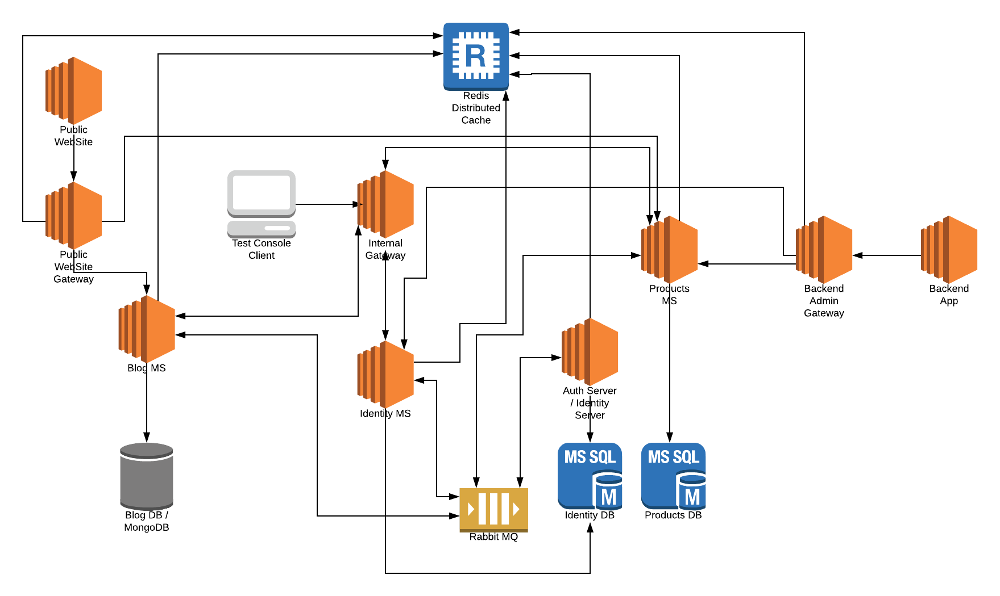

# Microservice Demo Solution

*"Microservices are a software development technique—a variant of the **service-oriented architecture** (SOA) architectural style that structures an application as a collection of **loosely coupled services**. In a microservices architecture, services are **fine-grained** and the protocols are **lightweight**. The benefit of decomposing an application into different smaller services is that it improves **modularity**. This makes the application easier to understand, develop, test, and become more resilient to architecture erosion. It **parallelizes development** by enabling small autonomous teams to **develop, deploy and scale** their respective services independently. It also allows the architecture of an individual service to emerge through **continuous refactoring**. Microservices-based architectures enable **continuous delivery and deployment**."*

— [Wikipedia](https://en.wikipedia.org/wiki/Microservices)

## Introduction

One of the major goals of the ABP framework is to provide a [convenient infrastructure to create microservice solutions](Microservice-Architecture.md).

This sample aims to demonstrate a simple yet complete microservice solution;

* Has multiple, independent, self-deployable **microservices**.
* Multiple **web applications**, each uses a different API gateway.
* Has multiple **gateways** / BFFs (Backend for Frontends) developed using the [Ocelot](https://github.com/ThreeMammals/Ocelot) library.
* Has an **authentication service** developed using the [IdentityServer](https://identityserver.io/) framework. It's also a SSO (Single Sign On) application with necessary UIs.
* Has **multiple databases**. Some microservices has their own database while some services/applications shares a database (to demonstrate different use cases).
* Has different types of databases: **SQL Server** (with **Entity Framework Core** ORM) and **MongoDB**.
* Has a **console application** to show the simplest way of using a service by authenticating.
* Uses [Redis](https://redis.io/) for **distributed caching**.
* Uses [RabbitMQ](https://www.rabbitmq.com/) for service-to-service **messaging**.
* Uses [Kubernates](https://kubernetes.io/) to **deploy** & run all services and applications.

The diagram below shows the system:

### Source Code

You can get the source code from [the GitHub repository](https://github.com/abpframework/abp/tree/master/samples/MicroserviceDemo).

### Status

This sample is still in development, not completed yet.

## Microservices

### Identity Service

...