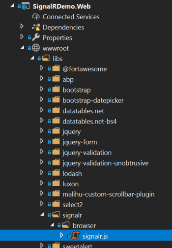
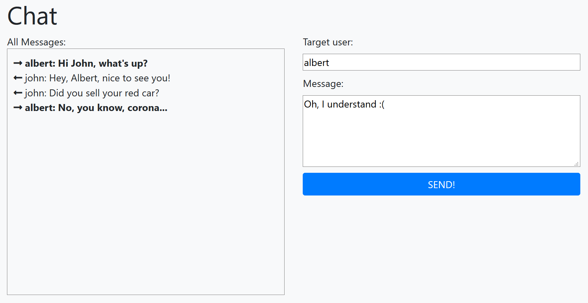

# SignalR Integration

> It is already possible to follow [the standard Microsoft tutorial](https://docs.microsoft.com/en-us/aspnet/core/tutorials/signalr) to add [SignalR](https://docs.microsoft.com/en-us/aspnet/core/signalr/introduction) to your application. However, ABP provides SignalR integration packages those simplify the integration and usage.

## Installation

### Server Side

It is suggested to use the [ABP CLI](CLI.md) to install this package.

#### Using the ABP CLI

Open a command line window in the folder of your project (.csproj file) and type the following command:

```bash
abp add-package Volo.Abp.AspNetCore.SignalR
```

> You typically want to add this package to the web or API layer of your application, depending on your architecture.

#### Manual Installation

If you want to manually install;

1. Add the [Volo.Abp.AspNetCore.SignalR](https://www.nuget.org/packages/Volo.Abp.AspNetCore.SignalR) NuGet package to your project:

   ```
   Install-Package Volo.Abp.AspNetCore.SignalR
   ```

   Or use the Visual Studio NuGet package management UI to install it.

2. Add the `AbpAspNetCoreSignalRModule` to the dependency list of your module:

```csharp
[DependsOn(
    //...other dependencies
    typeof(AbpAspNetCoreSignalRModule) //Add the new module dependency
    )]
public class YourModule : AbpModule
{
}
```

> You don't need to use the `services.AddSignalR()` and the `app.UseEndpoints(...)`, it's done by the `AbpAspNetCoreSignalRModule`.

### Client Side

Client side installation depends on your UI framework / client type.

#### ASP.NET Core MVC / Razor Pages UI

Run the following command in the root folder of your web project:

````bash
yarn add @abp/signalr
````

> This requires to [install yarn](https://yarnpkg.com/) if you haven't install before.

This will add the `@abp/signalr` to the dependencies in the `package.json` of your project:

````json
{
  ...
  "dependencies": {
    ...
    "@abp/signalr": "~2.7.0"
  }
}
````

Run the `gulp` in the root folder of your web project:

````bash
gulp
````

This will copy the SignalR JavaScript files into your project:



Finally, add the following code to your page/view to include the `signalr.js` file 

````xml
@section scripts {
    <abp-script type="typeof(SignalRBrowserScriptContributor)" />
}
````

It requires to add `@using Volo.Abp.AspNetCore.Mvc.UI.Packages.SignalR` to your page/view.

> You could add the `signalr.js` file in a standard way. But using the `SignalRBrowserScriptContributor` has additional benefits. See the [Client Side Package Management](UI/AspNetCore/Client-Side-Package-Management.md) and [Bundling & Minification](UI/AspNetCore/Bundling-Minification.md) documents for details.

That's all. you can use the [SignalR JavaScript API](https://docs.microsoft.com/en-us/aspnet/core/signalr/javascript-client) in your page.

#### Other UI Frameworks / Clients

Please refer to [Microsoft's documentation](https://docs.microsoft.com/en-us/aspnet/core/signalr/introduction) for other type of clients.

## The ABP Framework Integration

This section covers the additional benefits when you use the ABP Framework integration packages.

### Hub Route & Mapping

ABP automatically registers all the hubs to the [dependency injection](Dependency-Injection.md) (as transient) and maps the hub endpoint. So, you don't have to use the ` app.UseEndpoints(...)` to map your hubs. Hub route (URL) is determined conventionally based on your hub name.

Example:

````csharp
public class MessagingHub : Hub
{
    //...
}
````

The hub route will be `/signalr-hubs/messaging` for the `MessagingHub`:

* Adding a standard `/signalr-hubs/` prefix
* Continue with the **kebab-case** hub name, without the `Hub` suffix.

If you want to specify the route, you can use the `HubRoute` attribute:

````csharp
[HubRoute("/my-messaging-hub")]
public class MessagingHub : Hub
{
    //...
}
````

### AbpHub Base Classes

Instead of the standard `Hub` and `Hub<T>` classes, you can inherit from the `AbpHub` or `AbpHub<T>` which have useful base properties like `CurrentUser`.

Example:

````csharp
public class MessagingHub : AbpHub
{
    public async Task SendMessage(string targetUserName, string message)
    {
        var currentUserName = CurrentUser.UserName; //Access to the current user info
        var txt = L["MyText"]; //Localization
    }
}
````

> While you could inject the same properties into your hub constructor, this way simplifies your hub class.

### Manual Registration / Mapping

ABP automatically registers all the hubs to the [dependency injection](Dependency-Injection.md) as a **transient service**. If you want to **disable auto dependency injection** registration for your hub class, just add a `DisableConventionalRegistration` attribute. You can still register your hub class to dependency injection in the `ConfigureServices` method of your module if you like:

````csharp
context.Services.AddTransient<MessagingHub>();
````

When **you or ABP** register the class to the dependency injection, it is automatically mapped to the endpoint route configuration just as described in the previous sections. You can use `DisableAutoHubMap` attribute if you want to manually map your hub class.

For manual mapping, you have two options:

1. Use the `AbpSignalROptions` to add your map configuration (in the `ConfigureServices` method of your [module](Module-Development-Basics.md)), so ABP still performs the endpoint mapping for your hub:

````csharp
Configure<AbpSignalROptions>(options =>
{
    options.Hubs.Add(
        new HubConfig(
            typeof(MessagingHub), //Hub type
            "/my-messaging/route", //Hub route (URL)
            hubOptions =>
            {
                //Additional options
                hubOptions.LongPolling.PollTimeout = TimeSpan.FromSeconds(30);
            }
        )
    );
});
````

This is a good way to provide additional SignalR options.

If you don't want to disable auto hub map, but still want to perform additional SignalR configuration, use the `options.Hubs.AddOrUpdate(...)` method:

````csharp
Configure<AbpSignalROptions>(options =>
{
    options.Hubs.AddOrUpdate(
        typeof(MessagingHub), //Hub type
        config => //Additional configuration
        {
            config.RoutePattern = "/my-messaging-hub"; //override the default route
            config.ConfigureActions.Add(hubOptions =>
            {
                //Additional options
                hubOptions.LongPolling.PollTimeout = TimeSpan.FromSeconds(30);
            });
        }
    );
});
````

This is the way you can modify the options of a hub class defined in a depended module (where you don't have the source code access).

2. Change `app.UseConfiguredEndpoints` in the `OnApplicationInitialization` method of your [module](Module-Development-Basics.md) as shown below (added a lambda method as the parameter).

````csharp
app.UseConfiguredEndpoints(endpoints =>
{
    endpoints.MapHub<MessagingHub>("/my-messaging-hub", options =>
    {
        options.LongPolling.PollTimeout = TimeSpan.FromSeconds(30);
    });
});
````

### UserIdProvider

ABP implements SignalR's `IUserIdProvider` interface to provide the current user id from the `ICurrentUser` service of the ABP framework (see [the current user service](CurrentUser.md)), so it will be integrated to the authentication system of your application. The implementing class is the `AbpSignalRUserIdProvider`, if you want to change/override it.

## Example Application

See the [SignalR Integration Demo](https://github.com/abpframework/abp-samples/tree/master/SignalRDemo) as a sample application. It has a simple Chat page to send messages between (authenticated) users.



## Remarks

ABP Framework doesn't change the SignalR. It works in your ABP Framework based application just like any other ASP.NET Core application.

Refer to the Microsoft's documentation to [host and scale](https://docs.microsoft.com/en-us/aspnet/core/signalr/scale) your application, integrate to [Azure](https://docs.microsoft.com/en-us/aspnet/core/signalr/publish-to-azure-web-app) or [Redis backplane](https://docs.microsoft.com/en-us/aspnet/core/signalr/redis-backplane)... etc.

## See Also

* [Microsoft SignalR documentation](https://docs.microsoft.com/en-us/aspnet/core/signalr/introduction)
* [Real-Time Messaging In A Distributed Architecture Using ABP, SingalR & RabbitMQ](https://volosoft.com/blog/RealTime-Messaging-Distributed-Architecture-Abp-SingalR-RabbitMQ)
